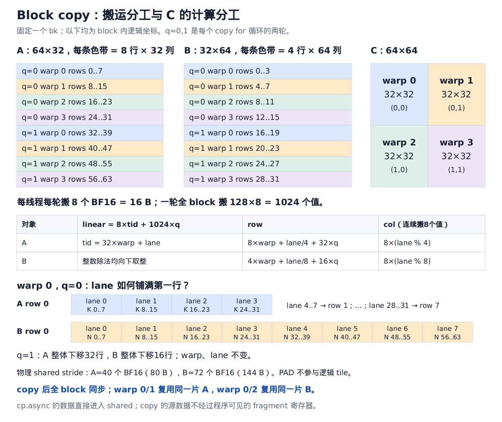
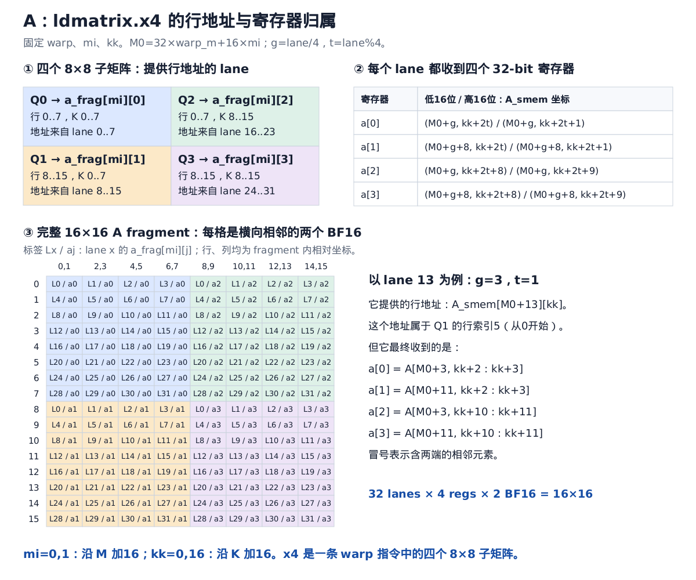
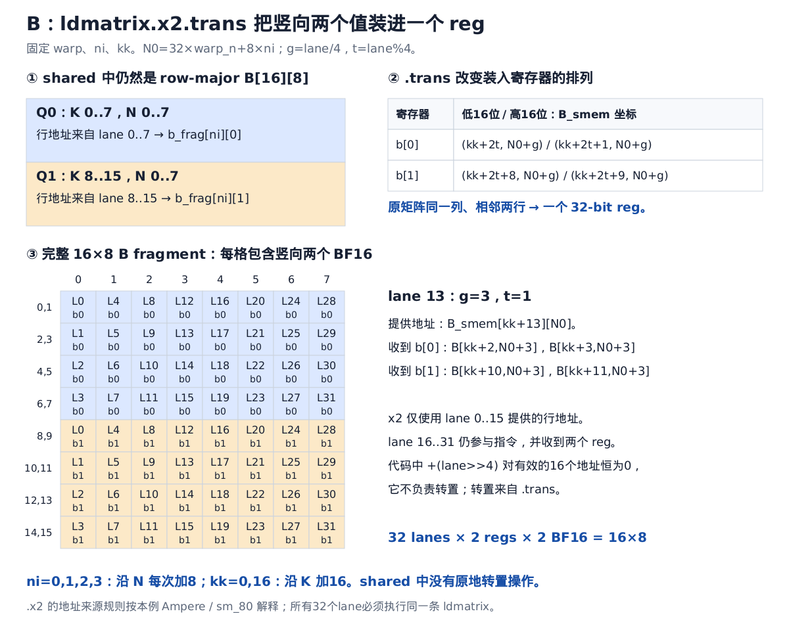
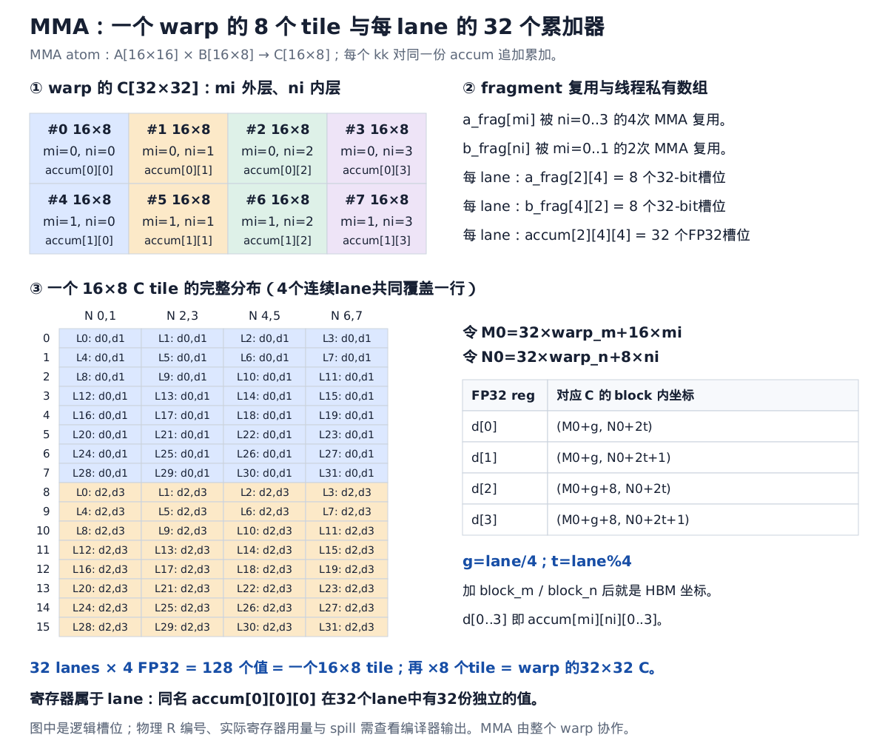
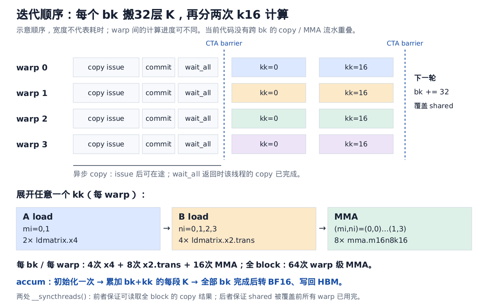

# BF16 GEMM：block copy、ldmatrix、mma 与 lane/reg 对应

本文按用户粘贴的代码和 `src/gemm_mma.cu` 推导：`BM=64, BN=64, BK=32, PAD=8, THREADS=128`。矩阵按行主序存储，`A[M,K] @ B[K,N] → C[M,N]`。图中范围 `a..b` 均包含两端，整数除法向下取整。

先区分三件事：copy 的线程分工、ldmatrix 的行地址提供者、fragment 元素最终所属的 lane。它们采用不同映射。一个线程搬进 shared 的元素，之后可以由另一个线程装入自己的寄存器。

## 1. Block / warp / MMA tile 的层级

```text
一个 block：128 threads = 4 warps，计算 C 的64×64
  warp 0：(warp_m,warp_n)=(0,0)，C rows  0..31, cols  0..31
  warp 1：(warp_m,warp_n)=(0,1)，C rows  0..31, cols 32..63
  warp 2：(warp_m,warp_n)=(1,0)，C rows 32..63, cols  0..31
  warp 3：(warp_m,warp_n)=(1,1)，C rows 32..63, cols 32..63

一个 warp：计算32×32
  M方向：2个16行 tile，mi=0,1
  N方向：4个 8列 tile，ni=0,1,2,3
  共2×4=8个16×8 C tile

一次 warp 级 MMA：A[16×16] × B[16×8] + C[16×8]
  32 lanes一起执行
  每 lane提供4个A reg、2个B reg、4个FP32累加器
```

这里的 reg 是线程私有的逻辑32-bit寄存器槽位。一个 A/B reg 打包两个 BF16；一个 accumulator reg 存一个 FP32。

## 2. Block copy 的两轮迭代



两段 copy 循环都复制2048个 BF16。每 lane 每次 `cp_async_16` 搬8个 BF16，因此每段循环恰好执行两轮：

```cpp
linear = 8 * tid + 1024 * q;  // q = 0,1
tid = 32 * warp + lane;
```

代入 A 的 `row=linear/32, col=linear%32`：

```text
A row = 8*warp + lane/4 + 32*q
A col = 8*(lane%4)             // 搬 col..col+7
```

代入 B 的 `row=linear/64, col=linear%64`：

```text
B row = 4*warp + lane/8 + 16*q
B col = 8*(lane%8)             // 搬 col..col+7
```

因此代码注释“每个 warp 负责加载32×32的 tile”不符合实际 copy 索引；32×32是该 warp 的 C 计算区域。每轮 copy，一个 warp 搬 A 的8×32或 B 的4×64。两轮合计，每 warp 对 A、B 各搬512个 BF16，分别来自两段不相邻的行带。

每个 bk，每 lane 总共发出4条16B copy：A两条、B两条，总计64B；全 block 搬8192B。`cp.async` 数据不经过程序可见的 A/B fragment 寄存器。

shared 是全 block 共享的。warp 0/1 读取同一片 A，warp 2/3 读取另一片 A；warp 0/2 读取同一片 B，warp 1/3 读取另一片 B。

`PAD=8` 只影响物理寻址，逻辑 tile 不变：

```text
&a_smem[r][c] = A_shared_base + 2*(40*r+c) bytes
&b_smem[r][c] = B_shared_base + 2*(72*r+c) bytes
```

每个有效8元素向量起点仍满足16B对齐。图中省略 padding；padding 本身不需要复制或参与 MMA。

## 3. A 的 ldmatrix.x4：行地址和目的寄存器



固定一个 warp、mi、kk，定义：

```text
M0 = 32*warp_m + 16*mi
g  = lane/4                 // 0..7
t  = lane%4                 // 0..3
```

本次加载逻辑上的 `A_smem[M0:M0+16, kk:kk+16]`，此处切片右端不包含。它由四个8×8子矩阵组成，寄存器顺序是先上/下，再左/右：

```text
              K 0..7         K 8..15
M 0..7          Q0              Q2
M 8..15         Q1              Q3
```

代码计算的是**行地址提供者**：

```cpp
row = M0 + (lane & 15);
col = kk + (lane >> 4)*8;
```

lane 0..7 提供Q0的8个行首地址，8..15提供Q1，16..23提供Q2，24..31提供Q3。硬件再按 fragment 布局把每个子矩阵分发给全部32个 lane。不能把“提供一行的地址”理解为“该线程独占这一行数据”。

下面 `{x,y}` 表示32-bit reg 中低16位与高16位分别保存的 BF16 值，不是类型转换成整数：

```text
a_frag[mi][0] = { A_smem[M0+g  ][kk+2*t  ], A_smem[M0+g  ][kk+2*t+1] }
a_frag[mi][1] = { A_smem[M0+g+8][kk+2*t  ], A_smem[M0+g+8][kk+2*t+1] }
a_frag[mi][2] = { A_smem[M0+g  ][kk+2*t+8], A_smem[M0+g  ][kk+2*t+9] }
a_frag[mi][3] = { A_smem[M0+g+8][kk+2*t+8], A_smem[M0+g+8][kk+2*t+9] }
```

每个 lane 得到8个 BF16，32 lanes合计256个值，恰好覆盖16×16。`x4` 指一条 ldmatrix 加载四个8×8子矩阵；每个 lane 收到四个 reg，不是四个 warp，也不是四次循环。

## 4. B 的 ldmatrix.x2.trans



定义 `N0=32*warp_n+8*ni`。本次加载 `B_smem[kk:kk+16,N0:N0+8]`，切片右端不包含；上下各一个8×8子矩阵。

```cpp
row = kk + (lane & 15);
col = N0 + (lane >> 4);
```

在本例 Ampere 的 `.x2` 中，只有 lane 0..15 提供两个子矩阵的行地址。对这些 lane，`lane>>4` 恒为0。lane 16..31也必须执行同一条指令，也会收到两个寄存器，但它们传入的地址不参与这两个子矩阵的行地址选择。

`.trans` 决定装入寄存器的排列；它不在 shared 中原地转置，也不是通过地址表达式的 `+(lane>>4)` 实现转置。

```text
b_frag[ni][0] = { B_smem[kk+2*t  ][N0+g], B_smem[kk+2*t+1][N0+g] }
b_frag[ni][1] = { B_smem[kk+2*t+8][N0+g], B_smem[kk+2*t+9][N0+g] }
```

与 A 对比：A 的两个 BF16 横向相邻；B 的两个 BF16 竖向相邻。每个 lane 得到4个 BF16，32 lanes合计128个值，覆盖16×8。这与 `.row.col` MMA 所需的 A、B fragment 排列匹配。

上述行地址与fragment规则核对自 [NVIDIA PTX：ldmatrix](https://docs.nvidia.com/cuda/parallel-thread-execution/#warp-level-matrix-instructions-ldmatrix) 和 [m16n8k16 浮点 fragment 布局](https://docs.nvidia.com/cuda/parallel-thread-execution/#warp-level-matrix-fragment-mma-16816-float)。不要把文档中逐个 BF16 标记的 a0..a7 与代码中四个 uint32 reg a_frag[mi][0..3] 混为一谈。

## 5. MMA 的2×4迭代与 accumulator



对于一个 kk，先装好两个 A fragment、四个 B fragment，再执行八次 warp 级 MMA：

```text
(mi,ni) = (0,0) → (0,1) → (0,2) → (0,3)
        → (1,0) → (1,1) → (1,2) → (1,3)
```

同一个 `a_frag[mi]` 被沿N方向的4次 MMA复用；同一个 `b_frag[ni]` 被沿M方向的2次 MMA复用。以上是源代码循环的逻辑顺序，实际机器指令调度由编译器决定。

`accum[2][4][4]` 三个维度依次是：M方向tile、N方向tile、该tile在本lane中的4个FP32。每个线程都有完整的一份这个数组。

令 `d = accum[mi][ni]`：

```text
d[0] ↔ C_block[M0+g  ][N0+2*t  ]
d[1] ↔ C_block[M0+g  ][N0+2*t+1]
d[2] ↔ C_block[M0+g+8][N0+2*t  ]
d[3] ↔ C_block[M0+g+8][N0+2*t+1]
```

再加 `block_m` 和 `block_n`，就是最后 store 的全局坐标。一个 lane 在一个16×8 tile中持有两行、每行两个输出；两行相距8。32 lanes × 4输出 = 128输出。

对于一个32×32 warp tile，每个 lane 持有32个输出：行号是 `g, g+8, g+16, g+24`，列号是 `2t,2t+1,8+2t,9+2t,16+2t,17+2t,24+2t,25+2t`，再加 warp 的行列起点。

同名寄存器跨 lane 的例子（warp 0）：

| 线程私有变量 | lane 0 | lane 1 | lane 4 | lane 31 |
|---|---|---|---|---|
| accum[0][0][0] | C(0,0) | C(0,2) | C(1,0) | C(7,6) |
| accum[0][0][1] | C(0,1) | C(0,3) | C(1,1) | C(7,7) |
| accum[0][0][2] | C(8,0) | C(8,2) | C(9,0) | C(15,6) |
| accum[0][0][3] | C(8,1) | C(8,3) | C(9,1) | C(15,7) |

MMA 由整个warp协作。不能把它解释为32个线程各自仅用自己持有的A/B做独立点积：一个 lane 持有的输入并不足以单独算出它的四个输出；硬件按指令约定使用整个warp分布的操作数。

源码数组的数据槽位数为每线程 A=8、B=8、accum=32，共48个32-bit槽位。这不是编译后的总寄存器用量：地址、临时变量、生命周期复用、可能的spill都会影响实际分配，也不能直接把数组下标当成物理R编号。

## 6. bk / kk 的完整时间顺序



```text
accum = 0                                    // 整个kernel中只初始化一次
for bk = 0,32,64,...,K-32:
    copy A：q=0,1                            // 每 lane 两条16B copy
    copy B：q=0,1                            // 每 lane 两条16B copy
    cp.async.commit_group
    cp.async.wait_all
    __syncthreads()                          // CTA 的copy结果可供所有warp读取

    for kk = 0,16:
        for mi = 0,1:       A ldmatrix.x4
        for ni = 0,1,2,3:   B ldmatrix.x2.trans
        for mi = 0,1:
            for ni = 0,1,2,3:
                accum[mi][ni] += A_frag[mi] × B_frag[ni]

    __syncthreads()                          // 全部warp读完才能覆盖shared

store accum，FP32转BF16                       // 最后一次性写C
```

每一次 MMA 沿K归约16个乘积。对于任意一个C输出，`kk=0` 加上本轮bk的前16个K项，`kk=16` 加上后16个K项，下一轮bk继续加后续32个K项；始终更新同一份 accumulator。

| 逻辑操作数 | 每 warp / kk | 每 warp / bk | 每 block / bk |
|---|---:|---:|---:|
| ldmatrix.x4 | 2 | 4 | 16 |
| ldmatrix.x2.trans | 4 | 8 | 32 |
| mma.m16n8k16 | 8 | 16 | 64 |

这些是warp级操作计数，不能再把32 lanes当作32次独立 MMA。`64×16×8×16 = 64×64×32` 个标量乘加，与block本轮计算量相等。

当前版本只有一份 shared buffer，copy 后马上等待，没有把下一轮bk的加载与当前bk的MMA重叠。`cp.async` 的异步性和跨迭代的软件流水是不同层次的机制。

## 7. 从一个具体线程贯穿到输出

取 `warp=0, lane=13, bk=0, kk=0, mi=0, ni=0`，忽略block全局偏移：

1. copy阶段，q=0：该线程搬 A第3行、K8..15；B第1行、N40..47。q=1再搬 A第35行、K8..15；B第17行、N40..47。
2. A ldmatrix：该线程提供A第13行、K0开始的行地址，却收到A第3/11行、K2/3/10/11的8个值。
3. B ldmatrix：该线程提供B第13行、N0开始的行地址，却收到B第2/3/10/11行、N3的4个值。
4. MMA之后，该线程的 `accum[0][0][0..3]` 对应C(3,2)、C(3,3)、C(11,2)、C(11,3)。

例如 C(3,2) 的这一段增量是 `sum(A[3,q]*B[q,2], q=0..15)`。这些输入分布于多个lane；lane 13持有部分A输入，而上述B第2列输入分布在lane 8..11。这直接说明MMA的warp协作关系。

## 生成与验证

源文件：[ampere_copy_ldmatrix_mma.py](assets/ampere_copy_ldmatrix_mma.py)。运行 `python3 docs/assets/ampere_copy_ldmatrix_mma.py [输出目录]` 可重新生成五张可编辑SVG及PNG。

画布宽1200px，高度依次1010、1000、950、1020、750px。验证包括完整copy/fragment/输出归属枚举、SVG结构检查和五张PNG的渲染检查；这是代码布局推导，没有执行GPU kernel或测量指令耗时。
