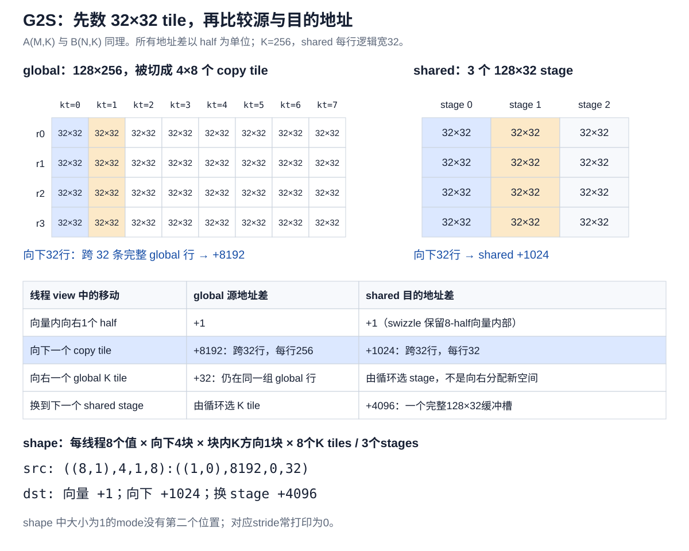
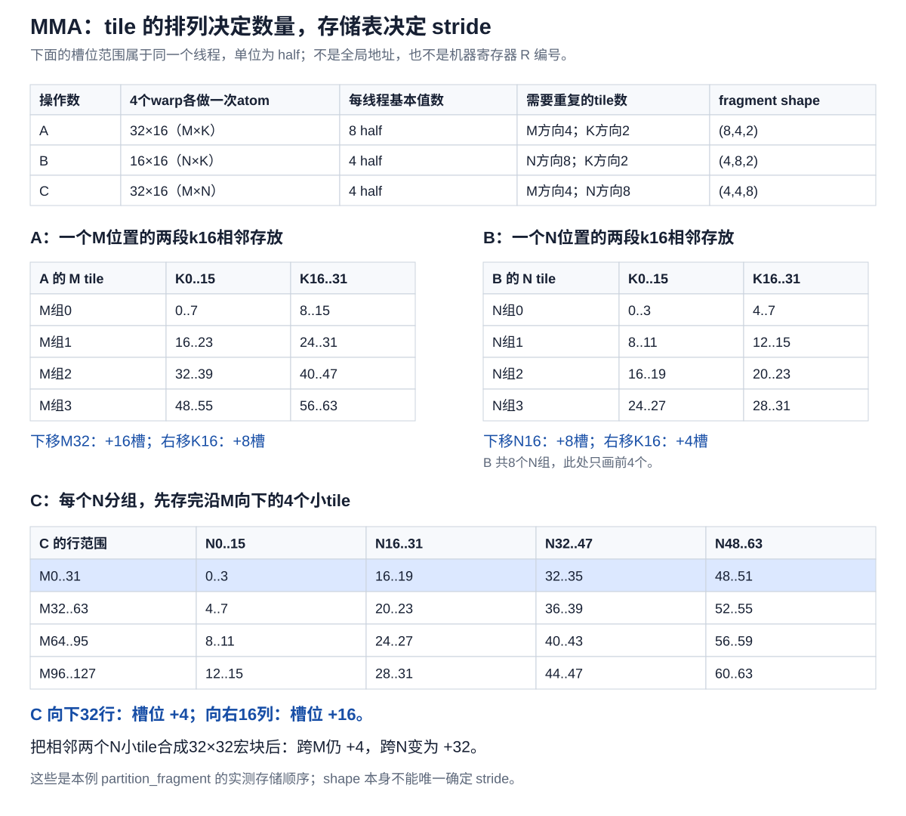
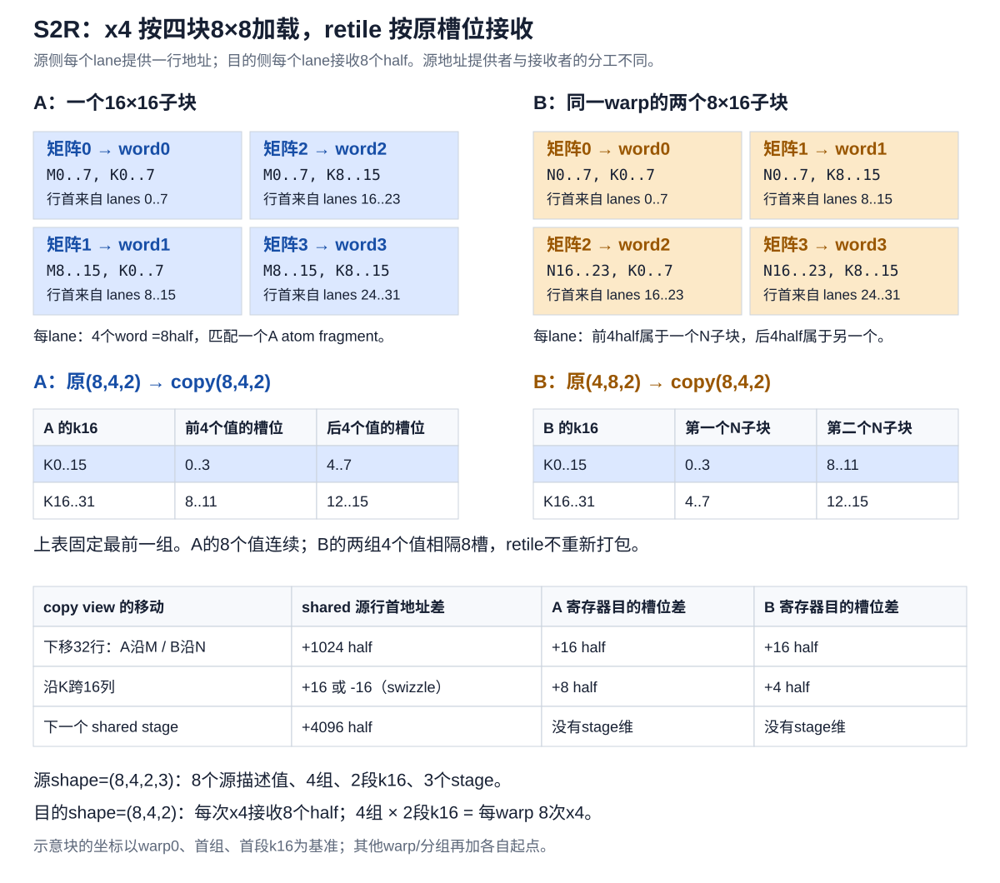
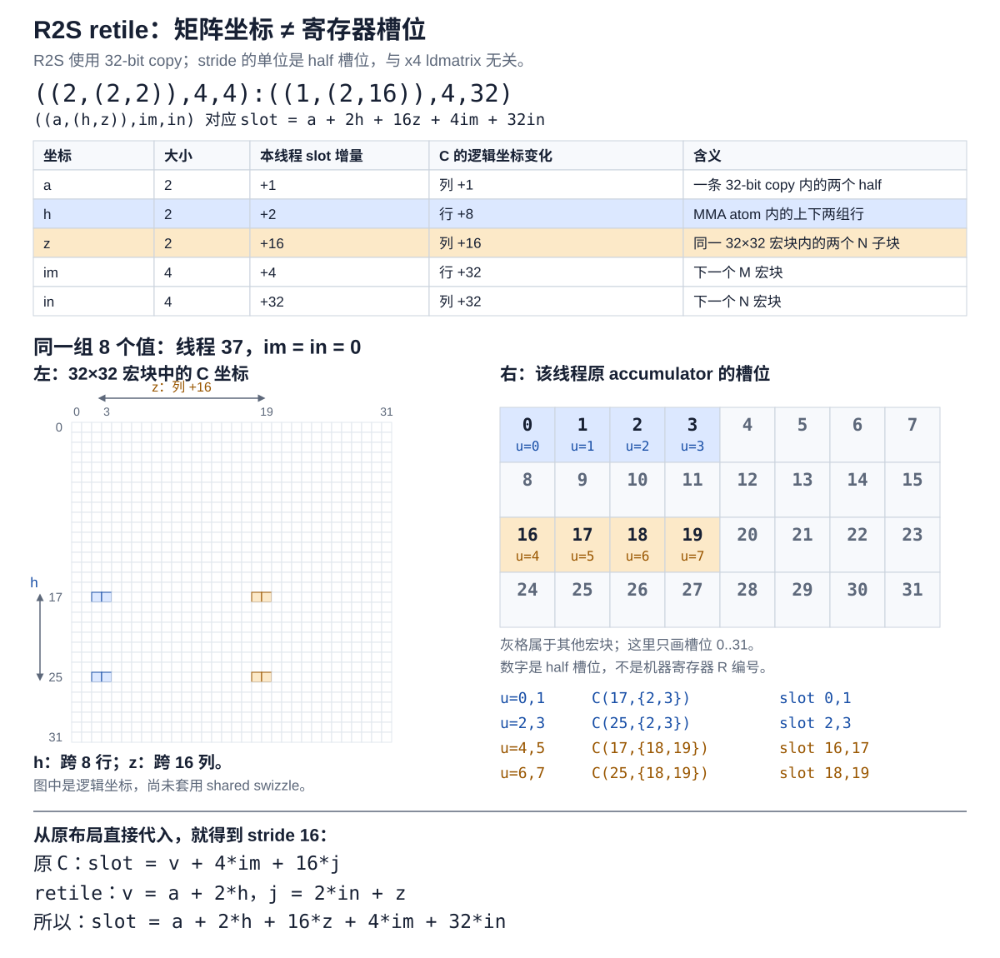

# 按 81920×256×256 解释 CuTe 多级 half GEMM

本文对应你粘贴的 `gemm_multi_stage`，保留它的 `128×128×32` tile、3 个 shared stage、
4 个 warp、half MMA、x4 ldmatrix 和分批 shared epilogue。**这里的具体 shape 不适用于
此前 32×32、FP32 累加的教学版本。**

| 文件 | 内容 |
|---|---|
| [multi_stage_config.cuh](../examples/cute_gemm/multi_stage_config.cuh) | 固定规格及配置注释 |
| [multi_stage_annotated.cuh](../examples/cute_gemm/multi_stage_annotated.cuh) | 保留原变量名的 kernel，按数据流分段注释 |
| [multi_stage_layout.cu](../examples/cute_gemm/multi_stage_layout.cu) | 使用真实 Config 检查所有线程的坐标、偏移与 retile |
| [multi_stage_bench.cu](../examples/cute_gemm/multi_stage_bench.cu) | 正确性检查、CUDA event 计时、cuBLAS half 基线 |

实现来源为用户提供的代码，对应 [reed-lau/cute-gemm 的多级版本](https://github.com/reed-lau/cute-gemm/blob/37f3a01eeef7ac7f404343b2cc67e8f0c21018f2/gemm-multi-stage.cu)。
本版将配置固定，以便每个数字都能对应到代码；移除了未使用的 `ComputeType` 模板参数。
原 Config 的 MMA op 是硬编码的：只把 `ComputeType` 改成 float，并不会让原 kernel
变成 float 累加。


新版阅读方法：每节先看需要的tile，再数重复次数得到shape，最后用相邻tile的实际存储
起点解释stride。G2S源地址、MMA存储表、S2R重组及R2S交接均配有可编辑示例图。
三张新增图由 [cute_tile_views.py](assets/cute_tile_views.py) 生成；它复用同目录
[cute_r2s_retile.py](assets/cute_r2s_retile.py) 的渲染函数。图是空间/归属示意，不是执行时间轴。

## 1. 先分清数学矩阵、CuTe 坐标和物理地址

数学问题为 `C = A × B`，alpha=1、beta=0：

```text
A: [81920,256]，row-major
B: [256,256]，column-major
C: [81920,256]，row-major
A/B/C 及 MMA accumulator：half
```

令 r 为 M 坐标，q 为 K 坐标，c 为 N 坐标。以下偏移的单位均为 half，字节地址再乘 2：

| 数学对象 | 数学坐标 | 物理偏移 | kernel 的 CuTe shape:stride |
|---|---|---|---|
| A | A(r,q) | r*K+q | (M,K):(K,1) |
| B | B(q,c) | q+c*K | (N,K):(K,1)，访问 B(c,q) |
| C/D | C(r,c) | r*N+c | (M,N):(N,1) |

为什么 B 的 CuTe layout 看上去也像行优先？因为它调换了**坐标的命名顺序**：

```text
数学 column-major B(q,c) 的 offset = q+c*K
CuTe B(c,q) 的 offset              = c*K+q
```

二者相等，不需要转置 kernel 或额外拷贝。CuTe MMA 接口惯用 A(M,K)、B(N,K)、C(M,N)。
虽然本例 N=K=256，数值相同会掩盖错误，但不能因此混用两套坐标；以后 N≠K 时仍用这个公式。

原程序输出名为 D，对本例等价于数学 C：它不读取旧 C，累加器只在 kernel 开头清零一次。

### 1.1 整个问题需要多少工作

```text
A = 81920*256*2 bytes = 40 MiB
B =   256*256*2 bytes = 128 KiB
C = 81920*256*2 bytes = 40 MiB
FLOPs = 2*M*N*K = 10,737,418,240，约 10.737 GFLOP
```

FMA 按乘、加两次浮点操作计数。耗时为 t 毫秒时，`TFLOP/s = 10.73741824 / t`。

## 2. 从 grid 走到 local_tile

实际实例为 `GemmConfig<half_t,128,128,32,3>`。模板声明的 stage 默认值 5 在这里不生效。

```text
block = 128 threads = 4 warps
grid.x = N/BN = 256/128 = 2
grid.y = M/BM = 81920/128 = 640
CTA 总数 = 1280
K tile 数 = K/BK = 256/32 = 8
```

本规格每维均整除，没有边界 predicate。原代码的向上取整 grid 并不代表支持非整除问题。

对于 `ix=blockIdx.x, iy=blockIdx.y`：

```text
gA: (128,32,8)，gA(r,q,kt)=A(128*iy+r,32*kt+q)
gB: (128,32,8)，gB(c,q,kt)=B_math(32*kt+q,128*ix+c)
gD: (128,128)，gD(r,c)=C(128*iy+r,128*ix+c)
```

`local_tile` 建立视图，`_` 保留全部 K tiles。它没有将全局行 stride 256 改成 32；
所以不能把 `gA` 当成紧凑的 128×32 临时数组来算地址。

## 3. A/B shared layout：把 swizzle 算到地址

配置先构造一个 8×32 的 row-major atom：

```cpp
composition(Swizzle<3,3,3>{},
            Layout<Shape<_8,_32>,Stride<_32,_1>>{})
```

再用 `tile_to_shape` 平铺成 `(128,32,3)`。本机 CUTLASS v4.6.1 实际打印：

```text
Sw<3,3,3> o 0 o
  ((8,16),(32,1),(1,3)):((32,256),(1,0),(0,4096))
```

先看 swizzle 右边的普通 layout。拆开嵌套后：

```text
row = row_in_8 + 8*row_group
x = 32*row_in_8 + 256*row_group + col + 4096*stage
  = 32*row + col + 4096*stage
```

然后计算 `Swizzle<B,M,S>`。这里 B=3 表示参与异或的位数，M=3 保留最低三位，S=3
表示来源位与目标位相隔三位：

```text
来源：bit 6,7,8
目标：bit 3,4,5
physical = x XOR ((x & 0x1c0) >> 3)
```

**BK=32 时，bit 5 已经属于行号，而非列号。** 因此它不仅改变列：

```text
physical_row = row XOR ((row>>3)&1)
physical_col = col XOR (8*((row/2)%4))
physical = 4096*stage + 32*physical_row + physical_col
```

例如 `row=8,col=0,stage=0`：

```text
x=8*32=256
(x&0x1c0)>>3 = 32
physical=256 XOR 32=288 = 9*32+0
```

逻辑第 8 行映射到物理第 9 行；逻辑第 9 行则映射回第 8 行。这个映射无碰撞。
不能把针对 BK64 的“只给列号 XOR”公式直接套在这里。

### 3.1 容量、stage 和对齐

```text
每个 stage，每个矩阵：128*32 half = 4096 half = 8192 bytes
每个矩阵三个 stage：12288 half = 24576 bytes
A+B 总共：49152 bytes = 48 KiB
A 的起点：0 bytes
B 的起点：24576 bytes
```

`cosize` 表示 layout 需要的存储空间，不是字节数。此配置中恰好等于逻辑元素数。
若更换 layout 有空洞或 padding，就不能只用 `size` 分配。

swizzle 保留最低三位，因此每个连续 8 half 的向量仍连续。cudaMalloc 基址、shared 的
16-byte 对齐、K=256 的行 stride，以及每向量起点的 8-half 倍数，共同保证地址对齐。
逻辑行的 8-half 段可以换位置，但不会把向量内部拆散。

swizzle 改变 shared bank 分布；是否消除了实际指令的冲突要结合 profiler 观察，
不能从“用了 swizzle”直接推出性能更高。

## 4. G2S：从需要搬的 tile 确定 source / destination view

本节和后面的MMA、S2R都按同一顺序阅读：**先确定基本tile，再数完整tensor中有多少块，
最后追踪相邻tile在当前存储中的起点。** shape只说明分组数量，不能单独决定stride。
所有步长以half为单位；global/shared说的是元素地址差，fragment说的是本线程槽位差。



[PNG](assets/cute_g2s_tile_steps.png) · [SVG](assets/cute_g2s_tile_steps.svg)

### 4.1 一次基本 copy tile 为什么是32×32

G2S的线程布局将128个线程排成32行、每行4个线程。每线程用一条16-byte cp.async
搬连续8个half，所以每行四个线程负责列0..7、8..15、16..23、24..31。
合起来，一次基本分工覆盖32×32。

当前CTA每个K tile需要A/B各128×32。因此保持这份分工，向下重复4次、向右不重复。
一个线程要搬四条8-half向量，总共32half；128个线程刚好覆盖4096half。

| mode | global源视图 | shared目的视图 | 来源 |
|---|---:|---:|---|
| 一次atom内的值 | 8 | 8 | 16bytes搬8half |
| 沿行重复的copy tile | 4 | 4 | 128行分成四组32行 |
| 当前BK内部沿K重复 | 1 | 1 | BK32正好覆盖一次 |
| 外部tile/缓冲槽 | 8 | 3 | global有8个K tiles，shared有3个stage |

所以 `tAgA_copy/tBgB_copy` 是 `(8,4,1,8)`，`tAsA_copy/tBsB_copy` 是 `(8,4,1,3)`。
第0 mode实际嵌套为 `(8,1)`；这里按总大小写成8。

### 4.2 partition_S 后，global source 的 stride 从哪里来

`local_tile`没有搬数据；原矩阵每行仍有256个half。固定一个线程，观察它负责的两条向量：

| 移动方式 | 矩阵中移动多少 | 源地址变化 |
|---|---|---:|
| 向量内取下一个值 | 同一行向右1列 | +1 |
| 换到下方的copy tile | 向下32行 | +8192，因为跨了32条完整的256元素行 |
| 换到下一个global K tile | 同一组行向右32列 | +32 |

对应实际打印：

```text
tAgA_copy：((8,1),4,1,8):((1,0),8192,0,32)
```

大小为1的mode没有第二个有效位置，stride常被化简为0。不要因为tile内宽度是32，
就把global向下32行的跨度误算为1024。

具体看线程37：它在首个copy tile负责行9、列8..15；下一个行tile负责行41、列8..15。
两个向量的global起点分别是2312与10504half，相差8192。
下一K tile则是行9、列40..47，起点2344half，只比2312增加32。

### 4.3 partition_D 后，shared destination 为什么是另一个步长

一个shared stage只存128×32，每逻辑行宽32。固定线程后：

| 移动方式 | shared地址变化 | 原因 |
|---|---:|---|
| 向量内下一个half | +1 | swizzle保留每条8-half向量内部的连续性 |
| 向下32行 | +1024 | 一组32行；该移动不改变本例swizzle作用的低位 |
| 下一个stage | +4096 | 跳过整个128×32输入缓冲 |

实际打印：

```text
tAsA_copy：((8,1),4,1,(1,3)):((1,0),1024,0,(0,4096))
```

虽然完整shared是swizzled layout，这份G2S分工固定线程后，剩下的几个移动恰好都能
化成上述步长。不能推广成“所有访问shared的view都如此”；第6节的S2R跨K16就不同。

线程37的同一对向量，swizzle后的shared起点为264和1288half，相差1024。
`partition_S/D`保持的是源/目的中对应的逻辑元素，源地址差8192与目的地址差1024可以不同。

每线程当前tile的A/B各4条cp.async，合计8条，随后提交一个group。`uint128_t`是传输
宽度，不把half转换成128位整数。CuTe用copy atom与线程/value布局共同确定分工，
参见[官方GEMM copy示例](https://docs.nvidia.com/cutlass/latest/media/docs/cpp/cute/0x_gemm_tutorial.html)。

## 5. MMA：从输出小 tile 看 fragment shape 与存储跨度



[PNG](assets/cute_mma_tile_storage.png) · [SVG](assets/cute_mma_tile_storage.svg)

### 5.1 先看一条atom和四个warp各负责什么

一条 `m16n8k16` 由整个warp协作：需要A的16×16与B的8×16，更新C的16×8。
每lane分别拥有8个A值、4个B值、4个C值，数据类型都是half。

两个warp沿M排列、两个沿N排列。四个warp各执行一次atom时，合起来需要A的32×16、
B的16×16，更新C的32×16。A在不同N warp组复制，B在不同M warp组复制。
这些是逻辑覆盖范围，不代表A/B的全部fragment没有重复。

完整CTA需要A/B各128×32与C的128×128，保持这份atom分工继续铺开：

| fragment | 基本分工下每线程的值 | 完整tensor还要铺多少次 | 最终shape | half/thread |
|---|---:|---|---|---:|
| tCrA | 8 | 沿M四组32行；沿K两段16列 | (8,4,2) | 64 |
| tCrB | 4 | 沿N八组16行；沿K两段16列 | (4,8,2) | 64 |
| tCrD | 4 | 沿M四组32行；沿N八组16列 | (4,4,8) | 128 |

C没有K mode：后续K的贡献继续更新同一份结果。A没有N repetition，B没有M repetition，
因为它们分别可以复用于另一个方向的多个输出小tile。

第三个参数 `Tile<32,32,16>` 把两个N小tile组织进一个32×32扩展tile，仍然使用四个warp。
warp0/1负责N的0..7和16..23；warp2/3负责8..15和24..31。
**MMA fragment仍保留8个N atom repetitions；copy会进一步把它们两两分组。**

### 5.2 相同逻辑分工，partition与fragment的stride为什么不同

`thr_mma.partition_A(gA)`建立global中的线程视图，保留原矩阵的地址。
`partition_fragment_A(gA)`则按该分工创建线程私有存储，本例编译后由寄存器承载。
它们指向相同逻辑角色的数据，但并不共享同一块存储。

先看跨小tile的动作，不展开lane公式：

| 操作数及移动 | 原矩阵中的移动 | global partition地址差 | 本线程fragment槽位差 |
|---|---|---:|---:|
| A，下一个M组 | 向下32行 | +8192 | +16 |
| A，下一段k16 | 向右16列 | +16 | +8 |
| B，下一个N组 | CuTe B(N,K)向下16行 | +4096 | +8 |
| B，下一段k16 | 向右16列 | +16 | +4 |
| C，下一个M组 | 向下32行 | +8192 | +4 |
| C，下一个N组 | 向右16列 | +16 | +16 |

所有global行宽都是256；而fragment只保存当前线程需要的值，不保存完整矩阵的整行。
接下来的存储表解释右侧数字。这个顺序由本例实际fragment layout确认，不能只从shape猜。

### 5.3 A：先把同一M位置的两段k16放在一起

表内均为同一线程的half槽位：

| A的M分组 | K0..15 | K16..31 |
|---|---|---|
| 第一组 | 0..7 | 8..15 |
| 第二组，向下32行 | 16..23 | 24..31 |
| 第三组 | 32..39 | 40..47 |
| 第四组 | 48..55 | 56..63 |

横向到下一段k16，跳8个槽；纵向到下一个M组，跳过两段各8个值，共16槽。
因此A外层两个mode的stride是16、8。

一个atom内部的8个值又分成四对：同一对跨1个K列对应槽位+1；上下相隔8个M行对应+2；
左右相隔8个K列对应+4。它不是16×16矩阵在global中的行优先存储。

```text
A fragment：((2,2,2),4,2):((1,2,4),16,8)
```

### 5.4 B：每个N位置只有4个值，再接下一段k16

| B的N分组 | K0..15 | K16..31 |
|---|---|---|
| 第一组 | 0..3 | 4..7 |
| 第二组，向下16个N行 | 8..11 | 12..15 |
| 第三组 | 16..19 | 20..23 |
| 第四组 | 24..27 | 28..31 |
| 后四组 | 同样继续排列 | 共到槽位63 |

横向跨k16，跳4槽；纵向跨N16，跳过两段各4个值，共8槽。
atom内部4个值是两对K方向片段：相邻K列对应+1，另一对相隔8个K列对应+2。

```text
B fragment：((2,2),8,2):((1,2),8,4)
```

注意B的“N方向”在CuTe的(N,K)视图里是行方向；不能把这里的向下N16当成向右K16。

### 5.5 C：先沿M存完一列小tile，再进入下一列小tile

一个四warp共同覆盖的32×16输出小tile，每线程有4个值。存储表为：

| C的行范围 | N0..15 | N16..31 | N32..47 | N48..63 |
|---|---|---|---|---|
| M0..31 | 0..3 | 16..19 | 32..35 | 48..51 |
| M32..63 | 4..7 | 20..23 | 36..39 | 52..55 |
| M64..95 | 8..11 | 24..27 | 40..43 | 56..59 |
| M96..127 | 12..15 | 28..31 | 44..47 | 60..63 |

只画前64列；后64列同样继续。向下跨32行，槽位只+4；向右跨16列，要跳过沿M的四组
各4个值，共+16。atom内部相邻列对应+1，相隔8行的另一对值对应+2。

```text
C fragment：((2,2),4,8):((1,2),4,16)
```

后面R2S将相邻两个N小tile合成一个32×32宏块，宏块内8个值会分两段存放。
所以向下跨宏块仍然+4；向右跨一个32列宏块则+32。retile没有重新打包寄存器。

### 5.6 再数一次gemm调用覆盖多少小tile

固定一段k16后，A还保留4个M位置，B还保留8个N位置。一个 `gemm` 调用遍历它们的
4×8种组合，所以每warp执行32次atom。A的同一个片段可服务8个N位置，B可服务4个M位置，
并不需要每次atom都重新加载。

| 计算范围 | warp atom执行次数 |
|---|---:|
| 一个warp、一段k16 | 32 |
| 一个warp、整个BK32 | 64 |
| 一个CTA、整个BK32 | 256 |
| 一个CTA、完整K256 | 2048 |

这里按warp指令计数，不再乘32个lane。半精度MMA内部累加次序不能用逐项C++ half运算
来代替；其精度语义参见[NVIDIA PTX MMA说明](https://docs.nvidia.com/cuda/parallel-thread-execution/index.html#warp-level-matrix-instructions-mma)。

## 6. S2R：需要哪些子tile，决定如何组织x4 copy



[PNG](assets/cute_s2r_tile_retile.png) · [SVG](assets/cute_s2r_tile_retile.svg)

一条非转置x4 ldmatrix加载四块8×8half，向每lane返回4个32-bit word，也就是8half。
每个8×8子矩阵的八个行首地址，由一组八个lane提供，结果则分给全部32个lane。
所以源侧“我提供哪一行地址”与目的侧“我接收哪几个值”是两套分工。

### 6.1 A需要一个16×16子tile，正好拆成四块

按M向下、K向右画出四块：

| | K0..7 | K8..15 |
|---|---|---|
| M0..7 | 矩阵0 → 每lane的word0 | 矩阵2 → word2 |
| M8..15 | 矩阵1 → word1 | 矩阵3 → word3 |

它们各由lanes0..7、8..15、16..23、24..31提供行首地址。
A本来就有8half/atom/lane，一次x4刚好装完，不用把不同M小tile再合组。

完整CTA仍要沿M铺4组、沿K铺2段，因此：

```text
MMA A fragment：(8,4,2)
A copy 目的view：(8,4,2)
A shared源view：(8,4,2,3)，最后是三个stage
```

A retile改变第0 mode的分组表示，将原来的三个二值维度交给一次x4处理；仍然指向
同一组连续8个half槽位。跨M组仍+16槽，跨k16仍+8槽。

### 6.2 B只有4half/atom/lane，合并两个N子tile组成x4

一个B atom只需要8×16。将同一warp负责的两个N子tile一起加载：

| | K0..7 | K8..15 |
|---|---|---|
| 第一个N子tile | 矩阵0 → word0 | 矩阵1 → word1 |
| 第二个N子tile，N起点+16 | 矩阵2 → word2 | 矩阵3 → word3 |

两个N子tile的起点相隔16，不是8；夹在中间的另一个8行范围属于另一个N warp组。
x4不要求四个子矩阵拼成物理连续的大矩形，各行地址可以分别提供。

两个N子tile各贡献本线程4个half，合成一次x4的8个half。原先8个N repetitions两两
合并成4组，所以B目的view从 `(4,8,2)` 变为 `(8,4,2)`。

到第5.4节的B槽位表中选择同一段k16：

| 当前x4要装的内容 | 原fragment槽位 |
|---|---|
| 第一N组的K0..15 | 0..3 |
| 第二N组的K0..15 | 8..11 |
| 第一N组的K16..31 | 4..7 |
| 第二N组的K16..31 | 12..15 |

因此一次x4的8个值分成两组4个值，组间起点相差8槽。
换下一对N子tile，整体向下跨32个N行，槽位+16；换k16，槽位+4。

```text
B copy目的view：(((4,2),1),4,2):(((1,8),0),16,4)
```

读这行时先看tile：前面的 `(4,2)` 是每个N子tile4个值、共两个N子tile；其stride是1、8。
后面的4表示四对N子tile，跨一对跳16槽；最后2表示两段k16，跨一段跳4槽。
`retile_D`只建立已有fragment的视图；不做shuffle，不创建另一份8个连续槽位。

### 6.3 shared源view的步长，为什么不能套用目的fragment的stride

A/B的copy源shape都是 `(8,4,2,3)`：一个源描述组有8个half、沿行有4组、沿K有2段、
外面还有3个stage。此处A沿行是M，B沿行是N。

| 同一个copy分组的移动 | shared源行首地址差 | A目的寄存器槽位差 | B目的寄存器槽位差 |
|---|---:|---:|---:|
| 沿行到下一组，跨32行 | +1024 | +16 | +16 |
| 沿K到下一段，跨16列 | +16或-16 | +8 | +4 |
| 换shared stage | +4096 | 没有stage维 | 没有stage维 |

global每行256、shared每逻辑行32、fragment只存本线程的值，因此三个空间不能共用stride。

为什么shared跨K16可能是负数？取同一个stage中的两行：

| 逻辑行与移动 | swizzle后的列变化 | 实际地址差 |
|---|---|---:|
| 行0，从K0到K16 | 物理列0 → 16 | +16 |
| 行4，从K0到K16 | 物理列16 → 0 | -16 |

行4处的swizzle调换了这两个16列半区。逻辑上仍是向右走，物理地址却向前移。
完整view可能保留composed layout，不能擅自把它写成所有线程统一的正向stride16。
当前验证器检查全部128线程，A源视图中64个线程为+16、64个为-16。

### 6.4 从copy tile数直接确定ldmatrix次数

固定一个stage和一段k16，source/destination还剩4组，每组由一次x4处理。
所以一次该切片的copy对应每warp4次x4；两段k16共8次。

| 操作数 | 每段k16的分组 | 每warp每BK32的x4次数 |
|---|---|---:|
| A | 四个M组，每组8half/lane | 8 |
| B | 四对N子tile，每对8half/lane | 8 |

一个warp每个操作数需要32lane×64half，单次x4加载256half，也得到8次。
这些加载出的A/B片段随后服务多次MMA，加载次数和MMA次数不相等。

<details>
<summary>需要逐lane核对时，再展开坐标公式</summary>

本节的示意坐标以首warp、首组、首段k16为基准。完整公式仅供与验证器对照：
`w=tid/32,l=tid%32,wm=w%2,wn=w/2,g=l/4,t=l%4`。

```text
MMA A(v,i,q)：m=16*wm+g+8*((v/2)%2)+32*i；k=2*t+v%2+8*(v/4)+16*q
MMA B(v,j,q)：n=8*wn+g+16*j；k=2*t+v%2+8*(v/2)+16*q
MMA C(v,i,j)：m=16*wm+g+8*(v/2)+32*i；n=8*wn+2*t+v%2+16*j

A source行首：row=16*wm+l%16+32*i；col=8*(l/16)+16*q
B source行首：row=8*wn+l%8+16*(l/16)+32*i；col=8*((l/8)%2)+16*q
```

源行公式不代表接收坐标。warp0的lane5在A中提供行5的地址，但接收来自行1、9的片段；
B中则接收来自N行1、17的片段。实际地址还需套用shared layout。

</details>

## 7. 三个 shared 槽与两个寄存器槽怎么配合

区分三个计数：

| 名称 | 本例范围 | 含义 |
|---|---|---|
| itile / itile_to_read | 0..7 / 最终 8 | 当前计算 / 下一次 global 预取的数据 tile |
| ismem_read / ismem_write | 0..2 | shared 循环槽 |
| ik / ik_next | 0..1 | 本线程 fragment 中的 k16 槽 |

### 7.1 prologue

先提交 tile0→stage0、tile1→stage1，两个 group。`wait<1>` 允许最新的一个 group
未完成，所以较老的 tile0 已完成。CTA barrier 后，把 tile0 的 k16=0 装入 r[0]。
此时 read=0、write=2、itile_to_read=2。

### 7.2 每个 tile 的两个 ik

```text
ik=0：
  从当前 shared tile 装 r[1]
  如有下一次 global 预取，提交到 write 槽；随后 commit group
  用已有 r[0] 执行 MMA

ik=1：
  wait<1> + CTA barrier，确认下一 shared tile 可读且旧读者已完成
  read=(read+1)%3
  从下一 shared tile 装 r[0]（最后一个 tile 时跳过）
  用当前 tile 的 r[1] 执行 MMA
```

为什么先装下一 r[0] 不会覆盖当前要算的值？当前 ik=1 使用 r[1]；r[0] 在上一轮 ik=0
已消费。这依赖本例 nk=2，不能不加分析地改成只有一个寄存器槽。

输入 stage 的循环如下；“预取”发生在当前 tile 的 ik=0：

| 当前计算 tile | 当前 shared 槽 | global 预取 |
|---:|---:|---|
| 0 | 0 | tile2→stage2 |
| 1 | 1 | tile3→stage0 |
| 2 | 2 | tile4→stage1 |
| 3 | 0 | tile5→stage2 |
| 4 | 1 | tile6→stage0 |
| 5 | 2 | tile7→stage1 |
| 6 | 0 | 无数据，仍 commit 空 group |
| 7 | 1 | 无数据，仍 commit 空 group |

`cp_async_fence` 在 CuTe 这里包装 commit-group，不是 CTA barrier。
`wait<1>` 控制本线程最近的 group 数量，不是等待“stage 编号 1”。
原尾部的空 commit 有作用：它使剩余真实 tile 的 group 成为较老的组，被 `wait<1>`
等待完成。不能只删掉空 commit 而保留原等待策略。

切换 stage 的 barrier 同时协调 producer/consumer：某槽被后续覆盖前，所有 warp
已经将其数据读到寄存器。MMA 此时访问寄存器，不继续读取那个 shared 槽。

### 7.3 本注释版的两处尾部调整

保留原流水结构，但跳过最终一次不再使用的 S2R 预取，并在输出复用 shared 前显式执行
`wait<0>` 与 CTA barrier。固定规格下原来的额外读取落到已有旧数据槽，不能说它必然
越界；这里的调整使排空与复用关系更直接。

输入只支持这份固定规格。短 K、尾块、更多 stages 都需要重新设计预取、等待和排空。

## 8. R2S：128×128 输出为什么只需要 32×32×2 scratch

完整 C tile 有 16384 half，32 KiB；每线程累加器持有 128 half。
它们已在寄存器中，无需一次全部放进 shared。

输出 scratch 只保存两个 32×32 宏块：

```text
SmemLayoutC shape=(32,32,2)
size=2048 half=4096 bytes
A 的一个 stage=4096 half=8192 bytes，足够容纳 scratch
```

最后 read 槽变为 `8%3=2`，kernel 取 `sA(:,:,2).data()` 作为新 sC 的基址，
用 C 的 layout 重新解释。它复用 A 的空间；A/B 输入搬运必须已排空。

输出 swizzle 是 `Swizzle<2,3,3>`，与输入不同：

```text
p_C(row,col,batch)=1024*batch+32*row+(col XOR (8*((row/2)%4)))
```

只影响列的 bit3..4，不影响行或 batch。

### 8.1 R2S：先把两个32×16小tile合成一个32×32宏块



[PNG](assets/cute_r2s_retile.png) · [SVG](assets/cute_r2s_retile.svg) ·
[生成脚本](assets/cute_r2s_retile.py)。固定线程37，首个宏块。

第5.5节的C存储表中，首个32×32宏块由槽位0..3和16..19组成，向下的下一个宏块则由
4..7和20..23组成。合并的是tile的分组，没有把这些值搬到连续8个槽位。
所以R2S从 `(4,4,8)` 变成 `(8,4,4)`，但向下跨宏块的stride仍是4，不是8。
向右跨宏块相当于跨过两个原N小tile，stride从16变成32。

每个宏块内部，本线程有四对相邻half。32-bit `UniversalCopy<int>`一次搬一对，
上下两对相隔8行，左右两对相隔16列：

| 在tile中移动 | 本线程槽位移动 | shape中的分组 |
|---|---:|---|
| 一对值内跨1列 | +1 | 两个half |
| 到下方相隔8行的一对 | +2 | 上下两组 |
| 到右边相隔16列的一对 | +16 | 左右两组 |
| 到下方下一个32×32宏块 | +4 | 沿M四个宏块 |
| 到右边下一个32×32宏块 | +32 | 沿N四个宏块 |

因此实际layout为 `((2,(2,2)),4,4):((1,(2,16)),4,32)`。
这里的16是C的槽位步长，与前面的x4 ldmatrix无关；copy atom中的int也不做数值类型转换。

目标scratch只有两个宏块容量，`partition_D(sC)`得到 `(8,1,1,2)`：每槽只有一个M宏块、
一个N宏块，外面两槽。它没有源view里完整4×4的宏块网格，靠外层循环反复接收两块结果。
两槽之间相隔1024half；不能把源fragment跨宏块的4/32槽位步长套用到shared地址。

### 8.2 group_modes 为什么能让两端使用同一个 i+j

```cpp
group_modes<1,3>(tensor)
```

合并 `[1,3)`，即 mode1 与 mode2，第0 mode 保留：`(8,4,4)→(8,16)`。
不是合并三个 mode，也不排序数据。

```text
p = im + 4*in，im=p%4，in=p/4
宏块起点 = (32*im,32*in)
```

于是宏块顺序为 `(0,0),(32,0),(64,0),(96,0),(0,32),...`，M 最先变化。
R2S 与 S2G 的第0 mode 都有8个half，但内部线程坐标不同；二者的 p 必须指同一宏块。

`step=size<3>(tCsC_r2s)=2` 来自 scratch batch。外循环 p 每次加2，总共 16/2=8批：

```text
p=0,2,4,...14：
  将 p 和 p+1 宏块 scatter 到 scratch batch0、batch1
  CTA barrier
  按新的连续向量分工读出 batch0、batch1，并存到 global 的 p、p+1 宏块
  CTA barrier，防止下批提前覆盖尚未读完的 scratch
```

输入 stage=3、scratch batch=2、register k16 slots=2 是三个独立概念。

原代码的临时 `t=make_tensor_like<T>(...)` 保留了按元素转换的步骤。
本例 accumulator/output 同为 half，所以没有精度转换；若将来采用 float accumulator，
转换发生在 `copy(accum,t)`，不是发生在 `UniversalCopy<int>`。

## 9. S2G：shared 如何更换写回线程

输出 copy 使用 `(32,4):(4,1)` 的线程布局与 `(1,8)` 的值布局，自然 tile 就是32×32。
每线程读取一条连续8half向量：

```text
scratch row = tid/4
scratch col = 8*(tid%4)+u，u=0..7

global tile row = tid/4 + 32*(p%4)
global tile col = 8*(tid%4)+u + 32*(p/4)
```

| 视图 | shape，各 mode 按总大小表示 |
|---|---|
| tCsC_r2s | (8,1,1,2) |
| tCsC_s2g | (8,1,1,2) |
| tCgC_s2g | (8,4,4) |
| tCgC_s2gx | (8,16) |

这些 source/destination shape 相同，并不说明线程持有的是同一组元素。
R2S 的线程分工继承 MMA；S2G 的线程分工让列连续。

普通 SM80 shared→global 的 `copy` 在机器码层面通过寄存器中转，不是反向 cp.async。
每批每线程输出两条 16-byte 向量；8批共256bytes/thread，恰好是128half。

源和目的都用同一个32×32基本tile，但完整空间不同：scratch每槽只需一次copy tile，
global要沿M、N各重复四次。固定线程后，global向下跨32行的地址差为8192half，
向右跨32列为32half；scratch换槽则为1024half。它们不是同一个stride表。

### 9.1 追踪 C(25,19) 的写者与读者

在 CTA(0,0)，MMA 线程37：`w=1,l=5,v=3,im=0,j=1`。

```text
m=16+1+8=25
n=2+1+16=19
accumulator slot = 3+4*0+16*1=19
R2S retile u=7,p=0
```

它写到 scratch 逻辑 `(25,19,batch0)`。物理偏移：

```text
col'=19 XOR (8*((25/2)%4))=19
p_C=25*32+19=819 half=1638 bytes（相对 sC 基址）
```

S2G 的读者变成线程102：`102/4=25,102%4=2`，其向量为第25行的第16..23列。
向量中 u=3 对应第19列。最终写到 global 元素偏移 `25*256+19=6419`。

一条输出向量集合了多个 MMA 线程的结果，因此 R2S 后需要 CTA barrier。
这里消费者是102，不是 FP32 旧例的76；half 每向量8个，float 每向量4个，分工不同。

## 10. cuBLAS 的转置参数为什么是 T,N

cuBLAS 传统 GEMM 使用 column-major。把 row-major 输出的存储看成 column-major 的
`C^T[N,M]`，有：

```text
C^T = B^T * A^T
```

| cuBLAS 参数 | 解释 |
|---|---|
| m=N,n=M,k=K | 计算 N×M 的 C^T |
| 第一个指针 Bptr，OP_T，lda=K | 存储本来是 column-major K×N，转成 N×K |
| 第二个指针 Aptr，OP_N，ldb=K | row-major M×K 的内存可视为 column-major K×M |
| 输出 ldc=N | column-major N×M 与 row-major M×N 共用存储解释 |

注释版使用 `cublasGemmEx`，A/B/C 与 alpha/beta 都是 half，并明确指定
`CUBLAS_COMPUTE_16F`；这对应题目的计算类型。它不保证 cuBLAS 的分块及内部累加顺序与
自写 kernel 完全一致。参见 [cuBLAS GEMMEx 类型说明](https://docs.nvidia.com/cuda/cublas/index.html#cublasgemmex)。

原代码还依赖外部 `detail/cublaslt-gemm.h`；这里没有对其隐藏的算法选择做性能结论，
基线就是明确标出的 cuBLAS GEMMEx 16F。

## 11. 构建、验证与性能测试

仓库根目录：

```bash
cmake -S . -B build
cmake --build build --target cute_gemm_81920 -j2
./build/examples/cute_gemm/cute_gemm_81920 --layout
./build/examples/cute_gemm/cute_gemm_81920 --check
./build/examples/cute_gemm/cute_gemm_81920
```

也可直接构建，省去项目其他依赖：

```bash
nvcc -std=c++17 -O3 -lineinfo -arch=sm_89 \
  -Ithird_party/cutlass/include \
  examples/cute_gemm/multi_stage_bench.cu \
  examples/cute_gemm/multi_stage_layout.cu \
  -lcublas -o /tmp/cute_gemm_81920
/tmp/cute_gemm_81920
```

其他支持该指令路径的 GPU 需选择对应编译架构。

验证分三层：

1. `--layout` 先测量全部128线程跨tile的真实地址差：G2S global/shared步长、MMA
   partition/fragment步长、S2R跨K16的正负地址差；再验证 A/B/C 坐标、fragment槽位、retile别名、
   G2S/ldmatrix地址、所有stage的swizzle映射、全部16个输出宏块的写者与读者。
2. B=I，检查全部20,971,520个输出精确等于A，覆盖最后CTA和输出所有批次。
3. half hash输入与cuBLAS对比全部输出，并对1024个位置用CPU double独立点积复核。
   容差为 `abs_error <= 0.02 + 0.02*abs(reference)`，针对本例[-0.5,0.5]输入；
   同时报告最大绝对误差与RMSE。不是half误差的通用保证。

原来的 `nt=11` 循环只是重复调用，没有 CUDA event 或其他计时工具就得不到毫秒数。
本版预热10次，随后5轮、每轮每实现50次；两种实现交替先后顺序。CUDA event位于同一
stream，排除分配、初始化、memcpy和校验。报告5轮平均耗时的中位数、最小值与最大值。
这是重复调用后的缓存条件，不是冷缓存性能，也未做cuBLASLt算法搜索。

### 11.1 如何理解瓶颈

每CTA每个K tile发起A+B共16KiB global读取，8 tiles共128KiB，1280 CTA共160MiB；
输出写40MiB。这个200MiB是按CTA累计的请求量，不等于DRAM流量：A被两个N方向CTA重复
使用，小B更会被M方向的640组CTA复用，缓存会减少实际DRAM读取。

3个shared槽占48KiB；寄存器中的half元素也会影响occupancy。更大的tile、更多stage、
宽向量写回都有代价，需用测量判定。本例只评估当前规格，不据此声称对所有GEMM更快。

### 11.2 本次实测记录

使用 CMake 最终构建的注释版，GPU 为 RTX 4060 Laptop、SM89、24 SM，CUDA runtime 13.0，
driver API 13.2，cuBLAS 版本号130101。两种实现使用相同输入、同一规格和half计算类型。

| 实现 | 中位 ms/次 | 最小 ms/次 | 最大 ms/次 | 中位 TFLOP/s |
|---|---:|---:|---:|---:|
| CuTe 注释版 | 0.407306 | 0.355287 | 0.407900 | 26.362 |
| cuBLAS GEMMEx 16F | 0.402860 | 0.376607 | 0.403843 | 26.653 |

这些是本机该次运行的记录，测量有波动，不能用很小的中位差距断言稳定优劣。
本版包含前述最终预取保护与显式排空，表中数值也不冒充原代码完全未修改时的性能。

验证结果：全部layout检查通过；全量单位矩阵检查通过；hash输入全部20,971,520个
输出与cuBLAS逐位一致，最大差与RMSE均为0。对CPU double的1024点抽查，两者最大
绝对误差都是0.0075683594。后一个数值说明“与cuBLAS相同”不等于没有half累加误差。

资源查询得到164个32-bit寄存器/thread、local memory为0、动态shared为49152bytes/CTA，
occupancy API计算为2个常驻CTA/SM。不能把64+64+128个half直接说成256个32-bit寄存器。
机器码核对到 `LDGSTS`、`LDSM.16.M88.4`、`HMMA.16816.F16`、`LDS.128` 和 `STG.E.128`，
分别对应异步输入搬运、x4矩阵加载、half MMA、shared向量读取及global向量存储。

CMake目标构建通过，两份`.cu`的clangd语法/标识符检查均为0 errors。检查命令使用
`--tweaks=none`，只关闭clangd附带的重构动作自检，不关闭源码诊断：

```bash
clangd --check=examples/cute_gemm/multi_stage_bench.cu --compile-commands-dir=build --tweaks=none
clangd --check=examples/cute_gemm/multi_stage_layout.cu --compile-commands-dir=build --tweaks=none
```

本环境此前Compute Sanitizer因WDDM debugger接口不可用而无法执行；这里的记录是
数值、layout及机器码检查，没有将其表述为sanitizer通过。

### 11.3 本次tile视图文档的复核

新增 `verify_tile_steps()` 直接用view元素的地址相减，验证表格中的跨tile步长。
全部128线程通过：G2S源向下32行为+8192、目的为+1024；MMA partition与fragment的
不同步长；S2R源跨K16存在+16和-16两种情况。原有逐元素坐标、别名和覆盖检查继续保留。

三张新增图为1200×960、1200×1080和1200×1060，均输出SVG与PNG。生成器接受自定义
输出目录，并复用项目已有渲染器；已做确定性检查、SVG结构校验和逐图完整渲染检查。
本次只更新kernel注释与layout验证器，不以重复性能测试替换前面记录的测量结果。

本轮CMake构建和`--check`通过：全部128线程的tile步长/坐标检查、完整规格的单位矩阵
输出检查、与cuBLAS的全量对比及CPU double抽查均通过。两份教学`.cu`以及
`src/cute_gemm.cu`的clangd语法/标识符检查均为0 errors。新增图通过SVG结构校验、
自定义输出目录测试、确定性比对和完整渲染检查。
