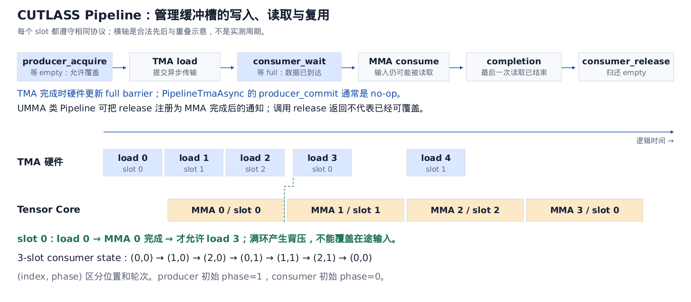
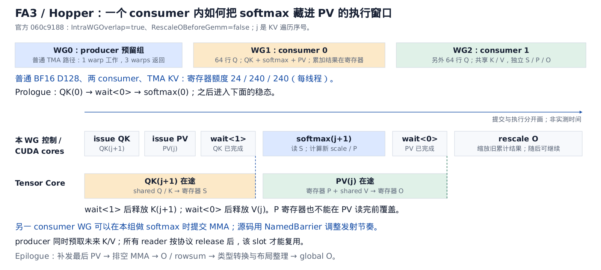
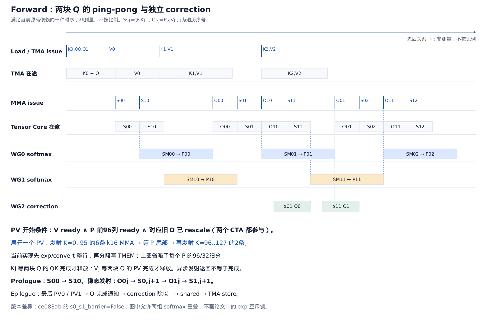

CUTLASS、FA3、FA4：从布局、线程角色到异步 Pipeline
================================================

核对日期：2026-09-07。本文是源码与官方文档的交叉解释，图中横轴表示依赖与可重叠窗口，没有用图形宽度表示实测周期。

| 源码 | 本地目录 | 固定版本 |
|---|---|---|
| CUTLASS 4.6.1，包含 3.x C++ API 和 CuTe DSL | `third_party/cutlass` | `e05f953a5b3d38adc240df2ff928e0421c2abba3` |
| FA3 / Hopper | `third_party/flash-attention/hopper` | `060c9188beec3a8b62b33a3bfa6d5d2d44975fab` |
| FA4 / CuTe DSL | `third_party/flash-attention-fa4/flash_attn/cute` | `ce088ab9ce0fc0434dcd8afa0a791da9fcc3a820` |

以下主线是 forward。FA3 重点选 BF16 D128、两 consumer WG、TMA KV 路径；FA4 重点选 B200 / SM100、BF16 D128、`m_block_size=n_block_size=128`、`q_stage=2` 的通用 2-CTA 路径。D256 专用 kernel、FP8、paged KV、causal 和 backward 的分工可能不同。“Blackwell”在这里指支持这些 SM100 指令的架构路径，不能把这套指令模型直接套给所有 Blackwell 产品。

**CUTLASS 要解决的核心问题，是把矩阵运算拆成能正确交接、持续重叠的片上工作。** 给定数学公式后，仍需决定 tile 大小、数据存储位置、线程与元素的映射、指令种类、异步完成条件和缓冲区复用时间。CuTe 擅长表达布局与指令；CUTLASS 的 collective、kernel 和 Pipeline 把它们组织起来。FA3 和 FA4 在这套基础上编写 attention 专用控制流。

一条 kernel 的四个独立维度是：

| 维度 | 回答的问题 | 典型对象 |
|---|---|---|
| 数学分块 | 本次负责哪些行、列、归约元素？ | ProblemShape、TileShape、ClusterShape |
| 空间映射 | 数据放在哪里，谁读写哪些元素？ | Layout、Tensor、TiledMma、TiledCopy |
| 时间安排 | 谁先做，谁能重叠，何时可覆盖？ | Pipeline、stage、barrier、warp specialization |
| 工作分配 | 当前 CTA / cluster 接下来算哪个问题块？ | TileScheduler |

这几个维度不能互相代替：stage 不是 warpgroup；单线程发射不是单线程完成矩阵乘；cluster 包含两个 CTA 也不自动意味着使用 2-CTA MMA。

**从一块 GEMM 看术语。** 对 `D = αAB + βC`，一个 CTA 或 CTA cluster 负责一个输出 tile，mainloop 沿 reduction K 遍历输入 tile，反复累加，epilogue 把累加值变成最终输出。

```text
选中一个输出 tile
  → prologue：准备 descriptor / barrier / 初始输入
  → mainloop：预取 A/B、等待输入、MMA 累加，沿 reduction K 迭代
  → drain：完成在途操作
  → epilogue：α·acc + β·C、bias/activation、转换、布局整理、写 D
  → 若 persistent：向 scheduler 取下一 tile
```

`MMA` 是矩阵乘加指令级操作；`GEMM` 是较完整的矩阵乘法算法/算子。一个软件 tile 往往要发射多条 MMA。Prologue 和 drain 是填充、排空流水线；它们不等于输入/输出 tensor 的数学意义。

**Epilogue 做两类事情：输出数学和输出数据搬运。** Tensor Core 的 accumulator 布局为 MMA 服务，不一定适合连续写 global；epilogue 需要安排线程分片、转换 dtype，并可能经 shared memory 重排后由 TMA store 输出。普通 GEMM 的 `α·acc+β·C`、bias、ReLU 等适合在这里融合。EVT 是描述这些融合表达式及取数关系的 epilogue visitor tree；不是另一次 MMA。

Attention 的 softmax 位于两次 GEMM 之间，并且贯穿 KV mainloop。把它全部塞进“最终 GEMM epilogue”这个词，会丢失 online 状态、第二次 GEMM 和跨 tile 依赖。Attention 最终 epilogue 通常还包括 O 除以 row sum、写 LSE、dtype 转换与输出搬运。官方解释见 [Efficient GEMM](https://docs.nvidia.com/cutlass/latest/media/docs/cpp/efficient_gemm.html#epilogue)，实际 builder/EVT 示例见 [49_collective_builder.cu](https://github.com/NVIDIA/cutlass/blob/e05f953a5b3d38adc240df2ff928e0421c2abba3/examples/49_hopper_gemm_with_collective_builder/49_collective_builder.cu#L283)。

**CUTLASS 的五层不是五个 kernel，也不是五级物理硬件。** 它们是可组合的软件层：

| 从高到低 | 职责 | 源码入口 |
|---|---|---|
| Device | host 侧参数检查、workspace、初始化与 launch | `GemmUniversalAdapter` |
| Kernel | 组合 mainloop/epilogue/scheduler；决定 CTA 角色与执行流程 | `GemmUniversal` 或自定义 attention kernel |
| Collective | 组织协作线程，在时间上安排 copy、MMA、同步 | `CollectiveMma`、collective epilogue |
| Tiled MMA / Copy | 把 atom 铺成更大的 tile，定义参与者和元素分片 | `TiledMma`、`TiledCopy` |
| Atom | 一种具体指令的类型、形状、operand 布局与调用封装 | `Mma_Atom`、`Copy_Atom` |

CuTe 的 `Layout` 则是这些层共用的映射语言：例如逻辑 `(row,col)` 到 offset，或者 `(thread,value)` 到矩阵坐标。`Tensor` 把存储 engine 与 layout 组合起来。`local_tile`、`partition_A/B/C`、`partition_S/D` 通常是在生成视图，真正移动数据的是 `copy` 或对应 load/store 指令。WGMMA 的 shared operand fragment 可能包含 descriptor，不能因为变量叫 `tSrQ` 就断言整块 Q 已经在普通寄存器中。参见 [官方 3.x GEMM API](https://docs.nvidia.com/cutlass/latest/media/docs/cpp/gemm_api_3x.html) 与 [FA3 的 operand fragment 构造](https://github.com/Dao-AILab/flash-attention/blob/060c9188beec3a8b62b33a3bfa6d5d2d44975fab/hopper/mainloop_fwd_sm90_tma_gmma_ws.hpp#L1019)。

**你提到的 operator 有几种完全不同的语境。**

| 源码中的词 | 含义 |
|---|---|
| `OperatorClass` / `OpClassTensorOp` | 选择 Tensor Core 等运算类别；不是具体 tile 的执行者 |
| `Mma_Atom<...>`、`MmaF16BF16Op(...)` | 选择具体 MMA 指令及约束 |
| `operator()` | C++ 函数调用运算符，让对象能写成 `obj(...)`；host adapter 中可能负责 launch，device functor 中可能负责计算 |
| `LinearCombination` 等 output operator | epilogue 中每个元素或 fragment 的数学变换 |

因此要看命名空间、模板参数和调用位置，不能给所有 `operator` 同一个硬件解释。[host adapter 的 operator()](https://github.com/NVIDIA/cutlass/blob/e05f953a5b3d38adc240df2ff928e0421c2abba3/include/cutlass/gemm/device/gemm_universal_adapter.h#L600) 是一个可以直接查的例子。

**Swizzle 也要区分两类。** Shared-memory swizzle 改变逻辑元素到物理 shared 地址的映射，以适配 bank 访问和 TMA/MMA descriptor；threadblock swizzle / rasterization 改变 block/work id 到矩阵 tile 的映射，主要影响 L2 重用和工作顺序。前者处理 tile 内部地址，后者处理 tile 之间的排列。

用一个独立的教学例子理解 shared swizzle：32×32 的 float 数组，地址以 float 为单位，直接 row-major 为 `a(r,c)=32r+c`。如果 32 个 lane 分别读不同 row 的同一 col，就访问同一 bank 的不同地址。改成 `a(r,c)=32r+(c XOR r)`，同一列的这些访问就落在不同 bank。读写双方必须使用相同映射。真实 CuTe `Swizzle<B,M,S>` 是对指定地址位做 XOR；128B TMA swizzle 还有专门的单位、对齐和 descriptor 约束，上述玩具例子不能作为它的完整公式。参见 [CuTe swizzle.hpp](https://github.com/NVIDIA/cutlass/blob/e05f953a5b3d38adc240df2ff928e0421c2abba3/include/cute/swizzle.hpp#L42) 与 [threadblock rasterization](https://docs.nvidia.com/cutlass/latest/media/docs/cpp/efficient_gemm.html#threadblock-rasterization)。

**StageCount 是同时保留多少份可轮换缓冲。** 对常见 GEMM `sA[BM,BK,S]`、`sB[BN,BK,S]`，S 是 stage 数；迭代 j 通常使用 `j % S` 这个槽。S=3 不表示做三次矩阵乘，也不表示三个 consumer。软件文献也把一次 mainloop 迭代叫 stage；读到代码 `Stages` 时要辨别它是否在定义 ring buffer 的深度。

固定每次输入量时，shared 占用近似为：

\[
S\,[B_M B_K\,sizeof(A)+B_N B_K\,sizeof(B)]
\]

还要加 epilogue、barrier、对齐等开销。更多 stage 可以增加预取距离，但会消耗 shared、限制驻留 CTA，并增加初始化/排空成本。`StageCountAutoCarveout<sizeof(Epilogue::SharedStorage)>` 的实际作用就是先预留 epilogue 空间，再确定 mainloop 能放几份输入。它不是在运行时学习最优 stage。[builder 源码](https://github.com/NVIDIA/cutlass/blob/e05f953a5b3d38adc240df2ff928e0421c2abba3/examples/49_hopper_gemm_with_collective_builder/49_collective_builder.cu#L318)。

**Pipeline 是缓冲区所有权和异步完成协议。** 它管理的是数据依赖，不会自动替你搬运矩阵或执行数学。一般每个槽有 full / empty 同步对象：producer 等 empty 后写入，consumer 等 full 后读取，最后一次读取结束后再归还 empty。



| 操作 | 应理解为 |
|---|---|
| `producer_acquire(state)` | 取得本轮的写权限，避免覆盖尚未消费完的数据 |
| `producer_commit(state)` | 发布生产完成，具体实现取决于生产者是普通线程、TMA 还是 UMMA |
| `consumer_wait(state)` | 等本轮数据确实就绪 |
| `consumer_release(state)` | 归还本轮读权限；异步 consumer 可能把通知安排到硬件操作完成时 |
| `state.index()` | 使用哪个物理槽 |
| `state.phase()` | 当前槽属于哪轮，避免把上轮信号当成本轮信号 |

`PipelineState<3>` 的 consumer 游标依次为 `(0,0),(1,0),(2,0),(0,1),(1,1),(2,1)`。这些是等待时携带的 phase，不应机械理解成“phase=1 就一定 full”。C++ `make_producer_start_state` 让 producer 以 phase=1 起步，consumer 默认 phase=0，保证初始空缓冲可取得。[PipelineState 源码](https://github.com/NVIDIA/cutlass/blob/e05f953a5b3d38adc240df2ff928e0421c2abba3/include/cutlass/pipeline/sm90_pipeline.hpp#L171)。

两个容易误读的特例尤其重要。第一，`PipelineTmaAsync` 在 acquire 时登记 expected bytes，TMA 完成时直接更新 transaction barrier，`producer_commit` 在正常路径是 no-op。第二，Blackwell 的 `PipelineTmaUmma.consumer_release` 会使用 UMMA completion 通知；源码在发射 MMA 后紧接着 release，并不等于立即让 load 线程覆盖输入。[CUTLASS Pipeline 文档](https://docs.nvidia.com/cutlass/latest/media/docs/cpp/pipeline.html)、[TMA acquire/commit](https://github.com/NVIDIA/cutlass/blob/e05f953a5b3d38adc240df2ff928e0421c2abba3/include/cutlass/pipeline/sm90_pipeline.hpp#L512)、[UMMA release](https://github.com/NVIDIA/cutlass/blob/e05f953a5b3d38adc240df2ff928e0421c2abba3/python/CuTeDSL/cutlass/pipeline/sm100.py#L329)、[completion signal helper](https://github.com/NVIDIA/cutlass/blob/e05f953a5b3d38adc240df2ff928e0421c2abba3/python/CuTeDSL/cutlass/pipeline/helpers.py#L432)。

下面只是同步语义伪代码，省略初始化、角色选择和具体 fence，不可直接编译：

```text
producer:
    for each input_tile:
        acquire(write_state)
        issue_copy_into(slot[write_state.index], full_barrier)
        publish_when_ready()  # TMA 自己完成 transaction；普通线程路径另有发布动作
        advance(write_state)

consumer:
    for each input_tile:
        wait(read_state)
        issue_mma_from(slot[read_state.index])
        release_after_last_read_completes(read_state)
        advance(read_state)
```

在 Hopper，典型做法是 `wgmma.wait_group` 后由线程 release。在 UMMA pipeline，completion commit 可以替发射线程延后发送 empty 信号。buffer 的实际生命周期始终以硬件最后一次访问结束为界。

**Scheduler 至少有三层语境。**

| 名称 | 决定什么 | 不应混淆之处 |
|---|---|---|
| TileScheduler | 下一块 `(m,n,batch,head,split)` 工作分给谁 | 不调度单条 warp 指令 |
| KernelSchedule / DispatchPolicy | 编译时选择 kernel 内部的 warp specialization、1/2-SM 等实现 | 不等于运行时任务队列 |
| GPU hardware warp scheduler | 从 ready warps 中选指令发射 | CUTLASS 没有替换这块硬件 |
| FA3 `warp_scheduler_barrier_*` | 软件用 barrier 调整几个 consumer WG 的发射先后 | 这是影响硬件调度的同步约束，不是新的硬件 scheduler |

普通 kernel 可以一个 CTA 算一 tile；static persistent kernel 可以固定 stride 领取后续 tile；dynamic persistent 可以用计数器取任务。Causal attention 的不同 Q tile 需要处理的 KV 数不同，varlen 的 batch 工作量也不同，scheduler 因而会考虑较重任务先做、cache locality 和负载平衡。FA3 中已有 [三类 scheduler 和 dynamic atomicAdd](https://github.com/Dao-AILab/flash-attention/blob/060c9188beec3a8b62b33a3bfa6d5d2d44975fab/hopper/tile_scheduler.hpp#L217)；FA4 还有 [CLC 与其他 scheduling mode](https://github.com/Dao-AILab/flash-attention/blob/ce088ab9ce0fc0434dcd8afa0a791da9fcc3a820/flash_attn/cute/tile_scheduler.py#L33)。是否使用 CLC/persistent 取决于所选路径，不能从“FA4”这个名字直接推出。

**写标准 CUTLASS GEMM 的范式，是编译时组合组件，运行时传入数据。** 下面是对象关系，省略类型参数，不能直接编译：

```cpp
using Epi  = /* epilogue CollectiveBuilder 的 CollectiveOp */;
using Main = /* mainloop CollectiveBuilder 的 CollectiveOp */;
using Kernel = cutlass::gemm::kernel::GemmUniversal<
    ProblemShape, Main, Epi, TileScheduler>;
using Gemm = cutlass::gemm::device::GemmUniversalAdapter<Kernel>;

// host: 填 Arguments；分配 workspace；检查可实现性；initialize；run。
```

编译时选 dtype、layout、alignment、architecture、tile、cluster、copy/MMA atom、stage 与 schedule；运行时给地址、实际 shape/stride、scale 和 workspace。CuTe DSL 把这套思路搬到 Python 语法与 JIT：`@cute.jit` 组织/特化，`@cute.kernel` 描述 GPU kernel，`cute.make_tiled_mma`、`cute.copy` 和 Pipeline 仍在描述 GPU 工作；不是 Python 解释器在 GPU 上逐元素跑循环。

FA3 沿用 collective/kernel 分层，但实现自己的 `CollectiveMainloopFwdSm90` 和 attention kernel；FA4 直接组合 CuTe DSL tensor、copy/MMA 和多条 Pipeline。它们不会简单调用两个完整 `GemmUniversalAdapter` 再在中间 launch 一个 softmax。这样才能保留片上 S/P/O，并安排跨 GEMM 的重叠。[FA3 launch 组合](https://github.com/Dao-AILab/flash-attention/blob/060c9188beec3a8b62b33a3bfa6d5d2d44975fab/hopper/flash_fwd_launch_template.h#L39)、[FA4 MMA 对象选择](https://github.com/Dao-AILab/flash-attention/blob/ce088ab9ce0fc0434dcd8afa0a791da9fcc3a820/flash_attn/cute/flash_fwd_sm100.py#L534)。

**Attention 的依赖决定了为什么必须有这些 Pipeline。** 对固定 Q 行块，按 KV 遍历序号 j 计算：

\[
S_j=QK_j^T/\sqrt d,\qquad
m_j=\max(m_{j-1},\operatorname{rowmax}(S_j)),\qquad
a_j=\exp(m_{j-1}-m_j),
\]
\[
P_j=\exp(S_j-m_j),\qquad
l_j=a_jl_{j-1}+\operatorname{rowsum}(P_j),\qquad
U_j=a_jU_{j-1}+P_jV_j,\qquad O=U_{last}/l_{last}.
\]

这里 P 是在当前基准下的未最终归一化概率权重。分块、online softmax 和最终除法避免把整个 N×N attention 矩阵写 global。源码通常用 `exp2` 并把缩放常数换到 log2 域；causal/mask 和全屏蔽行还需要专门处理。独立的下一块 `QK(j+1)` 可以先做，而它的 softmax 能与当前 `PV(j)` 重叠；缩放 U 则必须尊重之前 PV 对 U 的写入。

**FA3 的一个 producer WG 是否浪费，要分“预留线程”和“实际工作”。** 此版本 kernel 总线程数为 `128×(1+NumMmaWarpGroups)`；两 consumer 时是384。普通 BF16、TMA Q/KV、无需 V transpose 时，`NumProducerThreads=32`。WG0 的128线程先执行寄存器 dealloc，然后非首 warp 的96线程返回；留下一个 warp 跑 load/scheduler，具体 TMA 由 elected thread 发射。FP8 row-major V transpose 或非 TMA 数据准备等路径可能使用整个 producer WG。[producer 数量](https://github.com/Dao-AILab/flash-attention/blob/060c9188beec3a8b62b33a3bfa6d5d2d44975fab/hopper/mainloop_fwd_sm90_tma_gmma_ws.hpp#L119)、[分支与 return](https://github.com/Dao-AILab/flash-attention/blob/060c9188beec3a8b62b33a3bfa6d5d2d44975fab/hopper/flash_fwd_kernel_sm90.h#L308)。

预留 producer WG 有线程资源和初始化成本，不能说完全免费；但也不能按“1/3 的组没有执行 MMA”推出损失1/3算力。线程角色没有各自独占一份 Tensor Core。TMA 负责主体搬运，producer 负责持续发射、descriptor/索引和同步，让 consumer 少做标量控制、少背寄存器负担。用288线程直接删掉96线程也不是等价修改：Hopper WGMMA 与 `setmaxnreg` 有 warpgroup 分组约束，consumer 要维持合法且一致的组内执行。

两个 consumer 在本例沿 Q 的 M 维分工：每组64行，同一 CTA 共128行；共享 K/V，分别持有自己的 S/P/O。它们不是固定的一组只做 QK、另一组只做 PV。`AtomLayoutQK = Shape<kBlockM/64,1,1>` 显式给出这个 M 向划分。D128 非 causal 源码选 N=176，causal/local 常选 N=128；不要把这些都画成同一种实际 tile。[tile 选择](https://github.com/Dao-AILab/flash-attention/blob/060c9188beec3a8b62b33a3bfa6d5d2d44975fab/hopper/tile_size.h#L31)、[MMA atom layout](https://github.com/Dao-AILab/flash-attention/blob/060c9188beec3a8b62b33a3bfa6d5d2d44975fab/hopper/mainloop_fwd_sm90_tma_gmma_ws.hpp#L89)。

**寄存器确实重新分配，转移的是额度。** 此版本两 consumer 且 TMA KV 时，producer 为24、每个 consumer 为240个32-bit寄存器/线程的目标额度；非 TMA KV 则是40/232。源码调用 `warpgroup_reg_dealloc` 和 `warpgroup_reg_alloc`，CUTLASS 底层封装 `setmaxnreg.dec/inc.sync.aligned`。[FA3 配额](https://github.com/Dao-AILab/flash-attention/blob/060c9188beec3a8b62b33a3bfa6d5d2d44975fab/hopper/flash_fwd_kernel_sm90.h#L74)、[PTX wrapper](https://github.com/NVIDIA/cutlass/blob/e05f953a5b3d38adc240df2ff928e0421c2abba3/include/cutlass/arch/reg_reconfig.h#L74)。

按完整预留 WG 计算，该目标预算为 `128×24+256×240=64512` 个32-bit寄存器。若384线程都按240分配，则要92160个，已经超过64K级寄存器文件。这个算术展示资源重分配的价值，但不等于测得的实际寄存器活跃量或最终 occupancy。

PTX 为每个 CTA 维护可分配寄存器池：dec 归还、inc 获取；inc 可能等待资源，获得的新寄存器内容未定义，必须先初始化。同一 warpgroup 的所有 warps 必须执行一致的 `setmaxnreg`。它不会把 producer 的 Q/K/V 数据送进 consumer，也不会把一个 CTA 的寄存器借给另一个 CTA。[PTX setmaxnreg](https://docs.nvidia.com/cuda/parallel-thread-execution/#miscellaneous-instructions-setmaxnreg)。

**FA3 有三层重叠。** Producer 用 TMA 预取未来输入，隐藏 global→shared 延迟；不同 consumer WG 交错 MMA 与 softmax；每个 consumer 内又让 softmax(next) 与 PV(cur) 重叠。D128 的常见路径 QK 是 shared/shared WGMMA，PV 是 register/shared WGMMA，S/O accumulator 都在普通寄存器里。



把源码 KV 下标统一改成递增的“遍历序号”，其 IntraWGOverlap 主体可读成：

```text
prologue:
    QK(0); wait<0>; softmax(0) → P0

steady state（RescaleOBeforeGemm=false）:
    issue QK(j+1); commit group
    issue PV(j);   commit group
    wait_group<1>            # 较老 QK 已完成；较新 PV 仍允许在途
    release K(j+1)
    softmax(j+1)             # 与 PV(j) 重叠
    wait_group<0>            # 所有已提交 group 完成
    release V(j)
    转换/更新 P；按新 a 缩放 U

tail:
    最后一次 PV；wait；最终归一化与 store
```

`wait_group<1>` 的1是“最多还允许一个已提交 group 未完成”，与 `Stages=2` 的2不是同一种单位。要保证 score 可读、旧 P 不被提前覆盖、O 不在 PV 写入时被 rescale，同时每个 K/V 槽被所有 consumer 用完才能重填。源码在这里分别释放 K 和 V；把它们粗暴合成一个 ready/empty 信号会失去这层提前释放机会。[FA3 主体](https://github.com/Dao-AILab/flash-attention/blob/060c9188beec3a8b62b33a3bfa6d5d2d44975fab/hopper/mainloop_fwd_sm90_tma_gmma_ws.hpp#L1138)。

**Blackwell 的变化，是把 MMA 发射线程与 accumulator 存储进一步解耦。**

| 常见路径 | MMA 指令的发射语义 | accumulator | 主要 operand 路径 |
|---|---|---|---|
| Ampere `mma.sync` | warp 协同 | 寄存器 | A/B 寄存器 |
| Hopper `wgmma.mma_async` | 128线程 warpgroup 协同 | 寄存器 | SS 或 RS |
| SM100 `tcgen05.mma` / UMMA | 单线程发起完整异步 MMA | TMEM | SS 或 TS |

“single-thread MMA”的意思是一个线程发起整个矩阵操作；实际乘法由 Tensor Core 完成。Softmax、reduction、mask、地址计算、load/store 仍需要其他线程。TMEM 也不是任何线程随意寻址的普通 shared：load/store 有 warp 协同约束；TMEM allocation/deallocation 在2-CTA模式下还需要双方的 warp 参与，不能把所有 `tcgen05` 指令一律理解成单线程操作。[官方 tcgen05 编程指南](https://docs.nvidia.com/cutlass/latest/media/docs/pythonDSL/guides/mma/tcgen05_programming.html)。

**single-thread 与 2-CTA 描述两个不同轴。** 前者是一次指令的发射粒度，后者是一次 MMA 使用的 CTA-pair operands/TMEM 范围。两者组合就是“一个 CTA 的一个 elected thread，发射一条利用两 CTA 资源的 MMA”。PTX 允许 pair 内一侧发起；FA4 的约定是 leader CTA 发起。peer CTA 必须保持活跃；两个独立 kernel 的 CTA 不能临时凑成这一对。[PTX issue granularity / CTA pair](https://docs.nvidia.com/cuda/parallel-thread-execution/#tcgen05-issue-granularity)。

**看一个 FA4 的实际矩阵分配，就不会把两 CTA 误解成算重复的东西。** 以下只看一个 Q stage，联合 QK 为 `Q[256,128] × Kᵀ[128,128] → S[256,128]`；联合 PV 为 `P[256,128] × V[128,128] → U[256,128]`。

| 对象 | CTA0 保存的部分 | CTA1 保存的部分 |
|---|---|---|
| Q：SMEM A | query 0..127，全部128 features | query 128..255，全部128 features |
| K：SMEM B | KV token 0..63，全部128 features | KV token 64..127，全部128 features |
| S：TMEM accumulator | 前128 query × 全部128 KV token | 后128 query × 全部128 KV token |
| P：TMEM A | 前128 query × 全部128 KV token | 后128 query × 全部128 KV token |
| V：SMEM B | 全部128 KV token × feature 0..63 | 全部128 KV token × feature 64..127 |
| U：TMEM accumulator | 前128 query × 全部128 output features | 后128 query × 全部128 output features |

这条布局里，A/C 按 M 分；B 按 MMA 的 N 分。QK 的 N 是 KV token，而 PV 的 N 是 output feature，所以 K 与 V 的切分轴不同。硬件 MMA 使用双方 operand，CTA0 虽只 staging 一半 K，却能得到自己完整的一行 S。因此本例 softmax 不需要跨 CTA 做 rowmax/rowsum。联合 MMA 的数学关系可以写成：`C0=A0·[B0 B1]`，`C1=A1·[B0 B1]`；这里 B 使用数学 K×N 记法，CuTe 源码常写成 `(N,K)` 视图。

实现依据是 [FA4 的 MMA/SMEM/TMA 设置](https://github.com/Dao-AILab/flash-attention/blob/ce088ab9ce0fc0434dcd8afa0a791da9fcc3a820/flash_attn/cute/flash_fwd_sm100.py#L534)，以及仓库已有的 [layout probe 输出](assets/fa4_layout_probe.txt)：Q 每CTA128行，K/V 每CTA的 N 向分片为64。更详细的存储图见 [现有 FA4 布局笔记](flashattention4_blackwell_pipeline.md)。

一次2-CTA QK的装载量为：每CTA Q=32KiB、K=16KiB，总共96KiB；两个独立1-CTA tile 若各自都 staging 完整 K，总共128KiB。这个对比说明减少重复片上 staging 的可能收益，不代表 DRAM 流量必然同倍减少，L2/multicast 等也会影响流量。

**FA4 的线程分工已经不能沿用“一个 producer、两个 MMA consumer”。** 在上述 q_stage=2 的普通 TMA 路径，每 CTA 512线程，两个 CTA 都有下列角色：

| warp ID | 工作 |
|---|---|
| 0–3 | Q stage 0 的 softmax WG |
| 4–7 | Q stage 1 的 softmax WG |
| 8–11 | correction WG：旧 U rescale、最终 normalize 与写 shared |
| 12 | MMA 控制 warp；只有 leader CTA 的 elected thread 发射联合 MMA |
| 13 | epilogue TMA store |
| 14 | Q/K/V load |
| 15 | idle，或在特定 persistent 模式下做 scheduler |

这里两组 softmax 处理两块独立 Q；`q_stage=2` 每 CTA 带来256个 query，2-CTA cluster 一个 work tile 合计512个 query。联合 MMA 一次只处理其中一个 Q stage 的256行。每个 stage 的 Q 起点为 `((2*m_block+s)*2+cta_rank)*128`。`q_stage`、`kv_stage`、`cta_group_size` 与 warpgroup 数是不同参数。[角色定义](https://github.com/Dao-AILab/flash-attention/blob/ce088ab9ce0fc0434dcd8afa0a791da9fcc3a820/flash_attn/cute/flash_fwd_sm100.py#L300)、[tile/cluster 定义](https://github.com/Dao-AILab/flash-attention/blob/ce088ab9ce0fc0434dcd8afa0a791da9fcc3a820/flash_attn/cute/flash_fwd_sm100.py#L195)。

寄存器重分配仍存在：本例 softmax 为176、correction 为88、其他为72个/线程的目标额度，满足 `128×(176+176+88+72)=65536`。TMEM 减少了持有 MMA accumulator 的普通寄存器负担，但 softmax 仍要把 score 读到寄存器进行 exp/reduction，因此不会消除寄存器压力。[tuning 参数](https://github.com/Dao-AILab/flash-attention/blob/ce088ab9ce0fc0434dcd8afa0a791da9fcc3a820/flash_attn/cute/flash_fwd_sm100.py#L101)。

**FA4 的数据路径是两次 MMA 串接 TMEM 与普通线程。**

```text
global Q,K ──TMA──> shared Q,K ──SS UMMA──> S in TMEM
                                                 │ tcgen05.ld
                                                 v
                                      softmax WG 的寄存器
                                      rowmax / exp / rowsum
                                                 │ 转 BF16、tcgen05.st
                                                 v
                                             P in TMEM ─┐
global V ───TMA───> shared V ────────────────────────────┼─TS UMMA─> U in TMEM
                                                       │              │
                                         correction 缩放旧 U          │ 最后 normalize
                                                                      v
                                                              shared O ─TMA─> global O
```

SS=shared/shared，TS=TMEM/shared；两类 MMA 都累加到 TMEM。这里没有 Hopper 式普通寄存器 P 直接作为 RS 输入的路径。[MMA 选择](https://github.com/Dao-AILab/flash-attention/blob/ce088ab9ce0fc0434dcd8afa0a791da9fcc3a820/flash_attn/cute/flash_fwd_sm100.py#L534)、[真实 PTX helper](https://github.com/Dao-AILab/flash-attention/blob/ce088ab9ce0fc0434dcd8afa0a791da9fcc3a820/flash_attn/cute/blackwell_helpers.py#L503)。

**FA4 的 Pipeline 名字描述生产/消费的硬件类型。** 因而 MMA warp 在 K/V Pipeline 里是 consumer，在 S Pipeline 里又是 producer；softmax 在 S 上消费，在 P 上生产。

| Pipeline | 正向的 ready 通知 | 反向的复用/就绪通知 |
|---|---|---|
| `pipeline_q` / `pipeline_kv`：TmaUmma | TMA 输入完整 → MMA 可读 | MMA 读完 → load 可覆盖 |
| `pipeline_s_p_o`：UmmaAsync | QK 完成，S ready → softmax | P 的先行部分 ready 且旧 U 已 correction → MMA 可做 PV |
| `pipeline_p_lastsplit`：AsyncUmma | P 的尾部 ready → 剩余 PV 可发射 | 该尾部 handoff 的消费协议 |
| `pipeline_sm_stats` / named barrier | 新 scale/statistics → correction | statistics 可复用 |
| `pipeline_o_acc`：UmmaAsync | 最后 U accumulator 完成 → correction | U 读取结束后的交接 |
| `pipeline_o_epi`：Async | correction 写好 shared O → store | store 消费完成后可复用 |

`pipeline_s_p_o` 是源码特意复用 full/empty 双向信号的例子：名字里的 consumer release 同时表达“P 与 correction 均已准备好”。在2-CTA下，到达数覆盖双方的参与者；leader 不能只等自己 CTA 的 softmax 就发射需要双方 P 的 MMA。[完整 Pipeline 初始化及注释](https://github.com/Dao-AILab/flash-attention/blob/ce088ab9ce0fc0434dcd8afa0a791da9fcc3a820/flash_attn/cute/flash_fwd_sm100.py#L1002)。

**实际稳态时序如下。** 记 `S(s,j)=Q_s K_jᵀ`、`PV(s,j)=P(s,j)V_j`，s是Q stage，j是KV遍历序号；该 j 不一定等于源码中递增的物理 token block。

```text
prologue MMA:  S(0,0) → S(1,0)

steady MMA:    PV(0,j) → S(0,j+1) → PV(1,j) → S(1,j+1)
                                     重复 j

softmax WG0:   等 S(0,j) → rowmax/scale → exp/convert → 分段写 P(0,j) → rowsum
softmax WG1:   等 S(1,j) → rowmax/scale → exp/convert → 分段写 P(1,j) → rowsum
correction:   收到对应 scale → 必要时缩放旧 U → signal O_rescaled
load:         提前填 Q、K0、V0、K1、V1、…；等 UMMA release 后再复用 slot

tail:         最后 PV0 / PV1 → U completion → normalize/store → 排空并释放资源
```



上述稳态发射次序直接来自 [mma()](https://github.com/Dao-AILab/flash-attention/blob/ce088ab9ce0fc0434dcd8afa0a791da9fcc3a820/flash_attn/cute/flash_fwd_sm100.py#L1842)。源码在每个 Q stage 中先 PV，再下一轮 QK；该 QK 完成时，前面的 PV 也已完成。Correction 经由下一轮 scale 的到达间接获得之前 U 已就绪的保证，因此稳态某些显式 `O_full` 通知可以省去，最后一轮仍需 completion 通知。不能仅凭看到注释掉某个 barrier 就推断没有依赖。

**P 还能分段提前发布。** D128、Nblock=128 时，`split_P_arrive=96`。两侧 softmax 先写 P 的前96列并 fence；加上 correction 对旧 U 的到达，leader 可以开始 reduction K 前96项的六条 k16 MMA。访问最后32项前，helper 等 `pipeline_p_lastsplit`，再提交后两条。PV 同时还必须等 V ready。完整条件是：

```text
双方 V 可用
AND 双方 P 前96列已写入且发布
AND 双方对应旧 U 已完成 correction（或不需 rescale）
    → PV 的前6条 k16 MMA
    → 等 P 尾32列
    → PV 的后2条 k16 MMA
```

当前 `softmax_step` 先对整行做 exp/convert，再分段 store；因此精确说法是“P 的尾部写 TMEM 可以与先行 PV 重叠”，不能仅凭 early arrival 就宣称此版本一边计算尾部 exp、一边做前段 PV。[split 配置](https://github.com/Dao-AILab/flash-attention/blob/ce088ab9ce0fc0434dcd8afa0a791da9fcc3a820/flash_attn/cute/flash_fwd_sm100.py#L180)、[softmax_step](https://github.com/Dao-AILab/flash-attention/blob/ce088ab9ce0fc0434dcd8afa0a791da9fcc3a820/flash_attn/cute/flash_fwd_sm100.py#L2518)。

**KV stage 也不是“几对 K+V”。** 在本例，K/V 复用一套 slot 池，序列里分别推进 K 和 V。D128 BF16、q_stage=2、2-CTA、非 split、Q/O 不 alias 时，Q用64KiB、O用64KiB、一个K或V槽16KiB，源码用224KiB预算得到 `(224−128)/16=6` 个槽。这是六份交替输入的存储，不是六份 K 加六份 V。Q stage 是长期保留的独立 Q 工作块，与这些轮换输入槽不同。[stage 计算](https://github.com/Dao-AILab/flash-attention/blob/ce088ab9ce0fc0434dcd8afa0a791da9fcc3a820/flash_attn/cute/flash_fwd_sm100.py#L392)。

**FA4 还在减少 softmax/correction 本身的成本。** 作者指出 Tensor Core 吞吐提升后，forward 的指数运算与 backward 的 shared traffic 更突出。源码的 softmax 可以把部分 exp2 分到 FMA 近似路径，并延迟小幅 rowmax 更新；若延迟，P、row sum 与 U 都继续使用同一旧归一化基准。不能只省略 U 的 rescale，却让 P 改用新 rowmax，否则公式不再一致。理论上的基准变换与浮点实现精度也应分开讨论。[作者介绍](https://tridao.me/blog/2026/flash4/)、[rowmax 更新实现](https://github.com/Dao-AILab/flash-attention/blob/ce088ab9ce0fc0434dcd8afa0a791da9fcc3a820/flash_attn/cute/softmax.py#L315)。

作者文章还介绍过让两组 softmax 的 exp 阶段互斥以减少 SFU 争抢；本次固定的源码在构造函数设 `self.s0_s1_barrier=False`，因此上图允许两个 softmax WG 重叠。这个值和具体调参属于实现版本，不是 FA4 名称所保证的常量。[当前开关](https://github.com/Dao-AILab/flash-attention/blob/ce088ab9ce0fc0434dcd8afa0a791da9fcc3a820/flash_attn/cute/flash_fwd_sm100.py#L247)。

**2-CTA 真正配合起来，需要完整的启动、交接与结束。** 两CTA组成合法 cluster/pair，分别分配并初始化 SMEM、barrier 和 TMEM；双方 TMA 装入各自 operand shard，用匹配字节数的 transaction barrier 把 ready 汇合；leader 单线程提交 `.cta_group::2` MMA，并用 completion 通知发布结果；双方线程各自在本地 TMEM 上做 softmax/correction，再汇总必要的到达；所有在途访问排空后才能释放 TMEM 或退出。共享一个 kernel 的 `.cta_group` 参数、正确的 cluster shape、tensor partition 和 synchronization 必须共同成立。单改 `ClusterShape=(2,1,1)` 不会把两次1-CTA MMA变成联合2-CTA MMA。

这也解释了什么时候2-CTA可能不划算：更大输出 tile 增加 tail padding，任务太少会减少可并行 cluster，双方同步和更重资源占用也可能拖慢。是否获益必须看 shape、序列长度与具体实现；单线程 issue 和双CTA协作都不是无条件加速的开关。

**Backward 仍沿用相同编程范式，但数学工作图不同。** 它需要重建 P，并计算 `dP=dO·Vᵀ`、`dS=P⊙(dP−row_stat)`、`dV=PᵀdO`、`dK=dSᵀQ`、`dQ=dS·K`，加上重建 score 的 QK 共五类 MMA。FA4 把它们穿插在 P/dS 的非MMA计算之间，用 TMEM 保存中间值；部分2-CTA backward路径还需要显式交换 dS 的分片才能形成 dQ 所需布局。Forward中“硬件直接组合两侧K/V、无需软件完整交换”的结论不能推广成 backward 完全没有跨CTA交换。此版本通用 D128 backward 的 role、dS relay 与具体时序已在 [FA4 backward 笔记](flashattention4_blackwell_pipeline.md) 中逐项展开。

**读或写这类 kernel，建议始终追踪四个问题。** 当前 tensor 的数学坐标是什么、实际存储是 SMEM/RMEM/TMEM 哪一种、哪个执行者最后一次访问它、哪个 completion/barrier 允许下一次覆盖它。再把 scheduler 放在最外层，确认每个 producer/consumer 看到相同的工作序列和终止条件。这样阅读 `partition → acquire → copy/MMA → wait/release → advance` 时，每一行都会落到明确的数据依赖上。

| 要看什么 | 建议阅读顺序 |
|---|---|
| 标准 CUTLASS 拼装 | `examples/49_hopper_gemm_with_collective_builder/49_collective_builder.cu:307` |
| 最小 Pipeline 游标与 TMA 同步 | `include/cutlass/pipeline/sm90_pipeline.hpp:171`，然后512 |
| FA3 参数与 tile | `hopper/flash_fwd_launch_template.h:39`，`hopper/tile_size.h:10` |
| FA3 线程角色与寄存器 | `hopper/flash_fwd_kernel_sm90.h:74`，然后308 |
| FA3 overlap | `hopper/mainloop_fwd_sm90_tma_gmma_ws.hpp:1138` |
| FA4 角色、stage、MMA选择 | `flash_attn/cute/flash_fwd_sm100.py:300`，392，534 |
| FA4 交接图 | 同文件1002；MMA从1695，softmax从2400，correction从2551 |
| FA4 指令如何发射 | `flash_attn/cute/blackwell_helpers.py`，搜索 `tcgen05.mma` |

新增两张图均为1600px宽，分别700px与720px高；可编辑SVG与生成器 `assets/cutlass_pipeline_concepts.py` 同目录提供。FA4图复用仓库已核对的1800×1190 SVG/PNG及 `assets/fa4_blackwell_figures.py`。本次工作验证源码对应、图形结构、生成确定性和渲染布局，没有运行H100/B200性能或数值benchmark。
