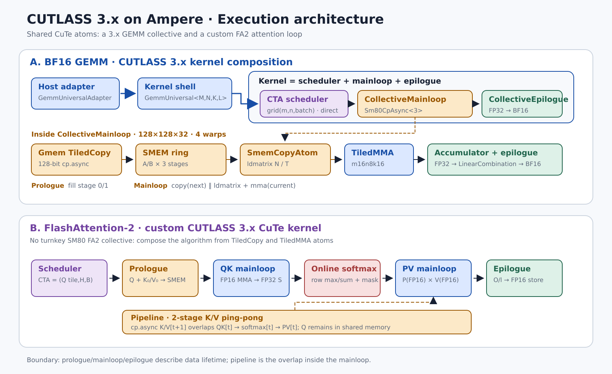
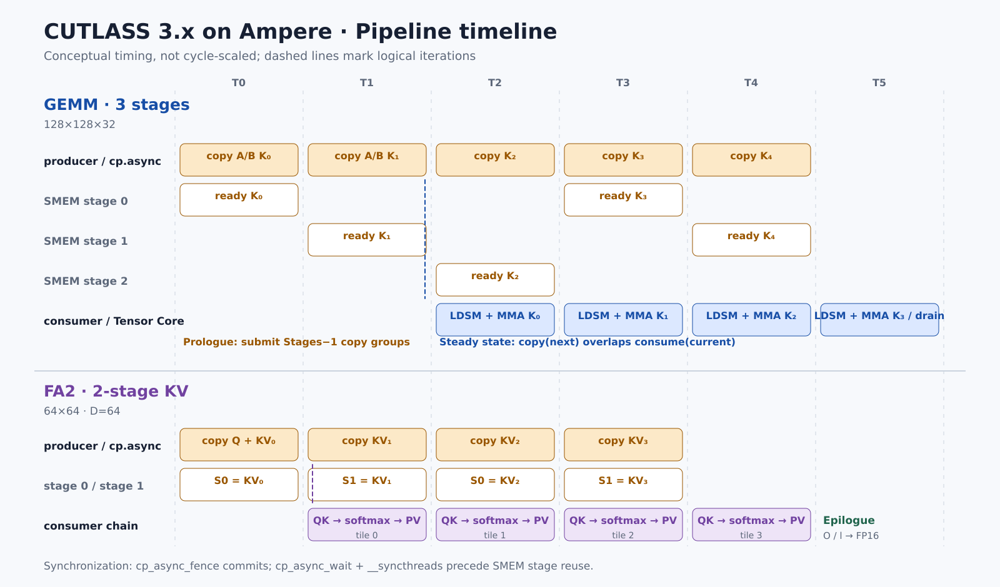

# CUTLASS 3.x Ampere GEMM 与 FlashAttention-2

代码入口：

- [`src/gemm_cutlass_ampere.cu`](../src/gemm_cutlass_ampere.cu)：真正的 CUTLASS 3.x
  `GemmUniversal + CollectiveMainloop + CollectiveEpilogue`；
- [`src/flash_attn_cutlass3.cu`](../src/flash_attn_cutlass3.cu)：用 CUTLASS 3.x 的 CuTe
  `TiledCopy` / `TiledMMA` atoms 组合的 FlashAttention-2 forward；
- Python API：`gemm_cutlass_ampere(a, b)` 与
  `flash_attn_cutlass3(q, k, v, causal=False)`。

当前子模块是 CUTLASS 4.6.1，但这里所说的“3.x API”指 CUTLASS 3 引入并继续保留的
collective/kernel 分层，而不是兼容层里的 `cutlass::gemm::device::Gemm` 2.x API。





两张图的可编辑生成器是
[`docs/assets/cutlass3_gemm_fa2_architecture.py`](assets/cutlass3_gemm_fa2_architecture.py)。

## 1. 先把几个边界说清楚

| 概念 | 本实现中的含义 |
|---|---|
| scheduler | 把问题 tile 分派给 CTA；不负责 CTA 内的 `cp.async` 时序 |
| prologue | mainloop 开始消费前，把第一批 operand tile 装入 shared memory |
| pipeline | producer copy 与 consumer compute 的重叠，以及环形 stage 的生命周期 |
| mainloop | 沿 reduction/sequence tile 迭代，并产出寄存器 accumulator |
| epilogue | 将 accumulator 变换、转换类型并写回输出 |

因此 pipeline 不是与 mainloop 并列的算法阶段，而是 mainloop 内部隐藏数据搬运延迟的
机制。prologue 也未必是一个独立 C++ 类型；SM80 GEMM 的 prologue 就在
`CollectiveMma::operator()` 的开头。

另一个重要区别是：CUTLASS 提供通用 GEMM collective，但没有一个可直接实例化的
“SM80 FA2 collective”。FA2 必须自己组织 QK、online softmax、PV 与 attention
epilogue；CUTLASS 3.x/CuTe 提供的是底层 copy/MMA/layout atoms。

## 2. GEMM：为什么这样组合 CUTLASS 3.x API

计算语义为：

```text
C[M,N] = A[M,K] @ B[K,N]
A/B/C: row-major BF16
accumulator: FP32
```

### 2.1 从 collective 到 device adapter

核心类型链如下：

```cpp
using ProblemShape = cute::Shape<int, int, int, int>;  // M,N,K,batch
using TileShape = cute::Shape<cute::_128, cute::_128, cute::_32>;
using DispatchPolicy = cutlass::gemm::MainloopSm80CpAsync<3>;

using CollectiveMainloop = cutlass::gemm::collective::CollectiveMma<...>;
using CollectiveEpilogue = cutlass::epilogue::collective::DefaultEpilogue<...>;

using GemmKernel = cutlass::gemm::kernel::GemmUniversal<
    ProblemShape, CollectiveMainloop, CollectiveEpilogue>;
using Gemm = cutlass::gemm::device::GemmUniversalAdapter<GemmKernel>;
```

这五层各自解决一个问题：

1. `ProblemShape` 固化 MNKL 的坐标约定；
2. `CollectiveMainloop` 描述 A/B 从 HBM 到寄存器并进行 MMA 的整条数据通路；
3. `CollectiveEpilogue` 描述 accumulator 到 C/D 的输出变换；
4. `GemmUniversal` 连接 grid、scheduler、mainloop 与 epilogue；
5. `GemmUniversalAdapter` 提供 host 端 `can_implement`、参数转换、动态 shared memory
   设置和 kernel launch。

CUTLASS 4.6.1 的 `CollectiveBuilder` 没有 SM80 GEMM specialization，所以本实现显式
给出 `TiledMma`、global/shared copy、shared layout 和 dispatch policy。这样仍然是
3.x collective API；退回 `device::Gemm` 才是 2.x 兼容接口。

### 2.2 mainloop 选型

| 维度 | 选择 | 原因 |
|---|---|---|
| CTA tile | `128×128×32` | A/B 复用较好；1024² 输出仍有 8×8 CTA |
| warp arrangement | `2×2×1`，共 128 threads | 四个 warp 分摊 CTA 的 M/N tile |
| MMA atom | `SM80_16x8x16_F32BF16BF16F32_TN` | BF16 输入、FP32 累加的 Ampere Tensor Core 原生形状 |
| Gmem copy | `SM80_CP_ASYNC_CACHEALWAYS<uint128_t>` | 每线程每次 16 B，HBM/L2 直接到 SMEM |
| Smem→register | A 用 `LDSM_N`，B 用 `LDSM_T` | 匹配 MMA A/B fragment 的寄存器布局 |
| shared layout | XOR swizzle | 避免 `ldmatrix` 访问时的 shared-memory bank conflict |

CUTLASS 将 B 表示为逻辑 `(N,K)`，而 Python 传入的是物理 row-major `B[K,N]`。因此
stride 必须写成：

```text
A logical (M,K,L): stride = (K, 1, M*K)
B logical (N,K,L): stride = (1, N, K*N)
C logical (M,N,L): stride = (N, 1, M*N)
```

`LDSM_T` 在 shared→register 路径完成 B operand 所需的转置视图，无需在 HBM 中先生成
`Bᵀ`。128-bit copy 要求 K、N 是 8 个 BF16 的倍数；M/N 的 CTA 尾块由 collective 的
predicate 处理。

### 2.3 为什么 GEMM pipeline 是 3 stages

一个 K stage 的 shared-memory operand 容量是：

```text
A: 128 × 32 × 2 B =  8 KiB
B: 128 × 32 × 2 B =  8 KiB
合计                    16 KiB/stage
3 stages                48 KiB/CTA
```

源码用 `static_assert(GemmKernel::SharedStorageSize == 48 * 1024)` 锁住了这一预算。

- 2 stages 只是最小 ping-pong，只有一组 future tile，较容易暴露 global-memory
  latency；
- 3 stages 在 prologue 预取 `Stages-1 = 2` 组，稳态时能在消费当前 tile 的同时搬入
  next tile；
- 4 stages 会把 operand storage 增至 64 KiB，对当前 GPU 的 occupancy 更不友好，
  是否有收益必须按目标 shape 实测。

概念时序是：

```text
prologue:  stage0 <- K0, stage1 <- K1
step 0:    consume K0 | stage2 <- K2
step 1:    consume K1 | stage0 <- K3
step 2:    consume K2 | stage1 <- K4
drain:     等待并消费最后的 ready stages
```

底层由 `cp_async_fence` 划分 copy group，`cp_async_wait<N>` 控制最多允许多少组仍在
飞行，CTA barrier 保证所有线程能安全看到并复用 shared stage。

### 2.4 GEMM prologue

`MainloopSm80CpAsync<3>` 的 prologue 做四件事：

1. 按 CTA 坐标得到 A/B global tiles，并构造 residue predicate；
2. 协作发出 stage 0、1 的 128-bit `cp.async`；
3. 每组 copy 后推进 shared-memory 环形写指针；
4. 第一次 `ldmatrix` 前等待所需 copy group 完成。

这里没有额外的量化反解、scale 或 elementwise transform，所以
`TransformA/TransformB` 都是 `cute::identity`。如果未来加 INT8/FP8 scale，这一层才是
输入 prologue 的主要扩展点。

### 2.5 GEMM epilogue

本实现选用 CUTLASS 3.x collective 边界：

```cpp
using EpilogueOp = cutlass::epilogue::thread::LinearCombination<
    cutlass::bfloat16_t, 1, float, float>;
using CollectiveEpilogue = cutlass::epilogue::collective::DefaultEpilogue<...>;
```

语义是 `D = alpha * accumulator + beta * C`，本次参数为 `alpha=1, beta=0`：

- accumulator 与 alpha/beta 运算保持 FP32；
- 最后 round/convert 为 BF16；
- `beta=0` 时不需要读取未初始化的 C source；
- 没有 bias、activation 或 residual，因为 Python API 的语义是纯矩阵乘。

注意这里的输出计数是 `1`。SM80 的 3.x `DefaultEpilogue` 是一个正确、清楚但偏保守的
逐 accumulator predicate/store 路径，不等同于 legacy 2.x 中高度调优的 shared-memory
vector epilogue。若追求超越 cuBLAS，下一步应实现 SM80 专用 collective epilogue，或在
满足语义时融合 bias/GELU，从减少额外 kernel launch 和 HBM 往返中获益。

### 2.6 GEMM scheduler

本 kernel 使用 SM70/80 通用的直接 2D grid 映射：

```text
grid.x = ceil_div(M, 128)
grid.y = ceil_div(N, 128)
grid.z = batch
CTA(m,n,l) = (blockIdx.x, blockIdx.y, blockIdx.z)
```

它没有使用 legacy `GemmIdentityThreadblockSwizzle<8>`，也没有 Hopper/Blackwell 的
persistent warp-specialized tile scheduler。K 方向也没有 split-K；每个 `(m,n)` 输出
tile 只由一个 CTA 完成，因此 workspace 为 0，没有额外归约。

选择直接 scheduler 的原因是当前 1024³ 基准已有 64 个 CTA，足以展示 mainloop；先把
真正的 3.x collective 路径做正确，再讨论 locality/persistent scheduling。M×N 很小、K
极大时，才值得引入 Stream-K 或 parallel split-K；窄长矩阵则可增加独立的 tile-shape
specialization。

## 3. FA2：如何用 CUTLASS 3.x CuTe atoms 重写

当前支持：

```text
Q/K/V/O: contiguous FP16 [B,H,N,64]
N: positive multiple of 64
causal: compile-time true/false specialization
softmax scale: 1/sqrt(64) = 1/8
```

一个 CTA 计算一个 `O[64,64]` query tile，grid 为：

```text
grid = (N / 64, H, B), block = 128 threads = 4 warps
```

四个 warp 只沿 M 方向分布，每个 warp 持有完整的 `16×64` score strip。这一安排让 QK
的 C fragment 能直接重解释成 PV 的 A fragment，避免概率矩阵 P 落到 HBM，也避免为了
跨 warp 转置而额外经过 shared memory。

### 3.1 FA2 prologue 与 2-stage KV pipeline

shared-memory 预算为：

```text
Q resident:          64 × 64 × 2 B =  8 KiB
K, two stages:   2 × 64 × 64 × 2 B = 16 KiB
V, two stages:   2 × 64 × 64 × 2 B = 16 KiB
合计                                      40 KiB/CTA
```

prologue 将 Q、K0、V0 用 CuTe `SM80_CP_ASYNC_CACHEGLOBAL<uint128_t>` 搬入 XOR-swizzled
shared memory，随后 `fence → wait<0> → __syncthreads()`。Q 在整个 CTA 生命周期中不变，
所以只搬一次；K/V 随 sequence tile 做两级 ping-pong。

这里没有照搬 GEMM 的 3 stages，原因是每个 KV tile 的 consumer 链很长：
`QK MMA → online softmax → PV MMA`。这段计算通常已经给下一组 K/V copy 留出足够的
隐藏窗口；改成 3-stage KV 会使 shared memory 从 40 KiB 增至 56 KiB，而当前 kernel
已使用约 161/162 registers/thread，额外 stage 更可能先伤害 occupancy。

循环内顺序为：

```text
1. 向 write_stage 发出 K/V[t+1] 的 cp.async，并 fence
2. 从 read_stage 用 ldmatrix 读取 K[t]，执行 QK MMA
3. causal mask + online softmax
4. 从 read_stage 读取 V[t]，执行 PV MMA
5. wait + CTA barrier，再交换 read/write stage
```

### 3.2 两个 mainloop 与 fragment handoff

QK 与 PV 共用同一个：

```cpp
MMA_Atom<SM80_16x8x16_F32F16F16F32_TN>
Layout<Shape<_4,_1,_1>>
Tile<_64,_64,_16>
```

第一个 mainloop 计算 FP32 score：

```text
S_tile = Q[64,64] @ K_tile[64,64]^T
```

每个 score 元素在 FP32 中完成 scale/mask/exp，随后临时转换为 FP16 P operand。CuTe
用 compile-time layout algebra 完成 C-fragment 到 A-fragment 的视图转换：

```cpp
auto a_to_c = left_inverse(layout_as_c).compose(layout_as_a);
auto trP_as_a = trP_as_c.compose(a_to_c);
```

第二个 mainloop 直接执行：

```text
O_numerator += P_tile(FP16) @ V_tile(FP16)
```

P 从未写到 global memory，这正是 FlashAttention 将显存复杂度从 `O(N²)` 降为
`O(ND)` 的关键。

### 3.3 online softmax 为什么能逐 tile 合并

每个 query row 保存运行状态 `(m, l, O)`。新 tile 的局部最大值合入后：

```text
m_new = max(m_old, max(S_tile))
alpha = exp(m_old - m_new)
P     = exp(scale * S_tile - m_new)
l_new = alpha * l_old + sum(P)
O_new = alpha * O_old + P @ V_tile
```

这保持了与整行 softmax 等价的归一化，同时数值稳定。causal specialization 只遍历
`q_block + 1` 个 KV tiles，并在对角 tile 内把 `key_col > query_row` 的 score 设为
`-∞`；因此既省掉未来 tiles 的算力，也避免运行时在 non-causal 路径留下分支。

### 3.4 attention epilogue

所有 KV tiles 完成后，epilogue 执行：

```text
O = O_numerator / l
FP32 → FP16
register fragment → swizzled shared O
shared O → coalesced 128-bit global stores
```

这里不能直接使用 GEMM 的 `DefaultEpilogue`：attention epilogue 需要每行不同的 softmax
denominator，并且输出 accumulator 来自跨多个 KV tile 维护的 online 状态。因此它是
一个自定义 attention epilogue，但 copy/store 仍使用 CuTe layout 与 `TiledCopy`。

## 4. 怎么选择：一张决策表

| 组件 | GEMM | FA2 | 选择原则 |
|---|---|---|---|
| scheduler | direct `(m,n,batch)` | `(q_tile,head,batch)`；causal 缩短 KV loop | 先保证独立输出 tile 足够并行，再考虑 persistent/split |
| prologue | A/B stage 0、1 | Q + K0/V0 | 常驻数据只搬一次；预热最少的 future stages |
| pipeline | 3-stage A/B | 2-stage K/V | 比较 copy latency 与 consumer 链长度，再核算 SMEM/occupancy |
| mainloop | 单一 A×B reduction | QK → softmax → PV | accumulator 尽量留在寄存器；避免中间矩阵落 HBM |
| epilogue | `LinearCombination` | 行归一化 + FP16 vector store | 融合所有依赖 accumulator/row-state 的末端运算 |

经验上，不能仅凭 stage 数判断快慢。至少同时观察：

- shared bytes/CTA 与 active CTAs/SM；
- registers/thread 与 spill；
- Tensor Core utilization；
- `cp.async` wait stalls；
- `ldmatrix` bank conflicts；
- 输入 shape 的 tile 数是否足以占满 GPU。

## 5. 构建、测试与当前实测

```bash
source scripts/env.sh
source ~/.python/miniinfer/bin/activate
cmake --build build -j

PYTHONPATH=python python -m cuda_learn.bench --check-only \
  test_gemm_cutlass_ampere \
  test_flash_attn_cutlass3 \
  test_flash_attn_cutlass3_causal

PYTHONPATH=python python -m cuda_learn.bench --warmup 20 --iters 100 \
  test_gemm_cutlass_ampere \
  test_flash_attn_cutlass3 \
  test_flash_attn_cutlass3_causal
```

当前 sm_89 机器、测试默认 shape 的一次运行结果（端到端 CUDA Event，取 min）：

| kernel | 本实现 | 对照 |
|---|---:|---:|
| BF16 GEMM | 0.131 ms / 16.38 TFLOPS | cuBLAS 0.114 ms / 18.72 TFLOPS |
| FA2 non-causal | 0.229 ms / 18.64 TFLOPS | FlashAttention 2.8.3 0.237 ms / 18.08 TFLOPS |
| FA2 causal | 0.135 ms / 15.21 TFLOPS | FlashAttention 2.8.3 0.113 ms / 17.35 TFLOPS |

正确性方面，GEMM 同时通过 cuBLAS 与仓库手写 MMA 对拍；FA2 的 non-causal/causal
同时通过 raw-PTX FA2 与 FlashAttention 2.8.3 对拍。资源检查显示 FA2 使用 40 KiB
static shared memory，non-causal/causal 分别约 161/162 registers/thread。性能数字依赖
GPU、频率、CUDA/CUTLASS 版本和 shape，应视为本机回归基线，而不是跨机器结论。

## 6. 下一步调优顺序

1. GEMM 先加入 `128×64×32`、`64×128×32` 与 2/4-stage 候选，按 shape dispatch；
2. 为 SM80 写 vectorized collective epilogue，再评估 bias/GELU fusion；
3. FA2 测 3-stage KV 是否能抵消 occupancy 降低，并用 profiler 看真实 wait stalls；
4. 扩展 FA2 的 head dimension、ragged sequence、GQA/MQA 和 dropout；
5. 只有 tile 数不足时再引入 split-K、Stream-K 或 persistent scheduler。

这套顺序的核心是：先由数据生命周期决定 prologue/pipeline/mainloop/epilogue，再由问题
形状决定 scheduler；最后才用 profiler 在多个合法候选之间选择。
