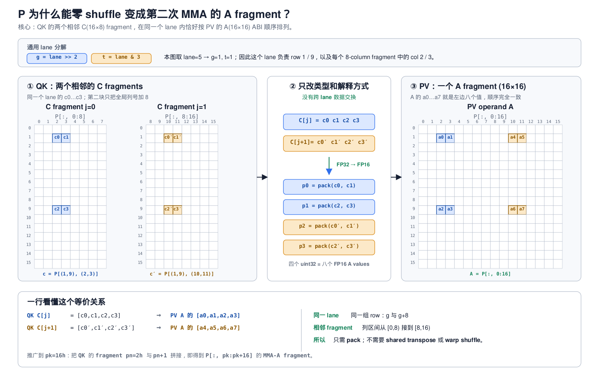

# Flash Attention：从教学版到寄存器、分阶段流水与 causal 优化

本文是本仓库 Flash Attention 实现的单一完整文档，合并了原先分散的背景、初始版本、
优化版本和性能测试文档。对应代码：

- 初始版本：[src/flash_attn.cu](../src/flash_attn.cu)，shared-memory 教学版；
- 优化版本：[src/flash_attn_optimized.cu](../src/flash_attn_optimized.cu)，寄存器累加、
  PAD=8 shared layout、8 warp、128×128 分阶段 K/V 流水；
- XOR swizzle 版本：[src/flash_attn_swizzled.cu](../src/flash_attn_swizzled.cu)，48 KiB
  compact layout、4 warp、目标 2 CTA/SM；
- multi-stage 教学优化版：[src/flash_attn_multistage.cu](../src/flash_attn_multistage.cu)，
  64×64、4 warp、40 KiB、双 stage XOR-swizzled K/V，并把相邻 `x2` 合并为
  `x4` / `x4.trans`；
- Python 调用：[python/cuda_learn/ops.py](../python/cuda_learn/ops.py)；
- 测试与 benchmark：[python/cuda_learn/tests/test_ops.py](../python/cuda_learn/tests/test_ops.py)。

四个手写 kernel 都固定为 FP16、forward-only 和 `D=64`。初始版和 multi-stage 版使用
64×64 tile；另外两个优化版使用 128×128 tile。输入布局为 `[B,H,N,64]`，且 `N`
必须是 64 的倍数。
`flash_attn_optimized(...)` 是 PAD=8 版本，`flash_attn_swizzled(...)` 是独立的 XOR
swizzle 版本，`flash_attn_multistage(...)` 是本文的显式双缓冲模板；三者都通过
`causal=False/True` 选择模式。

## 1. 为什么需要 Flash Attention

标准 scaled-dot-product attention 为：

```text
S = Q K^T / sqrt(D)    # [N,N]
P = softmax(S)         # [N,N]
O = P V                # [N,D]
```

把这三步拆成独立算子时，`S` 和 `P` 会完整写回 HBM 再读回。它们的空间复杂度是
`O(N^2)`，且大量时间消耗在中间矩阵的显存流量，而不是 Tensor Core 计算。

Flash Attention 的核心是：一个 CTA 持有一块 Q，流式扫过所有 K/V tile；当前的
score/probability tile 只在片上短暂存在，完整的 `[N,N]` 中间矩阵从不落 HBM。

### 1.1 Online softmax

分块后无法一次看到整行 score，因此每个 query 行维护：

- `m`：目前见过的最大值；
- `l`：以 `m` 为基准的指数和；
- `O_acc`：尚未归一化的输出分子。

处理新 tile 时：

```text
m_new = max(m_old, tile_max)
alpha = exp(m_old - m_new)
l_new = alpha * l_old + sum_j exp(x_j - m_new)
O_new = alpha * O_old + sum_j exp(x_j - m_new) * V_j
```

最后写出 `O_acc / l`。若新 tile 出现更大的最大值，只需用 `alpha` 重新缩放旧状态，
因此整个流式过程保持数值稳定。

### 1.2 本仓库采用的硬件原语

原语封装位于 [ampere_primitives.cuh](../src/include/ampere_primitives.cuh)：

- `cp.async`：16 字节 global-to-shared 异步拷贝；
- `ldmatrix`：一个 warp 协作把 shared-memory 矩阵 fragment 搬进寄存器；
- `mma.sync.m16n8k16`：Tensor Core 执行 FP16 矩阵乘、FP32 累加；
- `__shfl_xor_sync`：寄存器之间的 warp/subgroup reduction。

整体数据流是：

```text
HBM --cp.async--> shared --ldmatrix--> registers --mma--> registers
```

## 2. 初始版本：shared-memory 教学实现

初始 kernel 是 `flash_attention2_fwd_d64`。一个 CTA 负责 64 个 query 行，4 个 warp
各负责 16 行，循环处理 64 行的 K/V tile。

### 2.1 Shared memory 布局

| 区域 | 元素与类型 | 字节 | 用途 |
|---|---:|---:|---|
| `q_smem` | `64×72` FP16 | 9,216 | 当前 Q tile，循环外载入一次 |
| `kv_smem` | `64×72` FP16 | 9,216 | K/V 共用，V 会覆盖 K |
| `score_smem` | `64×64` FP32 | 16,384 | 当前 `QK^T` score |
| `prob_smem` | `64×72` FP16 | 9,216 | 当前 softmax probability |
| `out_smem` | `64×64` FP32 | 16,384 | 跨 tile 输出分子 |
| `row_m/row_l` | `2×64` FP32 | 512 | online-softmax 行状态 |
| 合计 | | **60,928 B** | 约 59.5 KiB |

`PAD=8` 让相邻 shared-memory 行在 bank 上错开，降低 `ldmatrix` bank conflict。
60,928 B 超过传统 48 KiB 动态 shared-memory 限制，因此 host wrapper使用
`cudaFuncSetAttribute(cudaFuncAttributeMaxDynamicSharedMemorySize, ...)` opt-in。

### 2.2 每个 KV tile 的五个 CTA barrier

初始版本的处理顺序为：

1. `K: HBM -> kv_smem`，等待 K 对所有 warp 可见；
2. `QK^T` 的 MMA 结果从寄存器写入 `score_smem`，等待 softmax 消费；
3. 64 个线程各自串行处理一行 softmax，并写入 `prob_smem`，等待所有 warp；
4. `V: HBM -> kv_smem` 覆盖 K，等待 K 的旧读者和 V 的新读者；
5. `PV` 累加回 `out_smem`，等待下一个 tile rescale 输出状态。

因此每个 tile 有 5 次 `__syncthreads()`。其中 score、输出和 m/l 状态本来都可以由
拥有对应行的 warp 保留在寄存器，却为了教学可见性反复经过 shared memory。

### 2.3 初始版 softmax 的瓶颈

初始版只让 `tid < 64` 的线程参与 softmax，每个线程串行完成：

```text
scan 64 scores for max
scan 64 scores for exp and sum
scan 64 output values for rescale
```

另一半线程空闲，串行依赖链也很长。这与前后高度并行的 Tensor Core MMA 不匹配。

### 2.4 初始版的价值

该版本不是为了接近库性能，而是把 `QK^T -> online softmax -> PV` 的边界全部显式化。
它便于检查 fragment 映射、shared-memory 生命周期以及每个 barrier 的必要性，是优化版的
正确性基线。

## 3. 优化版本总体结构

优化 kernel `flash_attention2_fwd_d64_registers` 同时改变 tiling、流水和状态归属：

| 项目 | 初始版 | 优化版 |
|---|---|---|
| tile | 64×64 | 128×128 |
| threads/CTA | 128（4 warp） | 256（8 warp） |
| score tile | FP32 shared memory | `s_frag[16][4]` 寄存器 |
| 输出分子 | FP32 shared memory | `o_acc[8][4]`，跨 KV tile 常驻寄存器 |
| m/l | shared-memory 数组 | 每 lane 两组标量寄存器 |
| softmax | 每行单线程串行 | 4-lane subgroup 协作 |
| K/V staging | 共用一个 buffer | K/V 各一个单-stage buffer |
| P | FP16 shared memory | FP32 `s_frag`；每个 `pk` 步临时 pack 为 FP16 A fragment |
| CTA barrier/tile | 5 | **2** |
| causal | 不支持 | 可选，整 tile 跳过 + 对角 mask |

### 3.1 输出和 online-softmax 状态常驻寄存器

每个 lane 持有：

```cpp
float o_acc[8][4];
float row_m0, row_m1;
float row_l0, row_l1;
```

`o_acc` 就是八个 `mma.m16n8k16` 输出 fragment。元素 0/1 属于 `row0`，元素 2/3
属于 `row1`。进入新 tile 时直接在寄存器里乘 `alpha`，随后 `PV` MMA 继续累加到
同一组寄存器。循环结束后乘 `1/l` 并转 FP16，再通过向量化 epilogue 写 HBM。

这样删除了初始版的 `score_smem`、`out_smem`、`row_m` 和 `row_l`，也删除了它们导致的
CTA 级生产者/消费者同步。

### 3.2 4-lane subgroup 并行 softmax

`mma.m16n8k16` 的 FP32 accumulator 映射中，每个 lane 持有两行、每行两个相邻列。
四个相邻 lane 共同覆盖相同的两行：

```text
lanes 4g..4g+3 -> rows g and g+8 -> each row has all 128 columns
```

每个 lane 先对自己持有的 32 个 score 求局部 max/sum，再通过两轮：

```cpp
__shfl_xor_sync(0xffffffffu, value, 1, 4);
__shfl_xor_sync(0xffffffffu, value, 2, 4);
```

得到整行结果。全部 256 个线程都参与 softmax，且 reduction 只经过寄存器和 shuffle。

softmax 之后不再把 P 写入 `prob_smem`。当前实现让概率继续留在 FP32 `s_frag` 中；执行
每个 `pk` 步时，把两个相邻 8-column score accumulator 临时转换为四个 packed FP16
register，恰好组成下一次 `mma.m16n8k16` 所需的 A fragment。因此 P 路径没有
shared-memory store/load，也不再需要 `__syncwarp()`。这和官方 FA2 的“先把整块 P
转换成 packed FP16/BF16 register tensor，再重解释 layout”略有不同，详见第 5 节。

### 3.3 复用 Q shared memory 的向量化输出

KV 循环结束后 `q_smem` 已不再使用。直接从 MMA accumulator 写 output 会生成每线程
32 条 `STG.E.U16`；当前版本先把 FP16 output fragment 写入 `q_smem` 完成 layout
conversion，执行一次 CTA barrier，再由所有线程按连续 16 字节读取和写出。

最终 SASS 从：

```text
32 × STG.E.U16
```

变为：

```text
5 × LDS.128 + 5 × STG.E.128
```

编译器也把 fragment 到 shared 的写入合并成 `STS.E.BYPASS.128`。代价是增加一次
epilogue CTA barrier，以及寄存器从 139 增至 143/thread。

## 4. 128×128 tile 与 K/V 分阶段流水

优化版将 tile 从 64×64 扩展到 128×128。八个 warp 各负责 16 个 query row；K/V
tile 被 128 行 Q 复用一次，因此相同 attention 计算发出的 K/V global load 请求减半。

K 和 V 各自只有一个 shared-memory stage：

```text
Q[128×64] + K[128×64] + V[128×64]
```

总动态 shared memory 为：

```text
3 * (128 * 72) half = 55,296 B = 54 KiB
```

分阶段流水为：

```text
prefetch Q and K[0]

for tile t:
    wait K[t]; __syncthreads()
    async copy V[t]
    QK[t]                         # 与 V[t] copy 重叠
    wait V[t]; __syncthreads()    # 此时 K[t] 已无人读取
    async copy K[t+1]
    online softmax + PV[t]        # 与 K[t+1] copy 重叠
```

K 和 V 的生命周期错开，因此不需要 `K[2] + V[2]` 完整 ping-pong。每 tile 两次 CTA
barrier 分别保护 K 和 V 的单 buffer 重用；虽然 barrier/tile 从旧双缓冲版的 1 增为 2，
但 128×128 tile 令整个 workload 的 tile 迭代从 4096 降到 1024，所以总 CTA barrier
约从 4096 降到 2048。

对于 `[2,8,1024,64]` non-causal workload：

| 项目 | 旧 64×64 | 当前 128×128 |
|---|---:|---:|
| query CTA 数 | 256 | 128 |
| 每 CTA 的 KV tile 数 | 16 | 8 |
| CTA×tile 迭代 | 4096 | 1024 |
| K/V global load 请求量（忽略 cache） | 64 MiB | 32 MiB |

### 4.1 64-row 尾块

接口仍支持 `N%64==0`，不强制 `N%128==0`。最后不足 128 行的 Q/K/V 使用带 source-size
的 `cp.async` zero-fill；softmax 同时把越界 key 置为 `-inf`，output store 只写有效 query
row。`N=64/128/192/320/1024` 的 causal 和 non-causal 都已单独验证。

### 4.2 为什么 shared memory 仍是 54 KiB

旧双缓冲版的 54 KiB 来自 `Q + K[2] + V[2] + P`；当前同样是 54 KiB，但来自扩大后的
`Q + K + V`。若仍为 128×128 P 分配 shared tile，总量会达到 90,112 B，因此 P 必须保留
在寄存器。PAD=8 版本仍受 1 CTA/SM 限制。

### 4.3 独立的 4-warp XOR-swizzle 版本

`flash_attn_swizzled` 保留相同的分阶段 K/V 流水、寄存器 P、causal 跳块和 vector
epilogue，但把 Q/K/V 的 shared layout 改为无 padding 的 128×64。每个连续 8-half
向量的列号与低三位 row 做 XOR：

```cpp
physical_col = col ^ ((row & 7) << 3);
physical_index = row * 64 + physical_col;
```

向量内的 8 个 half 保持连续和 16-byte 对齐，因此 `cp.async`、`ldmatrix` 和 epilogue
仍能向量化；相邻行则访问不同 bank pattern。shared memory 降为：

```text
3 * (128 * 64) half = 49,152 B = 48 KiB
```

CTA 从 8 warp/256 threads 改为 4 warp/128 threads。每个 warp 同时负责两组相隔 64 行
的 16-row MMA tile：

```text
warp w, mi=0 -> rows w*16 .. w*16+15
warp w, mi=1 -> rows 64+w*16 .. 64+w*16+15
```

编译结果为 255 registers/thread；每 CTA 的 register allocation 恰好约 32 Ki registers，
两 CTA 共 65,536 registers，shared memory 两 CTA 共 96 KiB，因此 sm_89 上满足目标
2 CTA/SM。为了降低峰值寄存器压力，两个 query row group 的 PV 依次执行；最终仍有
32-byte stack frame 和每线程 72-byte spill store/load，这是与 FA2 剩余差距的来源之一。

## 5. 对照官方 FA2：从 PTX fragment 推导 kernel

这一节只讨论 Ampere/Ada 上的经典 FA2 FP16 forward 路径。官方 D64 specialization 和
本仓库都以
[`mma.sync.aligned.m16n8k16.row.col.f32.f16.f16.f32`](https://docs.nvidia.com/cuda/parallel-thread-execution/#matrix-fragments-for-mma-m16n8k16-with-floating-point-type)
为基本 Tensor Core atom，但二者的 warp 划分、shared layout 和 P 的保存方式并不完全相同。
官方 D64 无 dropout dispatch 可直接对照
[`flash_fwd_launch_template.h`](https://github.com/Dao-AILab/flash-attention/blob/main/csrc/flash_attn/src/flash_fwd_launch_template.h#L190-L198)，
MMA 与 shared-copy atom 定义见
[`kernel_traits.h`](https://github.com/Dao-AILab/flash-attention/blob/main/csrc/flash_attn/src/kernel_traits.h#L27-L80)。

### 5.1 官方 FA2 做了什么，本实现差在哪里

| 项目 | 官方 FA2 D64 SM80 路径 | `flash_attn_optimized.cu` |
|---|---|---|
| CTA tile | 128×128 | 128×128 |
| warps/CTA | 4 | 8 |
| 每 warp 的 Q 行 | 32，两个 16-row MMA M fragment | 16，一个 M fragment |
| MMA atom | `m16n8k16.row.col` | 相同 |
| shared layout | compact XOR swizzle，Q/K/V 共 48 KiB | stride 72（`PAD=8`），共 54 KiB |
| Q shared→register | CuTe `SM75_U32x4_LDSM_N` | `ldmatrix.x4` |
| K shared→register | `SM75_U32x4_LDSM_N`，一次 copy 可组织两个 B atom | 每个 B atom 单独 `ldmatrix.x2` |
| V shared→register | `SM75_U16x8_LDSM_T`，一次 copy 可组织两个 B atom | 每个 B atom 单独 `ldmatrix.x2.trans` |
| P 的表示 | 整块 `acc_s` 转为 packed FP16/BF16 `rP` | P 仍存于 FP32 `s_frag`，按 `pk` 临时 pack |
| P→PV A layout | CuTe layout-only view | 手写四个 `pack_half2`，同样不跨 lane |
| K/V 跨 M fragment 复用 | 一个 warp 的两个 M fragment 共享载入值 | 每 warp 只有一个 M fragment |
| 实测资源 | 随 specialization/编译选项变化 | 143 registers/thread，55,296 B shared，1 CTA/SM |

这里最重要的不是照抄某个 `x4`，而是官方让同一 warp 负责两个 16-row M fragment：一次
载入的 K/V register tile 可以服务更多 Q 行。配合 compact swizzle，4 warp CTA 仍覆盖
128 行，并把 shared memory 压到 48 KiB。仓库的独立 `flash_attn_swizzled.cu` 已采用这个
总体方向，但当前编译为 255 registers/thread 且有 spill，说明“理论上能放两个 CTA”不等于
“一定更快”；必须同时控制寄存器 live range。

### 5.2 先读 MMA atom 的契约，再写循环

对 `m16n8k16`，一条 warp 级指令计算：

```text
A[16,16] × B[16,8] + C[16,8] -> D[16,8]
```

32 个 lane 合起来持有完整 fragment；单 lane 的 PTX 操作数是：

| operand | 逻辑形状 | 每 lane 寄存器 | 寄存器类型 |
|---|---:|---:|---|
| A | 16×16 FP16 | 4 | 4×`uint32_t`，每个 pack 两个 half |
| B | 16×8 FP16 | 2 | 2×`uint32_t` |
| C/D | 16×8 FP32 | 4 | 4×`float` |

仓库的 wrapper 与 CUTLASS 对该契约的声明可直接对照
[ampere_primitives.cuh](../src/include/ampere_primitives.cuh) 和
[CUTLASS `mma_sm80.hpp`](../third_party/cutlass/include/cute/arch/mma_sm80.hpp)。因此，循环次数
不是经验参数，而是 tile 形状除以 atom 形状。

设一个 warp 一次持有的输出 tile 为 `M_w×N_w`，规约长度为 `K_total`：

```text
MMA count = (M_w / 16) * (N_w / 8) * (K_total / 16)
C/D FP32 registers per lane = (M_w / 16) * (N_w / 8) * 4
                               = M_w * N_w / 32
```

本实现的 QK 阶段是 `M_w=16, N_w=BC=128, K_total=D=64`：

```text
kd 次数          = 64 / 16  = 4
nj 次数          = 128 / 8  = 16
MMA/warp/KV tile = 4 * 16    = 64
s_frag           = 16 * 4    = 64 个 FP32 register/lane
```

PV 阶段是 `M_w=16, N_w=D=64, K_total=BC=128`：

```text
pk 次数          = 128 / 16 = 8
nj 次数          = 64 / 8   = 8
MMA/warp/KV tile = 8 * 8    = 64
o_acc            = 8 * 4    = 32 个 FP32 register/lane
```

`o_acc` 必须跨所有 KV tile 存活；`s_frag` 只需活过当前 tile，但当前代码在整个 PV 循环中
仍保留 64 个 FP32 概率。官方先执行 `convert_type<Element>(acc_s)`，让 FP32 score accumulator
死亡，并以 packed FP16/BF16 保存 P。如果对本实现相同的 16×128 warp tile 采用这种表示，
仅从数据宽度看，P 的长期存储可从 64 个 32-bit 槽位降为约 32 个；官方每 warp 负责两个
M fragment，因此其元素总数还要乘 2。实际总寄存器数也取决于编译器是否让新旧对象的
live range 重叠，以及地址、谓词、softmax 临时量等开销。

### 5.3 如何确定用 `ldmatrix.x1/x2/x4` 和 `.trans`

[`ldmatrix`](https://docs.nvidia.com/cuda/parallel-thread-execution/#warp-level-matrix-load-instruction-ldmatrix)
的 `m8n8.b16` 基本单位是一块 8×8 的 16-bit 数据：

```text
.x1 -> warp 载入 1 个 8×8 tile -> 每 lane 得 1 个 32-bit register
.x2 -> warp 载入 2 个 8×8 tile -> 每 lane 得 2 个 32-bit registers
.x4 -> warp 载入 4 个 8×8 tile -> 每 lane 得 4 个 32-bit registers
```

由此可先得到最自然的单 atom 载入：

- A 是 16×16，由四个 8×8 组成，所以 Q 使用 `x4`；
- B 是 16×8，由两个 8×8 组成，所以单个 K/V B operand 使用 `x2`；
- 如果 shared layout 和地址分配允许一次取两个相邻 B operand，可以用 `x4`，然后把四个
  结果寄存器拆成两组 `{b0,b1}`。这正是官方 copy atom 倾向做的 grouping，不是说单条
  MMA 突然需要四个 B 寄存器。

`.trans` 的选择取决于“shared 中的物理排布”如何映射到 MMA 需要的 register fragment，
不能只看公式里是否写了转置：

- QK 使用 `A=Q`、`B=K^T`。K 在 shared 中按 `[key, d]` row-major 保存，这块内存也正好
  是逻辑 `K^T[d,key]` 的 column-major 表示，因此这里用非 `.trans`；
- PV 使用 `A=P`、`B=V`。V 同样按 `[key,d]` row-major 保存，而 `row.col` MMA 的 B 需要
  column-major fragment，所以当前地址映射配合 `ldmatrix.trans` 完成 register 内的 8×8
  转置。

最终判断必须同时满足四项：MMA 的 A/B fragment 映射、shared physical layout、每 8-lane
地址组的对齐、以及 bank-conflict 行为。一个实用流程是：

1. 由 MMA atom 写出每 lane 需要的逻辑坐标；
2. 由 shared layout 反算这些坐标的物理地址；
3. 检查 `ldmatrix` 的 lane/address contract 能否生成目标 register 次序；
4. 再决定 `x2` 还是把相邻 operand 合并成 `x4`；
5. 用 SASS 确认实际生成 `LDSM.16.M88.2/4`，再用 Nsight Compute 检查 bank conflict、
   eligible warps、long scoreboard 和 register spill。

对当前 kernel，低风险实验是分别把 K 的两次相邻 `x2` 合并为一次 `x4`，以及把 V 的两次
相邻 `x2.trans` 合并为一次 `x4.trans`。它可以减少 load 指令数，但会让四个载入寄存器
同时存活；若额外 live range 导致 occupancy 下降或 spill，结果可能反而更慢。

### 5.4 P 为什么能直接成为第二次 MMA 的 A layout

先区分三个层次：

1. 数学矩阵中的坐标，例如 `P[row,col]`；
2. QK MMA 完成后，同一个 lane 中 `c0..c3` 各代表哪个坐标；
3. PV MMA 开始前，同一个 lane 的 `a0..a7` 应该代表哪个坐标。

下面的图用 `lane=5` 展开了完整对应关系。可缩放版本见
[SVG 原图](assets/fa2_p_to_mma_a_layout.svg)，生成脚本见
[fa2_p_to_mma_a_layout.py](assets/fa2_p_to_mma_a_layout.py)。



令：

```text
g = lane / 4
t = lane % 4
```

PTX 规定，一个 `m16n8k16` C/D fragment 中该 lane 的四个 FP32 accumulator 是：

```text
c0 = C[g,   2t]
c1 = C[g,   2t+1]
c2 = C[g+8, 2t]
c3 = C[g+8, 2t+1]
```

QK 的每个 `s_frag[j]` 是一个 16×8 输出 tile，其全局列起点是 `8j`，所以：

```text
s_frag[j][0] = P[g,   8j+2t]
s_frag[j][1] = P[g,   8j+2t+1]
s_frag[j][2] = P[g+8, 8j+2t]
s_frag[j][3] = P[g+8, 8j+2t+1]
```

而同一条 `m16n8k16` 的 A operand 是 16×16。PTX 规定同一 lane 的八个 half 为：

```text
a0,a1 -> A[g,   2t],   A[g,   2t+1]
a2,a3 -> A[g+8, 2t],   A[g+8, 2t+1]
a4,a5 -> A[g,   8+2t], A[g,   8+2t+1]
a6,a7 -> A[g+8, 8+2t], A[g+8, 8+2t+1]
```

现在看一个具体 lane。`lane=5` 时 `g=1,t=1`。QK 的前两个 N=8 fragment 持有：

| 来源 | lane 5 中的寄存器 | 数学坐标 |
|---|---|---|
| `s_frag[0]` | `c0,c1,c2,c3` | `P[1,2]`, `P[1,3]`, `P[9,2]`, `P[9,3]` |
| `s_frag[1]` | `c0,c1,c2,c3` | `P[1,10]`, `P[1,11]`, `P[9,10]`, `P[9,11]` |

PV 的第一个 K=16 步要求 lane 5 的 A operand 恰好是：

```text
a0,a1 = P[1,2],  P[1,3]
a2,a3 = P[9,2],  P[9,3]
a4,a5 = P[1,10], P[1,11]
a6,a7 = P[9,10], P[9,11]
```

因此两块数据的 lane ownership 和 lane 内次序已经一致：第一个 C fragment 给 A 的前四个
half，紧邻的第二个 C fragment 给后四个 half。代码只需把相邻两个 FP32 值转换并 pack：

```cpp
const int pn = pk / 8;
uint32_t p_frag[4] = {
    pack_half2(s_frag[pn][0],     s_frag[pn][1]), // {a0,a1}
    pack_half2(s_frag[pn][2],     s_frag[pn][3]), // {a2,a3}
    pack_half2(s_frag[pn + 1][0], s_frag[pn + 1][1]), // {a4,a5}
    pack_half2(s_frag[pn + 1][2], s_frag[pn + 1][3]), // {a6,a7}
};
```

`pk` 每次增加 16，而一个 score fragment 宽 8，因此 `pn=pk/8` 总是取一对连续 fragment：

```text
pk=0   -> s_frag[0],  s_frag[1]  -> P[:,  0:16]
pk=16  -> s_frag[2],  s_frag[3]  -> P[:, 16:32]
...
pk=112 -> s_frag[14], s_frag[15] -> P[:,112:128]
```

这里“零 shuffle”只表示不改变线程所有权：没有跨 lane `shfl`，没有写 shared memory 再
transpose，也没有交换 FP16 元素。FP32→FP16 conversion 与两个 half 的 packing 仍然是真实
指令，并非完全零成本。

### 5.5 官方 CuTe 的两行代码究竟做了什么

官方 forward kernel 的核心写法是：

```cpp
Tensor rP = convert_type<Element>(acc_s);
Tensor tOrP = make_tensor(
    rP.data(),
    convert_layout_acc_Aregs<TiledMma>(rP.layout()));
```

第一行是实际数据变换：对 softmax 后的 FP32 `acc_s` 做 FP16/BF16 conversion，并得到 packed
register tensor `rP`。第二行不搬数据，只给相同的 `rP.data()` 换一个 layout view。

对 k16 atom，原 score accumulator 的逻辑形状可概括为：

```text
(MMA=4 values, MMA_M, MMA_N)
```

`convert_layout_acc_Aregs` 把 N 方向相邻两份 C fragment 折到 A register 的第一维：

```text
((4,2), MMA_M, MMA_N/2)
```

第一维的 `4×2=8` 个 half 正好是 A 的 `a0..a7`。所以这不是 CuTe 暗中生成 transpose，
而是类型转换后的线性寄存器数据本来就在正确顺序中，CuTe 只把索引解释从“两份 4-value
C fragment”改成“一份 8-value A fragment”。实现可对照官方
[`flash_fwd_kernel.h`](https://github.com/Dao-AILab/flash-attention/blob/main/csrc/flash_attn/src/flash_fwd_kernel.h#L315-L335)
和
[`utils.h`](https://github.com/Dao-AILab/flash-attention/blob/main/csrc/flash_attn/src/utils.h#L179-L193)。

### 5.6 这种零 shuffle 何时失效

它不是所有 attention kernel 的普遍规律，而是下面四个条件同时成立的结果：

1. QK 和 PV 都使用相容的 `m16n8k16` atom；
2. QK C 的 row/lane mapping 与 PV A 的 row/lane mapping 相同；
3. 两个连续 N=8 score fragment 正好组成 PV 的 K=16；
4. warp 在 P 的列方向没有加入会改变 lane ownership 的额外 partition/permutation。

更换 FP8 atom、改变 warp-N partition、让 P 以转置视图参加 PV，或改用不同 shape 的
WGMMA/MMA 后，都必须重新逐坐标验证。结果可能仍是 layout-only view，也可能需要 `prmt`、
warp shuffle 或 shared-memory transpose。判断标准始终是：对每个 lane，生产者的寄存器序列
是否与消费者要求的寄存器序列完全一致，而不是两个逻辑矩阵的 shape 看起来是否相同。

### 5.7 为新 kernel 选型时的顺序

设计新的 head dimension 或 tile 时，可以按以下顺序，而不是先猜 accumulator 数量：

1. 确定 dtype、目标架构和可用 MMA atom；
2. 选择 CTA tile 与 warp tile，并用整除关系写出 QK/PV 三重循环次数；
3. 用 `M_w*N_w/32` 算 score/output 的理论 accumulator 下界；
4. 加上 A/B operand、online-softmax 状态和地址/predicate 临时量，估算 live set；
5. 从 MMA fragment 映射反推 shared→register copy，决定 `ldmatrix` 的 `xN/.trans`；
6. 明确哪些 K/V fragment 能跨 M fragment 或多个 MMA 重用，再决定是否把 `x2` 合成 `x4`；
7. 编译后以 `ptxas`/`cuobjdump` 的 registers、stack、spill 为准，而不是只相信源码数组大小；
8. 最后用 Nsight Compute 区分瓶颈究竟是 MMA、shared bank、barrier、SFU 还是 occupancy。

对当前 D64 sm_89 实现，最有价值的目标不是简单增加 accumulator，而是同时实现：4-warp
compact swizzle、K/V 对两个 M fragment 的复用、整块 P 及时转为 packed FP16，以及不产生
spill。若一次完成导致难以定位回退，应先单独验证 K/V 的 `x4` grouping，再缩短 P 和 score
的 FP32 live range，最后才合并两个 M fragment。

## 6. 可选 causal：块跳过与对角 mask

调用方式：

```python
out = cuda_learn.flash_attn_optimized(q, k, v, causal=True)
```

对于第 `blockIdx.x` 个 Q tile，只需访问：

```cpp
kv_tiles = blockIdx.x + 1;
```

因此对角线右上方的 KV tile 不会加载，也不会执行 QK/PV MMA。最后一个被访问的 tile
是对角 tile，其中再按元素执行：

```text
if key_column > query_row: score = -infinity
```

其余左下方 tile 完全有效，不产生逐元素 mask 分支。这样 causal 模式大约跳过一半
QK/PV 工作，而不是先完成完整 attention 再把未来位置清零。

对 square self-attention，计入真正执行的 QK/PV FLOP：

```text
non-causal: 4 * B * H * N^2 * D
causal:     2 * B * H * N * (N+1) * D
```

## 7. Shared memory、寄存器与同步对比

`cuobjdump --dump-resource-usage` 的 sm_89 实测：

| 版本 | registers/thread | shared memory | local/stack spill | barrier |
|---|---:|---:|---:|---:|
| 初始版 | 80 | 60,928 B | 0 | 5/tile |
| 单-stage register 版（历史中间状态） | 102 | 36,864 B | 0 | 2/tile |
| 64×64 完整 K/V 双缓冲（历史版本） | 125 | 55,296 B | 0 | 1/tile |
| 128×128 分阶段流水、direct output（历史版本） | 139 | 55,296 B | 0 | 2/tile |
| PAD=8 8-warp + vector epilogue | 143 | 55,296 B | 0 | 2/tile + 1/CTA |
| XOR-swizzle 4-warp | 255 | 49,152 B | 32 B stack；72 B spill store/load | 2/tile + 1/CTA |
| 64×64 multi-stage + `x4` | 148 non-causal；130 causal | 40,960 B static | 0 | 2/tile + 1/CTA |

PAD 版本为 1 CTA/SM；XOR-swizzle 版本达到 2 CTA/SM。两者都是每 SM 约 8 个 resident
warp，但后者的 warp 分属两个 CTA，可以跨 CTA 隐藏 barrier、softmax SFU 和 MMA 阶段。

## 8. 完整调用链

```text
cuda_learn.flash_attn_optimized(q,k,v,causal)
    -> Python 检查 FP16 CUDA [B,H,N,64]
    -> TVM FFI: cuda_learn.flash_attn_optimized
    -> C++ TensorView/shape/device 检查
    -> torch 当前 CUDA stream
    -> flash_attention2_fwd_d64_registers<<<...>>>

cuda_learn.flash_attn_swizzled(q,k,v,causal)
    -> TVM FFI: cuda_learn.flash_attn_swizzled
    -> flash_attention2_fwd_d64_swizzled_4warp<<<...>>>

cuda_learn.flash_attn_multistage(q,k,v,causal)
    -> 编译期选择 Causal=true/false
    -> flash_attn_multistage_kernel<2,true,Causal><<<...>>>
```

官方对比基线使用 vendored flash-attention 2.8.3 的 D64 FP16 causal/non-causal 官方
specialization。benchmark-only binding 只裁剪无关 dtype/head-dim/反向 translation unit，
不修改被测 kernel 源码。

## 9. 正确性和性能

测试环境：RTX 4060 Laptop（sm_89）、torch 2.10+cu128、nvcc 13.0，输入
`[B=2,H=8,N=1024,D=64]` FP16。为降低笔记本 GPU Boost 和执行顺序的影响，先对每个
kernel warmup 100 次，再交替执行多轮、每轮 500 次 CUDA Event 计时。相对差距取每一轮
配对时间比的中位数，避免两种 kernel 的频率波动错位；vector epilogue 的最终结果使用
修改后额外执行的 8 轮配对测量。

### 9.1 Non-causal

| kernel | median | TFLOPS | 相对当前 optimized |
|---|---:|---:|---:|
| 初始版（历史标准 bench） | 1.052 ms | 4.08 | 慢 3.69x |
| 64×64 双缓冲版（改动前） | 0.331 ms | 12.99 | 慢 1.16x |
| 128×128 分阶段流水、direct output | 0.286 ms | 15.00 | 慢 1.10x |
| 当前 128×128 + vector epilogue | **0.259 ms** | **16.59** | 1.00x |
| flash-attention 2.8.3 | 0.227 ms | 18.92 | 快 1.16x（paired） |

从完整 K/V 双缓冲到当前实现，non-causal 延迟从 0.331 ms 降至 0.259 ms。单独看
vector epilogue，由于笔记本动态频率，绝对 A/B 测得约 6%--12% 提升；用同轮 FA2 时间
归一化后，相对差距从 1.235x 降到 1.156x，对应约 6.4% 的延迟下降。

### 9.2 Causal

| kernel | median | 有效 TFLOPS | 相对当前 optimized |
|---|---:|---:|---:|
| 64×64 双缓冲 causal（改动前） | 0.189 ms | 11.35 | 慢 1.06x |
| 128×128 分阶段 causal、direct output | 0.179 ms | 12.00 | 慢 1.09x |
| 当前 128×128 + vector epilogue causal | **0.164 ms** | **13.11** | 1.00x |
| flash-attention 2.8.3 causal | 0.143 ms | 15.03 | 快 1.12x（paired） |

vector epilogue 的 causal 归一化差距从 1.214x 降到 1.118x，对应约 7.9% 的延迟下降。
短序列收益较小：`N=128` 约为 0%--5%，新增 epilogue barrier 会抵消部分向量 store 收益。

### 9.3 XOR swizzle vs PAD=8 vs FA2

笔记本 GPU 的功耗状态会让长批次按固定顺序执行产生十几个百分点偏差。这里使用 30 轮
短批次，轮换三种 kernel 的执行顺序，并统计每轮时间比的中位数。小于 1 表示 swizzle
版本更快：

| mode | N | swizzle / PAD=8 | swizzle / FA2 |
|---|---:|---:|---:|
| non-causal | 128 | 0.998x | 1.706x |
| non-causal | 1024 | **0.896x** | **1.030x** |
| non-causal | 2048 | **0.896x** | **1.036x** |
| causal | 128 | 1.024x | 1.652x |
| causal | 1024 | **0.918x** | **1.038x** |
| causal | 2048 | **0.920x** | **1.034x** |

对 `N>=1024`，4-warp swizzle 版本相对 PAD=8 版本快约 8%--10%，与 FA2 的差距缩小到
约 3%--4%。`N=128` 时两种自研版本基本持平，但仍比 FA2 慢约 65%--71%；此时只有一个
KV tile，双 CTA 流水优势无法摊薄 kernel 固定控制开销。non-causal 的8个 KV tile 会反复
支付 spill 成本，因此下一步应优先压缩 register live range 和拆分编译期 mask 路径。

多组 `[B,H,N,D]` 形状的正确性测试均与
`torch.nn.functional.scaled_dot_product_attention` 对齐：non-causal/causal 最大绝对误差
均不超过 `4.88e-4`，没有 NaN/Inf。新增的 multi-stage 版本在 `N=64/128/256/1088`
的 non-causal/causal 补充检查中最大绝对误差同样不超过 `4.88e-4`，并在标准
`N=1024` case 通过 PyTorch SDPA、128×128 swizzle 和官方 FA2 三方正确性检查。

### 9.4 双 stage `x4` 版本 vs FA2

新接入的 `flash_attn_multistage` 把示例模板原样保留为编译期参数：

```cpp
flash_attn_multistage_kernel<Stages, UseSwizzle, Causal>
// 当前 Python binding 选择 <2, true, false/true>
```

它在处理 tile `t` 的 QK、softmax 和 PV 时，把 `K[t+1]`、`V[t+1]` 发往另一 stage；
下一轮先 `cp.async.wait_all()` 再消费。尾部不保留“可能只有一个 pending group 却执行
`wait_group 1`”的时序假设。每个 K `ldmatrix.x4` 拆成两组寄存器喂给两个相邻 N=8
MMA；V 使用 `ldmatrix.x4.trans` 做同样合并。`cuobjdump` 对一个循环体确认有 20 条
`LDSM.16.M88.4`、16 条 `LDSM.16.MT88.4`、64 条 `HMMA.16816`，并且 local/stack
均为 0。

下面是同一 RTX 4060 Laptop、同一进程、`[2,8,1024,64]` FP16、warmup 5000、
CUDA Event 1000 次的中位数。官方基线锁定 FA2 `v2.8.3` 及其 CUTLASS
`dc481792`：

| mode | 64×64 multi-stage | 128×128 swizzle | 官方 FA2 | multi-stage / FA2 |
|---|---:|---:|---:|---:|
| non-causal | 0.199 ms / 21.62 TFLOPS | 0.195 ms / 22.08 TFLOPS | **0.185 ms / 23.17 TFLOPS** | 1.076x，慢 7.6% |
| causal | **0.115 ms / 18.74 TFLOPS** | 0.127 ms / 16.93 TFLOPS | 0.119 ms / 18.10 TFLOPS | 0.966x，快 3.4% |

non-causal 仍落后 FA2 的根因不是 `x4` 没生效，而是 tile 形状。官方 D64 无 dropout
路径是 `128×128、4 warp`：一个 CTA 的每个 warp 负责两个 M=16 fragment。我们的
`64×64、4 warp` 每 warp 只负责一个 fragment，因此同样覆盖 Q 时 CTA 数翻倍；每个
CTA 又要读取 K/V，造成约 2 倍的 CTA 级 K/V 重读，并执行约 2 倍 KV-loop online
softmax 更新和 barrier。双 stage 可以隐藏一部分 latency，却不能消除这些额外工作。

causal 在这个形状上略快有特定原因：MMA 在 diagonal tile 内仍会计算随后才被 mask 的
右上三角。64×64 对角块比 FA2 的 128×128 对角块少做一半这种无效 score 计算，恰好
抵消了较小 tile 的 KV 重读与控制开销。它不代表 64×64 在所有序列长度或 GPU 上都比
FA2 快；笔记本动态频率下 3%--4% 也应视为接近持平，需要用 Nsight Compute 和更多
形状继续确认。

笔记本 GPU 会动态调整时钟和功耗，因此不同进程的绝对时间可能波动；比较时应关注同一
进程、相同输入和相同 warmup 下的 median。

## 10. 复现

```bash
source ~/.python/miniinfer/bin/activate
source scripts/env.sh
cmake --build build -j4

# 初始版 vs 官方 non-causal
MAX_JOBS=1 python -m cuda_learn.bench \
  --warmup 100 --iters 500 test_flash_attn

# 128×128 分阶段流水 vs 初始版 vs 官方 non-causal
MAX_JOBS=1 python -m cuda_learn.bench \
  --warmup 100 --iters 500 test_flash_attn_optimized

# 128×128 分阶段 causal vs 官方 causal
MAX_JOBS=1 python -m cuda_learn.bench \
  --warmup 100 --iters 500 test_flash_attn_optimized_causal

# 4-warp XOR swizzle vs PAD=8 vs FA2
MAX_JOBS=1 python -m cuda_learn.bench \
  --warmup 100 --iters 500 test_flash_attn_swizzled
MAX_JOBS=1 python -m cuda_learn.bench \
  --warmup 100 --iters 500 test_flash_attn_swizzled_causal

# 64×64 双 stage x4/x4.trans vs 128×128 swizzle vs FA2
MAX_JOBS=1 python -m cuda_learn.bench \
  --warmup 5000 --iters 1000 test_flash_attn_multistage
MAX_JOBS=1 python -m cuda_learn.bench \
  --warmup 5000 --iters 1000 test_flash_attn_multistage_causal

# 全部正确性
MAX_JOBS=1 python -m cuda_learn.bench --check-only
```

首次运行官方基线时会把 D64 causal/non-causal specialization 编译到 torch extension
cache，编译时间不进入 CUDA Event 计时窗口。

## 11. 当前边界与后续方向

- 只支持 FP16、forward、`D=64`、`N%64==0`；
- 没有 backward、dropout、GQA、variable length、bias、ALiBi 或 softcap；
- tile/warp 调度只针对当前教育实现，没有设备级 autotune；
- XOR-swizzle 版本已经达到 4-warp、48 KiB 和 2 CTA/SM，但 255-register 上限仍造成少量
  stack spill；下一步应缩短 score/output live range，或拆分计算阶段减少 spill；
- multi-stage 版本无 spill 且实现了合并后的 `x4` / `x4.trans`，但 64×64 tile 会增加
  K/V 重读和循环同步；若以 non-causal 吞吐为目标，下一步应将这套加载方式移植到
  128×128、每 warp 两个 M fragment 的数据分工；
- non-causal/causal 仍由运行时 `bool` 选择；拆成编译期 specialization 可以继续减少热循环
  predicate 和分支；
- Nsight Compute 硬件计数器在当前机器上受 `ERR_NVGPUCTRPERM` 权限限制，shared bank
  conflict、warp stall 和实际 L2/DRAM throughput 尚未获得硬件计数器验证；
- causal 当前针对 square self-attention；cross-attention 的非方形 causal 语义尚未实现。
