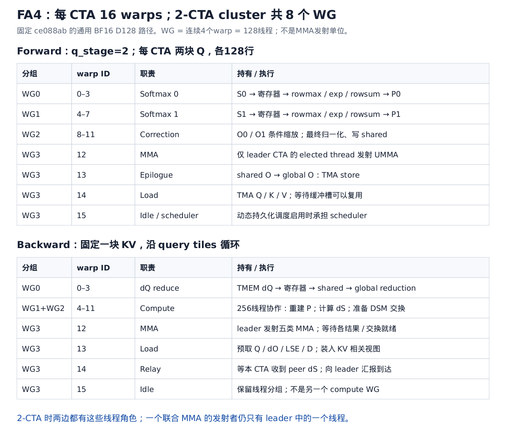
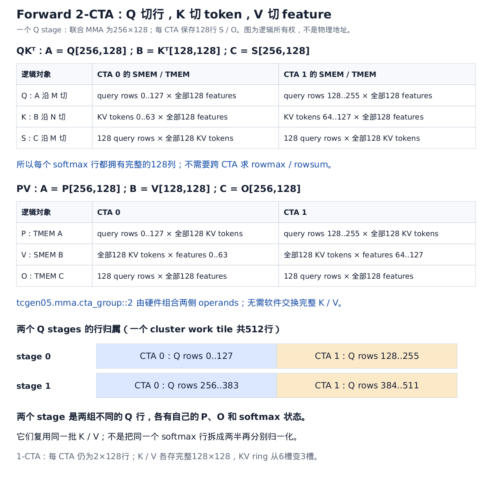
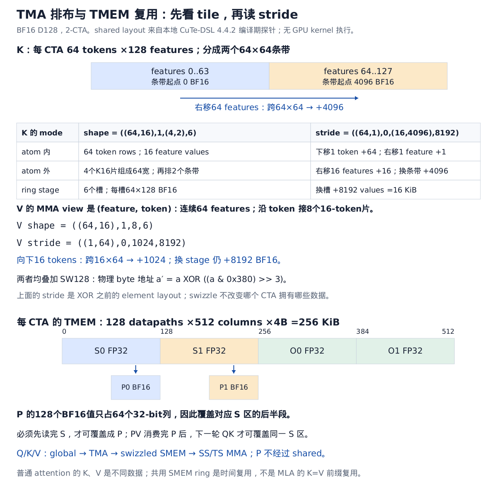
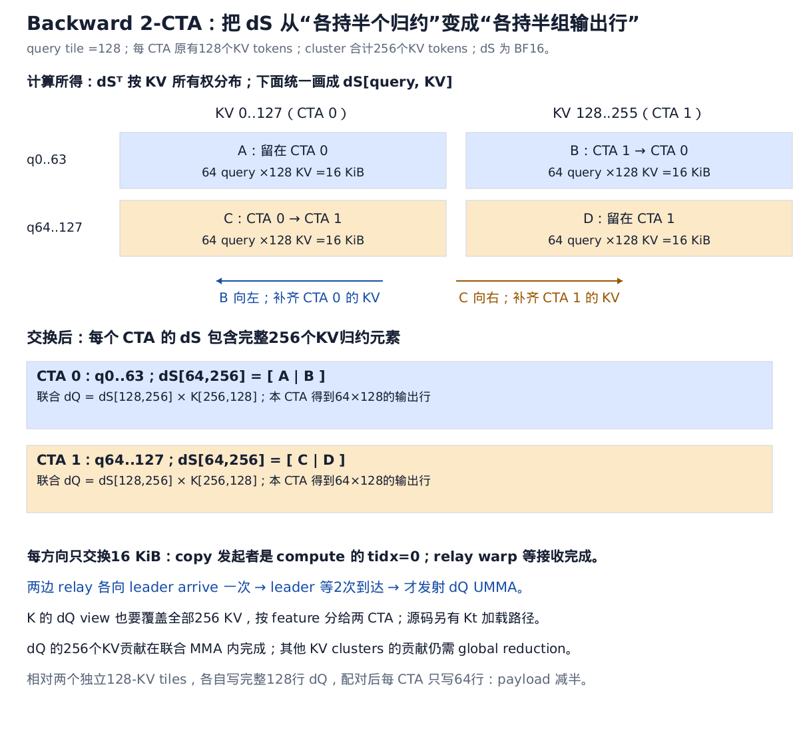
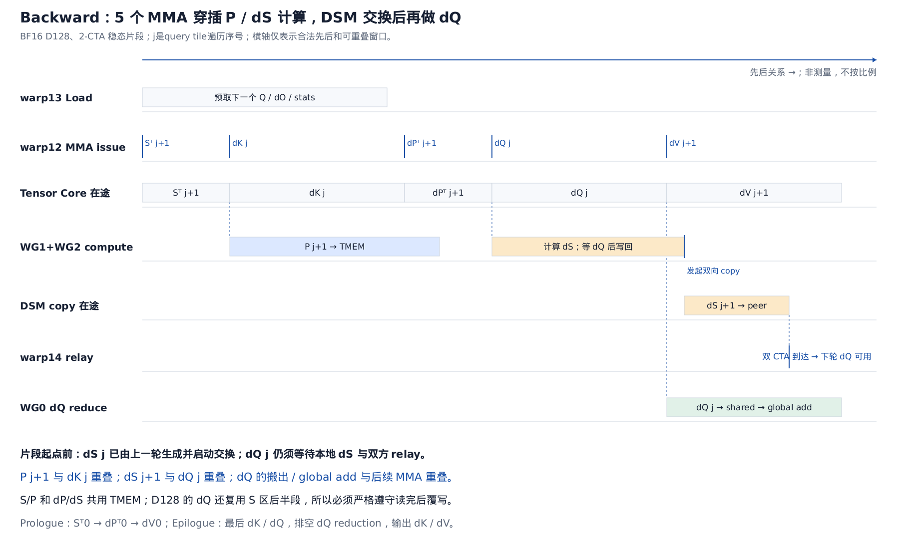

# Blackwell 上的 FlashAttention-4：指令、布局、2-CTA 与流水线

本文固定到官方 FlashAttention 仓库 **`ce088ab9ce0fc0434dcd8afa0a791da9fcc3a820`**（2026-08-27）。最新源码放在独立工作树 `third_party/flash-attention-fa4`；原有 2025 年版本的工作树保留。

主要例子是 **B200 / SM100、BF16、Q/K/V head dimension 均为128、普通 dense attention**。Forward 选择非 causal、固定长度、足够长的 Q，使通用 2-CTA 路径成立；同时说明 1-CTA 的差异。Backward 讲通用 D128 2-CTA 路径。D256 有专用实现，不能直接套用本文的 warp ID、buffer 数或布局。

本文的主要结论来自固定版本源码。FA4 的整体动机参见 [作者介绍](https://tridao.me/blog/2026/flash4/) 和 [论文](https://arxiv.org/html/2603.05451v1)：B200 的 Tensor Core 吞吐增长快于 softmax 指数运算与 shared-memory 带宽，优化需要把这些资源共同排进流水线。

## 1. 首先区分：warpgroup 数量、MMA 发射者、MMA 计算范围

本例中：

```text
一个 warp = 32 threads
一个 WG   = 4 warps = 128 threads
一个 CTA  = 16 warps = 4 WG = 512 threads
一个 2-CTA cluster = 8 WG = 1024 threads
```

但一次联合 MMA **只有 leader CTA 中的一个 elected thread 发起**。其他线程负责加载、softmax、缩放、梯度处理与输出。

因此，“8 个 WG 协作”描述线程职责；“2-CTA MMA”描述硬件乘法覆盖两侧 operands/TMEM；它们不是同一种计数。



### Forward 的精确分工

| 本 CTA 的组 | warp ID | 工作 |
|---|---|---|
| WG0 | 0–3 | 第一块 Q 对应的 softmax |
| WG1 | 4–7 | 第二块 Q 对应的 softmax |
| WG2 | 8–11 | 两块 O 的 correction、最终归一化和写 shared |
| WG3 的一个 warp | 12 | MMA 控制；leader 中单线程发射 |
| WG3 的一个 warp | 13 | TMA store O |
| WG3 的一个 warp | 14 | Load Q/K/V |
| WG3 的一个 warp | 15 | 空闲；启用动态持久化调度时承担 scheduler |

来源：[forward 角色定义](../third_party/flash-attention-fa4/flash_attn/cute/flash_fwd_sm100.py#L302)。`q_stage=1`、非 TMA paged KV 或非 TMA output 会改变部分角色。

**为什么安排两个 softmax WG？** 每 CTA 同时保持两块独立的 Q，各128行。采用当前 TMEM load partition 后，128线程分别处理128行，一线程承担一行的128个 score。另一个 WG 处理另一块 Q，产生第二条独立依赖链，使一个 tile 等 softmax 时，Tensor Core 可以计算另一块 tile。

**为什么另外分 correction WG？** Softmax 要持有整行 scores、算 rowmax/exp/rowsum，寄存器与标量工作很多。把旧 O 的 `load → multiply → store` 也塞进去，会拖后 P 的生成。Correction 只要拿到新缩放系数，就能与后续 exp 并行。

**为什么 load/MMA/epilogue 各只给一个 warp？** TMA 和 `tcgen05.mma` 搬运/计算主体由异步硬件承担；线程负责描述符、提交、barrier 和调度。增加发射线程不能按比例增加硬件吞吐。

寄存器预算也体现这种分工。此版本 B200、D128、非 causal 2-CTA 的 tuning 为 softmax 每线程176、correction 88、其他72个寄存器；这里是资源分配参数，不表示每个瞬间所有寄存器都存着有效值。

## 2. 从 copy、MMA 指令和存储位置开始

### 2.1 主要路径不是 Hopper 的 WGMMA

Hopper 的 `wgmma.mma_async` 要求 warpgroup 协同执行，结果在寄存器。这里使用 Blackwell 的 **`tcgen05.mma` / UMMA**，由单线程提交，累加到 TMEM。

TMEM 是 Tensor Core 专用片上存储。本例每 CTA 使用对应 SM 上的512列容量：

\[
128\text{ datapaths}\times512\text{ columns}\times4\text{ bytes}=256\text{ KiB}.
\]

不要把 TMEM 当成普通 CUDA shared-memory 数组。普通线程通过 `tcgen05.ld/st` 访问它；MMA 可以直接读取 TMEM 中的 A operand，B operand 仍来自 shared。指令和协作约束参见 [NVIDIA PTX：TensorCore 5th generation](https://docs.nvidia.com/cuda/parallel-thread-execution/#tensorcore-5th-generation-instructions)。

### 2.2 Forward 的数据路径

```text
Q global ──TMA──> Q shared ─┐
                           ├─ SS tcgen05.mma ─> S TMEM
K global ──TMA──> K shared ─┘                      │
                                                  │ tcgen05.ld
                                                  v
                                            softmax registers
                                                  │ tcgen05.st
                                                  v
                                                P TMEM ─┐
                                                        ├─ TS tcgen05.mma ─> O TMEM
V global ──TMA──> V shared ───────────────────────────────┘                     │
                                                                             v
                                                    correction registers → O shared
                                                                             │ TMA store
                                                                             v
                                                                          O global
```

- **SS**：A、B 都在 shared；用于 `QKᵀ`。
- **TS**：A 在 TMEM、B 在 shared；用于 `PV`。
- 累加结果始终是 FP32 TMEM；P 转成 BF16 后再作为第二次 MMA 的输入。

源码：[MMA 类型和 major mode](../third_party/flash-attention-fa4/flash_attn/cute/flash_fwd_sm100.py#L534)、[PTX 发射 helper](../third_party/flash-attention-fa4/flash_attn/cute/blackwell_helpers.py#L503)。

代表性的指令形式如下，省略寄存器声明及描述符构造，不能直接当成完整可编译 PTX：

```ptx
// SS: Q(shared) × K(shared) → S(TMEM)
tcgen05.mma.cta_group::2.kind::f16
    [tmem_S], smem_desc_Q, smem_desc_K, idesc, accumulate;

// TS: P(TMEM) × V(shared) → O(TMEM)
tcgen05.mma.cta_group::2.kind::f16
    [tmem_O], [tmem_P], smem_desc_V, idesc, accumulate;
```

`kind::f16` 这一类覆盖 BF16/FP16 操作，具体格式由 instruction descriptor 编码；不是看到 `f16` 就能判断输入一定是 IEEE FP16。

本例一条 atom 的 reduction dimension 是16。一次 `256×128×128` tile GEMM 沿 reduction 发射8条 `256×128×16` MMA。**tile 大小、单条 instruction 大小、software stage 大小必须分别看。**

### 2.3 Copy 的粒度和同步

源码用 `CopyBulkTensorTileG2SOp(cta_group)` 与 `make_tiled_tma_atom_A/B` 构造传输，而不是让每线程循环搬全部 Q/K/V。

TMA 的 tensor map 描述 global shape/stride、tile 范围和目标 swizzle；它将 global 的逻辑 tile 写进 MMA 要求的 shared 排布。源线程不需要逐元素算 destination XOR 地址。

异步边界有四层：

1. **TMA 已提交**：仅表示发射命令。
2. **TMA transaction barrier 完成**：tile 数据可被 MMA 消费。
3. **MMA completion barrier 完成**：对应结果可被 CUDA threads 读取；对应 input buffer 才能按协议释放。
4. **TMEM/shared stores 的 fence + arrival**：把线程写入的数据发布给下一条异步操作。

“提交后函数返回”不等于“源 buffer 可以覆盖”。对 ring stage 的 acquire/release 与 phase，才是保证复用安全的关键。

`tcgen05.cp` 是另外一类 shared→TMEM copy；不能把所有 TMA 或 TMEM 操作都叫成它。本例 forward 的 QK 使用 shared Q，P 由线程写 TMEM，不需要先通过 `tcgen05.cp` 把 Q 转入 TMEM。

## 3. Forward 2-CTA 究竟切什么



### 3.1 一次 QK 的联合矩阵

\[
S_{256\times128}=Q_{256\times128}K^T_{128\times128}.
\]

在当前 `cta_group::2` 布局里，A 与 C 沿 MMA 的 M 分到两 CTA；B 沿 MMA 的 N 分到两 CTA。

- CTA0 的 Q：前128个 query；CTA1：后128个 query。
- CTA0 的 K：前64个 KV token 的128 features；CTA1：后64个 KV token。
- CTA0 的 S：前128个 query 对**全部128个 KV token**；CTA1 同理。

容易误解之处是：CTA0 只 staging 半块 K，**不意味着 CTA0 只算得到半行 S**。联合 MMA 从两 CTA 的 shared operands 取得数据，在两边 TMEM 产生各自的 C 行块。

因此 softmax 的128列在本地齐全，不需要跨 CTA 汇总 rowmax/rowsum。

### 3.2 PV 中“沿 N 切 B”换成了切 V 的 feature

\[
\widetilde O_{256\times128}=P_{256\times128}V_{128\times128}.
\]

现在 MMA 的 N 是输出 feature，而 reduction K 是 KV token。因此：

- CTA0 staging `V[128 tokens,64 features]` 的前64 features。
- CTA1 staging 后64 features。
- 每 CTA 仍得到自己128个 query 的全部128维 O。

**K 的 B 分片沿 token，V 的 B 分片沿 feature。** 不能因为两者都是16 KiB，就认为它们的逻辑切分相同。

### 3.3 `q_stage=2` 不等于 KV 双缓冲

两个 stage 是两块独立 Q。对 cluster work tile `m_block`：

\[
q_{\rm start}=((2m_{\rm block}+s)\cdot2+c)\cdot128,
\]

其中 `s=0,1` 是 Q stage，`c=0,1` 是 CTA rank。

以 `m_block=0` 为例：

| stage | CTA0 的 Q 行 | CTA1 的 Q 行 |
|---|---|---|
| 0 | 0..127 | 128..255 |
| 1 | 256..383 | 384..511 |

所以一个 cluster work tile 合计512个 query，而一次联合 QK/PV MMA 只处理其中一个256行 stage。两个 stage 复用相同 K/V，各自维护不同的 softmax 统计量。

当前通用 forward 的2-CTA选路还要求非 causal、非 local、非 split-KV、无 Q varlen、指定 head dimensions 等条件。**普通 causal D128 forward 在此版本走1-CTA**；D256专用路径另论。来源：[接口选路](../third_party/flash-attention-fa4/flash_attn/cute/interface.py#L822)。

## 4. TMA 的 layout 如何变化：从平铺顺序读 stride

下列打印用仓库相同的 `make_trivial_tiled_mma`、`make_smem_layout_a/b` 参数，调用本机 **CuTe-DSL 4.4.2** 的编译期布局函数获得；它验证布局构造，不代表运行过完整 FA4 kernel。

[探针源码](assets/fa4_layout_probe.py) / [实际输出](assets/fa4_layout_probe.txt)。



### 4.1 K：64个 token ×128 features

完整 nested layout 为：

```text
K: S<3,4,3> o 0 o
shape  = ((64,16),1,(4,2),6)
stride = ((64, 1),0,(16,4096),8192)
```

这里第一组 `(64,16)` 是 MMA operand 内的 `(N,K16)` shape；外层 `(4,2)` 展开8个 K16片；最后6是 KV ring 的槽位数。

按 tile 平铺顺序读：

```text
一个条带：64 token rows ×64 features

features →    0..15 |16..31 |32..47 |48..63
              K16  | K16   | K16   | K16
              +0   | +16   | +32   | +48

token rows ↓  一共64行；每行逻辑跨度64个BF16

先填满这个64×64条带：4096个BF16
再右移到features64..127：跨过完整条带 → +4096
最后换ring槽：跨过64×128 → +8192
```

因此 `(4,2)` 的 stride 是 `(16,4096)`，不是从“每线程搬多少个值”推出来的。

若仅为阅读方便，把 instruction partition 合成逻辑 `(token,feature)` view：

```text
shape  = (64,(64,2),6)
stride = (64,(1,4096),8192)
```

它与 nested operand layout 表达同样的未 swizzle 存储顺序。

### 4.2 Q：128个 query ×128 features

```text
Q: S<3,4,3> o 0 o
shape  = ((128,16),1,(4,2),2)
stride = (( 64, 1),0,(16,8192),16384)
```

Q 的条带变成 `128×64`，因此：

- 条带内右移 K16：`+16`。
- 右移完整64-feature条带：`128×64=8192`。
- 换 Q stage：`128×128=16384` BF16，即32 KiB。

与 K 的区别来自每 CTA 的行数不同，不是因为 swizzle 换了算法。

### 4.3 V：MMA view 是 `(feature,token)`

源码先把 V 的 tensor view 从 `(sequence,feature,...)` 换成 `(feature,sequence,...)`，不需要在 global 执行一个转置 kernel。

```text
V: S<3,4,3> o 0 o
shape  = ((64,16),1,8,6)
stride = (( 1,64),0,1024,8192)
```

现在64个连续 feature 是内层连续维，16个 token 是第二维：

```text
连续64 features                  → +1 / feature
向下1 token，跨一条64-feature行   → +64
向下16 tokens，跨完整64×16片     → +1024
8片堆满128 tokens                → 8192 BF16
换stage                         → +8192
```

这与 K 的逻辑角色不同。K 的 major mode 是 MMA reduction K；V 的 major mode 是 MMA 的 N，也就是输出 feature。

### 4.4 Swizzle 与 TMA descriptor

三者都使用 SW128，探针打印 `S<3,4,3>`。以 byte 地址表示，在对应对齐的 atom 范围内：

\[
a'=a\oplus((a\mathbin{\&}\texttt{0x380})\gg3).
\]

BF16 element offset 的等价形式：

\[
e'=e\oplus((e\mathbin{\&}\texttt{0x1c0})\gg3).
\]

其效果是使用行相关的 bits 置换16-byte包；每包8个 BF16 的内部顺序不变。上面的 stride 是基础 layout 的 stride；不能把 XOR 后任意两个邻接元素的地址差都当成固定 stride。

TMA 把逻辑 tile 写成这样的 shared 排布，MMA shared descriptor 按相同 major/swizzle 解释字节。**view 转置、tile 平铺、swizzle 是三个不同层次的变化。**

### 4.5 为什么2-CTA有6个KV槽

本例每 CTA：

```text
Q shared：2 ×128×128×2B =64 KiB
O shared：2 ×128×128×2B =64 KiB
源码粗预算：224 KiB
剩余：224−64−64=96 KiB

K 或 V 的单槽：128×128×2B /2 =16 KiB
kv_stage =96 /16 =6
```

1-CTA 时单槽32 KiB，因此是3槽。

这里6槽轮流装 `K0,V0,K1,V1,K2,V2,...`，不是 K 六槽再加 V 六槽。K/V 使用同一 shared ring 的不同时间片，K 和 V 的数值仍是独立的普通 attention 输入。来源：[stage 计算](../third_party/flash-attention-fa4/flash_attn/cute/flash_fwd_sm100.py#L396)、[layout/TMA 构造](../third_party/flash-attention-fa4/flash_attn/cute/flash_fwd_sm100.py#L568)。

## 5. Forward 的 TMEM 怎样支撑 ping-pong

每 CTA 的列分配：

| 列范围 | 长期逻辑对象 | 临时别名 |
|---|---|---|
| 0..127 | S0，128×128 FP32 | P0，128×128 BF16，占64..127 |
| 128..255 | S1，128×128 FP32 | P1，占192..255 |
| 256..383 | O0，128×128 FP32 | — |
| 384..511 | O1，128×128 FP32 | — |

一个 TMEM column 按32-bit计数；两个 BF16 打包进一个32-bit槽，所以128列 BF16 P只需64列容量。

S→P 的覆盖顺序受到约束：

```text
QK 写 S → softmax 把 S 读入寄存器 → 用相同存储区写 P
       → PV 消费 P → 下一次 QK 才能覆盖这块 S/P
```

O 在 TMEM 中跨多个 KV blocks 累加；仅在需要 correction 或输出时读到寄存器。这样 MMA warp 不需要长期背负大块 O 的寄存器 accumulator。

来源：[TMEM offset 定义](../third_party/flash-attention-fa4/flash_attn/cute/flash_fwd_sm100.py#L344)。

## 6. Forward 流水线，按真实发射顺序展开

记：

\[
S_{s,j}=Q_sK_j^T,\qquad U_{s,j}=P_{s,j}V_j.
\]

`s=0,1` 表示两块 Q；`j` 是 KV **遍历序号**。当前 dense load 从高 KV block 向低 block 遍历，因此 `j+1` 不表示原序列物理下标加一。


### 6.1 Prologue

Load warp 先提交 K0，再 Q0、Q1，然后 V0，随后预取后续 K/V。

MMA 的第一步是：

```text
wait Q0、K0 → QK(Q0,K0) → 通知 S00 ready
wait Q1    → QK(Q1,K0) → 通知 S10 ready
两次 QK 完成后，K0 才能安全释放
```

Q0/Q1留在 shared，供本 work tile 的整个 KV 循环重复使用。

### 6.2 稳态不是“两个 QK 做完，再两个 PV”

当前源码的稳态发射顺序是：

```text
PV(Q0 对应的 Pj, Vj)
QK(Q0, K[j+1])
PV(Q1 对应的 Pj, Vj)
QK(Q1, K[j+1])
```

再循环下一对。

这样 Q0 的下一块 S 可以尽早交给 WG0，而 MMA 接着处理 Q1；WG0 的 softmax 与另一个 Q stage 的 MMA 重叠。

来源：[forward MMA 主循环](../third_party/flash-attention-fa4/flash_attn/cute/flash_fwd_sm100.py#L1884)。

### 6.3 PV 的启动要同时满足三件事

\[
V_j\text{ ready}\quad\land\quad P_{s,j}[0:96]\text{ ready}\quad\land\quad\widetilde O_s\text{ rescaled}.
\]

Softmax 把 `acc_scale` 写入 shared 后，先通知 correction；随后继续算 exp、转换 BF16、写 P。Correction WG 同时读取旧 O、乘缩放系数、写回 TMEM。

`pipeline_s_p_o` 的 consumer 侧同时包含 softmax 和 correction；在2-CTA时还包含两侧对应参与者。MMA 等的是这些条件共同满足，不是任意一个线程随便发一次 ready 就能启动。

源码的 pipeline 定义明确说明它不是一般单向 producer-consumer queue：[联合 S/P/O barrier](../third_party/flash-attention-fa4/flash_attn/cute/flash_fwd_sm100.py#L1037)。

### 6.4 为什么 P 可以发布前96列后先开始 PV

把 reduction 维展开：

\[
P_{[:,0:128]}V_{[0:128,:]}
=P_{[:,0:96]}V_{[0:96,:]}+P_{[:,96:128]}V_{[96:128,:]}.
\]

这是同一个输出 accumulator 的两段 reduction，不是两个独立 softmax。

执行可以是：

```text
softmax：写 P 前96列 → fence → 发布 first chunk
MMA：   发射6条 k16 PV指令
softmax：写 P 后32列 → fence → 发布 tail
MMA：   等 tail → 发射剩余2条 k16 PV指令
```

实际是否等待到停顿取决于生产者速度；tail若已到达，wait立即通过。

这里有一个重要版本细节：**当前 `softmax_step` 先 `apply_exp2_convert` 整行，然后才循环分段写 TMEM**。所以源码直接保证的是“前一部分 P 已写入就可发射对应 PV；最后的 TMEM stores/发布可与先发射的 PV 重叠”。不应把论文中的文字理解成此版本一定先只算96个 exp，再边做 PV 边算剩余32个 exp。

来源：[softmax_step](../third_party/flash-attention-fa4/flash_attn/cute/flash_fwd_sm100.py#L2510)、[PV helper 中间 wait](../third_party/flash-attention-fa4/flash_attn/cute/blackwell_helpers.py#L539)。

### 6.5 行分母为什么不阻塞每次 PV

循环中生成的是未最终归一化的概率权重 P；PV 累加未归一化的 O。行和只在维护在线状态、最终归一化时使用。

因此当前 softmax 可以先发布 P，再更新 rowsum。PV 无需等整行概率除完分母，也不需要每轮都把 O 除一次。

### 6.6 为什么稳态 correction 不单独等待 O-full

同一 Q stage 的顺序是：

```text
上一块 PV → 下一块 QK → 下一块 S ready → softmax 算出新的 scale → correction
```

当下一块 S 已完成且 scale 已交给 correction 时，前面的 PV 已经过了相应完成顺序。源码利用这一依赖，稳态省掉单独的 O-full 通知。

最后一块 PV 后没有“下一块 S”替它证明完成，所以 epilogue 必须显式通知并等待 O-full。这里不能把稳态省掉的 barrier 一并从尾部删除。

### 6.7 每个 buffer 到底什么时候释放

| 对象 | 可以安全复用的条件 |
|---|---|
| K_j 槽 | 两块 Q 对它的 QK 都已完成 |
| V_j 槽 | 两块 Q 对它的 PV 都已完成 |
| Q0/Q1 | 本 work tile 最后一次 QK 已完成 |
| S/P 的别名区 | S 读完才写 P；PV 消费完才让下一次 QK 覆盖 |
| O TMEM | correction 与 MMA 通过 rescaled/ready 协议交接 |
| O shared | TMA store 对源数据的读取已经完成，才允许覆盖 |

## 7. Conditional rescale 为什么数学上成立

用 base-2 logits `z` 表示，把 softmax scale 与 `log2(e)` 已经合入。维护某个基准 b：

\[
p_j=2^{z_j-b},\qquad l=\sum_jp_j,\qquad\widetilde O=\sum_jp_jV_j.
\]

最终：

\[
O=\widetilde O/l.
\]

b不必每一步都等于当前最大值；只要指数、累加不发生不可接受的溢出/下溢，同一行分子分母使用相同基准，数学结果就不变。

若换基准 `b_old→b_new`，两者统一乘：

\[
\alpha=2^{b_{old}-b_{new}},\quad
l\leftarrow\alpha l+\sum p_{new},\quad
\widetilde O\leftarrow\alpha\widetilde O+p_{new}V.
\]

当前 BF16 forward 把 rescale threshold 设为8个 log2 单位：候选最大值比旧基准高不超过8时，保留旧基准，并令 `α=1`；增长大于阈值才切换。**保留的是旧基准，不是既换了新基准又漏乘 α。**

这使很多迭代不必执行昂贵的 TMEM O `load → multiply → store`。Correction 使用 warp 粒度判定是否需要缩放，有一行需要时同 warp 可能一起走缩放路径。

源码：[阈值设定](../third_party/flash-attention-fa4/flash_attn/cute/flash_fwd_sm100.py#L2190)、[SoftmaxSm100 的基准选择](../third_party/flash-attention-fa4/flash_attn/cute/softmax.py#L315)。浮点转换和指数近似仍有数值误差；不能据代数等价宣称 BF16 与另一实现逐 bit 相同。

B200 上还可把部分 exp2 放到 FMA 多项式近似路径，分担 SFU 压力；具体比例由 tuning 配置决定。**SM103/B300 的指数单元条件不同，此版本禁用该软件 exp2 路径，并在合适情况使用 TMEM `ld.red` 辅助 rowmax。**

论文介绍了两个 softmax WG 的 exp 互斥安排，但本版本明确 `self.s0_s1_barrier=False`。本文图允许两组 softmax 区间重叠；不能直接拿论文中那把锁解释当前代码。

## 8. Backward 为什么变成5个MMA

令 `a=1/sqrt(D)`；为简化展示，下面先以 `S=aQKᵀ`、`dS` 表示对缩放后 logits 的梯度，Q/K 梯度最后还要乘 a。源码可能把这个标量合到其他步骤。

前向已经保存 LSE，预处理得到：

\[
D_i=\sum_d dO_{i,d}O_{i,d}.
\]

一块 KV 与一块 query 相交时：

| 类型 | 运算 | 作用 |
|---|---|---|
| 1 | `Sᵀ=KQᵀ`，随后施加 a | 重算 logits |
| 标量阶段 | `Pᵀ=exp(Sᵀ−LSE)` | 用保存的 LSE 重建概率 |
| 2 | `dPᵀ=V dOᵀ` | 对 P 的梯度 |
| 标量阶段 | `dSᵀ=Pᵀ⊙(dPᵀ−D)` | softmax backward |
| 3 | `dV+=Pᵀ dO` | 对 V 的梯度 |
| 4 | `dK+=dSᵀ Q` | 对 K 的梯度，最后计入 a |
| 5 | `dQ+=dS K` | 对 Q 的梯度，最后计入 a |

这里刻意在 KV×query 的方向上形成 `Sᵀ/Pᵀ/dSᵀ`，使 `Pᵀ` 可以直接作为 dV 的 TMEM A operand，`dSᵀ` 作为 dK 的 TMEM A operand，减少 intermediate 经 shared 的往返。

## 9. Backward 的4个WG为什么重新分工

| 组 | warp ID | 主循环职责 |
|---|---|---|
| WG0 | 0–3 | 消费 dQ TMEM，搬出并归约到 global |
| WG1+WG2 | 4–11 | 256线程协作完成 P 重建、dS 计算、TMEM/shared 写回 |
| WG3 | 12 | leader MMA 控制 |
| WG3 | 13 | load |
| WG3 | 14 | relay |
| WG3 | 15 | 空闲 |

来源：[backward 配置](../third_party/flash-attention-fa4/flash_attn/cute/flash_bwd_sm100.py#L139)。表中描述主循环；尾部还会利用线程执行 dK/dV epilogue。

WG1和WG2共同 partition 一个转置 score/gradient tile，并有256线程的 compute barrier。它们不是 forward 那样分别维护两块 Q 的独立在线 softmax。Backward 直接从 LSE 恢复 P，不需要 forward 式的在线 O correction，所以可以把一整组线程转交给 dQ 搬出。

这样分职责的原因是：

1. 五个 MMA 的 accumulator 留在 TMEM，MMA warp 只管发射与依赖。
2. P/dS 的读写、elementwise、布局调整需要足够多线程分担寄存器和带宽。
3. dQ 要持续向 global 加和，独立 reduce WG 可把这段工作藏到后续 MMA 后面。
4. relay 专门等待 DSM copy 完成，使 MMA 控制只需要等待一个汇总 barrier。

## 10. Backward 的2-CTA：为什么要交换半块dS

### 10.1 前四类MMA的所有权很自然

固定每 CTA 的 KV tile 为128行，cluster 合计256行；每次 query tile 为128行。四类 MMA 的联合 M 是256：

```text
Sᵀ  = K[256,128]   × Qᵀ[128,128]
dPᵀ = V[256,128]   × dOᵀ[128,128]
dV  = Pᵀ[256,128]  × dO[128,128]
dK  = dSᵀ[256,128] × Q[128,128]
```

CTA0拥有前128个KV的 A/C，CTA1拥有后128个KV的 A/C。每个 CTA 只需 staging 相应 B 分片，联合 MMA 读取两侧 B。

对于 dV/dK，M=KV 也意味着最终输出梯度按 KV 行归属，符合外层固定 KV 的调度方式。

### 10.2 dQ 的 reduction 轴恰好是被分开的 KV

\[
dQ_{128\times128}=dS_{128\times256}K_{256\times128}.
\]

此时：

- dQ 的 M 是 query，不是 KV。
- dQ 的 reduction K 是256个 KV token。
- 原来的 dS 所有权是“每 CTA 持有128个KV、全部128个query”。

如果原样各算各的，就会得到两块完整 `128×128` dQ 的局部贡献，再去 global 累加，无法获得期望的2-CTA分工。

### 10.3 交换的内容是四象限中的 B 和 C



把 `dS[query,KV]` 分成：

\[
dS=\begin{bmatrix}A&B\\C&D\end{bmatrix},
\]

每小块 shape 为 `64 query×128 KV`。

最初：

```text
CTA0：A、C —— 全部query，前半KV
CTA1：B、D —— 全部query，后半KV
```

交换：

```text
CTA0 把 C 发给 CTA1
CTA1 把 B 发给 CTA0
```

之后：

```text
CTA0：[A | B] —— 前64 query，完整256 KV
CTA1：[C | D] —— 后64 query，完整256 KV
```

联合 dQ MMA 的 shape 变成 **M=128、N=128、K=256**；每 CTA 得到64行×128维的 dQ。一个 k16 atom 仍只处理16个 reduction 元素，整块要16次 reduction 发射。

注意：只有搬 dS 不够，dQ 的 K operand 也必须覆盖256个 KV，并按输出 feature 分片给两个 CTA。源码有单独的 `Kt` 加载/view 路径来匹配这个 MMA，不能直接拿各自原有的128-token K tile 假装覆盖了256个token。

### 10.4 DSM copy 与 relay 的真实职责

每个方向的交换数据量是：

\[
64\times128\times2\text{ bytes}=16384\text{ bytes}=16\text{ KiB}.
\]

对应指令在源码直接写出：

```ptx
cp.async.bulk.shared::cluster.shared::cta.mbarrier::complete_tx::bytes
    [peer_dst], [local_src], bytes, [peer_mbarrier];
```

顺序是：

```text
compute 的256线程写本地dS/交换缓冲
→ shared async fence + compute barrier
→ compute tidx=0 声明 peer barrier 的 expected bytes，并发起copy
→ peer 的 relay warp 等待自己接收完成
→ 两个 relay 各向 leader 的汇总barrier arrive 一次
→ leader 等2次到达 + 本地dS/pipeline条件
→ 发射联合 dQ MMA
```

**relay 不负责把16 KiB一个元素一个元素搬过去，也不是发起这次copy的warp。** Copy由compute一侧发起，relay负责完成通知的汇总。

来源：[compute 的 DSM 发起](../third_party/flash-attention-fa4/flash_attn/cute/flash_bwd_sm100.py#L3355)、[relay](../third_party/flash-attention-fa4/flash_attn/cute/flash_bwd_sm100.py#L1632)、[copy PTX](../third_party/flash-attention-fa4/flash_attn/cute/copy_utils.py#L211)。

### 10.5 为什么global dQ归约流量减半

对相同的256个 KV：

```text
两个独立128-KV tile：
  CTA0 写128×128局部dQ
  CTA1 写128×128局部dQ
  合计 2×128×128 FP32 elements

2-CTA联合处理：
  CTA0 写64×128
  CTA1 写64×128
  合计 128×128 FP32 elements
```

归约写出 payload 减半，因为这对 KV 的贡献先在联合 MMA 的完整 reduction 中合起来。

其他 KV clusters 仍会对同一个 query 产生贡献，**global reduction 并没有消失**。当前 reduce WG 的路径是 TMEM→寄存器→shared，随后由其中一个warp发起：

```ptx
cp.reduce.async.bulk.global.shared::cta.bulk_group.add.f32
    [global_dQacc], [shared_partial], bytes;
```

源 shared buffer 要经过 bulk commit/wait 管理才能复用；deterministic 模式还有写入顺序约束。来源：[dQacc_reduce](../third_party/flash-attention-fa4/flash_attn/cute/flash_bwd_sm100.py#L3564)、[reduce PTX](../third_party/flash-attention-fa4/flash_attn/cute/copy_utils.py#L267)。

## 11. Backward的TMEM复用与流水线

D128、2-CTA的主要列区域：

| TMEM列 | 对象/别名 |
|---|---|
| 0..127 | Sᵀ FP32 |
| 0..63 | S读完后，Pᵀ BF16 |
| 64..127 | 与S区域复用的 dQ FP32 布局 |
| 128..255 | dV FP32 |
| 256..383 | dPᵀ FP32；随后覆盖为dSᵀ BF16 |
| 384..511 | dK FP32 |

dQ每CTA只有64×128个FP32元素，其TMEM布局用128 datapaths×64 columns表达；不能把TMEM列数直接当作原矩阵的 feature 列数。



### 11.1 真实MMA顺序

Prologue：

```text
Sᵀ0 → dPᵀ0 → 等P0 → dV0
```

当前D128、2-CTA稳态：

```text
Sᵀ[j+1]
dK[j]
dPᵀ[j+1]
dQ[j]
dV[j+1]
```

因此：

- Compute重建 `P[j+1]` 时，Tensor Core可以做 `dK[j]`。
- Compute计算 `dS[j+1]` 时，Tensor Core可以做 `dQ[j]`。
- dQ reduce WG搬出当前dQ时，Tensor Core继续后续工作。
- Load预取后续query相关数据，与上面过程并行。

尾部再补最后一次dK、dQ，完成dK/dV输出，并排空dQ的异步global归约。

来源：[2-CTA backward 主循环](../third_party/flash-attention-fa4/flash_attn/cute/flash_bwd_sm100.py#L2550)。

### 11.2 “dS计算与dQ重叠”不等于“可以提前覆盖dQ正在读的dS”

Compute可以先把下一块dS算在寄存器里，但写回复用的shared dS buffer之前，必须等待旧dQ的使用者释放它。

另一个别名关系是dQ覆盖S区后半段。因此D128、2-CTA路径把“下一块S已从TMEM读完”的通知也纳入 `pipeline_dS`，防止旧dQ覆盖仍在被读取的S。

可重叠的是彼此不冲突的计算阶段；TMEM/SMEM复用仍需严格的 lifetime 约束。图中把dS写回放在旧dQ完成之后，并没有让copy提前覆盖其input。

## 12. 读源码时按这条链走

1. [interface.py](../third_party/flash-attention-fa4/flash_attn/cute/interface.py#L822)：先确认是不是2-CTA、是否通用D128路径。
2. [forward角色/offset](../third_party/flash-attention-fa4/flash_attn/cute/flash_fwd_sm100.py#L302)：看CTA人数、每个warp做什么、TMEM占用。
3. [layout与TMA](../third_party/flash-attention-fa4/flash_attn/cute/flash_fwd_sm100.py#L534)：区分logical shape、partitioned shape、shared physical layout。
4. [forward MMA loop](../third_party/flash-attention-fa4/flash_attn/cute/flash_fwd_sm100.py#L1842) 配合 [softmax](../third_party/flash-attention-fa4/flash_attn/cute/flash_fwd_sm100.py#L2446)：找实际等待条件，不根据函数名猜。
5. [backward配置](../third_party/flash-attention-fa4/flash_attn/cute/flash_bwd_sm100.py#L139)、[主循环](../third_party/flash-attention-fa4/flash_attn/cute/flash_bwd_sm100.py#L2550)、[dS交换](../third_party/flash-attention-fa4/flash_attn/cute/flash_bwd_sm100.py#L3355)：理解轴所有权如何变化。

## 13. 复现与验证范围

- 图的可编辑源：[fa4_blackwell_figures.py](assets/fa4_blackwell_figures.py)，输出6张 SVG/PNG，画布分别为1200或1800像素宽。
- 布局探针：[fa4_layout_probe.py](assets/fa4_layout_probe.py)，调用CuTe-DSL编译期layout构造；没有launch GPU kernel。
- CPU校验：[fa4_blackwell_checks.py](assets/fa4_blackwell_checks.py)，验证在线softmax的条件换基准、96/32 reduction拆分、2-CTA operands逻辑分片、dS交换后的dQ等价与shared地址置换。
- 流水线图是由源码依赖构造的合法示意，不是性能测量或逐cycle轨迹。
- 没有在Blackwell GPU上运行或benchmark完整FA4，也没有宣称这些CPU代数检查证明浮点bitwise一致或硬件调度无误。
