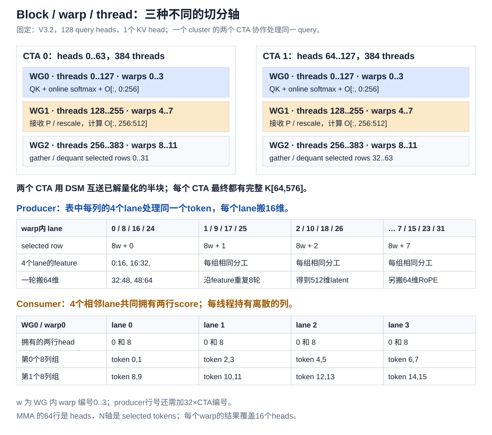
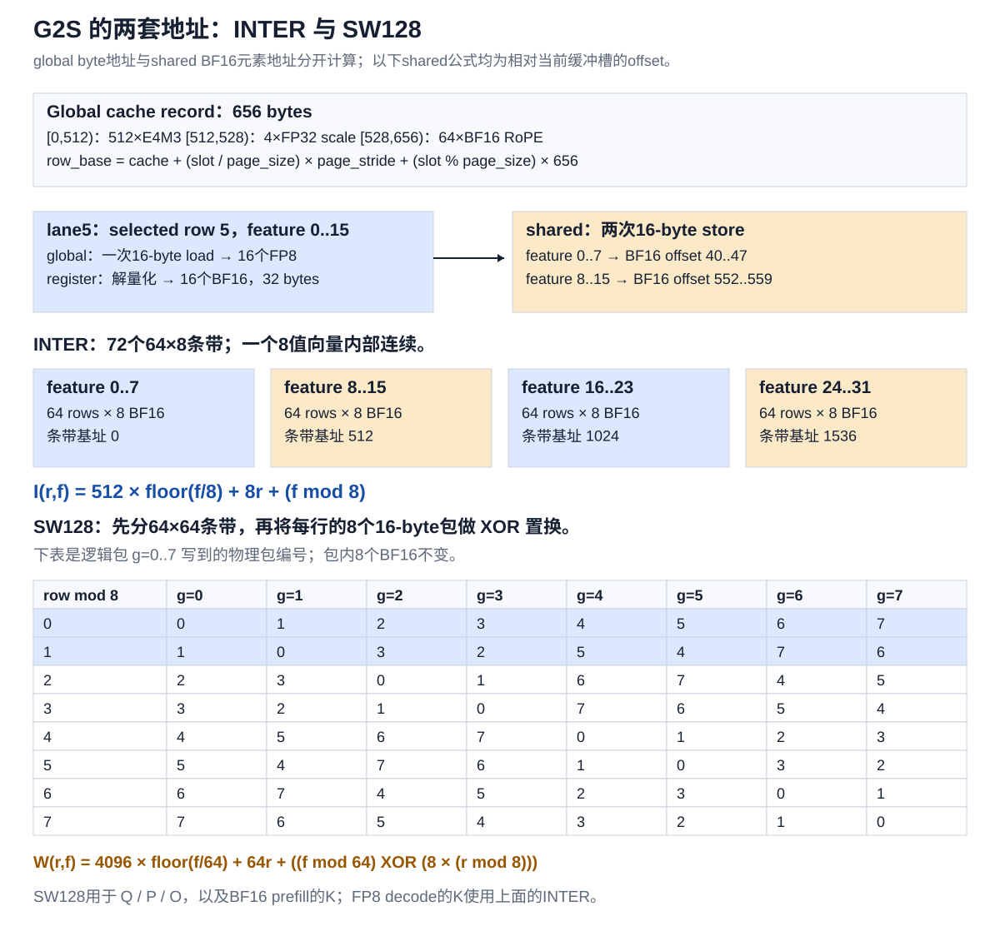
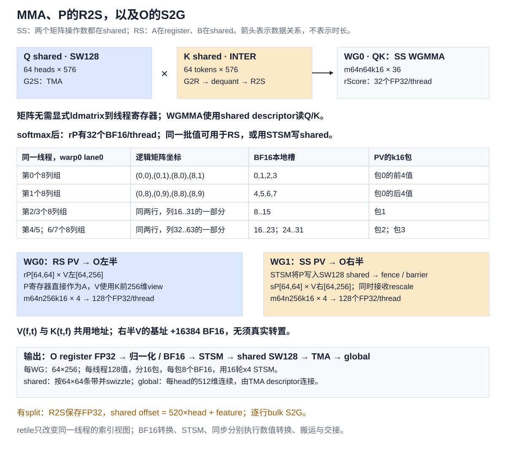

# FlashMLA V3.2：从 FP8 cache 到 attention 输出

对应本地 `third_party/FlashMLA` commit `15f13e5030374295491c5ce31b02d7e63a7772c6`，只把 Hopper / SM90、V3.2、128 heads、FP8 sparse decode 作为主线。64-head、BF16 sparse prefill、dense decode 的差异放在最后。

核心：cache 是混合 FP8/BF16 字节记录，producer 用线程指令 gather，并在寄存器中解量化；shared K/V 是 BF16，Tensor Core 做 BF16×BF16、FP32 累加。QK 使用 SS WGMMA，没有显式的整块 Q/K shared→线程寄存器 `ldmatrix` 阶段。

## 1. 参数、问题规模与两次矩阵乘

| 符号 / 参数 | 本例值 / shape | 含义 |
|---|---|---|
| `b` | 请求数量 | batch 中有多少条请求 |
| `s_q` | decode 常取 1，也可大于 1 | 每请求本次 query token 数 |
| `h_q` / `h_kv` | 128 / 1 | query heads / 共享的 latent KV head |
| `d_qk` | 576 | 512 latent + 64 RoPE，QK 归约维 |
| `d_v` | 512 | latent 输出维度；后续模型投影在 kernel 外 |
| `Q` | `[b,s_q,128,576]` BF16 | absorbed MLA query |
| `cache` | `[num_pages,page_size,1,656]` 字节 | 第四维不是 656 个同 dtype 的数值 |
| `indices` | `[b,s_q,topk]` int32 | 已经选好的物理 cache slot，`-1` 为无效项 |
| `topk` | 例如 2048 | 选中列表的存储长度，本 kernel 要求为 64 的倍数 |
| `page_block_size` | 例取 64 | cache page 容纳多少记录；与 compute tile 的64含义不同 |
| `sm_scale` | 调用方指定 | logits 缩放；Python API 缺省 `1/sqrt(576)=1/24` |
| `sm_scale_div_log2` | `sm_scale × log2(e)` | 用 `exp2` 代替 `exp` 的换底系数 |
| `stride_kv_row` | 656 bytes | V3.2 此路径启动时会断言等于656 |
| `stride_kv_block` | 运行时参数 | 允许页面之间有 padding |
| `out` / `lse` | `[b,s_q,128,512]` / `[b,s_q,128]` | BF16 输出与 FP32 log-sum-exp |
| scheduler metadata / splits | 运行时参数 | 一个 partition 处理哪些请求和哪些64-token块 |

`Q/out` stride 按 BF16 元素计，FP8 cache 地址运算按 byte 计；不要把所有 stride 都当成 bytes。传给 CUDA TMA descriptor 的 stride 字段则要求 bytes，源码会乘元素大小。

固定一个 query token、一个 head：

\[
x_{h,t}=\alpha\sum_{f=0}^{575}Q_{h,f}\widehat K_{t,f},\qquad
p_{h,t}=\frac{e^{x_{h,t}}}{\sum_{u\in\mathcal I}e^{x_{h,u}}},\qquad
O_{h,d}=\sum_{t\in\mathcal I}p_{h,t}\widehat K_{t,d},\ d<512.
\]

这里 `t` 表示选中列表中的位置，`indices[t]` 才是实际 cache slot；`Khat` 是解量化后的 K。上式先忽略可选 attention sink，伪代码也采用无 sink 的基本情况。

一个 CTA 处理的矩阵为：

```text
QK: Q[64 heads,576] × K[64 selected tokens,576]^T → Score[64,64]
PV: P[64 heads,64 tokens] × V_math[64 tokens,512] → O[64,512]
```

CuTe 的 GEMM B 操作数用 `(N,K)` 坐标，因此 QK 的 B view 是 `K(token,feature)`，PV 的 B view 是 `V(feature,token)`。数学表达式 `V_math(token,feature)` 与 CuTe B view 只是轴命名不同。

注意三种 scale：cache 中4个 **量化 scale** 还原 latent；`sm_scale` 缩放 logits；online softmax 的 **rescale** 将旧 O 调整到新的最大值基准。它们不能互换。

## 2. Block、warpgroup、warp、thread



一个 warp=32 threads，一个 warpgroup=4 warps=128 threads，一个 CTA=3 WG=384 threads=12 warps。128-head配置一个 cluster=2 CTA=768 threads：

| 层次 | 负责的工作 |
|---|---|
| CTA0 | heads 0..63；producer只解量化本tile的tokens 0..31 |
| CTA1 | heads 64..127；producer只解量化tokens 32..63 |
| 每CTA WG0，threads 0..127 | 完整 QK、online softmax、O左256列 |
| 每CTA WG1，threads 128..255 | 读取WG0传来的P/rescale，计算O右256列 |
| 每CTA WG2，threads 256..383 | 读indices，gather、dequant、写本地/远端shared |

实际 launch：

```cpp
grid    = (NUM_M_BLOCKS, s_q, num_sm_parts); // 本例(2,s_q,num_sm_parts)
block   = (384,1,1);
cluster = (2,1,1);

head_block_idx = blockIdx.x;
query_idx      = blockIdx.y;
partition_idx  = blockIdx.z;
```

`blockIdx.z` 不是简单的 batch 编号：scheduler metadata 可以让一个 partition 遍历多条请求，也能只计算某请求的一段 selected tokens。对于具体一次 query/partition 的工作，两个 CTA 处理相同的 token 范围、不同的 heads。

`topk=2048` 时共32个64-token块；若教学上均匀分成4个split，则每个split处理8块，两个CTA覆盖同一split的两个head组。实际split划分由调度器决定。

## 3. Cache record、gather 地址、量化与反量化



### 3.1 一条记录为什么是656 bytes

```text
byte       0                   512          528                    656
           | 512 E4M3 values     | 4 FP32     | 64 BF16 RoPE         |
           | 4 groups ×128      | scales     | 不量化                 |
```

大小：`512×1 + 4×4 + 64×2 = 656 B`。没有独立 zero point，反量化做乘法。

若 `slot=indices[b,q,t]` 是有效物理 slot：

```cpp
page = slot / page_block_size;
row  = slot % page_block_size;
record = byte_ptr(cache) + page*stride_kv_block + row*656;
```

连续页面且 `page_size=64` 时，`stride_kv_block=64×656=41984 B`。例 `slot=130`：page=2、row=2，起点 `2×41984+2×656=85280 B`。

如果下一个索引是7，就重新计算slot7的地址；shared目的行从0变1，global源没有固定行stride。此路径直接使用物理slot索引，kernel内部不再读一次block table。逻辑页→物理页的映射若需要，应在生成这些indices时完成；dense paged decode则有独立block-table路径。

地址例里的连续page只是方便计算。`tests/quant.py` 的V3.2参考生成器实际先分配 `block_size+1` 行再切片，页面之间有额外一行空间：page_size=64时它的page stride是`65×656=42640 B`，同一slot130的地址变为`2×42640+2×656=86592 B`。

### 3.2 Producer每个线程到底读什么

定义producer WG中的线程局部编号 `u=threadIdx.x%128`：

```cpp
w = u / 32;        // 0..3
lane = u % 32;     // 0..31
c = CTA_rank;     // 0或1
r = 32*c + 8*w + lane%8;  // shared中本tile的token行
a = lane/8;               // 同token的第几个feature搬运者：0..3
```

第 `j=0..7` 次latent循环：

```cpp
f = 64*j + 16*a;
raw16 = load_16bytes(record + f);  // feature f..f+15
scale = scales[j/2];              // 每两轮64维共用一个128维scale
```

warp0第一轮：lane0/8/16/24都负责同一token，分别搬feature0..15、16..31、32..47、48..63；lane1/9/17/25负责下一token。一个warp并行搬8 tokens×64 features=512 FP8；4 warps搬32 tokens×64 features=2048 FP8；8轮完成32×512 latent。

每线程负责该token的128个latent值（8×16），另负责16个RoPE值：

```cpp
for (j=0; j<2; ++j) {
    rope_f = 32*j + 8*a;                  // 64维RoPE中的相对列
    rope8 = load_16bytes(record+528+2*rope_f);
    // 写shared feature 512+rope_f .. 519+rope_f
}
```

所以一个producer线程在一个token轮次内输出`128+16=144`个BF16；`128线程×144值=32×576`。这是累计处理量，不意味着所有值都同时存活在寄存器中。

源码每个协作lane都读同token的4个scale，不是只有一个lane读后广播。`64×656=41984 B`是一个tile的唯一记录字节数，不能据此断言实际load请求量或HBM事务量完全相等：还存在重复scale load、indices、缓存命中及事务粒度。

### 3.3 如何反量化，如何舍入

对latent列 `f`：

\[
g=\lfloor f/128\rfloor,\qquad
\widehat K_{t,f}\approx\operatorname{decode\_E4M3}(q_{t,f})s_{t,g}.
\]

当前C++ helper的实际步骤：

```cpp
scale_bf16 = BF16(load_float32(record+512+4*g));
x_float   = float(fp8_e4m3_value);  // 数值转换，不能把byte当整数乘
x_bf16    = BF16(x_float);
y_bf16    = x_bf16 * scale_bf16;  // __nv_bfloat162向量乘，BF16结果
```

一个16-FP8包分两半，每半8值，最终用两个16-byte BF16 store写shared。scale转换与乘法都有对应精度规则；不能对任意外部FP32 scale宣称等价于`BF16(float(fp8)*float(scale))`只在最后舍入一次。有限E4M3值本身可精确表示成BF16，实际差异主要应关注scale/乘法的精度语义。

具体例：FP8编码 `0x3C`（正数，指数7、尾数4）表示

\[
(1+4/8)2^{7-7}=1.5.
\]

若该128维组scale为0.25，则恢复为`1.5×0.25=0.375`。`0x3C`不能按整数60乘0.25。零、subnormal、格式保留值等由E4M3转换处理，不能仅用正常数公式处理全部位模式。

参考量化生成器先对每128维求 `amax`，再计算：

\[
s=2^{\lceil\log_2(\max(amax/448,10^{-4}))\rceil},\qquad q=\operatorname{E4M3}(x/s).
\]

例如该组`amax=100`，则scale取0.25，原值0.375量化成1.5、解量化回0.375。一般输入存在FP8量化误差，并非都能精确还原。此scale算法属于测试生成器，cache字段格式本身不强制所有调用框架使用同一种算法。

RoPE是64个现成BF16，直接搬到shared feature512..575，不乘latent scale，也不重新计算旋转。

无效slot=-1时，源码使用安全替代源地址，清零latent相关值并设置valid mask；softmax将该列score设为负无穷，因此P=0。V3.2的RoPE不必为PV清零，因为PV只读取前512维。

## 4. G2S destination：K的INTER，Q/P/O的SW128

### 4.1 INTER地址可直接代入

`r`为token行0..63，`f`为feature0..575，以下offset单位是BF16元素：

\[
I(r,f)=512\lfloor f/8\rfloor+8r+(f\bmod8).
\]

等价教学layout：`shape=(64,(8,72)), stride=(8,(1,512))`。它的物理存储顺序：

```text
先放 feature0..7 的所有64行：  [row0八值][row1八值] ... [row63八值]
再放 feature8..15 的所有64行：[row0八值][row1八值] ... [row63八值]
... 一共72个条带。
```

| 坐标变化 | BF16 offset变化 |
|---|---:|
| 同8维包内feature+1 | +1 |
| 同feature、token+1 | +8 |
| 同token、feature+8 | +512 |
| 同token、feature+64 | +4096 |
| 换下一完整K buffer | +36864 |

例：CTA0 producer warp0 lane5负责row5、第一轮读feature0..15。解量化后先写`I(5,0)=40`处8值，再写`I(5,8)=552`处8值，两包起点相隔1024 bytes。源16 bytes连续，目的32 bytes分散到两个条带。

地址形式里的`Sw<0,4,3>`没有额外XOR位交换，INTER的关键是8维条带排列。

### 4.2 SW128还要加XOR

Q、shared P、BF16输出O，以及prefill的K按64列宽条带排列。对本例BF16布局、正确对齐的buffer基址：

\[
W(r,f)=4096\lfloor f/64\rfloor+64r+
\big((f\bmod64)\operatorname{XOR}(8(r\bmod8))\big).
\]

把一行64个BF16拆成8个16-byte包，逻辑包编号`g=0..7`，物理包编号为`g XOR (r%8)`。包内部8个BF16连续，包之间换位置。

例如row1的逻辑包0/1/2/3分别放物理包1/0/3/2。于是`W(1,0)=72`、`W(1,8)=64`，feature向前8，地址反而向后8；不能把“沿feature连续”用于跨包的全部位置。

`SW128`里的128指128 bytes，不是128个BF16；`OBUF_SW=64`指64 BF16列，恰好128 bytes。

CuTe打印 `Sw<3,4,3> o smem_ptr[16b](unset) o ...` 时，指针swizzle可能还待解析。仅调用底层layout的`operator()`不一定已经加上这层XOR；验证实际物理地址应通过完成swizzle绑定的tensor pointer。附带的probe对此专门做了检查。

### 4.3 两CTA交换什么

CTA0写自己解量化的前32行，并用`st.async`向CTA1写同一组行；CTA1反向写后32行。两边各有完整`K[64,576]`副本，Q各自不同。

每CTA收到远端半块`32×576×2=36864 B`。消费者等待`local_ready`及`remote_ready`；远端barrier按异步事务字节完成，本地ready还覆盖valid mask的发布。

共享内存的K一个槽`64×576×2=73728 B=72 KiB`，两个槽144 KiB；Q还有72 KiB，shared P还有8 KiB，三者合计224 KiB，另外还有barriers、统计量及对齐。224 KiB不是精确`sizeof(SharedMemoryPlan)`。输出scratch与K采用union复用，不能把两者再同时相加。

## 5. S2R与MMA：指令如何消费这些layout



| 用户所说的阶段 | 本路径实际做法 | layout关注点 |
|---|---|---|
| Q G2S | TMA global→shared | global strides→SW128 |
| KV G2S | `ld.global` G2R→解量化→普通shared store / DSM | 不规则record地址→INTER |
| QK S2R | 无显式完整矩阵fragment load | WGMMA从descriptor指向的shared读Q/K |
| QK MMA | SS BF16 WGMMA→FP32 registers | Q/K shared layout；score的线程分配 |
| P本地消费 | FP32 score→softmax→BF16 P→RS WGMMA | P已在register，无须先写再读 |
| P传WG1的R2S | `retile_S / partition_D / STSM` | 分散的线程fragment→SW128 P |
| WG1 PV | SS WGMMA读shared P/V | 矩阵不经显式ldmatrix；rescale会普通S2R |
| 输出R2S | FP32归一化、BF16转换、STSM | accumulator→SW128 O |
| 输出S2G | TMA store | SW128 O→global输出strides |

`SS`=A、B都来自shared；`RS`=A来自register、B来自shared。`partition_fragment_A(sQ)`这个名字不能据此推断它加载了Q：对于SS WGMMA，其操作数是描述shared矩阵的descriptor迭代器，而非线程持有的一整包Q数值。

本decode虽在config中定义`TiledMMA_QK_rQ`类型，当前主循环实际调用的是SS `TiledMMA_QK`。dense decode中使用寄存器Q的分支应另看，不应根据类型存在就推断已使用。

### 5.1 QK的36次atom和每线程32个score

```text
M=64 heads，N=64 tokens，K=576 features
atom m64n64k16
576/16=36次atom（9个k64段，每段4个k16）
64×64个FP32 /128 threads =32值/thread
```

128个线程共同执行WGMMA，它不是4个warp各自发一份独立的完整64×64乘法。

定义consumer WG中的 `u=threadIdx.x%128`、`w=u/32`、`lane=u%32`。当前线程第`v`个accumulator元素的矩阵坐标为：

\[
row=16w+\lfloor lane/4\rfloor+8\lfloor(v\bmod4)/2\rfloor,
\]
\[
col=2(lane\bmod4)+8\lfloor v/4\rfloor+(v\bmod2).
\]

QK取`v=0..31`，半输出PV取`v=0..127`；PV WG1的col再加256，跨CTA的head再加`64*CTA_rank`。

warp0 lane0前8值：`(0,0),(0,1),(8,0),(8,1),(0,8),(0,9),(8,8),(8,9)`。lane1拥有同两行的列2/3、10/11等，lane2拥有4/5等，lane3拥有6/7等。这解释了softmax为什么用`shfl_xor(1)`和`shfl_xor(2)`在4个相邻lane间归约。

一warp的accumulator覆盖16 heads；整个WG覆盖64 heads。这描述输出所有权，不表示每warp独立完成一个WGMMA。

CuTe的线程局部score layout：

```text
shape  = ((2,2,8),1,1)
stride = ((1,2,4),0,0)
```

第一组2是相邻列，第二组2是两行（相隔8），第三组8是8个列组（每组跨8列）。局部slot=`a+2*b+4*g`；单位是该线程的逻辑元素槽，不是shared地址，也不是机器寄存器编号。

## 6. Online softmax怎样算、两个consumer怎样统一

每个head维护已处理token的最大值`m`、分母`l`、未归一化输出分子`o`。以下自然指数版本便于看数学：

```text
m初始=-∞，l初始=0，o初始=0
新64-token块的logits为 x
m_new = max(m, max(x))
rho   = exp(m - m_new)
p     = exp(x - m_new)              # 本块未最终归一化的权重
l_new = rho*l + sum(p)
o_new = rho*o + p @ V
全部块完成后 O=o/l
```

代码实际把scaled logits换为base2：`z=raw_score*sm_scale_div_log2`，用`exp2`维护`m2`、`rho`及P。源码用有限的很小初始max规避全mask行`-inf - -inf`问题，输出分母为0时有单独处理。

对一行例：旧`m=2,l=3`，新块最大logit为4，则旧贡献乘`exp(-2)`；新块里logit4的权重是1、logit3的是`exp(-1)`。WG0持有左半`o`，WG1持有右半`o`，两边必须都乘相同`rho=exp(-2)`。如果只传P而不传rho，右半输出会留在旧基准上。

源码细节：每个lane只保存自己那部分token的`rL`，max每块在4-lane组里归约，sum的4-lane归约推迟到epilogue。概念公式中的完整行`l`等于这4份之和。每线程拥有两行，所以有`rM[2]`、`rL[2]`，不是把64个heads的统计量放在一个线程里。

P先在FP32计算指数并更新分母，再转换BF16供PV；输出分子由BF16 P/V做FP32 MMA累加。数学公式和该浮点实现会有相应舍入差异。

这里的P是当前running max基准下的未最终归一化权重，不是对每个64-token块独立softmax后得到、每行和为1的概率。独立softmax再把块输出相加不正确。

## 7. PV：V为何能直接复用K，P怎样R2S

### 7.1 V是K前512列的转置view

\[
addr_V(d,t)=addr_K(t,d)=I(t,d),\quad 0\le d<512.
\]

QK B使用`(token,feature)`，PV B使用`(feature,token)`。这里配套的`Major::MN` BF16 WGMMA接受这种物理排列，所以只用composition换view，无数据转置。

左右半V：

```text
WG0: d=0..255   → P(register) × V_left(shared) → O_left FP32
WG1: d=256..511 → P(shared)   × V_right(shared)→ O_right FP32
V_right base offset = I(0,256)=32×512=16384 BF16
```

每半PV矩阵为`M=64,N=256,K=64`，atom=`m64n256k16`，需要4次；每WG输出`64×256/128=128`个FP32/线程。

每CTA每token tile共`36+4+4=44`次WGMMA；双CTA共88次。按乘加计2 FLOPs，主矩阵乘为`2*64*64*(576+512)=8,912,896 FLOPs/CTA/tile`，不含softmax、dequant等标量操作。这些计数已覆盖协作的128线程，不能再乘线程数。

### 7.2 P从score fragment变成RS输入

P逻辑矩阵仍是64×64，当前线程32个BF16，按k16分4包、每包8值：

```text
P RS shape  = ((2,2,2),1,4)
P RS stride = ((1,2,4),0,8)
包0: slots0..7；包1:8..15；包2:16..23；包3:24..31。
```

这8值并非一个thread拥有某行连续16个token中的8个任意值，而是WGMMA协议指定的两行×两组×两列。一个k16需要整个WG的128线程协作提供A。

### 7.3 retile与实际STSM

```cpp
auto r2s = make_tiled_copy_C(
    Copy_Atom<SM90_U32x4_STSM_N,bf16>{}, TiledMMA_QK{});
auto tc = r2s.get_slice(idx_in_warpgroup);
auto src = tc.retile_S(rP_bf16); // 同线程已有BF16值的view
auto dst = tc.partition_D(sP);  // SW128矩阵里本copy参与的目的view
copy(r2s,src,dst);              // 实际stmatrix shared store
fence_view_async_shared();
publish_P_and_rescale_ready();
```

源码把FP32 score寄存器命名为`rP`，BF16 softmax权重命名为`rS`，shared权重命名为`sS`；本文用`Score/P/sP`按数学意义命名，避免把源码名字当dtype。

source retile：`((8,4),1,1):((1,8),0,0)`。每lane一次x4 STSM提供4个32-bit word，也就是8个BF16；32值需4轮。每warp每轮协同写4个8×8矩阵、总计256个BF16；4 warps×4轮×256=4096值，填满64×64 P。

必须区分源值提供者与shared行地址提供者，STSM具有warp级交换语义；不能画成每个线程把自己的8个值简单连续写进shared。它最终把上面的逻辑坐标写到`W(head,token)`地址。

`retile`不创建跨线程通信，`copy`才搬数值，fence/barrier才保证WG1可消费。与此同时WG0的BF16 P仍可直接供RS PV使用。

## 8. 输出R2S/S2G与buffer生命周期

无split：两个consumer各持`O[64,256]`的FP32分子，先乘最终`1/l`再转BF16。每WG每线程128值，按8值一包发16轮x4 STSM；整个WG每轮写64×16的逻辑输出片段。每warp本轮对应一个16×16片段。

对于输出局部head `h`、feature `d`：

```text
shared BF16 address = output_smem_base + 2*W(h,d)
global  BF16 address = out_base + 2*(b*stride_o_b + q*stride_o_s_q
                                    + (64*CTA_rank+h)*stride_o_h_q + d)
```

同一head的feature增加64，shared offset增加4096 BF16，global仅增加64 BF16。TMA描述符将分条带、带swizzle的shared表示连接到global tensor。

实际O的5D TMA视图轴为`(d_in64,head,d_group64,query,batch)`：

```cpp
global_size = {64, h_q, 8, s_q, b};
global_stride_bytes = {
    2*stride_o_h_q, 2*64, 2*stride_o_s_q, 2*stride_o_b
}; // 最内层d_in64隐含元素stride=2 bytes
box_size = {64,64,8,1,1};
```

两个consumer完成STSM、fence、named barrier之后，thread0发TMA store；硬件承担bulk搬运，并非所有线程逐元素global store。

有split：部分输出也先除该split的`l`，保存FP32，shared scratch采用`offset=520*h+d`。每行512有效float后留8个padding以改善bank分布；R2S用普通float2 store，S2G按每行512 float做bulk copy。padding不写到global。

每个split的base2 LSE为`lambda_i=m2_i+log2(l_i)`。combine：

\[
a=\max_i\lambda_i,\quad
w_i=\frac{2^{\lambda_i-a}}{\sum_j2^{\lambda_j-a}},\quad
O=\sum_iw_iO_i.
\]

分母1与3对应权重1/4、3/4，不是简单平均。使用相同指数单位的LSE才可合并。

同步依赖：

```text
producer等K slot free
    → 填自己的半块 / 发远端半块
    → local-ready + remote-ready
WG0 QK完成
    → softmax → STSM P / 写rho → fence → P-ready
WG0左PV完成 + WG1右PV完成（两CTA都需要）
    → K slot free，可复用
WG1读完P/rho → P-free，WG0可写下一轮P/rho
全部KV读者完成 → K存储union可用于O scratch
O STSM完成 → fence/barrier → TMA store完成 → scratch可再次复用
```

这是一张依赖清单，不是所有线程一起按顺序执行的时间表。实际producer/consumers并行运行，两个K buffer用phase bit区分不同轮次。尤其WG1的PV仍会读K，不能在WG0完成QK后立刻回收K。

## 9. 伪代码框架

以下展示并行职责及关键依赖，省略真实barrier计数、phase翻转、索引预取、cache hint、批请求切换、sink和异常边界优化，不是可直接编译的CUDA。

### 9.1 数学参考

```python
def reference_attention(q, cache, indices, alpha):
    # q [128,576]，一个query；忽略sink
    rows = [decode_record(cache, slot) for slot in indices if slot != -1]
    K = stack(rows)                         # [T,576]
    score = alpha * (float(q) @ float(K).T) # [128,T]
    prob = softmax(score, axis=-1)
    return prob @ float(K[:, :512])         # [128,512]
```

这份数学参考不刻意复现BF16 P、scale舍入等kernel数值细节。

### 9.2 Producer的线程级框架

```cpp
// cluster_size=2，每producer线程在一个tile负责一个token的部分features。
producer_one_tile(tile, buf):
    u = threadIdx.x % 128;
    w = u/32; lane = u%32; a = lane/8;
    r = CTA_rank*32 + w*8 + lane%8;
    slot = indices[tile*64 + r];
    record = safe_record_address(slot);  // 无效slot仍保证load地址合法
    scales = convert_to_bf16(load_float4(record+512));

    wait_slot_free(buf);
    arm_remote_transaction_barrier(buf, 32*576*2);
    for (j=0; j<8; ++j):
        f = 64*j + 16*a;
        raw = load_16bytes(record+f);
        y[16] = valid(slot) ? dequant_bf16(raw, scales[j/2]) : zeros;
        for (half=0; half<2; ++half):
            dst = I(r, f+8*half);
            store_16bytes(local_K[buf]+dst, y[8*half:8*half+8]);
            st_async_16bytes(peer_K[buf]+dst, y[8*half:8*half+8], peer_bar);
    for (j=0; j<2; ++j):
        rf = 32*j + 8*a;
        y8 = load_16bytes(record+528+2*rf); // 已是BF16
        store_local_and_peer(buf, I(r,512+rf), y8);
    fence_async_shared();
    cooperatively_publish_valid_mask_for_all_64_rows(buf);
    arrive_local_ready(buf);
```

上述`arm_remote_transaction_barrier`在真实代码由一个指定线程执行，发布有效性由producer的首warp执行，local-ready由128个producer线程到达；不能把每个概念调用都展开成所有线程重复做一次。

### 9.3 三WG主循环

```cpp
kernel(params):
    setup_cluster_and_barriers();
    task = scheduler_metadata[blockIdx.z];
    // 对task覆盖的每个request、当前blockIdx.y对应的query执行：
    elected_thread_launches_TMA_Q_into_SW128();

    parallel_by_warpgroup:
      WG2: // producer
        for tile in task.token_tiles:
            producer_one_tile(tile, tile_relative % 2);

      WG0: // consumer 0，heads64，输出左256维
        O_left = 0; m2 = very_negative; l_partial = 0;
        wait_Q_ready();
        for tile in task.token_tiles:
            buf = tile_relative % 2;
            wait_K_local_and_remote_ready(buf);
            Score = wgmma_SS_QK(Q_smem, K_smem[buf]); // 36 atom
            wait_wgmma_complete();
            wait_previous_P_and_rho_free_if_needed();
            // max跨4-lane归约；l_partial保存本lane贡献
            P_bf16, rho, m2, l_partial = online_softmax(Score, valid_mask);
            O_left *= rho;
            stmatrix_P_into_SW128(P_bf16);
            store_row_rescale(rho);
            fence_async_shared();
            issue_wgmma_RS_PV(P_bf16, V_left_view(K_smem[buf]), O_left); // 4 atom
            publish_P_and_rho_ready();
            wait_wgmma_complete();
            release_K_reader_for_both_CTAs(buf);

      WG1: // consumer 1，同heads64，输出右256维
        O_right = 0;
        for tile in task.token_tiles:
            buf = tile_relative % 2;
            wait_P_and_rho_ready();  // 该依赖也保证本轮K已就绪
            rho = load_row_rescale_from_shared();
            O_right *= rho;
            issue_wgmma_SS_PV(P_smem, V_right_view(K_smem[buf]), O_right); // 4 atom
            wait_wgmma_complete();
            release_K_reader_for_both_CTAs(buf);
            publish_P_and_rho_free_if_needed();

    // 以下为各分支内协作执行的epilogue，不是再次串行跑一遍WG。
    WG0_reduces_l_across_4_lanes_and_publishes_normalizer();
    consumers_sync_after_all_K_reads();
    if no_split:
        consumers_convert_normalized_O_to_BF16_and_STSM_SW128();
        fence_and_sync_consumers();
        thread0_launches_TMA_store();
        wait_TMA_store_complete();
    else:
        consumers_store_normalized_FP32_O_to_padded_shared();
        fence_and_sync_consumers();
        elected_threads_bulk_copy_valid_rows_to_global();
        WG0_writes_partial_log2_LSE();
        wait_bulk_store_complete();
    sync_cluster_before_storage_reuse();

if split_outputs_exist:
    combine_partial_outputs_using_LSE_weights();
```

## 10. BF16 sparse prefill、64-head、dense的差异

64-head sparse FP8 decode使用cluster=1，仍是3 WG/384 threads。producer同一线程多做一个token轮次：`r=8*w+lane%8+32*round`，`round=0,1`，独自覆盖64 tokens；删除远端store/remote-ready，QK/PV的tile与44次atom计数不变。

BF16 sparse prefill每CTA一个query、64 heads，3 WG；K已经BF16，G2S用16-byte `cp.async` gather到SW128，无解量化，无双CTA crossover。producer的局部线程u：

```cpp
group = u/8;                       // 16组
in_group = u%8;                    // 每组8线程
for row_round in 0..3:
    r = group + 16*row_round;
    token = indices[tile*64+r];
    for feature_tile in 0..8:
        f = 64*feature_tile + 8*in_group;
        cp_async_16B(global_K+token*row_stride+f,
                     shared_K+W(r,f));
```

每线程`8值×4行×9条带=288 BF16`，128线程合计64×576。向下16行shared差1024 BF16；feature+64差4096 BF16；换buffer差36864 BF16。

prefill两个consumer配对处理token块K0/K1：WG0算QK0，WG1算QK1，再交换P、统一max基准。

```text
WG0（O左）：P0×V0_left + P1×V1_left
WG1（O右）：P0×V0_right + P1×V1_right
```

本地P用于RS，对方P写shared后用于SS。两个token块共`2×36+4×4=88`次WGMMA/CTA。实际producer加载次序是K0前4条带→K1后5条带→K0后5条带→K1前4条带；分段ready/free barrier允许有依赖已满足的工作提前开始。

prefill的O按4个64×64条带/consumer转换与STSM，再TMA输出；decode的手写epilogue按16个64×16片段/consumer组织，二者每线程总输出量同为128值。V3.2 prefill另把一份P scratch复用到K0的RoPE条带，必须等对应QK结束才能覆盖。

dense decode则通过block table定位完整physical page，规则页面内可用TMA搬BF16/FP16 K；该版本没有FP8 sparse producer的工作分工。dense的最后一段Q还使用寄存器RS QK，不能把本文的全部SS QK结论推广到它。

## 11. 源码入口与验证

- [kernel参数及layout配置](../third_party/FlashMLA/csrc/sm90/decode/sparse_fp8/config.h)
- [producer、WG0/WG1、launch](../third_party/FlashMLA/csrc/sm90/decode/sparse_fp8/splitkv_mla.cuh)
- [dequant helper](../third_party/FlashMLA/csrc/sm90/decode/sparse_fp8/components/dequant.h)
- [参考quant/dequant](../third_party/FlashMLA/tests/quant.py)
- [API参数](../third_party/FlashMLA/flash_mla/flash_mla_interface.py)
- [prefill配置](../third_party/FlashMLA/csrc/sm90/prefill/sparse/config.h)、[prefill主循环](../third_party/FlashMLA/csrc/sm90/prefill/sparse/phase1.cuh)
- [可编辑图形生成器](assets/flashmla_decode_details.py)
- [新增地址/线程坐标probe](../examples/flash_attn/flashmla_address_probe.cu)、[已有完整layout probe](../examples/flash_attn/hopper_layout_probe.cu)

图为静态布局与所有权图，无实测时序含义。SVG尺寸分别1200×1060、1200×1130、1200×1070，另提供同尺寸PNG。验证范围是固定源码、CPU执行的CuTe检查、SVG结构与渲染检查；未在Hopper上运行完整attention kernel，未测量吞吐或数值误差。
