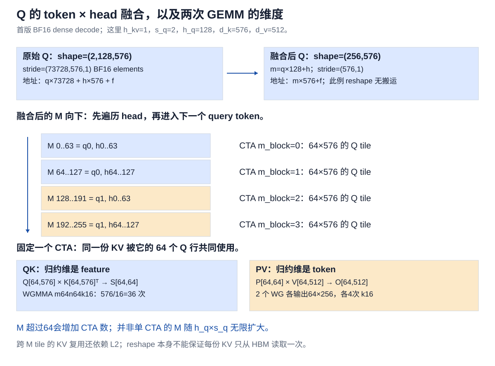
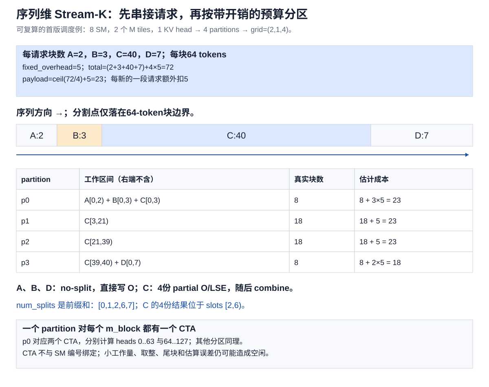
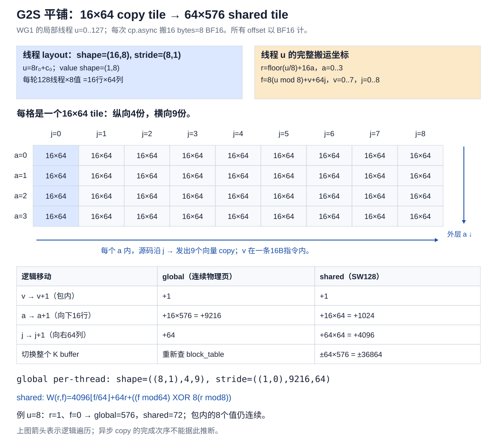
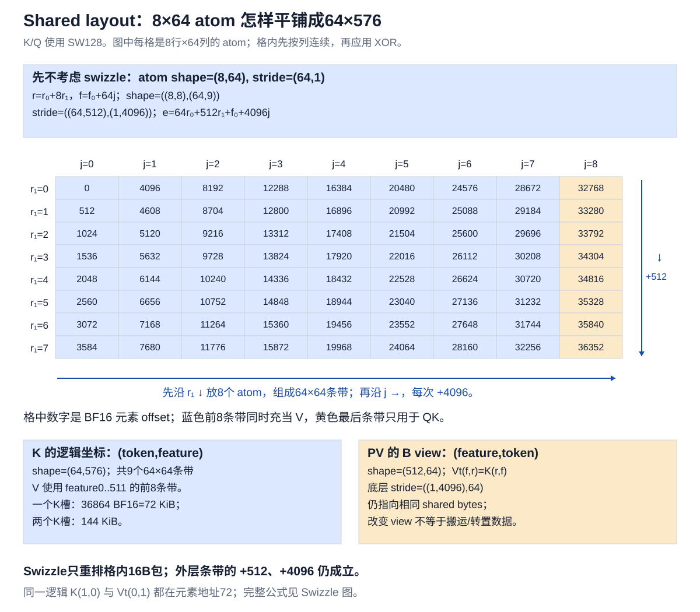
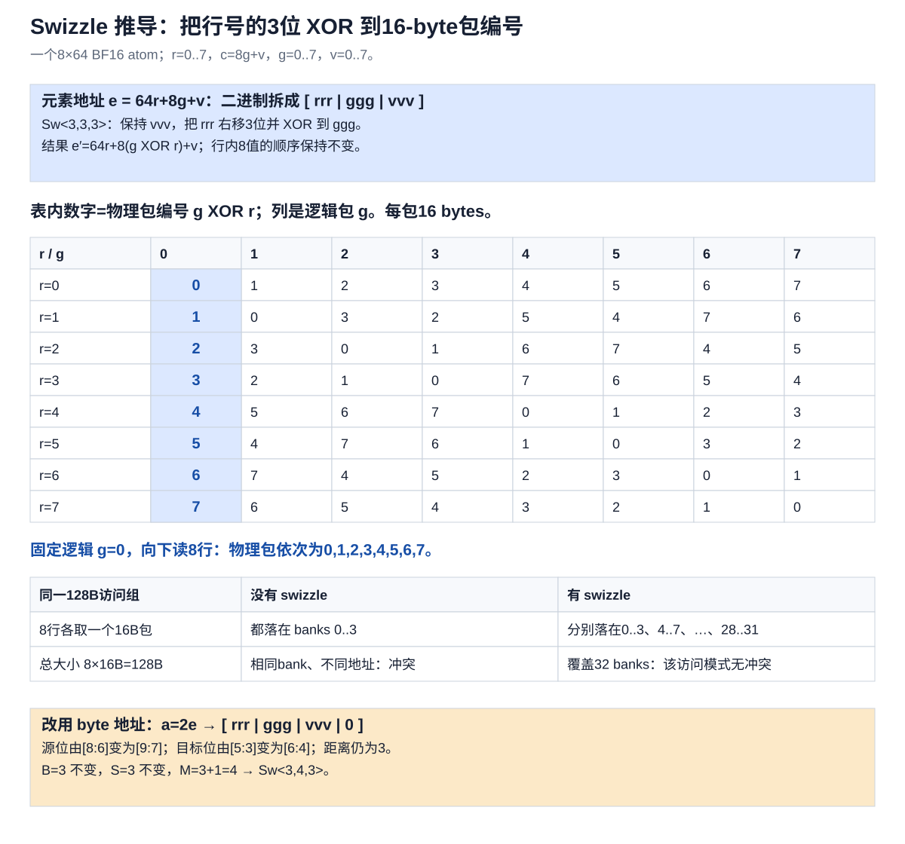
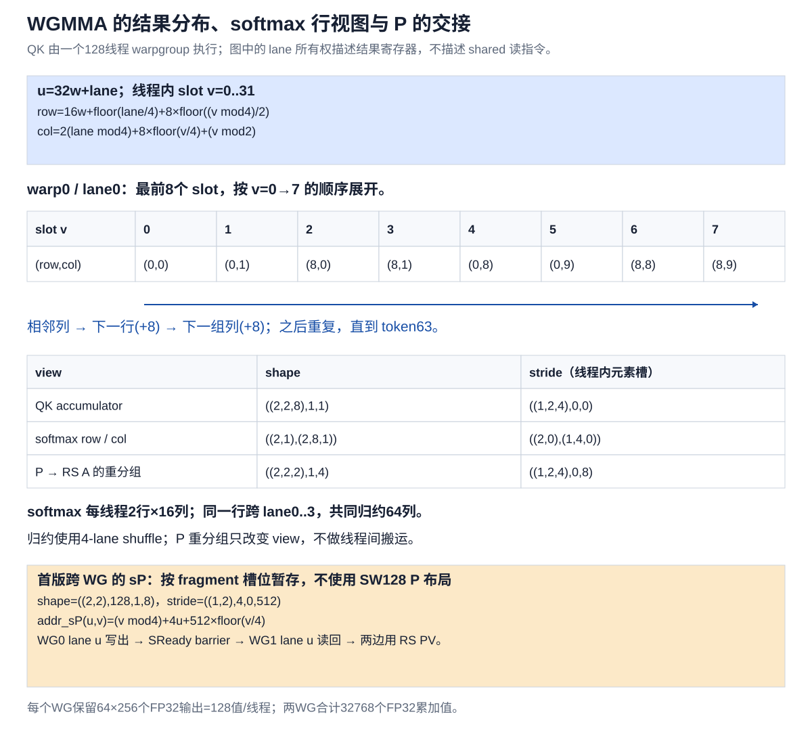
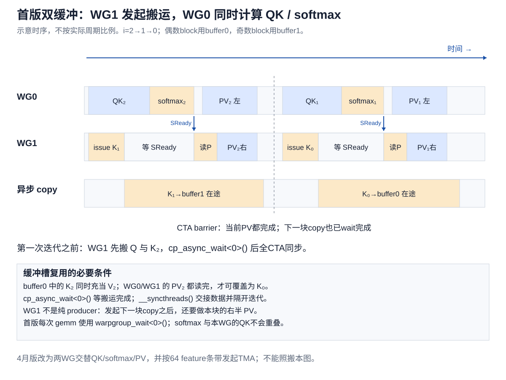
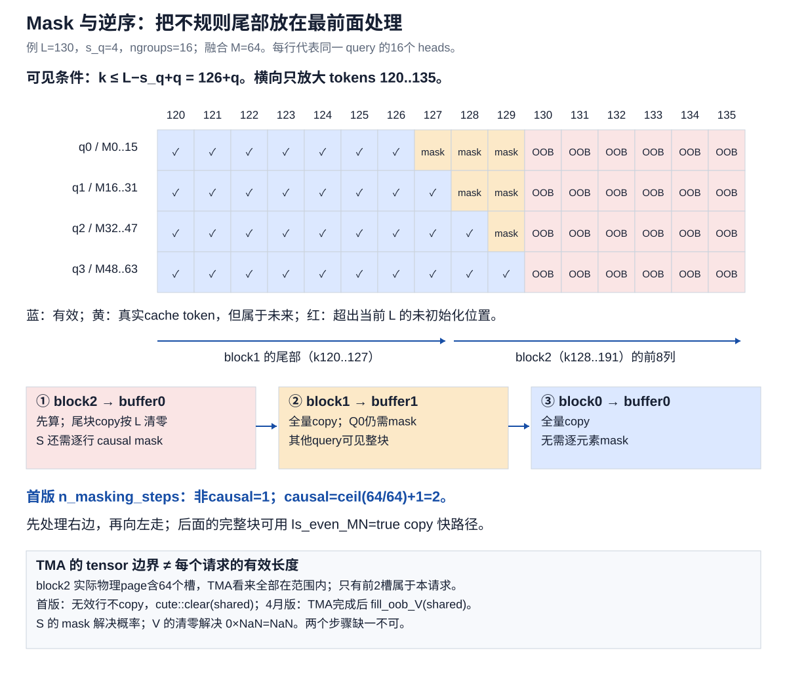

# FlashMLA 首版详解：Stream-K、mask、TMA 与 CuTe layout

本文针对提问中贴出的[知乎文章片段](https://zhuanlan.zhihu.com/p/1892715287004051401)，沿“算法 → CTA → 线程 → layout → 地址 → 指令”的顺序解释。知乎正文抓取返回403，因此不假定已读到未贴出的全文；两张给定的swizzle图片已读取。

**先给结论：原文列出的优化方向基本成立，但“消除所有碎片”“融合后一定不再受带宽限制”“cp.async自身完成首版的越界清零”都需要修正。新版TMA使用显式shared V清零保证无效cache槽中的NaN不进入PV；缩小token块到16不能代替这一正确性措施。**

## 1. 先固定版本和讨论范围

| 版本 | 固定源码 | 本文用途 |
|---|---|---|
| 首个提交 | [`414a2f3`](https://github.com/deepseek-ai/FlashMLA/tree/414a2f3eedeb5ad3c4a6e89d8641e059519cacc9)，提交日期2025-02-21 | 主线：BF16、Hopper、dense MLA decode |
| 4月性能更新 | [`c2067be`](https://github.com/deepseek-ai/FlashMLA/tree/c2067be3eaa0f2e98e10854c30898139d5d01d36)，2025-04-22 | 核对TMA、`fill_oob_V`及两WG新调度 |
| 本地新版 | `15f13e5030374295491c5ce31b02d7e63a7772c6` | 确认dense路径仍保留显式清零；不混入FP8 sparse路径 |

首版锁定的CUTLASS为`afa1772203677c5118fcd82537a9c8fefbcc7008`。本文的地址probe使用这个版本，而非只凭新版CuTe的打印结果推测旧版。

“首个提交日期”不等于对外发布日。官方4月文章所说的previous version指向`b31bfe7`；这里按你的要求进一步回到initial commit。首版只接受BF16，FP16支持是后续提交增加的。

新版FlashMLA已经包含多个kernel。**dense decode使用TMA搬规则KV页，不代表FP8 sparse decode也使用TMA gather KV。** 本地FP8 sparse路径另见[已有说明](flashmla_decode_walkthrough.md)。

## 2. 先把 MLA 的两个矩阵乘写清楚

此kernel接受的是经过MLA投影吸收变换后的query/cache，不是在内部展开完整的每head K/V。对DeepSeek这组维度：

```text
cached K(t,:) = [latent c(t), RoPE key(t)]  → 512+64=576 BF16
cached V(t,:) = latent c(t)               → 前512 BF16
```

固定一个请求、一个共享KV head，令`G=h_q/h_kv`、`T=s_q`、有效KV长度为`L`：

\[
Q\in\mathbb R^{(TG)\times576},\quad
K\in\mathbb R^{L\times576},\quad
V=K[:,0:512]\in\mathbb R^{L\times512}.
\]

\[
X=\alpha QK^T,\qquad P=\operatorname{softmax}(X+\mathrm{mask}),\qquad O=PV.
\]

这里输出512维latent attention结果；后续模型所需的投影在kernel之外。

首版固定`BlockM=64, BlockN=64, d_k=576, d_v=512`。一个CTA每轮：

```text
QK：Q[64,576] × K_block[64,576]ᵀ → S[64,64]
PV：P[64,64] × V_block[64,512]   → O[64,512]
```

QK的归约维是576个feature；PV的归约维是64个token。这个差别直接决定NaN为什么在两次GEMM中表现不同。



首版参数和固定kernel选择见[API](https://github.com/deepseek-ai/FlashMLA/blob/414a2f3eedeb5ad3c4a6e89d8641e059519cacc9/csrc/flash_api.cpp#L90-L128)与[kernel启动](https://github.com/deepseek-ai/FlashMLA/blob/414a2f3eedeb5ad3c4a6e89d8641e059519cacc9/csrc/flash_fwd_mla_kernel.h#L596-L602)。

## 3. 序列维 Stream-K：究竟怎样分配 SM

### 3.1 先用掉天然的并行维度

一共有：

\[
n_M=\left\lceil\frac{TG}{64}\right\rceil,
\quad n_H=h_{kv},
\quad n_P=\left\lfloor\frac{n_{SM}}{n_Hn_M}\right\rfloor.
\]

首版grid为：

```cpp
grid = (num_m_block, num_kv_heads, num_sm_parts);
//          n_M           n_H           n_P
```

`blockIdx.z`是partition编号，不是batch编号。一个partition可以处理多条请求的若干连续区间。所有M tiles和KV heads共用这套序列分区元数据。

例如132个SM、`T=1,G=128,h_kv=1`：`n_M=2,n_P=66`，共132个CTA。在该kernel一SM容纳一个大CTA的设计下，目标是让这些CTA构成一批常驻工作者。

但是代码没有指定“CTA p一定在SM p”。CUDA负责实际放置；如果乘除不能整除，CTA总数可能少于SM数；没有工作的一些partition还会直接退出。

### 3.2 它不是简单地把总 token 数除以 SM 数

先把每条请求换算成64-token块：

\[
n_b=\lceil L_b/64\rceil.
\]

首版显式估计了每次开始一段请求的固定开销，取`fixed_overhead_num_blocks=5`：

\[
W=\sum_b(n_b+5),\qquad
\mathrm{payload}=\lceil W/n_P\rceil+5.
\]

分区从请求0往后扫：

1. 剩余预算能容纳“当前请求剩余块数+5”，就处理完该请求，再接下一条。
2. 容纳不下整条，但扣除5后还能处理若干块，就切开当前请求。
3. 连5的开销都支付不了，就结束此partition。

所以多个短请求可以落在同一CTA内；长请求可以横跨多个partition。边界落在**64-token块**上，不是任意token位置。



图中是直接按首版算法算出的例子，不能只比较每partition真实块数8、18、18、8：前后两组处理多段请求，其固定开销也更高。图也显示最后一个partition的估计成本仍较小，说明它是负载均衡启发式，不保证完全等长。

每个partition的metadata包含：

```text
[begin_batch, begin_seq_offset, end_batch, end_seq_offset,
 begin_split_idx, unused, unused, unused]
```

`num_splits`是长度`B+1`的**前缀和数组**。请求b的split数为`num_splits[b+1]-num_splits[b]`，不是直接读取`num_splits[b]`。

### 3.3 “一个 wave，消除计算碎片”应怎样理解

传统按请求分CTA时，短请求很快结束，长请求仍拖着SM运行；固定split-K还可能产生大量CTA及最后一波不足SM数的任务。Stream-K把工作串起来再切分，主要改善这两种不均衡。

这里沿attention的序列归约维做类似Stream-K的工作分配。attention局部结果不是普通GEMM可直接相加的partial sum，还需要LSE归并。

**减少的是CTA任务层面的负载不均与wave尾部利用率损失。** 仍存在：不足64个token的N尾块、不足64行的M尾块、split归并流量、流水线启动/收尾以及调度估算误差。请求间不会互相混合做softmax；多条短序列共用CTA也不会自动把它们各自的尾块拼成一个无padding的GEMM。

主kernel约一波CTA，更不等于整次调用只有一个kernel：首版仍启动combine kernel。源码见[SM数与开销参数](https://github.com/deepseek-ai/FlashMLA/blob/414a2f3eedeb5ad3c4a6e89d8641e059519cacc9/csrc/flash_api.cpp#L24-L43)、[metadata调度器](https://github.com/deepseek-ai/FlashMLA/blob/414a2f3eedeb5ad3c4a6e89d8641e059519cacc9/csrc/flash_fwd_mla_kernel.h#L606-L672)。

## 4. token 与 num_heads 融合：为什么提高计算密度

### 4.1 融合的真实下标

固定KV head `a`，它对应G个Q heads，令组内head编号为`g`：

\[
m=tG+g,\qquad t=\lfloor m/G\rfloor,\quad g=m\bmod G.
\]

首版API把：

```text
[B,T,h_kv,G,576]
  → transpose head-group axes
[B,T,G,h_kv,576]
  → reshape
[B,TG,h_kv,576]
```

当`h_kv=1`、输入连续时，合并T和G只改变view。一般`h_kv>1`时，transpose后reshape是否产生copy还要看stride，不能一概声称零搬运。

原来单个head、单个query只是一行Q，几乎是向量乘矩阵。把共享同一KV的多个Q行堆成M维，就能让读入的K/V服务多行计算，同时填满WGMMA的M=64。

例如一GPU本地只有16个heads：`T=1`只能提供16个有效M行；`T=4`有64行，恰好填满。这里MTP指一次验证/处理多个query token，不能在有因果依赖时把未来token当成对所有query可见。

DP MLA的相关收益是：相较把heads切到多GPU上的TP，单GPU本地可能保留更多Q heads，共享本地latent KV。它不是“把不同batch请求直接合并成共享同一KV”。

### 4.2 AI的定量推导及适用范围

取`h_kv=1`，总融合行数`M=Th_q`。长序列时忽略Q/O读写和softmax标量开销：

\[
F\approx2ML(576+512),\qquad
D_{\min}\approx2L\cdot576\ \mathrm{bytes},
\]

\[
AI_{\mathrm{ideal}}\approx M\frac{1088}{576}
=\frac{17}{9}M\approx1.889M\ \mathrm{FLOP/byte}.
\]

| 有效Q行数M | 理想AI，FLOP/byte |
|---:|---:|
| 16 | 30.2 |
| 64 | 120.9 |
| 128 | 241.8 |
| 256 | 483.6 |

这和官方常用的`AI≈2h_qs_q`是一致的近似，但有两个重要边界：

- 首版每CTA的M固定64。M=128会变成两个CTA，各自读同一段KV；上述HBM流量下界要靠跨CTA的L2复用等条件接近，不能用reshape保证它。
- 是否compute-bound要比较实际有效算力/带宽、缓存命中、M/N padding、split开销、softmax与pipeline等。MTP让AI上升，不等于在所有shape上“消除bandwidth bound”。

官方4月文章用其机器的降频算力865TFLOPS、带宽3.35TB/s及`AI≈2M`估算M约128的分界。若保留576与512的精确差异，同一粗模型给出的分界约M=137；这本来就不是硬件的精确切换点。性能结论应与实测shape一起理解。[官方理论分析](https://github.com/deepseek-ai/FlashMLA/blob/c2067be3eaa0f2e98e10854c30898139d5d01d36/docs/20250422-new-kernel-deep-dive.md)

## 5. KV-cache复用：省掉哪些加载，没有省掉哪些计算

首版有强断言：

```cpp
FLASH_ASSERT(params.k_ptr == params.v_ptr);
```

而shared中的三个view都从同一个`smem_k.data()`开始：

```text
sK  : (64 tokens,576 features)
sV  : (64 tokens,512 features)
sVt : (512 output_features,64 reduction_tokens)
```

一次搬入64×576个BF16：

1. QK读取全部576维。
2. PV只读前512维。
3. 最后64维RoPE不用参与PV。

`sVt`是CuTe给B操作数使用的`(N,K)`视图，这里的N是512个输出feature、K是64个归约token。**不是先执行一次shared transpose kernel。**

若没有这个复用，K和V各搬一次，理想KV输入流量为`2L(576+512)`bytes；复用后是`2L576`bytes，少约47.1%，相应AI提升约1.889倍。实际HBM事务还受缓存影响，不能把这当成实测加速比。

QK和PV两次GEMM都仍要做；“复用KV”不是省掉PV。这个性质来自吸收后的MLA表示，普通MHA/GQA里独立投影出来的K与V不能随意共用指针。至于其他框架某历史Triton kernel是否重复加载，必须指定那份代码；不能据此评价今天的vLLM/SGLang所有MLA实现。[首版共享view](https://github.com/deepseek-ai/FlashMLA/blob/414a2f3eedeb5ad3c4a6e89d8641e059519cacc9/csrc/flash_fwd_mla_kernel.h#L249-L253)

## 6. G2S：先算线程负责什么，再看copy后的地址

### 6.1 一个CTA只有WG1负责cp.async

首版CTA为256线程=8 warps=2 warpgroups：

| 线程范围 | 分工 |
|---|---|
| WG0，0..127 | QK、softmax、左256维PV |
| WG1，128..255 | Q/K搬运、读取WG0的P/scale、右256维PV |

WG1局部线程号`u=threadIdx.x-128`。线程布局来自：

```cpp
ThrLayout = Layout<Shape<16,8>, Stride<8,1>>;
ValLayout = Layout<Shape<1,8>>;
CopyAtom  = SM80_CP_ASYNC_CACHEGLOBAL<uint128_t>;
```

第一层16表示16个token行，第二层8表示每行8个线程；每线程搬8个BF16。一个基础copy tile：

\[
(16\times8)\text{ threads}\times8\text{ BF16}=16\times64\text{ BF16}.
\]

扩展到`64×576`，纵向4个基础tile、横向9个基础tile：

\[
r=\lfloor u/8\rfloor+16a,\quad
f=8(u\bmod8)+v+64j;
\]

其中`a=0..3,j=0..8,v=0..7`。每线程一共搬`4×9×8=288`个BF16，是36次16-byte copy；不是一次指令搬完288值。



### 6.2 Global源地址

首版要求page size恰好64，与compute BlockN相同。逻辑block i先查：

```cpp
physical_page = block_table[batch][i];
src = cache
    + physical_page * k_batch_stride
    + kv_head       * k_head_stride
    + r             * k_row_stride
    + f;
```

上述stride单位是BF16元素。`h_kv=1`且连续时，`k_row_stride=576`，`k_batch_stride=64×576=36864`。`block_table`可能使相邻逻辑block落到完全不同的物理page，不能简单用全局指针减36864替代查表。

线程源view的实测打印：

```text
shape  = ((8,1),4,9)
stride = ((1,0),9216,64)
```

解释：8个值内部+1；向下16行是`16×576=9216`；向右64列是+64。大小1的mode没有第二个位置，打印的0 stride不代表数据被复制了多份。

### 6.3 Shared目的地址

shared不是简单的`row×576+feature`行主序。它先按64-feature条带组织，每条带覆盖完整64行，再在atom内部swizzle。线程目的view的底层打印为：

```text
shape  = ((8,1),4,9)
stride = ((1,0),1024,4096)
```

因为向下16行变成`16×64=1024`；向右一个64-feature条带，跨越`64×64=4096`个BF16。

对当前线程的16B向量，内部8个元素连续。跨线程比较时还要加各自的swizzle起点，不能把上面的stride当成全局完整物理地址公式。[首版copy配置](https://github.com/deepseek-ai/FlashMLA/blob/414a2f3eedeb5ad3c4a6e89d8641e059519cacc9/csrc/flash_fwd_mla_kernel.h#L87-L105)

## 7. Shared layout：atom如何平铺，K与V为何能原地复用

首先忽略XOR。BF16的`Layout_K_SW128_Atom`底层是8×64：

```text
shape=(8,64), stride=(64,1)
```

SW128中的128是bytes，对BF16正好64个元素，不是128个BF16。

铺成`(64,576)`：

```text
r = r₀ + 8r₁        r₀∈[0,8), r₁∈[0,8)
f = f₀ + 64j        f₀∈[0,64), j∈[0,9)

shape  = ((8,8),(64,9))
stride = ((64,512),(1,4096))

e = 64r₀ + 512r₁ + f₀ + 4096j
  = 64r + f₀ + 4096j
```

先用8个8×64 atom沿行方向堆满64行，再放下一个64-feature条带。因此512维V恰好是前8条带，576维K多一个RoPE条带；两种layout的前512维地址一致。



加入XOR后的完整元素地址，假设buffer基址按相应swizzle周期对齐：

\[
\boxed{W(r,f)=4096\lfloor f/64\rfloor+64r+
\big((f\bmod64)\mathbin{\mathrm{XOR}}8(r\bmod8)\big)}.
\]

`sVt(f,r)`与`sK(r,f)`在`f<512`时指向同一地址。真实打印：

```text
K:  Sw<3,4,3> o smem_ptr[16b] o ((8,8),(64,9)):((64,512),(1,4096))
Vt: Sw<3,4,3> o smem_ptr[16b] o ((64,8),64):((1,4096),64)
```

不要只调用底层layout的`operator()`就认定已包含XOR：此类型把swizzle挂在smem pointer上。本文probe通过实际绑定的tensor元素地址验证。

## 8. Swizzle<3,3,3>到底怎样推出来

### 8.1 先明确bank和访问单位

在这里使用的shared bank模型中，32个bank，每个连续32-bit word映射到下一个bank：

\[
\operatorname{bank}(a)=\lfloor a/4\rfloor\bmod32,
\quad
\operatorname{bank}(e)=\lfloor e/2\rfloor\bmod32
\]

其中a是byte地址，e是BF16元素地址。16B包=8 BF16=4个bank word。

取一个8×64元素atom，每行拆成8个包。令行号r、逻辑包号g、包内位置v：

\[
e=64r+8g+v,\quad r,g,v\in[0,8).
\]

二进制正好是：

```text
bit   8 7 6 | 5 4 3 | 2 1 0
       rrr  |  ggg  |  vvv
```

固定g=0，从8行各取一个16B包，共128B。未swizzle时，各行起点是0、64、128……个BF16；byte起点相差128B，所以都落在同样的banks0..3，且是不同地址。

为了让这些包错开，令物理包号：

\[
g'=g\oplus r.
\]

于是8行分别使用包0..7，对应banks0..3、4..7……28..31。这是该访问模式下没有bank conflict的原因。它不是“同一bank不能读任何重复地址”的泛化：广播等行为还要单独区分。

### 8.2 B、M、S逐个求

- **M=3**：保留包内v的低3位，使8个BF16仍连续。
- **B=3**：8个包的编号要3位，目标是`ggg`。
- **S=3**：行号`rrr`的最低位在bit6，包号`ggg`最低位在bit3，相差3位。

所以：

\[
\operatorname{Sw}_{3,3,3}(e)
=e\oplus\left((e\mathbin{\&}(7\ll6))\gg3\right).
\]

不是“冲突8路，所以所有参数都取3”。路数只能帮助确定需要8种包置换；M来自连续包粒度，S来自源位和目标位的实际位置。



数值例：`r=1,c=0`时，`e=64`，XOR后的地址是72；`r=1,c=8`时，`e=72`，XOR后变64。同行前两个包互换，包内部顺序不变。

再取`r=3,c=17`：`g=2,v=1`，`g'=2 XOR 3=1`，地址`64×3+8×1+1=201`。

### 8.3 为什么CuTe显示Sw<3,4,3>

对16-bit元素，byte地址`a=2e`：

```text
元素地址 e：[ rrr | ggg | vvv ]
字节地址 a：[ rrr | ggg | vvv | 0 ]
```

所有位位置整体左移1：保留最低位数变成4；两个3-bit字段之间的距离仍是3。因此：

\[
\operatorname{Sw}_{3,4,3}(2e)=2\operatorname{Sw}_{3,3,3}(e).
\]

`smem_ptr[16b]`表示元素位宽16 bit，**不是swizzle输入的单位为16 bytes**。指针层对byte地址做XOR，故保留16-byte包的低4位。

原始swizzle代码的S正数表示源字段右移，S负数表示左移；不能不看字段位置，单纯把所有配置都理解为交换两段位。[首版CUTLASS swizzle定义](https://github.com/NVIDIA/cutlass/blob/afa1772203677c5118fcd82537a9c8fefbcc7008/include/cute/swizzle.hpp#L40-L96)、[GMMA shared布局定义](https://github.com/NVIDIA/cutlass/blob/afa1772203677c5118fcd82537a9c8fefbcc7008/include/cute/atom/mma_traits_sm90_gmma.hpp#L65-L105)

### 8.4 原文的8×8图不能当成完整WGMMA执行模型

8×8 BF16正好128B，很适合解释一个访问组怎样分摊到bank。但**WGMMA由4个warp、128线程共同发起**；首版QK是SS WGMMA，Q/K由shared descriptor提供，没有“先显式ldmatrix把整个Q/K读入各线程寄存器”的阶段。

图中的T0..T3可以帮助理解4线程的一行结果所有权；不能由此断言每个warp独立完成一个8×8 WGMMA，或从输出寄存器布局反推出内部所有shared事务次序。完整WGMMA的形状、descriptor及操作数要求以[PTX WGMMA文档](https://docs.nvidia.com/cuda/parallel-thread-execution/#asynchronous-warpgroup-level-matrix-instructions)为准。

## 9. WGMMA、softmax与P传递的layout

### 9.1 QK与PV怎样切

QK使用一个WG的SS `m64n64k16`，沿576维做36个k16 atom。PV将输出N=512切成两个256维：两个WG各执行RS `m64n256k16`，沿64-token归约维各做4个atom。

一完整token块的CTA总计36+4+4=44次WGMMA atom操作。这里的SS表示A、B来自shared；RS表示A来自register、B来自shared。

`TiledMmaO`的atom layout为`(1,2,1)`，其中2沿输出N维扩展，因此WG0输出feature0..255、WG1输出256..511。

### 9.2 每个线程拿到哪些score

设WG内`u=32w+lane`，线程内结果slot为v。QK每线程32个FP32：

\[
r=16w+\lfloor lane/4\rfloor+8\lfloor(v\bmod4)/2\rfloor,
\]

\[
c=2(lane\bmod4)+8\lfloor v/4\rfloor+(v\bmod2).
\]

所以lane0拥有行0、8，各16个token列；lane1拥有相同行的另一组列；lane0..3合起来是两条完整64-token行。



这解释了softmax跨4-lane归约。最大值每轮归约；分母row_sum可以在每线程先累计其部分，最后再跨4-lane求和，减少循环内通信。

### 9.3 三个register view不要混淆

```text
QK C fragment:
  shape=((2,2,8),1,1), stride=((1,2,4),0,0)

softmax row/col view:
  shape=((2,1),(2,8,1)), stride=((2,0),(1,4,0))

RS A view:
  shape=((2,2,2),1,4), stride=((1,2,4),0,8)
```

第一个2是相邻两列，第二个2是相隔8的两行，8表示沿列重复8组。softmax把行维提到外面，便于逐行归约。RS把8组列再拆为`2×4`，每个k16阶段需要8个BF16/线程，4阶段共32个BF16。

这些stride的单位是**线程fragment的元素槽**。FP32转BF16是数值转换；`convert_layout_acc_Aregs`的重分组本身是view变换，不是跨线程shuffle。

### 9.4 首版怎样把P给WG1

首版shared P的layout：

```text
shape  = ((2,2),128,1,8)
stride = ((1,2),4,0,512)
```

对WG内线程u、fragment slot v：

\[
\operatorname{addr}_{sP}(u,v)=(v\bmod4)+4u+512\lfloor v/4\rfloor.
\]

WG0把rP和rescale写shared，发出`SReady`；WG1同局部线程号从shared读回自己的rP。**首版两个WG的PV都是RS**。这份sP按fragment交接排布，不是新版供SS WGMMA直接读取的SW128矩阵P。

行rescale的layout为`shape=(2,128), stride=(1,2)`，每个线程交接对应两行的缩放因子。只有P而没有rescale，WG1保留的旧输出就无法调整到新的softmax最大值基准。[首版WG主循环及P交接](https://github.com/deepseek-ai/FlashMLA/blob/414a2f3eedeb5ad3c4a6e89d8641e059519cacc9/csrc/flash_fwd_mla_kernel.h#L274-L449)、[view变换](https://github.com/deepseek-ai/FlashMLA/blob/414a2f3eedeb5ad3c4a6e89d8641e059519cacc9/csrc/utils.h#L85-L151)

## 10. Double buffer究竟overlap什么

shared Q常驻，一个K buffer为`64×576×2=73728B=72KiB`；两个K buffer为144KiB。Q另占72KiB，P占8KiB，scale占1KiB：首版该配置的计算期有效数组合计225KiB，输出阶段通过union复用这片shared。

大shared占用是不能指望同SM堆很多CTA的直接原因。输出`64×512`的FP32累加值又需要32768个寄存器槽，两WG每线程各持有128个输出值，还不包括P、地址等状态。



首版从当前分区的最右block开始，简化伪代码：

```cpp
WG1: load Q;
WG1: load K[last] into buffer[last % 2];
WG1: commit cp.async;

for (i = last; i >= first; --i) {
    WG1: wait outstanding cp.async;
    all: __syncthreads();

    WG1: issue K[i-1] into the other buffer, if it exists;
    WG0: S = Q @ K[i].T; wait WGMMA complete;
    WG0: mask; online softmax; write P and rescale;
    WG0/WG1: SReady handoff;
    WG0: rescale O_left;  O_left  += P @ V_left[i];
    WG1: load P/rescale; rescale O_right; O_right += P @ V_right[i];
    // 两边的gemm均等待完成，下一轮CTA同步后才可覆盖旧buffer。
}
```

下一块copy可与本块QK、softmax乃至PV的执行重叠；实际重叠时长取决于延迟。不是说WG1在执行标量copy发射指令的同时又执行PV，而是它**发起异步搬运后**可以继续自己的计算。

首版`flash::gemm<...,wg_wait=0>`每次等当前组完成，所以本WG的softmax发生在本WG QK完成以后。不要把4月新版的跨WG seesaw overlap套到首版。

一个buffer中的K同时充当V，故**不能在QK读完后立刻覆盖整块K**：两个PV消费者仍然需要它。`cp_async_wait`保证加载完成，CTA barrier保证线程间交接；它们不是同一种同步。

源码里descriptor的`sK_offset/8`也不是“只移了1/8个buffer”：一个descriptor地址单位对应16 bytes=8 BF16，故36864个BF16要换算成4608个16-byte地址单位；普通BF16指针则直接加36864。[双缓冲地址切换](https://github.com/deepseek-ai/FlashMLA/blob/414a2f3eedeb5ad3c4a6e89d8641e059519cacc9/csrc/flash_fwd_mla_kernel.h#L281-L287)

## 11. Mask怎样实现，block为什么逆序

### 11.1 Load mask和score mask是两件事

**Load mask**以token行为粒度，只判断是否超出真实KV长度L。最后一页有不足64的有效行时，WG1不加载无效行，改为清零对应shared位置。

**Score mask**以每个`(query row,KV token)`为粒度，将不可见score赋值为`-INFINITY`。它同时处理KV长度边界和不同query的causal边界。

必须是覆盖赋值，如`S=where(valid,S,-inf)`。若先算出NaN再用`S += additive_mask`，`NaN + (-inf)`仍为NaN，不能达到这里的效果。

### 11.2 融合head以后，causal边界怎么求

decode/MTP中的T个query对齐到KV序列最后T个位置。query t的全局位置为`L-T+t`，因此：

\[
k\le L-T+t.
\]

融合行`m=tG+g`，所以：

\[
k\le L-T+\lfloor m/G\rfloor.
\]

同一个query的G个heads具有完全相同的mask。边界在融合M维上每G行才前进一步，不是普通`k≤m`的逐行三角形。

首版用距离序列右端的等价写法。令局部score行r、列c、M tile号a、N block号i：

```cpp
m = a*64 + r;
col_limit_right = L - 1 - i*64 - (T*G - 1 - m)/G;
if (c > col_limit_right) S[r,c] = -INFINITY;
```

对于有效m，整数除法项等于`T-1-floor(m/G)`，所以与上式相同。无效M尾行不会写最终输出。T=1时首版API直接关闭causal分支，只需KV长度mask。



### 11.3 为什么要先算最后一个block

首版：

```cpp
int n_block = n_block_max - 1;
for (...; n_block >= n_block_min; --n_block) { ... }
```

倒序的工程收益是：

1. 序列长度不整除64的尾块首先处理，第一次load执行精确长度判断并清零。
2. 后续更左边的block都位于真实序列内，copy可以走`Is_even_MN=true`。
3. 对短query decode/MTP场景，causal边界也集中在最右侧少数block；离开这一区域后省去逐元素mask判断。

首版设置非causal至少1个mask迭代，causal为`ceil(BlockM/BlockN)+1=2`。当序列结尾不与block对齐时，causal边界可能跨两个block。图中L=130、T=4、G=16：q0可见到126，q1到127，q2到128，q3到129；所以block2和block1都需要检查。

这个“最多两个”的解释针对该首版面向的短query场景，不应据此推导任意长prefill都可以仅mask最后两块。若某split不包含序列右端，开头几个mask迭代可能只是保守检查，所有位置实际都有效。

逆序发生在**每个请求分给当前CTA的区间内部**；跨请求仍按batch顺序处理。不存在把请求A和B的softmax状态一起倒序累计。

### 11.4 逆序不改变attention定义

Online softmax对已处理集合维护最大值m、分母l、未归一化输出u。新块scaled logits为x：

\[
m'=\max(m,\max x),\quad \rho=e^{m-m'},\quad p=e^{x-m'},
\]

\[
l'=\rho l+\sum p,\quad u'=\rho u+pV.
\]

最后`O=u/l`。精确算术下，按正序、逆序或分块再合并，最终集合相同就等价；浮点累计顺序会带来舍入差异。倒序不是causal attention的数学要求，也不能据此认为最近token权重更高。

全mask行还需要避免`-inf-(-inf)`。首版`scale_apply_exp2`遇到最大值`-inf`时将用于指数相减的基准替换为0，使masked项得到0；后续`Check_inf`处理及输出归一化也有专门分支。[mask与倒序源码](https://github.com/deepseek-ai/FlashMLA/blob/414a2f3eedeb5ad3c4a6e89d8641e059519cacc9/csrc/flash_fwd_mla_kernel.h#L289-L330)、[softmax边界处理](https://github.com/deepseek-ai/FlashMLA/blob/414a2f3eedeb5ad3c4a6e89d8641e059519cacc9/csrc/softmax.h#L57-L196)

## 12. 为什么旧版没用TMA，新版怎么解决NaN

### 12.1 先区分两种“越界”

TMA认识的是tensor descriptor定义的维度边界；它不自动知道`cache_seqlens[b]`。

例L=130、page size=64，最后一页的64个物理槽都合法存在，但仅前2槽属于本请求，后62槽可能还没有初始化。对整页TMA而言，这62行仍在tensor范围内，不能靠descriptor的OOB填充规则清零。

因此“超出序列长度”通常是**语义无效、物理合法**，不一定是非法地址访问。区别正是[issue #61中的NaN解释](https://github.com/deepseek-ai/FlashMLA/issues/61#issuecomment-2709365584)的重点。该解释来自社区评论，GitHub标记为`NONE`，不宜直接称为官方保证；后续协作者另[确认4月版已使用TMA](https://github.com/deepseek-ai/FlashMLA/issues/61#issuecomment-3345333858)。下面的解决办法以实际源码为准。

### 12.2 为什么QK的mask够用，PV却不够

假设无效token j的cached K含NaN，但其他有效输入有限：

\[
S_{m,j}=\sum_f Q_{m,f}K_{j,f}
\]

该NaN污染的是第j个输出列；不会沿token维归约到其他有效列。用predicate把该列score**覆盖**为`-inf`，就能在softmax前丢弃它。

但是PV为：

\[
O_{m,d}=\sum_j P_{m,j}V_{j,d}.
\]

即使`P[m,j]=0`，IEEE浮点中`0×NaN=NaN`，`0×Inf`也不是安全的零。它沿token归约污染O。Tensor Core的dense乘法不会因为P为0就保证跳过V读取和乘法。

因此必须保证无效token的V为有限安全值，这里直接置0。

注意这里不是清洗模型所有NaN：真实有效token若本来含NaN，kernel不会承诺修复；causal未来token虽对某query不可见，但可能对其他query有效，不能按某行mask全局清掉共享V。该实现针对的是**真实序列之外的未初始化槽**。

### 12.3 首版并非依赖cp.async自身的zero-fill

首版使用普通`SM80_CP_ASYNC_CACHEGLOBAL<uint128_t>`。其`flash::copy`逻辑是：

```cpp
for each token row owned by this thread:
    if (row < valid_rows):
        for each feature vector:
            cute::copy(cp_async_atom, global_vector, shared_vector);
    else if (Clear_OOB_MN):
        cute::clear(shared_row_vectors);
```

也就是有效行发cp.async，无效行执行显式shared clear。16B粒度位于feature维，各8线程协作搬同一token行，故能逐token判定是否该copy。

cp.async指令家族确实另有按有效src-size填零的用法，但不能因此说首版使用了这个机制。[首版实际copy helper](https://github.com/deepseek-ai/FlashMLA/blob/414a2f3eedeb5ad3c4a6e89d8641e059519cacc9/csrc/utils.h#L204-L235)

### 12.4 4月新版：TMA照常搬，PV之前显式清零

新版存在清楚的函数：

```cpp
fill_oob_V(sV, valid_window_size, idx_in_warpgroup);
```

它把每WG负责的`V_half[256 features,64 tokens]`重解释成64-bit包：

```text
256 BF16 / 4 BF16-per-int64 = 64 个int64包/行
128 threads = 同时覆盖2个token行
```

概念伪代码：

```cpp
valid = max(L - block_start, 0);
for (token = valid + u/64; token < 64; token += 2)
    V_int64[u%64, token] = 0;
```

WG0清左256维，WG1清右256维，两边覆盖完整512维V。实际使用相应的swizzled layout寻址，不是往普通行主序地址写。

必须遵循：

```text
TMA完成、相关QK读取完成
    → CUDA线程覆盖无效shared V
    → fence_view_async_shared
    → WGMMA读取清零后的V
    → PV
```

这是普通线程shared写与异步WGMMA读之间的可见性问题。该路径在fill后执行proxy fence，再通过PV helper中的`gemm`发起WG共同执行的WGMMA，包含`warpgroup_arrive()`（WGMMA fence）。`fill_oob_V`本身没有另加`__syncthreads()`；不要把这段协作代码概括成“任意producer写完后单独做一个fence就足够”，也不要把proxy fence与普通线程barrier混为一谈。

清零发生在尾部PV路径，普通完整块没有这份清理代价；如果partition结束处并非真正序列尾部，`valid`可能大于等于64，循环自然不写任何值。

只需清理前512维V，不必为PV清理最后64维RoPE：后者只参与已经完成并mask过的QK。首版则在load端将整条无效K行清掉，两者策略不同。

**这就是TMA可以使用的原因：把“高效批量搬运”与“处理每请求的无效V行”分成两个步骤。** [4月版fill_oob_V](https://github.com/deepseek-ai/FlashMLA/blob/c2067be3eaa0f2e98e10854c30898139d5d01d36/csrc/kernels/splitkv_mla.cu#L571-L595)、[WG0调用](https://github.com/deepseek-ai/FlashMLA/blob/c2067be3eaa0f2e98e10854c30898139d5d01d36/csrc/kernels/splitkv_mla.cu#L774-L807)、[WG1调用](https://github.com/deepseek-ai/FlashMLA/blob/c2067be3eaa0f2e98e10854c30898139d5d01d36/csrc/kernels/splitkv_mla.cu#L891-L918)

### 12.5 新版TMA的9次搬运沿哪一维切

新版把`64 tokens×576 features`拆成9个：

```text
64 tokens × 64 features = 8192 bytes / TMA
```

**切的是feature维，token维仍为64。** 因此没有通过改成16-token块来解决NaN。

新版mask的数值表示也与首版不同：4月代码用有限极小值`MAX_INIT_VAL=-1e33f`屏蔽score，以`MAX_INIT_VAL_SM=-1e30f`初始化共享max，配合其缩放和指数计算使masked概率下溢为0，并规避全mask时的`-inf-(-inf)`。不能把首版所有`-INFINITY`细节原样套到新版。

每64维条带有自己的barrier；相应条带完成后可发4个k16 QK atom，其他条带可以继续搬运。QK需要9条带，V左半需要前4条带，V右半需要接下来的4条带，最后1条带是RoPE。

新版两个WG分别负责一对token块的QK，并交替处理softmax、输出左右半边。最后一次使用某组V条带的PV完成后，就可以为下一组K发起对应TMA，不必等整块所有feature都空闲。这是改动调度能获益的重要原因；还涉及共享max与rescale，不能只把旧版copy指令替换成TMA。

本地新版dense路径仍有[fill_oob_V](../third_party/FlashMLA/csrc/sm90/decode/dense/splitkv_mla.cuh)及同样的9条带TMA结构。4月新版按`block_idx += 2`向前处理一对KV块，亦说明首版逆序并非算法必须。[4月版TMA发射代码](https://github.com/deepseek-ai/FlashMLA/blob/c2067be3eaa0f2e98e10854c30898139d5d01d36/csrc/kernels/splitkv_mla.cu#L27-L54)

### 12.6 对“block_size=1 / 16”的评价

一次TMA搬1个token，给无效token构造descriptor范围外坐标，原则上可以实现逐token零填充，但要满足该descriptor、box及swizzle的约束，并增加大量发射和barrier管理开销；不是TMA不能做，而是与批量搬运的优势不一致。

若token维box长度为1，token坐标-1可使这一行OOB；box长度大于1时，起点-1并不表示整个box都OOB，后续坐标0、1……仍可能在范围内。

把token tile改为16只把尾部最多无效行数从63降到15；**只要仍有一个NaN被PV读到，数值结果就可能污染。** “在一些MHA/GQA测试上没遇到问题”不能替代有效性判断或清零；这条浮点规则与模型结构无关。未初始化bit模式是否恰好形成NaN也不是模型产生NaN的概率。

## 13. Combine：为什么no-split直接输出，split要LSE加权

### 13.1 每个split输出的不是未归一化分子

首版每个split独立完成online softmax，最后输出：

\[
O_s=\frac{\sum_{j\in\mathcal I_s}e^{x_j}V_j}{\sum_{j\in\mathcal I_s}e^{x_j}},
\qquad LSE_s=\log\sum_{j\in\mathcal I_s}e^{x_j}.
\]

也就是说`Oaccum`虽然名字带accum，保存的是**该split已归一化的FP32输出**，并不是可直接相加的分子。完整输出：

\[
LSE=\operatorname{logsumexp}_s(LSE_s),\qquad
w_s=e^{LSE_s-LSE},\qquad O=\sum_sw_sO_s.
\]

稳定实现先求`max LSE_s`，再做指数和。首版内部用exp2加速softmax，但写出的LSE由自然对数计算，combine使用expf；不要误当成base2的LSE。

例：两个split未归一化质量分别为2和6，对应局部输出10和20。正确结果是`(2×10+6×20)/8=17.5`；简单平均为15，直接相加为30，都不对。

### 13.2 NoSplit路径省掉什么

主kernel判断当前请求区间是否覆盖全部KV块；若是，直接写最终BF16 O和最终LSE。若不是，则写FP32 Oaccum与局部LSE，交给combine。

combine读取实际split数，等于1时直接return。这节省了no-split请求的临时FP32写回、combine读回和归并计算。

**首版仍然发射combine kernel，即使所有请求都是no-split。** 所以它省掉的是数据流量和每请求的归并工作，不是必然省掉该kernel launch。4月版进一步使用Programmatic Dependent Launch等调度改动，不应反推到首版。[首版store与归一化](https://github.com/deepseek-ai/FlashMLA/blob/414a2f3eedeb5ad3c4a6e89d8641e059519cacc9/csrc/flash_fwd_mla_kernel.h#L155-L237)、[combine及启动](https://github.com/deepseek-ai/FlashMLA/blob/414a2f3eedeb5ad3c4a6e89d8641e059519cacc9/csrc/flash_fwd_mla_kernel.h#L482-L592)

## 14. 对原文关键表述的核对

| 原表述 | 更精确的解释 |
|---|---|
| CTA数设置成SM数 | 先除以M tiles与KV heads再取整，CTA总数通常接近SM数；没有CTA到SM编号绑定 |
| 一个wave，消除计算碎片 | 改善CTA层面的尾波与负载不均；M/N尾块、split开销和空partition仍可能存在 |
| token/head融合消除bandwidth bound | 提高复用与M利用率；能否跨过带宽瓶颈还受shape、缓存和实测算力影响 |
| 不用单独加载V | 正确，但因为该MLA表示中V是K前512维；QK、PV都仍要计算 |
| Double buffer | 下一块KV搬运与本块QK/softmax等重叠；WG1兼任搬运者和PV消费者 |
| cp.async把无效token填0 | 首版实际上是条件cp.async + `cute::clear` |
| TMA不能处理NaN | TMA不理解每请求的有效长度；可在PV前显式清理shared V |
| 16-token TMA足以保证正确 | 不成立；仍需处理剩余无效行 |
| Swizzle的B=M=S=3 | 对这个元素布局推导成立；指针byte地址对应`Sw<3,4,3>` |
| 一个warp读8×8就是一个MMA | 8×8可解释访问组；WGMMA整体是128线程协作，不能等同 |
| no-split不需要combine | 不需要归并计算；首版仍启动combine kernel并让相关CTA提前退出 |

## 15. 图形、源码probe与验证范围

8幅SVG均为可编辑文本和矢量图元，另提供相同尺寸PNG。尺寸宽度均为1200px，高度分别为890、950、1080、1050、1120、1080、1040、900px。流水线图只表达先后和依赖，没有实测周期含义。

- [图形生成器](assets/flashmla_initial_figures.py)，可指定输出目录，复用本项目已有绘图与librsvg渲染helper。
- [CuTe地址probe](../examples/flash_attn/flashmla_initial_layout_probe.cu)，核对原始CUTLASS的全部G2S坐标与覆盖、global/shared stride、K/V别名、QK/PV结果所有权、sP地址和byte/element swizzle关系。
- [probe原始输出](assets/flashmla_initial_layout_probe.txt)，可直接对照文中的shape、stride。
- [CPU数值与调度检查](assets/flashmla_initial_checks.py)，验证图中分区实例、正逆序online softmax、split-LSE归并及NaN尾槽反例。

编译probe无需运行GPU kernel：

```bash
nvcc -std=c++17 --expt-relaxed-constexpr \
  -I/path/to/cutlass-afa17722/include \
  examples/flash_attn/flashmla_initial_layout_probe.cu \
  -o /tmp/flashmla_initial_probe
/tmp/flashmla_initial_probe
python docs/assets/flashmla_initial_checks.py
python docs/assets/flashmla_initial_figures.py /tmp/flashmla-figures
```

以上验证不等于在Hopper上验证了完整kernel的数值与吞吐；本文没有声称进行过GPU benchmark。所有性能因果解释均与实际源码结构及相应假设一起给出。
