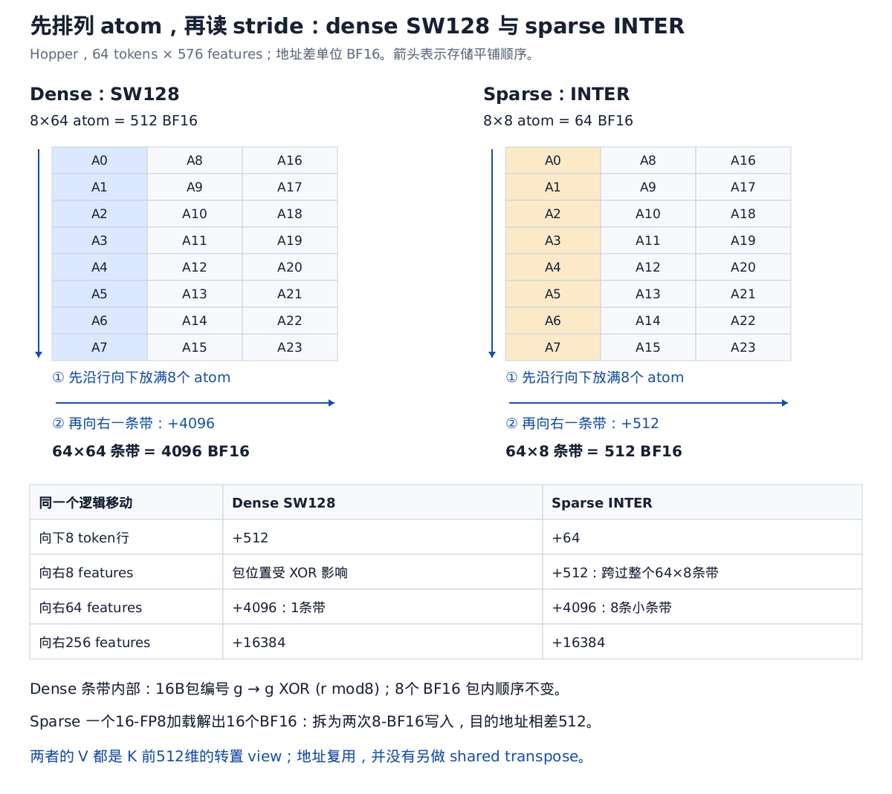
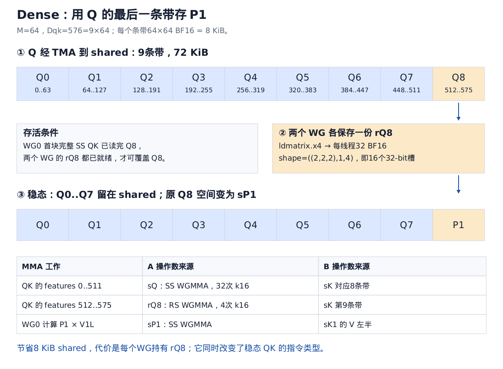
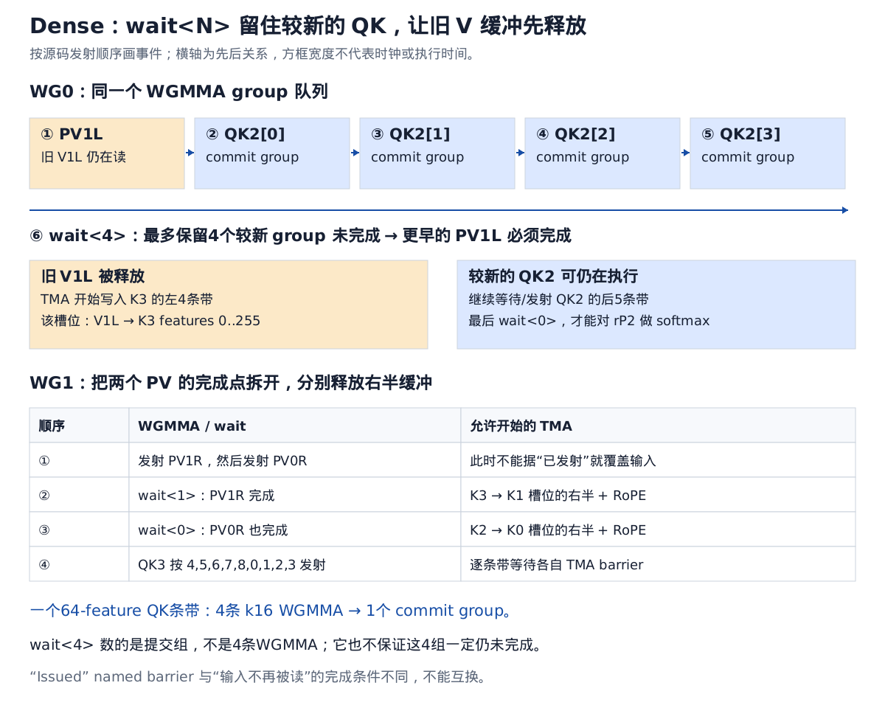
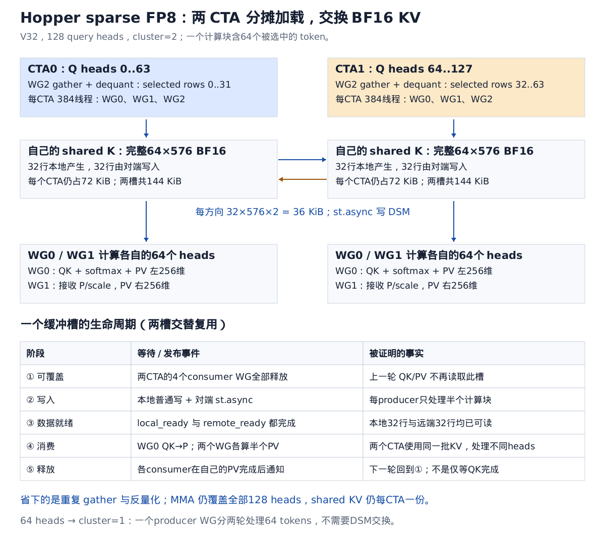
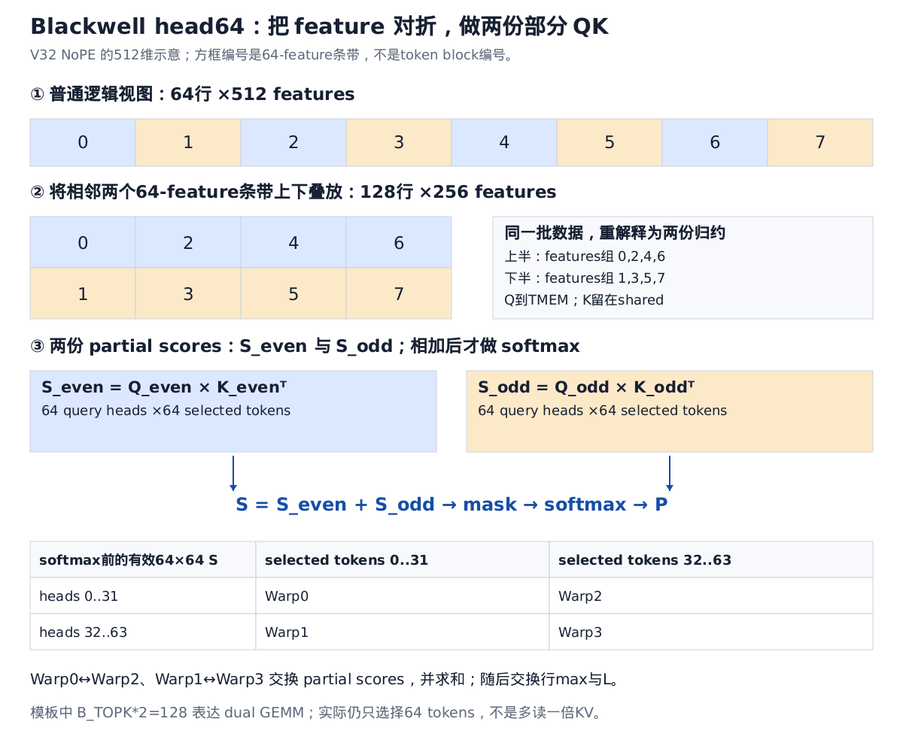

# FlashMLA 最新源码精读：Dense TMA/WGMMA、Hopper Sparse FP8 与 Blackwell Gather4

本文固定到官方仓库 **`15f13e5030374295491c5ce31b02d7e63a7772c6`**（2026-07-28，`Extend decode-combine num_splits buckets to 256`）。2026-09-07 执行 `git fetch origin main` 后，本地 HEAD 与远端 main 一致；仓库位于 [`third_party/FlashMLA`](../third_party/FlashMLA)。已有官方 clone，因此直接更新并复用，没有另建一份。

按你给的旧文结构展开：**输入输出 → 分块 → WG 分工 → 数据搬运/布局 → 流水线 → mask → 调度与输出**。重点是 decode；prefill 有独立实现，不能把它的线程分工套到 decode 上。下文默认 BF16 输入，用 BF16 element 表示 shared 地址单位；字节单位会明确标出。

## 0. 先区分三条实际执行路径

| 路径 | KV 的主要搬运方式 | Tensor Core 指令 | 主要分工 |
|---|---|---|---|
| SM90 dense decode | TMA 加载规则的页内二维条带 | WGMMA：QK 混合 SS/RS，PV 混合 RS/SS | 2 WG，各负责一个 token block 的 QK，并各持有半个 O |
| SM90 sparse FP8 decode | 线程按 indices gather、反量化；cluster=2 时 `st.async` 交换 BF16 KV | **BF16 WGMMA**，FP32 累加 | 2 consumer WG + 1 producer WG |
| SM100 sparse FP8，本文以 head64 路径为例 | **TMA gather4** 搬 FP8/RoPE，另有反量化 WG | **`tcgen05`**，使用 TMEM | softmax WG、按 warp 分工的发射/加载 WG、反量化 WG |

因此，“新版用了 TMA”至少有两个不同含义：dense 的规则二维 TMA，以及 Blackwell sparse 的不连续行 gather4。**Hopper sparse 的 KV 并不是用 dense 那套 TMA 加载；FP8 cache 也不意味着用 FP8 MMA。**

入口依据：[Python interface](../third_party/FlashMLA/flash_mla/flash_mla_interface.py)、[dense dispatch](../third_party/FlashMLA/csrc/api/dense_decode.h)、[sparse dispatch](../third_party/FlashMLA/csrc/api/sparse_decode.h)。在线代码均可从[固定提交](https://github.com/deepseek-ai/FlashMLA/tree/15f13e5030374295491c5ce31b02d7e63a7772c6)查看。

## 1. Dense：明确输入输出，再看分块

### 1.1 MLA 的 K、V 为什么共用 cache

本文讨论典型配置：latent 512 维，RoPE 64 维。吸收投影后的 query 与 cache 可写成：

```text
q[h]  = [q_nope[h, 512], q_rope[h, 64]]
k[t]  = [latent[t, 512],  k_rope[t, 64]]
v[t]  =  latent[t, 512]

S = Q[ M,576 ] × K[ N,576 ]ᵀ
O = P[ M,N   ] × V[ N,512 ]
```

这里的 O 是 latent 空间的 attention 输出，后续模型层继续做对应的输出投影；kernel 没有展开成每个 head 独立的完整 K/V。

**从 HBM 把 K 的 576 维搬一次，前 512 维已经是 V。** shared 中 `sV` 是 `sK` 的转置 view，不需要第二次读 HBM，也不需要真的做一次 shared transpose。

### 1.2 heads 与 query tokens 的融合仍在，但单 CTA 的 M 固定为 64

令 query 长度为 T，query heads 为 Hq，KV heads 为 Hkv，G=Hq/Hkv。dense 在一个 KV head 内把 `(T,G)` 合成 `M=T×G`，再切为 64 行的 CTA tiles。

对于 Hkv=1、T=2、Hq=128：

```text
原始 Q: (2,128,576)
             ↓ 合并 token/head
逻辑 Q: (256,576)

CTA m0: token0, heads   0..63
CTA m1: token0, heads  64..127
CTA m2: token1, heads   0..63
CTA m3: token1, heads  64..127
```

每块 Q 是 `64×576`，每个 KV block 是 `64×576`，每块 P 是 `64×64`，最终 O tile 是 `64×512`。

融合的作用是让同一 KV tile 服务更多 Q 行，减少小 M 的浪费。它提高 AI，但**不能推出已经消除 bandwidth bound**：M 超过 64 后增加 CTA，跨 CTA 的复用要依赖 L2；T、head 分片、context、GPU 带宽共同决定瓶颈。

只算 KV 流量，满 64 行的理想计算强度近似为：

\[
\frac{2\cdot64\cdot64\cdot(576+512)}{64\cdot576\cdot2}
\approx120.9\ \text{FLOP/byte}.
\]

这没有计入 Q、输出、partial buffer、cache miss 和未填满的行，不能拿它直接当整核实测 AI。

### 1.3 指令 tile 与线程分布

| 计算 | 整体尺寸 | WGMMA atom | 每个 token block 的 atom 次数 |
|---|---|---|---|
| QK | `64×576 @ 576×64` | `m64n64k16` | 36 |
| PV 左半 | `64×64 @ 64×256` | `m64n256k16` | 4 |
| PV 右半 | `64×64 @ 64×256` | `m64n256k16` | 4 |

一个 block 共 44 次 WGMMA atom；一对 block 共 88 次。这里是 **128 个线程共同发射的 warpgroup 指令**，不能再乘 128。

对 BF16 的 QK atom，WG 内线程 `u=32w+lane` 的 FP32 C fragment 有 32 个值。按 v 从 0 到 31 线性遍历：

\[
r=16w+\lfloor lane/4\rfloor+8\lfloor(v\bmod4)/2\rfloor,
\quad c=2(lane\bmod4)+8\lfloor v/4\rfloor+(v\bmod2).
\]

可以先按 tile 读：一个线程先拿同一行的相邻两列，再拿相隔 8 行的相邻两列；随后列方向跳 8，重复 8 次。PV 的 C 列宽增至 256，重复 32 次，所以每线程持有 **128 个 FP32 O 值**。

这条公式已对当前 CUTLASS 的 `partition_C(identity_tensor)` 全量核对；它描述 C ownership，**不是 SS 操作数由各 lane 按相同坐标加载**。SS 的 A/B 由 shared descriptor 描述，硬件执行取数。

依据：[dense traits](../third_party/FlashMLA/csrc/sm90/decode/dense/traits.h)。

## 2. Dense shared layout：继续按 atom 平铺理解 stride



[可编辑 SVG](assets/flashmla_latest_layouts.svg)

### 2.1 SW128：先向下，再向右

`Layout_K_SW128_Atom<bf16>` 的基本覆盖是 `8×64`。先忽略 XOR，把 tile 的存储层次写清楚：

```text
一个 atom：8行 × 64列 = 512 BF16
    ↓ 沿行方向摆8个 atom
一个条带：64行 × 64列 = 4096 BF16
    → 沿 feature 方向摆9个条带
整个 K ：64行 × 576列 = 36864 BF16 = 72 KiB
```

这就是你此前追问的：

```text
shape  = ((8,8),(64,9))
stride = ((64,512),(1,4096))
```

其含义是：第一层行内 8 行，每行跨 64；下一层向下一个 atom 跨 512；条带内 feature 相邻值跨 1；向右换条带要跨掉**整个 64×64 条带**，所以是 4096。

**不是从“一个线程搬多少值”推 stride。先确定整个 shared tile 的排列，然后看线程 view 每个 mode 跨过了哪些 tile。**

旧版 G2S 的一个 copy tile 是 `16×64`，于是它的 shared destination view：

```text
shape  = ((8,1),4,9)
stride = ((1,0),1024,4096)

8：一次16B指令中的8个 BF16
4：向下四个16行 copy tiles；每次跨2个8×64 atom → 2×512=1024
9：向右九个64-feature条带；每次跨一个64×64条带 → 4096
```

这个推法仍能解释新版 dense 的**存储布局**。但新版 G2S 已由 TMA 发射，不能继续把旧版线程搬运的 `((8,1),4,9)` 当作新版 TMA 的线程 destination view。

### 2.2 XOR 如何作用到实际地址

在一个 `8×64` atom 内，将 64 列分成 8 个 16-byte 包，每包 8 个 BF16：

```text
行 r：0..7
逻辑包 g：0..7
包内元素 v：0..7

元素地址位：[ rrr | ggg | vvv ]
                 ↓ XOR 到包编号
物理包编号：g XOR r
```

所以元素单位是 `Swizzle<3,3,3>`；换成 byte 地址后最低位多一位，变为 `Swizzle<3,4,3>`。对整个 tile，实际地址差为：

\[
A_{dense}(r,f)=4096\lfloor f/64\rfloor+64r+
((f\bmod64)\mathbin{\mathrm{xor}}8(r\bmod8)).
\]

例如同列起点：`(r=0,f=0)→0`，`(r=1,f=0)→72`；相隔 16 行时 XOR pattern 重复，因此仍有 `+1024`。相隔 64 features 时条带内部位置不变，因此是 `+4096`。

这个 swizzle 把同一逻辑列组在不同行上的 16B 包错开。对于相关矩阵读写模式，它改善 bank 分布；不要把它简化成“一个 warp 总是一次读完整 atom”，也不能仅凭看到 `SW128` 就宣称所有普通 load/store 都无 bank conflict。访问指令与 lane 分组同样重要。

## 3. 新版 dense 的核心：两个 WG 交错，而 O 仍按列切半

### 3.1 为什么不直接做两个完整的 ping-pong consumer

`64×512` 的 FP32 O 有 32768 个 32-bit 累加值。两个 WG 如果各自保留一份完整 O，就要 65536 个寄存器值，已经用掉 Hopper 一个 SM 的全部 64K 32-bit register slots，尚未计入 Q、S、softmax、地址和控制状态。

因此新版并非：WG0 算偶数块完整 O，WG1 算奇数块完整 O，最后相加。

实际分工是：

| | WG0，线程 0..127 | WG1，线程 128..255 |
|---|---|---|
| QK / softmax | block 0、2、4… | block 1、3、5… |
| 常驻 O | 左 256 维 | 右 256 维 |
| 自己产生的 P | 直接从寄存器做 RS PV | 直接从寄存器做 RS PV |
| 另一 WG 产生的 P | 从 shared 做 SS PV | 从 shared 做 SS PV |

于是一个两块迭代的四个 PV 为：

```text
WG0: P0 × V0L，P1 × V1L  → O_left
WG1: P1 × V1R，P0 × V0R  → O_right
```

两 WG 都承担 QK/softmax，但各只保留半个 O。官方将这一方法称为 **seesaw**。它给 softmax 与另一个 WG 的 Tensor Core 工作创造重叠机会，同时控制寄存器占用。

依据：[官方 dense 设计说明](https://github.com/deepseek-ai/FlashMLA/blob/15f13e5030374295491c5ce31b02d7e63a7772c6/docs/20250422-new-kernel-deep-dive.md)、[当前实现](../third_party/FlashMLA/csrc/sm90/decode/dense/splitkv_mla.cuh)。

### 3.2 两个 softmax 如何保持同一个归一化基准

下面只看一行，使用自然指数说明数学；实现用 `exp2`，将 softmax scale 预乘 `log2(e)`。

开始时共同最大值为 m，两个 O 半边与 l 都基于这个 m。依次处理分数 x0、x1：

\[
m_0=\max(m,\max x_0),\quad a_0=e^{m-m_0},\quad p_0=e^{x_0-m_0},
\]
\[
m_1=\max(m_0,\max x_1),\quad a_1=e^{m_0-m_1},\quad p_1=e^{x_1-m_1}.
\]

WG0 先做 `O_L←a0 O_L+p0 V0L`，发布 a0/m0。WG1 取得这个基准后计算 a1/p1：

```text
WG1: O_R ← a0*a1*O_R + p1*V1R
WG0: O_L ← a1*O_L    + p1*V1L
WG1: O_R ← O_R       + (a1*p0)*V0R
```

结束时两半都等于：

\[
O^{new}=a_0a_1O^{old}+(a_1p_0)V_0+p_1V_1.
\]

这里最容易漏掉 **P0 必须乘 a1 才能交给 WG1**。源码 `wg0_scale_rP0` 从 FP32 p0 乘 a1，再转 BF16 写出；不是把已经舍入过的 BF16 p0 重新缩放。

两 WG 的 `rL` 也维护分开的部分和：WG0 累加偶数块，WG1 累加奇数块，按相同的 max 更新规则缩放。最后先做 lane 内行归约，再合并两 WG 的 l，统一归一化 O。

a0/a1 都是 `exp(old_max-new_max)≤1`。阅读示意公式时应以源码这个符号方向为准，否则最大值增大时反而放大旧累加值，会破坏 online softmax。

### 3.3 用 Q8 的 shared 空间存 P1



[可编辑 SVG](assets/flashmla_latest_dense_alias.svg)

shared 中主要分配：

```text
sQ       64×576 BF16   72 KiB
sK0      64×576 BF16   72 KiB
sK1      64×576 BF16   72 KiB
sP0      64×64  BF16    8 KiB
--------------------------------
主要数组合计           224 KiB
另加 scale、max、L reduction workspace 和 barriers
```

如果再单独分配 sP1，又要 8 KiB。源码直接：

```cpp
Tensor sP1 = flat_divide(sQ, Shape<Int<T::BLOCK_SIZE_M>,
                                     Int<T::PAGE_BLOCK_SIZE>>{})
                (_, _, _0{}, _8{});
```

这里 `_8` 是从 0 开始的第 9 条带：Q 的 feature 512..575。它与 sP1 都是 `64×64 BF16`，所以大小和 layout 匹配。

覆盖之前，两 WG 用 `ldmatrix.x4` 将 Q8 各保存到寄存器：

```text
rQ8 shape = ((2,2,2),1,4)
          = 8 × 1 × 4 = 32 BF16 / thread
          = 16 个32-bit寄存器槽 / thread
```

这里 shape 的最后 4 是归约维四个 k16 子块；每线程每子块需要 8 个 BF16 A 值。中间 1 是 M 方向只有一个 m64 tile。

当前 CuTe probe 的实际输出（去掉进程地址）是：

```text
rQ8:
shape  = ((2,2,2),1,4)
stride = ((1,2,4),0,8)

ldmatrix 的 thread0 source:
Sw<3,4,3> o ((8,1),1,4):((1,0),0,16)

ldmatrix 的 thread0 destination:
             ((8,1),1,4):((1,0),0,8)
```

按 tile 的解释是：source 沿 Q8 的 feature 方向推进一个 k16 子块，逻辑地址步长 16；destination 先排完本线程这一个 k16 atom 的 8 个 BF16 槽，再排下一个 atom，所以步长 8。source 还带 swizzle，不能把其内部线性 stride 不加说明地叫作所有线程的最终物理地址差。`retile_D` 在这里组织的是原有寄存器槽，不是又搬一次数据。

此后稳态 QK：前 8 条带用 SS，最后 1 条带改用 RS。**节约 shared 的决定反过来改变了 WGMMA 输入来源。**

首块 WG0 有例外：它先等整份 K 完成，再做完整 SS QK。源码明确保留了这个非流水化 prologue，并注释了流水化首块带来的性能/编译问题；不能把稳态 32 SS + 4 RS 无条件套到首块上。

## 4. TMA 优化的重点：加载单位与缓冲释放单位一致

### 4.1 一页不是一条 TMA，而是九个条带

dense page size 固定 64。对一个 `64×576` KV tile：

```text
feature →
| j0 | j1 | j2 | j3 | j4 | j5 | j6 | j7 | j8 |
|       V left      |       V right     |RoPE|
|     0..255        |      256..511     |    |

每个 j：64 tokens ×64 features ×2B =8192B
```

`launch_kv_tiles_copy_tma<start,end>` 由 WG 的一个线程发射相应条带；每个 K buffer 有 **9 个 transaction barriers**。一个条带的 QK 在自己的 8192-byte transaction 完成后即可发射，无须等全部 576 维。

TMA 的作用包括：减少线程逐条发射 cp.async、计算 copy 地址的开销；硬件按 tensor map 搬到指定 shared layout；能让少量发射线程驱动较大的二维传输。代价是描述符、transaction barrier、布局约束及其管理成本。

源码为该传输使用 cache hint；这属于针对访问模式的性能选择，并不意味着 TMA 绕过 cache 或保证特定命中率。

### 4.2 为什么分成左 4 条带、右 5 条带

PV 左半只读取 K 的前 256 features，对应 j0..3；PV 右半只读取 256..511，对应 j4..7。RoPE 的 j8 只用于 QK，在下一轮加载时与右半组织成 j4..8。

因此：

```text
旧 V_left 读完 → 可覆盖 j0..3
旧 V_right 读完，且旧 QK 已完成 → 可覆盖 j4..8
```

不用等整个 `64×576` buffer 一起空闲。这是“double buffer”之内更细的流水化：**同一物理 K 槽的左/右条带可在不同完成点转交给下一块。**

### 4.3 `wait<4>` 为什么是 4，不是 0



[可编辑 SVG](assets/flashmla_latest_dense_wait.svg)

一个 64-feature 的 QK 条带发射 4 条 k16 WGMMA，然后做一次 `commit_group`。WG0 的相关发射顺序是：

```text
较旧：PV1L group
较新：QK2_j0，QK2_j1，QK2_j2，QK2_j3 groups
      ↓
wait_group<4>
```

`wait<4>` 保证最多还有 4 个较新的提交组未完成。所以较旧的 PV1L 已完成，K1 的左半可被 TMA 覆盖成 K3；QK2 的新组可以继续执行。

若写 `wait<0>`，会连新 QK 都等完，丢掉这个加载重叠窗口。若完全不等，就可能覆盖 Tensor Core 仍在读取的 V1L。

WG1 类似：先发 PV1R，再发 PV0R。`wait<1>` 后可释放 V1R；`wait<0>` 后再释放 V0R。**wait 的数字是 outstanding commit groups 上限，不是等待的指令条数。**

另外，named barrier `rO1sP0sV0RIssued` 证明的是相应指令已经发射，不能代替 WGMMA 完成等待。TMA ready、P ready、WGMMA input 不再被读取，分别是不同的同步条件。

### 4.4 为何两个 WG 的 feature 顺序不同

源码稳态顺序：

```text
WG0 QK2 phase0: 0 → 1 → 2 → 3
WG0 QK2 phase2: 4 → 5 → 6 → 7 → 8

WG1 QK3:        4 → 5 → 6 → 7 → 8 → 0 → 1 → 2 → 3
```

这是按照可较早释放/加载的条带来排归约次序，使两个 WG 的 QK、PV、TMA 更好穿插。数学上 feature 子块的乘积可以换序相加；浮点舍入路径可能随顺序变化。

**这里的 feature 顺序不要与序列 block 方向混淆。当前 dense 主循环沿 block 正序、每次推进两块，不再是旧实现“先算尾块，再逆序遍历”的叙述。**

依据：[`warpgroup_cooperative_qkt_gemm`](../third_party/FlashMLA/csrc/sm90/decode/dense/splitkv_mla.cuh)、同文件 `wg0_*` / `wg1_*` 两个迭代主体。

## 5. TMA 与 NaN：新版没有依靠“降低出现概率”保证正确性

### 5.1 逻辑越界与 tensor map 越界是两回事

假设有效长度 L=70，cache 页大小 64。第 2 页只有前 6 个 token 有效，但物理页仍分配了 64 行。

TMA 看到的是一块合法分配的物理页。余下 58 行仍在 tensor map 的范围内，因此**不会因为 sequence length=70 自动补零**。TMA 不知道这一请求只有 6 行有效。

QK 的归约维是 feature。某个无效 token 行带入 NaN，只污染其对应 score 列；随后逐列 mask 用常数覆盖，可把它删除。

PV 则沿 token 归约：若无效列的 P=0，V 仍为 NaN，那么 `0×NaN=NaN`，整行 O 都可能受影响。只 mask S/P 不充分。

### 5.2 Dense 的办法：QK 之后、PV 之前清理 V

新版 `fill_oob_V` 对尾块有效行数之外的 shared V 清零。WG0 负责左 256 维，WG1 负责右 256 维，各自在对应 PV 之前处理。

```text
TMA 加载完整64行
        ↓
QK 使用 K → score mask
        ↓
把 shared V 的无效 token 行写0
        ↓ fence / synchronization
PV：无效项变成 0×0
```

它不需要把整个 576-feature 尾行全部清掉：最后 64 维 RoPE 不属于 V，已由 QK 的 score mask 消除。还必须先等需要原始 K 的 QK 读取完成，避免清零操作和 QK 异步读取竞态。

源码把 V 临时按 `int64_t` 的 layout 组织清零，一次普通向量化写可覆盖多个 BF16；每个线程负责的行/列由这个布局确定。你之前分析过的 [TMA 尾块图](assets/flashmla_tma_tail.png)对应这一问题。

**将 TMA block size 从 64 改成 16 只会减少可能含脏数据的尾行，不能保证正确性；只要留下一个会参与 PV 的 NaN，就仍可能污染输出。**

### 5.3 Dense causal mask 的边界

令融合后的行 m 对应 query token `t=floor(m/G)`，cache 长度 L 包括本次 T 个 query tokens。该行可见的 key 下标满足：

\[
0\le k<L-T+t+1.
\]

kernel 还与当前 split 的结束边界取最小。它先用 M tile 中最靠后的有效 query 行确定整块能到达的最大 KV block，跳过完全不可见的 block；最后一到两块再逐行逐列 mask。

实现使用很小的有限值和相应的 max 初始化，避免空块直接走 `-inf-(-inf)`。奇数个 block 时，缺失的 WG1 block 仍要参加 max/scale 的握手；它不会真的执行那块不存在的 PV。

T=1 的 decode 不需要额外三角 mask，入口会关闭 causal。尾页有效长度检查仍需要。

## 6. Stream-K、no-split、combine：保留思路，更新细节

### 6.1 调度不是“把 CTA 绑定到某个 SM”

dense 的自然并行量为：

\[
P_{natural}=Hkv\cdot\lceil TG/64\rceil,
\quad P_{seq}=\max(\lfloor SM/P_{natural}\rfloor,1).
\]

随后 metadata kernel 把 batch 中每个请求的序列切成 64-token blocks，结合每段工作的固定开销预算划分为 `P_seq` 个区间。一个区间可包含多个短请求，也可只包含长请求的一部分。

这属于预先计算的 Stream-K 风格划分；不是运行时 work stealing，也不是硬件保证 CTA i 运行于 SM i。当自然并行量不过多时，目标是让整体 CTA 数接近 SM 数。取整、尾块、请求切换成本估计，以及自然并行本来就大于 SM，都让“全局严格一个 wave、完全没有碎片”不成立。

`block_table` 是上层 cache 管理提供的逻辑页→物理页映射；调度 kernel 构建的是工作区间 metadata 和 split 前缀和，**不是替上层申请物理页并建立 block_table**。

当前 `get_mla_metadata()` 还发生了 API 变化：返回一个空 `FlashMLASchedMeta` wrapper，真正的 metadata 在第一次 `flash_mla_with_kvcache()` 中生成。只有 shapes 和相关 `cache_seqlens/topk_length/extra_topk_length` 值不变时才可复用；每轮 decode 长度变化时不能机械复用旧划分。

### 6.2 no-split 省掉哪些工作

如果一个请求只落在一个 partition：主 kernel 已有完整 O 和 LSE，直接归一化，写最终输出。它不必写 FP32 partial O，也不必让 combine 再读回这份 O。

若分成多个 partition：每段写局部归一化 O_s 与 LSE_s，combine 用：

\[
LSE=\log\sum_s e^{LSE_s},\qquad
O=\sum_s e^{LSE_s-LSE}O_s.
\]

实现内部部分 LSE 使用 base-2，所以对应权重用 `exp2`；最终公开结果再按所需约定转换。不能混用自然 LSE 与 base-2 的指数函数。

当前 combine 一个 256-thread CTA 组织 8 个 warp，通常每 warp 处理一个 query head；最新提交把 num_splits 的模板 bucket 扩展到了 256。no-split 的行由 combine 跳过，但不能据此说主机一定完全不 launch combine。

### 6.3 输出也在利用异步搬运

no-split 的 BF16 O 先排到 shared，再走 TMA store。split 输出是 FP32，shared 临时行 stride 为 **520 个 float**，真实数据只有 512 列；padding 用来改善访问 bank 分布，搬出时只写真实 512 列。

K buffers 在消费结束后可复用为输出暂存区；这与 Q8/P1 是同一类生命周期优化，成立的前提是所有旧读取者已完成。

dense launch 还启用 PDL，让 combine 提前做可独立执行的准备工作，在读取 partial 结果前通过 `cudaGridDependencySynchronize` 等待依赖。它没有允许 combine 提前读取未完成结果。Hopper sparse 的对应 PDL launch 配置在当前源码被注释掉，不能仅因为看到 trigger 调用就断言它也启用了相同机制。

依据：[metadata kernel](../third_party/FlashMLA/csrc/smxx/decode/get_decoding_sched_meta/get_decoding_sched_meta.cu)、[combine](../third_party/FlashMLA/csrc/smxx/decode/combine/combine.cu)。

## 7. Sparse FP8：输入已改变，不能直接沿用 dense 加载图

### 7.1 Sparse 指的是哪些 token 被选中

输入增加 `indices[b,t,topk]`，每个值是一个**物理 cache slot**：

```text
physical_index = page_index * page_size + row_in_page
```

不是原始序列下标，也不是 FP8 数值中的某种稀疏编码。kernel 沿 topk list 每 64 项组成计算块，再 gather 指定 KV。选择哪些 token 的过程在上游完成；这里不是一个 top-k 搜索 kernel，也不是 Tensor Core 2:4 structured sparse MMA。

sparse 接口要求 `causal=False`，因为可见性应由 indices 表达。不同 query token 可以有不同 indices，因此当前路径把 query token 放在独立 grid 维度，M 的 64 行对应 heads，**不把任意 query tokens 像 dense 那样直接合进同一 M tile，共用一份选中 KV。**

### 7.2 V32 cache 的一条记录是 656 bytes

```text
byte offset →
0                           512     528                  656
| 512 × FP8 E4M3 latent      |4×FP32 |64 × BF16 RoPE      |
| 每128个latent值一个scale   |scales |不量化               |
```

相比原来 `576×2=1152B`，每 token 容量变成 656B，减少约 **43.1%**，同容量可存约 **1.76 倍** token。它不是把整个 576 维都压成 FP8，所以不能简单说减半。

计算时：

```text
FP8 cache + scale → BF16 shared K
BF16 Q × BF16 K → FP32 S
BF16 P × BF16 V → FP32 O
```

节省的是 HBM/cache 带宽和容量；反量化引入额外 load、转换、乘 scale、shared store。是否更快取决于这些成本能否隐藏。

只按选中 KV 字节数计算，64 个 Q heads 的理想 AI 上限变成约 `120.9×1152/656≈212.3 FLOP/B`；这还没计 gather 浪费、indices/scales 处理、DSM、反量化及输出，不能据此推导实测速度同比提升。

依据：[官方 Hopper sparse 设计说明](https://github.com/deepseek-ai/FlashMLA/blob/15f13e5030374295491c5ce31b02d7e63a7772c6/docs/20250929-hopper-fp8-sparse-deep-dive.md)、[当前 config](../third_party/FlashMLA/csrc/sm90/decode/sparse_fp8/config.h)。

## 8. Hopper sparse：三个 WG，两个 CTA 可以共摊反量化

### 8.1 CTA 内分工

| WG | 线程范围 | 工作 | 源码 register budget |
|---|---|---|---|
| WG0 | 0..127 | QK、softmax、P 发布、左 256 维 PV | 192/thread |
| WG1 | 128..255 | 接收 P/scale、右 256 维 PV | 160/thread |
| WG2 | 256..383 | 读 indices、gather、反量化、写 shared/DSM | 152/thread |

三个预算之和是 `128×(192+160+152)=64512` 个 32-bit slots。它说明为什么要用 `setmaxnreg` 差异化分配：若每线程都按 192 配，384 线程需要 73728，超出 64K。这里是源码设置的预算，不能当作每条指令处实际存活寄存器数的测量。

和 dense seesaw 不同，Hopper sparse 的 WG0 连续处理各个 topk block 的 QK/softmax，WG1 主要算右半 PV；专门的 WG2 尽量把不规则加载与反量化盖在 consumer 计算之后。

### 8.2 128 heads：CTA cluster 做 cross-over



[可编辑 SVG](assets/flashmla_latest_sparse_cluster.svg)

128 heads 分成两 CTA：CTA0 算 heads0..63，CTA1 算 heads64..127。它们需要同一个 64-token 选中集合。

若两 CTA 各加载、反量化全部 64 tokens，会重复 producer 工作。实际分工：

```text
CTA0 producer：只解 rows  0..31
    ├─ 写自己 shared K 的  0..31
    └─ st.async 写对端 K 的 0..31

CTA1 producer：只解 rows 32..63
    ├─ 写自己 shared K 的 32..63
    └─ st.async 写对端 K 的32..63
```

每方向传输 `32×576×2=36KiB`。最终两 CTA 各有完整 72KiB K tile，再分别计算自己的 heads。

这里的 `st.async.weak.shared::cluster.mbarrier::complete_tx::bytes.v2.s64` 将寄存器中的 16B payload 异步写到另一个 CTA 的 shared，并累加完成字节数。**它是 DSM store，不是把 sparse HBM gather 偷换成 TMA。**

省下的是重复 gather 和反量化；两个 CTA 的 MMA 工作、每 CTA 的完整 shared KV 存储并没有减半。只有 64 heads 时 cluster=1，producer 分两轮各处理 32 tokens，不需要跨 CTA 交换。

### 8.3 一个 producer warp 到底负责哪些值

在 WG2 内重新从 0 编线程 u：

```text
warp = u / 32
lane = u % 32

lane 的排列：
           同一 token 的4段feature
token0: lane 0   8   16  24
token1: lane 1   9   17  25
 ...
token7: lane 7  15   23  31
```

先按 tile 看：一个 warp 覆盖 **8 tokens ×64 features**。同一 token 由 4 个 lane 分别加载 16 个 FP8；整个 producer WG 的 4 个 warp 覆盖 32 tokens。

沿 feature 方向重复 8 次，得到 latent 512 维；每两次 64-feature tile 共用一个 128-feature scale。其后另用两轮每 lane 8 BF16 加载 RoPE 64 维。

再写出坐标用于核对：

\[
r=32\,cta+8\,warp+(lane\bmod8),\qquad
f=64j+16\lfloor lane/8\rfloor+v.
\]

j=0..7，v=0..15。cluster=1 时去掉 CTA 偏移，第二轮再加 32 行。

每次 16 个 FP8 变成 16 个 BF16，不能直接假定在 shared 连续写 32B；它需要按下面的 INTER layout 拆成两次 16B store。

### 8.4 为什么 sparse K 改用 INTER，而不是沿用 SW128

其基本 atom 是 `8×8 BF16`：

```text
8×8 atom，64 BF16
    ↓ 沿行放8个
64×8条带，512 BF16
    → 沿feature放72个
64×576 tile，36864 BF16
```

因此可以把它理解成等价的：

```text
shape  = (64,(8,72))
stride = (8,(1,512))
```

**先排满一个窄 8-feature 条带，再排下一个**。于是：

| 移动 | shared element stride |
|---|---:|
| 同一个 8-feature 包内向右 1 | +1 |
| 向下 1 token | +8 |
| 向右 8 features | +512 |
| 向右 64 features | +4096 |
| 从 V 左半跨到右半，+256 features | +16384 |

实际地址：

\[
A_{inter}(r,f)=8r+512\lfloor f/8\rfloor+(f\bmod8).
\]

例如 row5 的 feature0 起点是 40，feature8 起点是 552。producer 一次解出 feature0..15 时，前 8 个写 `[40,47]`，后 8 个写 `[552,559]`。

这里没有 dense SW128 那个 XOR，CuTe pointer 的 swizzle 可显示为 `Sw<0,4,3>`。INTER 仍是 WGMMA 支持的 shared 布局；它把解量化输出与 16B 本地/远端写入组织成合适的小包。**“没有 XOR”不代表“没有为矩阵读取安排布局”。**

### 8.5 Ready 与 available 分别解决什么

cluster=2 的每个 K 槽有：

- `local_ready`：计数 128，等待所有 producer 线程完成本地部分。
- `remote_ready`：transaction barrier，期待另一 CTA 的 36KiB 数据。
- `avail`：计数 4，收集两个 CTA ×两个 consumer WG 的释放通知。

consumer 的 QK 只能在 local/remote 都 ready 后开始；下一轮 producer 只有等四个 consumer 都不再读取这个槽，才可覆盖。只等 QK 完成还不够，因为 V 与 K 共用数据，PV 仍可能在读。

P 则是另一条生命周期：WG0 产生 P，WG1 从 shared 使用 P；WG0 可先做下一块 QK，但在重新写 shared P/scale 前要等 WG1 释放旧 P。两个 K 槽、一个共享 P 槽及其握手共同决定真实 overlap，不能只画三条完全独立的流水线。

依据：[Hopper sparse kernel](../third_party/FlashMLA/csrc/sm90/decode/sparse_fp8/splitkv_mla.cuh)、[helpers](../third_party/FlashMLA/csrc/sm90/decode/sparse_fp8/components/helpers.h)、[dequant](../third_party/FlashMLA/csrc/sm90/decode/sparse_fp8/components/dequant.h)。

## 9. Sparse 的 mask、FP8 scale 和格式限制

### 9.1 Invalid indices 可能散布在每一个 block

dense 的主要问题是连续序列的尾页；sparse 则可能在 topk list 任意位置出现 `-1`。因此 sparse QK 按每个 block 的 `is_kv_valid[64]` 逐列 mask，不能套用“只在最后两块 mask”的结论。

Hopper V32 对 invalid token 会选择一个可访问的安全源位置执行加载，再把 **FP8 payload 与 scale 都清零**后做反量化。仅清 scale 不够，因为 `NaN×0` 仍是 NaN。RoPE 只参与 QK，不参与 V，所以在这条格式下其无效值由 score mask 消掉即可。

这个保证只针对无效项；若一个被当作有效数据的 cache token 自己含 NaN，kernel 不会替模型把它自动修成正常值。

### 9.2 V32 与 MODEL1 是两种不同 cache 布局

| | V32 | 源码 `ModelType::MODEL1` |
|---|---|---|
| Dqk / Dv | 576 / 512 | 512 / 512 |
| FP8 部分 | 512 NoPE | 448 NoPE |
| BF16 部分 | 64 RoPE | 64 RoPE |
| scale | 每128值一个 FP32，4个 | 每64值一个 E8M0，7个 +1 byte padding |
| 每 token 平均字节 | 656 | 584 |
| V 是否含 RoPE | 否 | 是，V覆盖完整512维 |

**MODEL1 的 584B 不是简单的逐 token 连续 record。**物理页先放每个 token 的 576B payload（448 FP8+128 BF16），后面再放每 token 8B 的 scales：

```text
一页，page_size=P：
[payload0:576B][payload1:576B] ... [payload(P-1):576B]
[scale0:8B]   [scale1:8B]     ... [scale(P-1):8B]

payload(row) = page_base + row*576
scales(row)  = page_base + P*576 + row*8
```

因此不能因为 tensor shape 的最后维是 584，就把反量化源地址写成 `page_base+row*584`。页间还有上层提供的 stride/padding，读取应遵循实际 kernel 的格式。

MODEL1 中 RoPE 属于 V，所以 invalid token **连 BF16 RoPE 也必须清零**；V32 的“不清 RoPE”不能照搬。

Hopper 的转换 helper 先把 `__nv_fp8x4_e4m3` 转成 `float4`，再转成 BF16 pair 并乘 BF16 scale。高级类型转换不等于硬件存在一条“E4M3直接到BF16”的对应指令；读取转换源码时要区分表达式和最终指令。源码的16B加载也带有cache hint：656B记录虽然16B对齐，却不总是32B对齐，访问包与cache sector边界并不完全一致，所以“FP8字节数减少”不等于每次事务数等比例减少。

当前 SM90 V32 分支对 `extra_kv` 和 `topk_length` 有显式不支持检查；MODEL1 才支持对应路径。Python 的通用参数和 feature 列表不代表所有模板实例都支持同一组能力。当前长度张量实际检查是 `[batch]`，也不能仅凭某处旧注释推成 `[batch,s_q]`。

### 9.3 Attention sink 为什么需要 combine 特殊处理

当前 sparse API 可给每个 head 一个 sink logit。它只增加 softmax 分母，没有对应的 V：

\[
O_{sink}=\frac{\sum_i e^{x_i}V_i}{\sum_i e^{x_i}+e^{sink}}.
\]

no-split 可直接在最终归一化处加入。split 时不能每个局部 O 都独立加入一次，再按普通权重合并；sink 应在全局合并时只加入一次。

接口约定返回的 LSE 不包含 sink，输出则包含其分母效应。这是比旧版 combine 多出的语义，阅读输出 normalization 时需要区分。

## 10. 最新 Blackwell sparse：这里才出现 TMA gather4

### 10.1 同样叫 sparse FP8，但已经不是 WGMMA kernel

当前 [`sm100/decode/head64`](../third_party/FlashMLA/csrc/sm100/decode/head64) 使用 TMEM 与 `tcgen05`。以 V32 head64 为例：

```text
Q：TMA → shared → tcgen05.cp → TMEM
KV latent：TMA gather4 → raw FP8 shared → WG反量化 → BF16 shared
KV RoPE：独立 TMA gather4 → BF16 shared
QK / PV：tcgen05 MMA → FP32 TMEM accumulators
softmax：线程读取 TMEM，计算并写入后续使用的 P
```

QK 的 Q 在 TMEM、K 在 shared；PV 使用 BF16 shared 操作数。不能因为 API 名字相同，就用 Hopper 的 SS/RS WGMMA 寄存器图解释 Blackwell 的 TMEM 工作。

### 10.2 一个 WG 内还按 warp 拆分职责

head64 kernel 共 384 线程：

| 分组 | 主要工作 |
|---|---|
| 第一个 WG，warps0..3 | softmax、TMEM 结果相关处理 |
| warp4 | 选定线程发射 `tcgen05` MMA |
| warp5 | 选定线程发射 NoPE 的 TMA gather |
| warp6 | 选定线程发射 RoPE 的 TMA gather |
| warp7 | indices、validity、scales 的准备 |
| 最后一个 WG，warps8..11 | FP8→BF16 反量化 |

raw/解量化 KV 使用两槽；indices/coords/scales 使用四槽。索引准备可以比真正的数据消费者更超前，减少 gather 发射等地址的时间。

### 10.3 Gather4 如何处理不连续的行

普通 dense TMA 是一次搬规则矩形；`tma_gather4` 的调用给出四个行坐标，在同一 tensor map 中搬四条独立选择的行。

```text
indices list: [slot17, slot400, -1, slot23, ...]
                   ↓ 转换成 descriptor 行坐标
gather4:      [coord17, coord400, -1, coord23]
                   ↓
raw shared:   [ row0 ][ row1 ][ 0 ][ row3 ] ...
```

对 64-token NoPE block，循环步长 4，发射 **16 次 gather4**。一行的 NoPE 512 FP8 bytes 在 tensor map 中按 INT64 元素打包为 64 项，以满足 descriptor 维度/box 的约束；它不是把 FP8 数值转换成 int64 参与计算。

RoPE 由独立的加载路径按自己的维度和子块发射。scales 由索引/scale warp 准备，反量化 WG 等相应 raw 数据和元数据就绪。

### 10.4 新版如何解决“无效行 TMA 读进 NaN”

源码在构造 TMA 坐标时：

```cpp
tma_coords[i] = is_token_valid
    ? block_idx * cur_tma_coords_step_per_block
        + idx_in_block * tma_coords_step_per_token
    : -1;
```

包括因 `topk_length` 之外而无效的项，都主动改成 -1。这样无效行真正落在 tensor map 外，利用 TMA 的 OOB zero-fill，不把页内未初始化行当作有效数据搬入。

这与你之前提出的“逐行选择，非法行触发 TMA OOB”思路对应，但这里用了 **Blackwell 的 gather4，一次表达四条独立行**。它不是在 Hopper dense 中简单把二维 tile 的 N 从64改1，也不是“把16行尾块中残留NaN的概率降到足够小”。

同时，该路径仍需 score validity mask；数据清零解决 PV 的 NaN 传播，score mask 才决定该项不进入 attention 概率分布，两者不能互相替代。

### 10.5 Dual GEMM：为什么模板里的 N 是128，而 topk block 只有64



[可编辑 SVG](assets/flashmla_latest_dual_gemm.svg)

源码的 `TiledMMA_P` 使用 `B_H=64, B_TOPK*2=128`，旁边明确注释 `*2 for dual gemm`。不是多加载了64个选中token，而是把 feature 归约拆成两路，使用该指令组织计算。

以 NoPE512 为例，每64 features 编一个条带号：

```text
原逻辑64×512： |0|1|2|3|4|5|6|7|
                       ↓ 相邻两条带上下叠放
重解释128×256：|0|2|4|6|
               |1|3|5|7|
```

从存储上看，一条64×64条带是4096个BF16。原先向右跨一条是+4096；重解释后向下跨64行也是+4096，向右跨64features则需要跨两条，即+8192。**同一段数据被另一种 tile 形状解释，并没有在HBM复制一倍。**

Q经过 `tcgen05.cp` 搬进对应的TMEM位置，K以`SmemLayoutKTiles_DualGemm_SW128`解释。两路的数学意义：

\[
S_{even}=Q_{0,2,4,6}K_{0,2,4,6}^{T},\quad
S_{odd}=Q_{1,3,5,7}K_{1,3,5,7}^{T},\quad
S=S_{even}+S_{odd}.
\]

FP32 partial scores 从TMEM读出后，warp0与warp2、warp1与warp3通过shared交换需要的部分并相加，**相加之后才能mask与softmax**。这不是对两份partial scores分别softmax再求和。

合并后，softmax线程覆盖的逻辑64×64 S为：

```text
                     selected tokens
                      0..31   32..63
heads  0..31          warp0   warp2
heads 32..63          warp1   warp3
```

每线程处理自己那行的32列，再与相隔64线程的同一行伙伴交换max和l。

V32的64维RoPE单独分成两个32-feature半块，采用SW64布局；可先等RoPE到达做这一部分QK，再等NoPE反量化完成。MODEL1的RoPE是512维中的第7条带，它与第6条NoPE带配成一组，所以必须等两者都ready后做相应dual GEMM。

### 10.6 延迟缩放 O，减少 TMEM 读改写

Hopper的O主要常驻线程寄存器；这里O在TMEM。每次max增大都缩放O，需要线程把TMEM的O分块读出、乘scale、再写回，成本更显著。

源码用 `cur_pi_max - mi > 6.0f` 的warp级`any`判断是否更新归一化基准。这里分数已处于base-2尺度。当增长不超过阈值，可以保留旧mi，令`scale_for_old=1`，跳过这轮O缩放；超过阈值才更新并重缩放。

为什么数学上成立？online softmax的基准不必每轮都严格等于最大值，只需O和l保持同一基准：

\[
O_b=\sum_i2^{x_i-b}V_i,\quad l_b=\sum_i2^{x_i-b},
\qquad O_b/l_b\text{ 与 }b\text{ 无关}.
\]

保留旧基准时，指数可能大于1；阈值限制其增长幅度，再利用BF16/FP32的范围处理。实际浮点路径仍有舍入差异，所以这个恒等式不是“任意延迟都数值安全”的保证。源码还维护`real_mi`识别完全没有有效token的情况。

此外，V32的RoPE不属于V，其槽在QK完成后就可被下一轮gather覆盖；MODEL1的RoPE还参与PV，必须等PV完成。这延续了dense“按最后一个使用者释放缓冲”的原则。

### 10.7 当前 SM100 反量化仍值得逐条看源码

V32输入scale虽然是FP32，head64的scale warp会先将它转成E8M0暂存，反量化WG再使用BF16 scale。E8M0表示幂次尺度，因此不能据FP32输入类型假定这个分支保留任意实数scale的完整精度；转为E8M0会约束/舍入实际尺度。

当前[`sm100/helpers.h`](../third_party/FlashMLA/csrc/sm100/helpers.h)里的FP8转换仍写成 `float2 → BF16 → multiply scale`，并留有使用后续CUDA原生转换的TODO。不能把未来硬件/工具链支持的最短转换路径当成本提交已经采用的实现。

### 10.8 不要把 head64 的实现泛化到所有 SM100 分支

当前 dispatch 中：

- 64 heads：head64 实现。
- 128 heads、V32：head64x2 wrapper，分两次 head64 调用处理两个 64-head 半边，并非 Hopper 的双 CTA DSM cross-over。
- 128 heads、MODEL1：走另一条 head128 实现，复用 `fwd_for_small_topk` 的 decode-with-split-KV 模式。

所以这里详细解读的 warp 分工、buffer 数、gather 循环，应限定在 head64 路径；源码“最新”是一个 kernel 家族，不是一份统一线程图。

依据：[SM100 head64 kernel](../third_party/FlashMLA/csrc/sm100/decode/head64/kernel.cuh)、[config](../third_party/FlashMLA/csrc/sm100/decode/head64/config.h)、[dispatch](../third_party/FlashMLA/csrc/api/sparse_decode.h)。指令语义见 [NVIDIA PTX ISA](https://docs.nvidia.com/cuda/parallel-thread-execution/)。

## 11. 与旧文主要优化点逐项对照

| 旧文关注点 | 当前 dense | Hopper sparse FP8 | Blackwell sparse head64 |
|---|---|---|---|
| 序列维 Stream-K | 保留，按连续KV blocks划分 | 按选中topk工作量划分 | 同样需要split与combine |
| token/head 融合 | 保留，M tile=64 | query tokens 独立，heads成M | query tokens 独立 |
| K/V 复用 | K前512维作V | 反量化后的K前512维作V，V32 | 相同算法语义；存储路径不同 |
| Double buffer | 两槽内部再按左右条带释放 | 两K槽+producer/consumer握手 | raw/dequant槽+多级索引准备 |
| 加载方式 | 9个64×64条带TMA | 线程gather+DSM异步store | TMA gather4 |
| 计算重叠 | 两WG seesaw，交换P/scale | 专门producer掩盖gather/反量化 | 分warp发射TMA/MMA，WG反量化 |
| P 的复用空间 | P1别名Q8，Q8移到寄存器 | 共享P由WG0发布给WG1 | 使用不同shared/TMEM组织 |
| NaN处理 | 尾部shared V在PV前清零 | invalid payload/scale清零 | invalid TMA坐标=-1零填充 |
| no-split | 直接最终输出，减少partial流量 | 同理，并处理sink | 同理，具体epilogue不同 |

## 12. 复查方法与验证边界

这是一份源码与布局分析，**没有声称在 Hopper/Blackwell 上复现性能数据**。已有两类可重复检查：

1. 使用仓库实际 CUTLASS 子模块编译 CPU-only CuTe probe，核对 layout、真实 swizzled 指针差、Q8/P1 全部地址别名、C fragment 归属和 producer 全覆盖。
2. CPU 数值检查，核对 seesaw 的两阶段 max 更新、两个部分 l 的缩放、奇数尾块、split/sink、dual GEMM 部分和与延迟 max 缩放的数学结果。

复现：

```bash
/usr/local/cuda/bin/nvcc -std=c++17 \
  -Ithird_party/FlashMLA/csrc/cutlass/include \
  examples/flash_attn/flashmla_latest_dense_probe.cu \
  -o /tmp/flashmla_latest_dense_probe
/tmp/flashmla_latest_dense_probe

/usr/local/cuda/bin/nvcc -std=c++17 \
  -Ithird_party/FlashMLA/csrc/cutlass/include \
  examples/flash_attn/flashmla_address_probe.cu \
  -o /tmp/flashmla_latest_address_probe
/tmp/flashmla_latest_address_probe

python3 docs/assets/flashmla_latest_checks.py
python3 docs/assets/flashmla_latest_figures.py /tmp/flashmla_latest_figures
```

probe 输出保存在 [dense layout 结果](assets/flashmla_latest_dense_probe.txt) 与 [address 结果](assets/flashmla_latest_address_probe.txt)。图的源文件是 [flashmla_latest_figures.py](assets/flashmla_latest_figures.py)，输出为1200px宽的 SVG/PNG，图高按内容不同；时间相关图仅表达源码事件顺序，不是 benchmark timeline。

进一步的 Hopper sparse 单线程地址例子可接着看 [已有 sparse decode walkthrough](flashmla_decode_walkthrough.md)；版本区别、当前格式限制与 SM100 分支以本文固定提交的分析为准。
