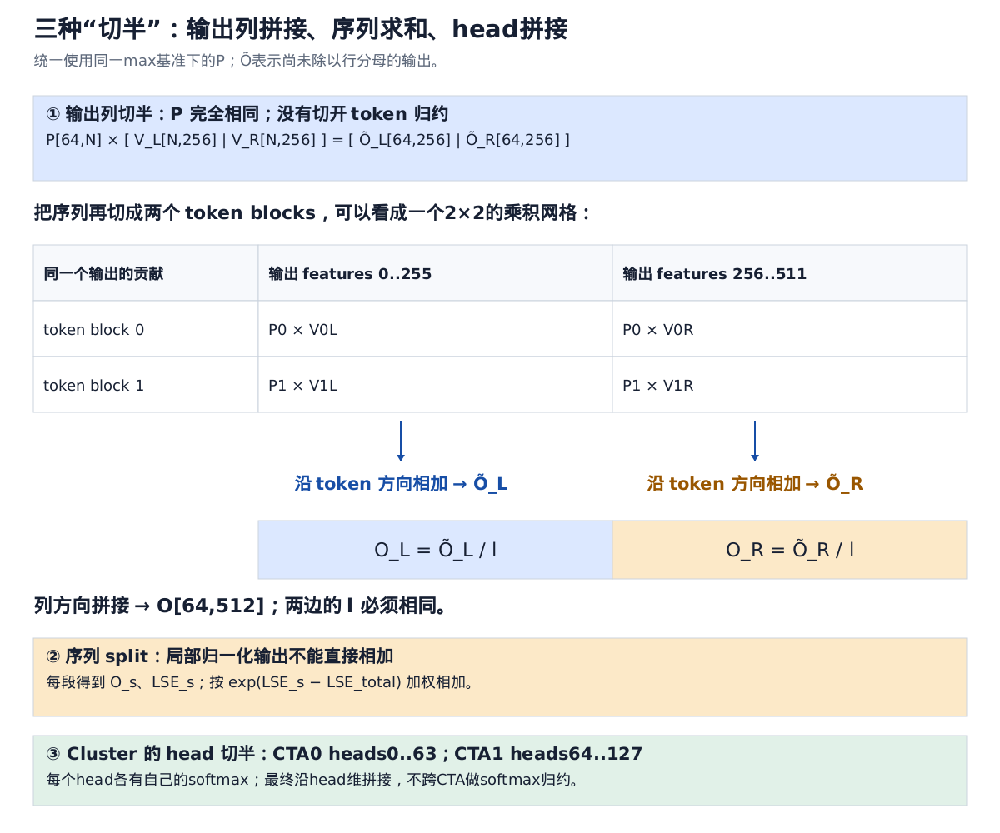
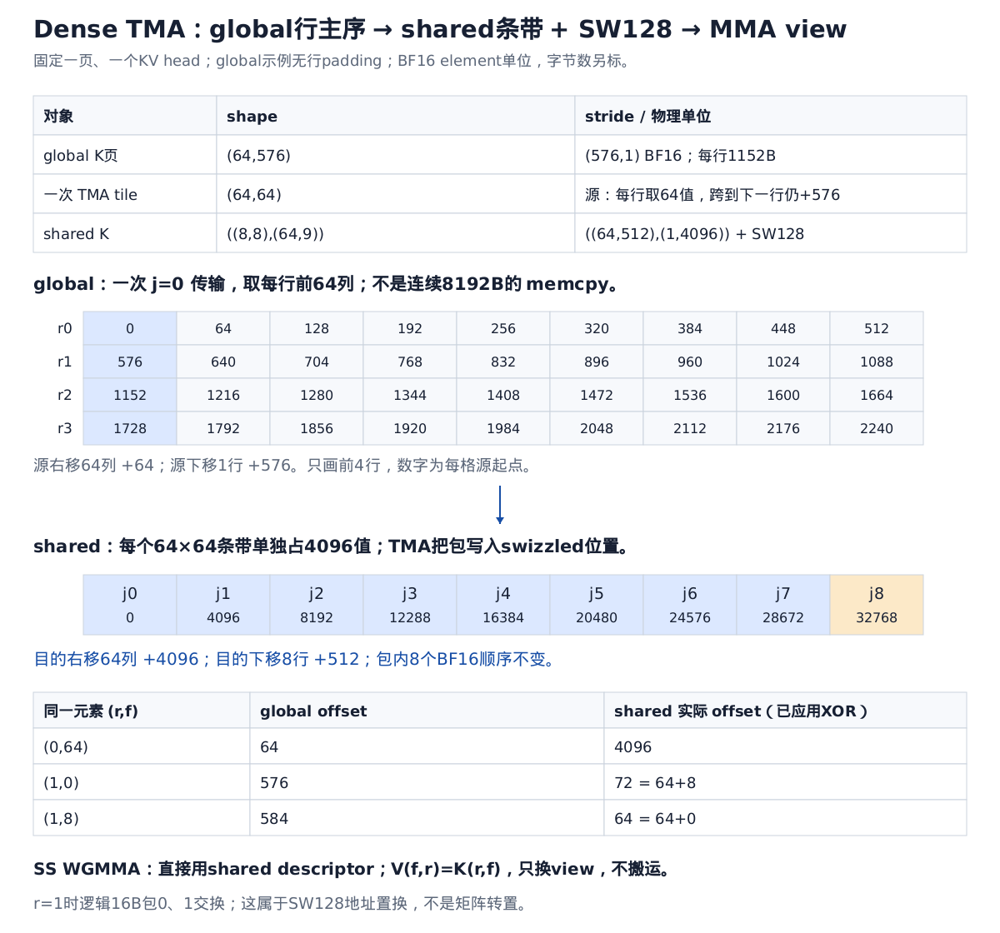
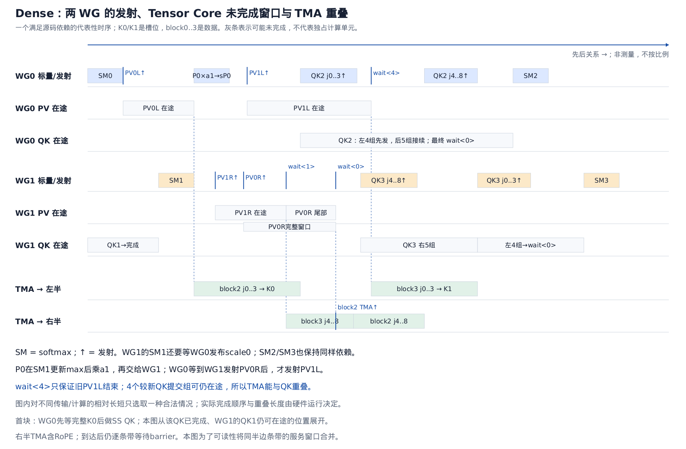
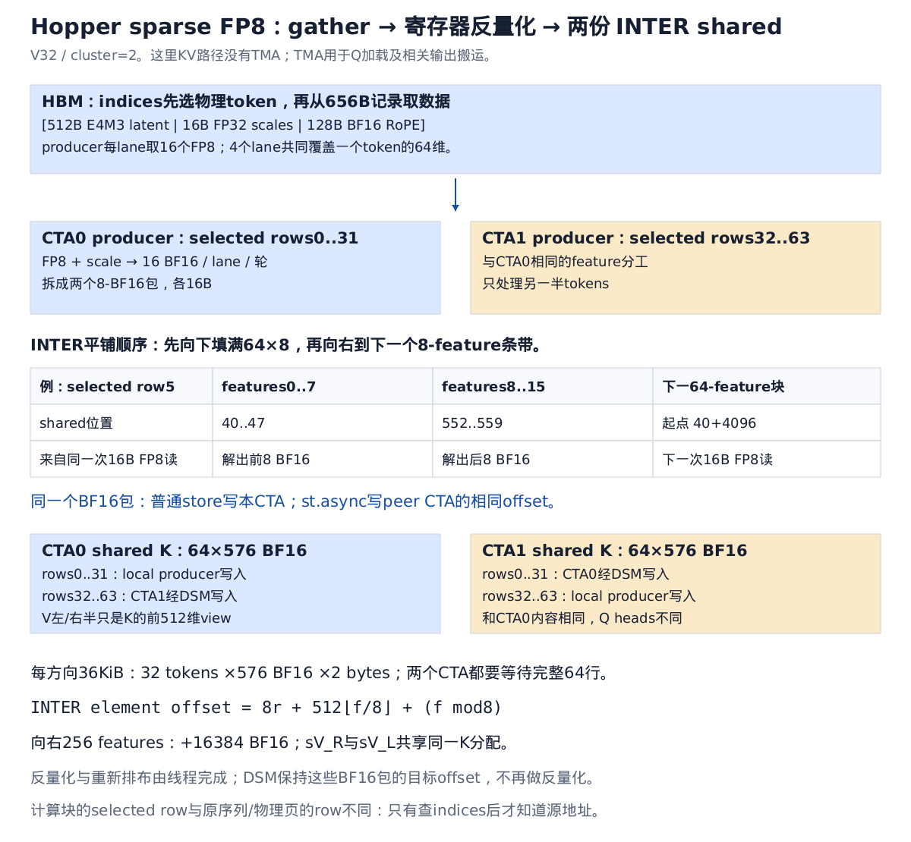
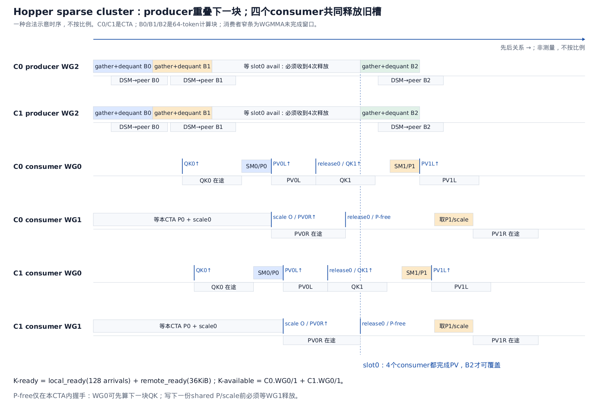
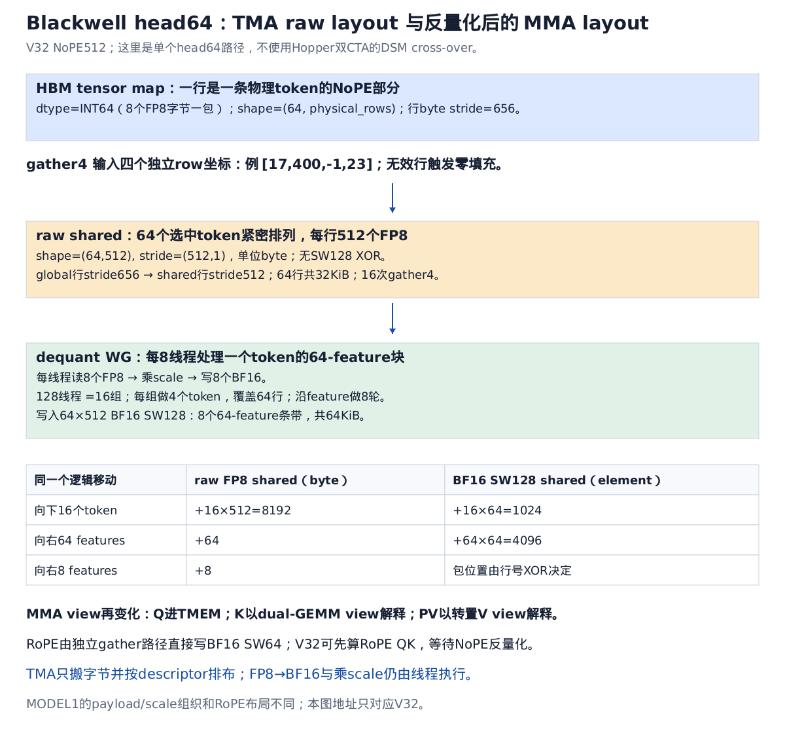
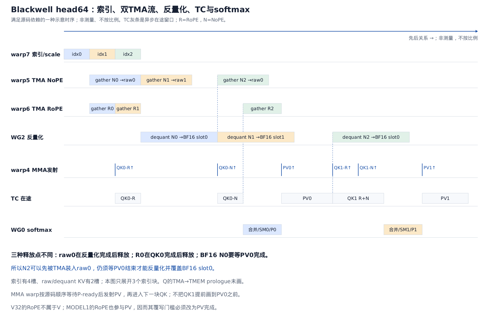

# FlashMLA：左右半边为什么能拆、TMA layout 如何变化、Dense 与 Sparse 的真实流水线

固定源码版本：`15f13e5030374295491c5ce31b02d7e63a7772c6`。本文是[最新版源码总览](flashmla_latest_dense_sparse.md)的专题展开，专门回答矩阵切分、layout 变化、两个 WG 与加载的 overlap，以及 FP8 cluster 的数据共享。

先约定三点：

- 这里的“两个 WGMMA”准确说是**两个执行 WGMMA 的 warpgroup**。每个 WG 有128线程，内部会发射多条 WGMMA，数量远不止两条。
- Hopper dense、Hopper sparse FP8、Blackwell sparse head64 是三条路径。**Hopper sparse 的 cluster KV 交换不是 TMA gather；Blackwell 的 gather4 也不是 Hopper 双 CTA cluster 实现。**
- 下文使用 `S=QKᵀ`，`P=exp(S-m)`，`l=sum(P)`，`Õ=PV`，`O=Õ/l`。P 尚未除以 l。源码某些文件以 rP 表示 score、sS 表示指数结果，阅读时应按运算区分。

## 1. 为什么可以切成左、右半边计算



[SVG](assets/flashmla_focus_split_axes.svg)

### 1.1 PV 的输出列相互独立

固定一个 query 行 i，输出第 d 列：

\[
O_{i,d}=\frac{\sum_{t=0}^{N-1}\exp(S_{i,t}-m_i)V_{t,d}}
{\sum_{t=0}^{N-1}\exp(S_{i,t}-m_i)}.
\]

如果 d=0，这个式子需要所有 tokens 的 V 第0列，但不需要 V 第256列。d=256 同理。

因此沿 V 的 feature 维分割：

\[
V=[V_L\mid V_R],\quad V_L,V_R\in\mathbb R^{N\times256},
\]
\[
PV=[PV_L\mid PV_R].
\]

这就是普通矩阵乘法按输出列切块的性质。对 FlashMLA 一个 Q tile：

```text
P:       64 × N
V_L:      N ×256    → Õ_L:64×256
V_R:      N ×256    → Õ_R:64×256

O = [Õ_L/l | Õ_R/l]，shape=64×512
```

**两边必须使用同一个 P，同一个 row-wise l，且 P 与 Õ 必须采用同一个 max 基准。**它们不需要把 O_L 和 O_R 相加，最终只需将两部分写入输出的不同列。

### 1.2 一个数值例子

一个 query 只看两个 tokens，logits 为 `[ln2,ln3]`，两个 value 向量为：

```text
V0 = [10,100]
V1 = [20,200]
```

归一化概率是 `[2/5,3/5]`：

```text
左列：2/5×10  +3/5×20  =16
右列：2/5×100 +3/5×200 =160
拼接：[16,160]
```

左、右列不需要交换乘积，只需要共享那两个概率。若采用 max=ln3 的稳定形式，P=`[2/3,1]`，l=`5/3`，结果仍一样。

### 1.3 与序列 split 的区别

若切的是 token 维：

\[
P=[P_0\ P_1],\qquad V=\begin{bmatrix}V_0\\V_1\end{bmatrix},
\]
\[
PV=P_0V_0+P_1V_1.
\]

这时沿 token 维的贡献需要相加。如果各段先独立 softmax，得到局部归一化 O0、O1，就不能直接加：上面的数值例子会错误地得到 `[10,100]+[20,200]`。

必须使用局部 LSE 的权重：

\[
O=\sum_s e^{LSE_s-LSE_{all}}O_s.
\]

所以“两个 WG 各算半个 O”和“多个 CTA 做 sequence split，最后 combine”是两个不同层次：前者**拼列**，后者**加权求和**。

### 1.4 QK 若按 feature 切分，规则又不同

QK 的 feature 是归约维。如果 Q/K 分成两段：

\[
QK^T=Q_aK_a^T+Q_bK_b^T.
\]

需要把两段 score 相加后才做 softmax。不能各算一份 softmax 再拼起来。后文 Blackwell dual GEMM 正是在这个位置形成 partial scores，然后合并。

## 2. Dense 的两个 WG：既分输出列，又交错处理 token blocks

依据：[dense traits](../third_party/FlashMLA/csrc/sm90/decode/dense/traits.h)、[dense kernel](../third_party/FlashMLA/csrc/sm90/decode/dense/splitkv_mla.cuh)。

### 2.1 为什么 O 要切成64×256

完整 `64×512` FP32 累加矩阵有32768个32-bit值。若两个 WG 各保留一份完整 O，需要65536个寄存器槽，已达到 Hopper SM 的64K槽位，还没有给 score、softmax、Q fragment、地址和控制变量留空间。

每个 WG 只保留 `64×256`，每线程平均128个 FP32累加值，才能给其余状态留下空间。这个拆分直接决定 PV 的 atom 是 `m64n256k16`。

### 2.2 四个 PV，谁算哪一个

设本轮处理相邻两个64-token blocks，编号0、1：

| | 左半输出，由WG0持有 | 右半输出，由WG1持有 |
|---|---|---|
| block0贡献 | P0×V0L，P0本地寄存器，RS | P0×V0R，P0由WG0写shared，SS |
| block1贡献 | P1×V1L，P1由WG1写shared，SS | P1×V1R，P1本地寄存器，RS |

QK/softmax 的工作分配：WG0产生 P0，WG1产生 P1。P 的生产者与 O 的拥有者不完全相同，因此需要交换 P。

这里的 remote P 指**同一个 CTA 中另一个 WG 产生的 P**，不是跨 CTA 的 DSM。

### 2.3 为什么还要交换 scale，不能只交换 P

处理完旧 blocks 时，两个 Õ 半边都基于旧 max m。设本轮 score 是 x0、x1：

\[
m_0=\max(m,\max x_0),\quad a_0=e^{m-m_0},\quad p_0=e^{x_0-m_0},
\]
\[
m_1=\max(m_0,\max x_1),\quad a_1=e^{m_0-m_1},\quad p_1=e^{x_1-m_1}.
\]

WG0先执行：

\[
\widetilde O_L\leftarrow a_0\widetilde O_L+p_0V_{0L}.
\]

此时 WG1 更新到更大的 m1，就需要对旧贡献再乘 a1：

```text
WG0：Õ_L ← a1 Õ_L + p1 V1L
WG1：Õ_R ← a0 a1 Õ_R + p1 V1R + (a1 p0) V0R
```

两边最终都变成：

\[
a_0a_1\widetilde O^{old}+(a_1p_0)V_0+p_1V_1.
\]

因此：

1. WG0先发布 a0/m0，WG1才知道从什么基准继续做softmax。
2. WG1发布 a1，WG0才能把p0转成基于m1的权重。
3. WG0交给WG1的是 **a1×p0**，而不是最初的p0。
4. 两边的部分 l 也按同样规则缩放，最终合为相同分母。

源码从 FP32 p0 乘a1再转BF16，避免先对p0做一次BF16舍入、缩放后又舍入。实现使用 `exp2` 与预缩放logits，原理不变。

## 3. Dense TMA 的 layout 变化：数值坐标不变，物理地址变化



[SVG](assets/flashmla_focus_dense_tma_flow.svg)

### 3.1 global tensor、copy tile、shared tensor 是三个层次

源码为 K 构建的逻辑 tensor：

```text
shape  = (64,576,Hkv,num_pages)
stride = (k_row_stride,1,k_head_stride,k_page_stride)
```

选定物理页与KV head后，在普通连续页的例子中：

```text
gK shape=(64,576), stride=(576,1) BF16
```

一条 TMA 只负责一个64-feature条带：

```text
源tile j：gK[0:64, 64j:64j+64]
          共4096个BF16 =8192B
```

但这4096个值在global中不是连续8192B：每行取128B，再跳到下一条1152B行的相同feature区间。TMA descriptor 描述这一二维访问。

### 3.2 shared 先向下排atom，再向右排条带

`Layout_K_SW128_Atom<bf16>`基本覆盖 `8×64`：

```text
8×64 atom，512 BF16
   ↓ 8个atom
64×64条带，4096 BF16
   → 9个条带
64×576，36864 BF16
```

未把swizzle展开的layout打印为：

```text
Sw<3,4,3> o
shape  = ((8,8),(64,9))
stride = ((64,512),(1,4096))
```

向右跨64 features时，global跨64个BF16，shared则跨掉一个完整64×64条带，即4096个BF16。

条带内的16B包还做XOR置换：

\[
A(r,f)=4096\lfloor f/64\rfloor+64r+
((f\bmod64)\operatorname{xor}8(r\bmod8)).
\]

例如 `gK(1,0)` 在源页offset576，目的offset72。元素仍然是“token1、feature0”，只是存储位置改变。不是先对矩阵做转置，也不是改变元素含义。

### 3.3 不要把构造TMA时出现的576当作shared最终行stride

构造 `tma_K` 的代码包含：

```cpp
tile_to_shape(
    GMMA::Layout_K_SW128_Atom<InputT>{},
    Layout<Shape<Int<64>,Int<64>>,Stride<Int<576>,_1>>{}
)
```

关键在CuTe的 `tile_to_shape` 实现：第二个参数虽然可以是Layout，但函数通过 `shape(trg_shape)` 取得目标大小，**不继承这个目标Layout的stride**。上面的写法与传入 `Shape<_64,_64>{}` 生成完全相同的类型；576在这一步被忽略。

对应的实现逻辑可简化为：

```cpp
block_shape  = product_each(shape(atom));       // (8,64)
target_shape = product_each(shape(target));     // (64,64)，只取shape
product_shape = ceil_div(target_shape, block_shape); // (8,1)
return blocked_product(atom,
                       make_ordered_layout(product_shape, default_order));
```

沿行复制8个8×64 atom，就得到一个64×64条带，线性内部layout为 `((8,8),64):((64,512),1)`，再附带SW128。**最终stride是由atom和扩展排列生成的，不是从目标Layout复制来的。**

新增的[编译期探针](../examples/flash_attn/flashmla_tma_tile_probe.cu)用 `static_assert(std::is_same_v<...>)` 核对两种写法，并检查全部4096个实际swizzled地址。实现位置：[CuTe layout.hpp](../third_party/FlashMLA/csrc/cutlass/include/cute/layout.hpp) 的 `tile_to_shape`。

kernel真正分配的完整 `sK` 则由 `Traits::SmemLayoutK` 扩展到64×576。分析顺序是：先看atom与平铺决定目的存储，再看 `partition_S/partition_D` 如何把源tile和目的tile配对；global真正的576行stride来自前面源tensor的 `make_stride`。

### 3.4 TMA之后，WGMMA还要再把K搬进寄存器吗

SS WGMMA的输入是shared descriptor。每线程持有少量descriptor/控制状态，硬件根据descriptor读取shared操作数；不是每个线程先把整块K用普通load搬到通用寄存器，再执行MMA。

RS的A在寄存器、B在shared。dense中有两个典型用法：

- 本WG产生的P已经在寄存器，直接做RS PV。
- Q最后64维先用ldmatrix保存为rQ8，shared原Q8空间被P1复用，稳态这部分QK改为RS。

前8个Q条带的QK使用SS，最后一个使用RS；首块WG0的非流水化QK有单独的全SS路径。

### 3.5 `sV` 的“转置”只发生在view上

从逻辑矩阵乘法看V是 `[token,feature]`；CuTe为PV的B操作数使用 `[feature,token]` view。对前512features：

\[
\operatorname{addr}(sV(f,r))=\operatorname{addr}(sK(r,f)).
\]

右半V的起点对应feature256，在shared中偏移：

```text
4条64-feature带 ×4096 BF16 =16384 BF16 =32768B
```

两半V都在K的原分配里，没有额外global V加载，也没有额外shared转置kernel。

## 4. Dense 的流水线：从两块旧KV推进到两块新KV



[全尺寸 SVG](assets/flashmla_focus_dense_pipeline.svg)

图为满足源码依赖的一种示意时序，非测量、不按比例。灰条是指令发出后仍可能未完成的窗口，不表示两套独立Tensor Core硬件。实际各条TMA到达时间可能不同，图把同半边的条带合并显示。

### 4.1 先分清block编号与buffer编号

```text
sK0：本轮装block0，下一轮装block2
sK1：本轮装block1，下一轮装block3
```

每个buffer又分成：

```text
L: j0..3，features0..255
R: j4..7，features256..511
尾: j8，RoPE512..575；在加载调度中与R合成j4..8
```

不能在某个PV仍读V0L时用block2覆盖K0左半；也没必要在V0L读完后继续等V0R才加载左半。

### 4.2 WG0的关键顺序

对应 `wg0` 的迭代主体：

```text
S0已经完成
→ SM0，发布scale0
→ 发射PV0L（RS）
→ wait<0>：PV0L完成
→ 等scale1
→ TMA加载block2左4条带到K0
→ p0乘a1，写sP0，发布P0-ready
→ 等WG1的PV0R已发射
→ 缩放O_L，发射PV1L（SS）
→ 等block2左条带各自ready，发射QK2的前4个groups
→ wait<4>：确保较旧的PV1L已完成
→ TMA加载block3左4条带到K1
→ 发射QK2后5个groups
→ wait<0>：QK2完成
→ 下一轮SM2
```

源码把加载block2左半放在等待scale1之后，这是一项实测调度选择。解释时不能仅从“PV0L已经完成”推断代码立刻在更早的位置发TMA。

### 4.3 WG1的关键顺序

```text
S1已经完成，且收到scale0
→ SM1，发布scale1
→ 写sP1，发射PV1R（RS）
→ 等P0-ready
→ 发射PV0R（SS），发布Issued
→ wait<1>：较旧PV1R完成
→ TMA加载block3右半+RoPE到K1
→ wait<0>：PV0R也完成
→ TMA加载block2右半+RoPE到K0
→ QK3按j4,5,6,7,8,0,1,2,3发射
→ wait<0>：QK3完成
```

WG1之所以先算j4..8，是让归约顺序配合这些条带的到达和另一WG的工作。它不是逆序扫描tokens；当前dense沿token blocks正序，每轮推进2块。

### 4.4 `wait<4>`的4来自哪里

一条64-feature QK条带覆盖四个k16 atom，源码：

```text
wait 该条带的TMA barrier
wgmma k16 ×4
commit_group ×1
```

WG0发射顺序为：

```text
较旧：PV1L group
较新：QK2_j0 group、j1 group、j2 group、j3 group
```

`wait<4>`允许最多保留4个较新的提交组未完成，因而能保证PV1L已完成。于是旧V1L可覆盖，而QK2还可能在Tensor Core队列里。

WG1的`wait<1>`同理：发射顺序是PV1R在先、PV0R在后，所以等到只允许1个组未完成时，PV1R的shared输入已安全释放。

### 4.5 三类同步分别证明什么

| 同步 | 证明什么 | 不证明什么 |
|---|---|---|
| TMA transaction barrier | 对应条带传输已完成，可供矩阵读取 | PV已结束、buffer可以覆盖 |
| P/scale named barrier | 另一个WG已发布相应P/scale或发射事件 | 所有异步MMA都完成 |
| WGMMA wait_group | 满足指定数量的较新未完成groups上限 | 没有单独同步的其他WG也完成 |

此外，普通shared写与异步矩阵读取之间还需要相应proxy fence；它负责可见性，不能替代“另一个WG已经写完”的参与者同步。

### 4.6 NaN清理插在哪里

TMA可加载物理页内的逻辑无效行。对尾块，源码在相应QK读完之后、相应PV之前清零shared V的无效行，再做async-shared fence。

因为K/V别名，在QK未完成时提前改写K会有竞态；因为 `0×NaN=NaN`，在PV之后才清零又太晚。这也是“最后读者”和“下一使用者”之间的精确插入点。

## 5. Hopper FP8 cluster：heads分工与tokens加载分工是两根不同的轴

依据：[sparse config](../third_party/FlashMLA/csrc/sm90/decode/sparse_fp8/config.h)、[kernel/launch](../third_party/FlashMLA/csrc/sm90/decode/sparse_fp8/splitkv_mla.cuh)、[DSM helpers](../third_party/FlashMLA/csrc/sm90/decode/sparse_fp8/components/helpers.h)。

### 5.1 Cluster并没有让每个CTA只对32 tokens做attention

128 heads时，launch使用：

```text
grid    = (2, s_q, num_sm_parts)
cluster = (2, 1, 1)
threads = 384 / CTA
```

同一个cluster的两个CTA对应同一个query token、同一个sequence工作分区，不同的64-head块：

| | CTA0 | CTA1 |
|---|---|---|
| 计算的query heads | 0..63 | 64..127 |
| producer负责加载/解量化的selected rows | 0..31 | 32..63 |
| consumer最终读取的selected rows | **完整0..63** | **完整0..63** |
| 输出tile | 64×512 | 64×512 |

Hopper cluster允许这一对CTA共同驻留在支持cluster的调度范围内并访问彼此的shared地址。每个CTA仍有自己的寄存器、shared和线程块；不是把两个CTA合成一个256线程WGMMA，也不是共享一个寄存器文件来做跨SM WGMMA。

### 5.2 为什么这样划分有收益

两个head组的query不同，但选中的KV相同。如果两CTA各解量化64tokens，相同KV就被重复解量化。

现在：每个CTA只解32tokens，再把结果发给对方。因此在cluster范围内，同一批64tokens只需要一次gather/反量化工作，随后服务两组heads。

代价是跨CTA传输BF16数据、额外barrier和同步约束。每方向36KiB，两个方向共72KiB；两个CTA各自仍保留完整64×576 BF16，所以不是减少shared占用，也不是把MMA运算量减半。

### 5.3 三个WG的作用

```text
WG0（0..127）：QK → mask/softmax → P → PV左半
WG1（128..255）：取P/scale → PV右半
WG2（256..383）：indices/gather → FP8反量化 → local+peer写入
```

与dense seesaw不同，Hopper sparse的WG1不交替承担另一块的QK；producer成本足够显著，单独安排WG2来隐藏它。

最终CTA0/CTA1沿head维写不同输出位置，无需在这两个CTA之间合并softmax。只有同一head被sequence split到不同partition时，才需要后续combine。

## 6. Hopper FP8的数据layout与TMA角色



[SVG](assets/flashmla_focus_sparse_layout_flow.svg)

### 6.1 Global不是一个连续64-token页

indices指定的是物理slot：

```text
page = slot / page_size
row  = slot % page_size
src  = cache_base + page*page_stride + row*656
```

64个被选中的tokens可能来自不同页。因此计算tile的行r是 **selected list中的第r项**，不是物理页的第r行，也不是原序列中的第r个token。

V32一条记录：512个FP8 latent、4个FP32 scales、64个BF16 RoPE。producer使用线程发射的向量global loads，随后寄存器里转换与乘scale。

### 6.2 从线程tile推shared的两个16B写

一个producer warp按8tokens×64features工作：

```text
同一token：lane r、r+8、r+16、r+24
各lane负责16features
4lane ×16 =64features
```

一次16B FP8 load解出16个BF16，变成32B。这32B在INTER shared中拆成两个8-BF16包。

INTER排列：

```text
8×8 atom → 向下8个 → 64×8条带 → 向右72个 → 64×576
```

所以：

```text
向右8features：+512 BF16
向右64features：+4096 BF16
```

每个lane的前8个结果写一个包，后8个结果写下一个窄条带，两个包起点相差512，而不是8。这是layout改变的主要执行位置：**普通线程在反量化输出时就排成INTER**。

### 6.3 交换的是寄存器payload，不是读取对方的Q

对一个16B BF16包：

```text
register payload
   ├─ ordinary shared store → local K[offset]
   └─ st.async              → peer K[offset]
```

相同shared plan、相同offset。peer地址通过cluster shared地址映射获得，远端store同时向对应transaction barrier报告完成字节。

没有跨CTA交换Q/P/O；交换的是两CTA都会用到的KV。每个CTA得到完整K后独立执行本CTA heads的attention。

### 6.4 这条路径TMA究竟做什么

KV gather/反量化/DSM交换不是TMA。TMA仍负责Q加载以及相关输出搬运：

**Q输入：**逻辑global tensor `(Hq,Dqk,T,B)`，每CTA取自己的64heads，落到自己的 `64×576 SW128` shared Q。两CTA的Q内容不同，不需要对这一Q tile做KV式共享。

**no-split O输出：**先将两个WG的输出半边排到shared输出tile，再使用5D tensor map。源码的维度按CUDA tensor map的快维在前表示为：

```text
size      = (64,Hq,8,T,B)
box       = (64,64,8,1,1)
byte stride of higher dims:
            (stride_head*2, 64*2, stride_token*2, stride_batch*2)

feature = f_inner +64*f_stripe
```

这是把512输出features拆成`64×8`，方便一个tile覆盖shared中按64features分条带的布局，同时写回global中每个head的512维输出。它是输出维度的重新描述，不是给原始O增加新语义。

两个WG先各自用STSM写输出的256列半边，做async-shared fence及256-thread `epilogue_r2s_ready`同步；随后thread0发射一次 `SM90_TMA_STORE_5D`。所以这里“组合O”的具体动作是**将两半写进同一个shared输出tile的不同列，再统一搬出**，没有执行 `O_L+O_R` 的数值归约。

## 7. Hopper cluster计算流水线：为什么必须收齐四次释放



[全尺寸 SVG](assets/flashmla_focus_cluster_pipeline.svg)

图中每个CTA有自己的一条WG0/WG1 consumer轨迹。不同CTA不要求同时完成；图中特意画出一点错位。灰色窄条区分WGMMA发射和完成。

### 7.1 一个K槽的完整生命周期

```text
旧slot可用
→ 本CTA加载/反量化半块，并发送给peer
→ 本地半块ready + 远端半块ready
→ 本CTA WG0 QK
→ 本CTA WG0 softmax，发布P/scale
→ 本CTA WG0/1各自PV
→ 两CTA的四个consumer都释放
→ 下一批数据可覆盖同一个slot
```

槽选择按相对block编号交替，slot0用于B0/B2，slot1用于B1/B3。barrier phase在各槽复用时翻转，不能把上一轮ready误认为新一轮ready。

### 7.2 数据ready为什么分成两个barrier

`local_ready.init(128)`：本CTA producer的128线程全部完成本地数据写入并到达。

`remote_ready.init(1)`并期待：

\[
32\cdot576\cdot2=36864\ \text{bytes}.
\]

这个值是peer写入本CTA的32行。WG0做QK前必须等这两个条件；只等本地producer，最多只有半份KV。

计数1是transaction barrier的arrival配置，**不是“只收到一个线程16B就全部ready”**；还必须收到期望的36864完成字节。

### 7.3 `avail.init(4)`在数谁

以CTA0的slot0为例，四次arrival来自：

```text
CTA0.WG0：它的PV左半已完成
CTA0.WG1：它的PV右半已完成
CTA1.WG0：对端PV左半已完成
CTA1.WG1：对端PV右半已完成
```

每个consumer WG在自己的PV `wait<0>`之后，指定线程分别向两个CTA的avail barrier通知。所以两个producer都知道：两份shared K的所有consumer已经用完。

为什么不只等本CTA？因为本producer下一轮不仅写自己，还会`st.async`写peer。peer若仍在读旧KV，也会被覆盖。

### 7.4 P只有一个shared槽，会不会阻塞整个WG0

WG1需要P和scale完成右半PV。WG0下一块可以先做QK，结果留在寄存器；等QK完成之后，在softmax/重新写P之前等待 `sScale_and_sS_free`。

所以可以出现：

```text
WG0：下一块QK在途
WG1：上一块PV右半仍在途
WG2：下一块或再下一块gather/反量化
```

但不能让WG0在WG1还读取旧shared P时就覆盖它。K双槽的生命周期和P单槽的生命周期是两组不同约束。

64heads时cluster=1，producer自己分两轮处理64tokens，avail改为256个consumer线程到达，不需要remote-ready与DSM交换。

## 8. Blackwell FP8：真正的TMA gather4路径

依据：[head64 config](../third_party/FlashMLA/csrc/sm100/decode/head64/config.h)、[head64 kernel](../third_party/FlashMLA/csrc/sm100/decode/head64/kernel.cuh)。本节仅解释V32 head64分支；它使用 `tcgen05`/TMEM，不使用Hopper WGMMA。



[SVG](assets/flashmla_focus_blackwell_layout_flow.svg)

### 8.1 TMA第一次只搬raw FP8，不做反量化

NoPE tensor map使用INT64类型，每项装8个FP8字节：

```text
D_NOPE=512 bytes →64个INT64元素
shape=(64, descriptor_rows)
box=(64,1)
global row byte stride=656
swizzle=NONE
```

这里INT64是搬运打包，不是数值转换。这样box最快维不超过tensor map的限制。

`gather4`每次提供4个独立row坐标，取4个token的NoPE；循环步长4，共16次，落到raw shared：

```text
shape  = (64,512) FP8
stride = (512,1) bytes
```

原先656B的记录步长被压成512B raw行步长，scales/RoPE由另外的处理路径提供。

如果页间有padding，descriptor row不一定等于原始physical slot。源码使用：

```text
coord = page*(page_stride/656) + row
```

映射真实行位置。无效项统一改成-1，从而触发TMA OOB补零。

### 8.2 反量化WG把raw行主序变成BF16 SW128

WG内128线程分成16组，每组8线程。每次8线程共同处理一个token的64features，每线程8FP8：

```text
16组 × 每组4个token =64tokens
每token 8轮 ×64features =512features
```

各线程的基础token是group编号，随后每轮向下跨16tokens。基础feature为组内线程号×8，随后向右跨64features。

按tile推stride：

| 移动 | raw shared，byte | BF16 shared，element |
|---|---:|---:|
| 向下16tokens | 16×512=8192 | 16×64=1024 |
| 向右64features | 64 | 64×64=4096 |
| 包内相邻一个值 | 1 | 1 |

初始目的地址由SW128处理包编号；下移16行、右移64列时pattern重复，后续可以用固定步长推进。这就是源码先用CuTe算base、循环里再使用简单offset的原因。

**raw FP8 buffer与BF16 buffer是两个独立分配，layout变化在反量化store时完成。**不能说TMA直接把FP8 cache变成了BF16矩阵。

### 8.3 Q进TMEM后，dual GEMM再重解释一次tile

Q经TMA落shared，然后`tcgen05.cp`搬入TMEM。每两条64-feature带被上下叠放：

```text
原64×512： |0|1|2|3|4|5|6|7|
重解释：   |0|2|4|6|
           |1|3|5|7|    →128×256视图
```

从存储上看，下移64行跨4096BF16，右移64features跨两条原条带，即8192BF16。K也按对应dual-GEMM view描述。

得到两路partial scores后，线程读TMEM并通过shared交换求和，再mask/softmax；不能对两路partial scores分别softmax。PV继续使用正常512维V的转置view。

RoPE64维在V32里单独采用两个32-feature半块的SW64布局，其QK可以先于NoPE反量化完成而执行。

## 9. Blackwell流水线：三个“可覆盖”时刻



[全尺寸 SVG](assets/flashmla_focus_blackwell_pipeline.svg)

### 9.1 参与者

```text
WG0 / warps0..3：TMEM score读取、两路partial合并、mask、softmax、O缩放
warp4：发射tcgen05 MMA
warp5：NoPE TMA gather
warp6：RoPE TMA gather
warp7：indices、validity、scale准备
WG2 / warps8..11：raw FP8 → BF16反量化
```

indices/coords/scales有4槽，raw/dequant KV有2槽。图里省略了Q的启动搬运，只展开稳态数据流。

### 9.2 三类buffer的最后使用者不同

| buffer | 最后使用者 | 下一块何时可覆盖 |
|---|---|---|
| raw FP8 NoPE | 反量化WG的shared load | 反量化完成，`raw_free`发布后 |
| BF16 NoPE | PV的V读取 | `sv_done`后 |
| BF16 RoPE，V32 | QK的RoPE读取 | `qk_done`后 |

例如B0在slot0，B2将复用slot0：

```text
B0反量化完成
→ raw0空闲
→ TMA可先把B2 raw FP8装进raw0
→ 但BF16 slot0仍存着B0供PV读取
→ 等PV0结束
→ 才把B2 raw0反量化到BF16 slot0
```

这比“两个buffer轮换”更精确。**能够提前搬下一块raw数据，不等于能够提前覆盖其解量化目标。**

V32 RoPE不属于V，因此比NoPE更早释放；MODEL1 RoPE属于V，其覆盖条件必须改为PV完成。

### 9.3 MMA与softmax的握手

一个block：

```text
等RoPE-ready → 发QK-RoPE
等NoPE-ready → 发QK-NoPE
发布QK-done
WG0读取并合并partial scores → mask/softmax → 写P，必要时缩放O
发布S/O-ready
MMA warp发PV → 发布SV-done
```

下一块QK按MMA warp的循环次序排在当前PV发射之后。TMA和反量化可更超前；图中不能为了显得并行而把所有下一块运算都随意提前。

当新的max只小幅增长时，源码可保留原归一化基准，跳过本轮O的TMEM读改写；当增长超过base-2阈值时才缩放。因为Õ和l始终使用同一基准，它们的比值不变，数值范围则由阈值与浮点格式约束。

### 9.4 为什么不能把这条图叫做“FP8 cluster TMA流水线”

当前Hopper 128-head路径用cluster=2、线程gather和DSM；当前Blackwell V32 128-head dispatch是两次head64调用，不是把上图再套上同一个双CTA cross-over。

二者共同目标都是提高KV复用、隐藏数据准备成本，但使用了不同的硬件机制和数据存储组织。读源码时必须先确定实际dispatch实例。

## 10. 图、源码与验证

图的可编辑源：[flashmla_pipeline_focus.py](assets/flashmla_pipeline_focus.py)。本专题新增7张SVG/PNG：布局图1200px宽，流水线图1800px宽。所有pipeline的长度只表示一种合法的先后关系，不提供cycle数、吞吐预测或实测利用率。

关键源码定位：

| 关注点 | 文件内符号 |
|---|---|
| 左/右PV与QK指令类型 | `dense/traits.h` 的 `TiledMMA_PV_LocalP/RemoteP` |
| Dense TMA条带 | `launch_kv_tiles_copy_tma`、`qkt_gemm_one_tile_sQ/rQ` |
| Dense partial wait | `wg0`迭代主体的`wait<4>`、`wg1`的`wait<1>` |
| Dense Q8/P1别名 | `sP1 = flat_divide(sQ,...)(_0,_8)`对应初始化 |
| Cluster加载分工 | `sparse_fp8/splitkv_mla.cuh` 的producer分支 |
| Cluster完成与复用 | `bar_k_local_ready`、`bar_k_remote_ready`、`bar_k_avail` |
| Blackwell gather/dequant | `sm100/decode/head64/kernel.cuh` 的warps5/6/7与WG2分支 |
| Blackwell buffer生命周期 | `bar_raw_free`、`bar_qk_done`、`bar_sv_done` |

布局地址可用上一轮的[CuTe probe](../examples/flash_attn/flashmla_address_probe.cu)和[dense alias probe](../examples/flash_attn/flashmla_latest_dense_probe.cu)复查。矩阵分列、cluster按head拼接与共同softmax基准的CPU核对见 [split检查脚本](assets/flashmla_split_checks.py)。这些验证不替代GPU race检测或性能benchmark。

官方参考：[固定提交源码](https://github.com/deepseek-ai/FlashMLA/tree/15f13e5030374295491c5ce31b02d7e63a7772c6)、[Dense seesaw设计](https://github.com/deepseek-ai/FlashMLA/blob/15f13e5030374295491c5ce31b02d7e63a7772c6/docs/20250422-new-kernel-deep-dive.md)、[Hopper sparse设计](https://github.com/deepseek-ai/FlashMLA/blob/15f13e5030374295491c5ce31b02d7e63a7772c6/docs/20250929-hopper-fp8-sparse-deep-dive.md)。
