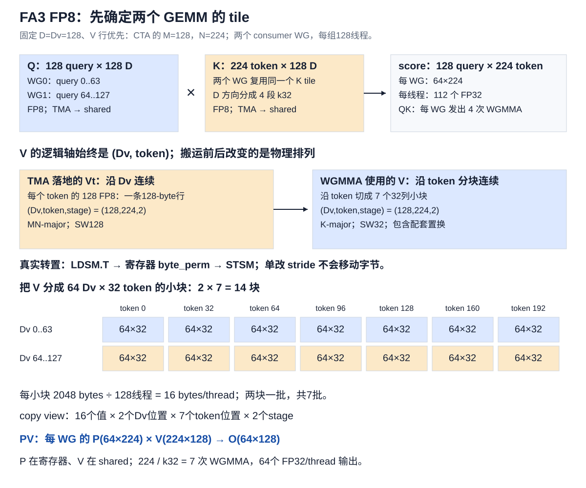
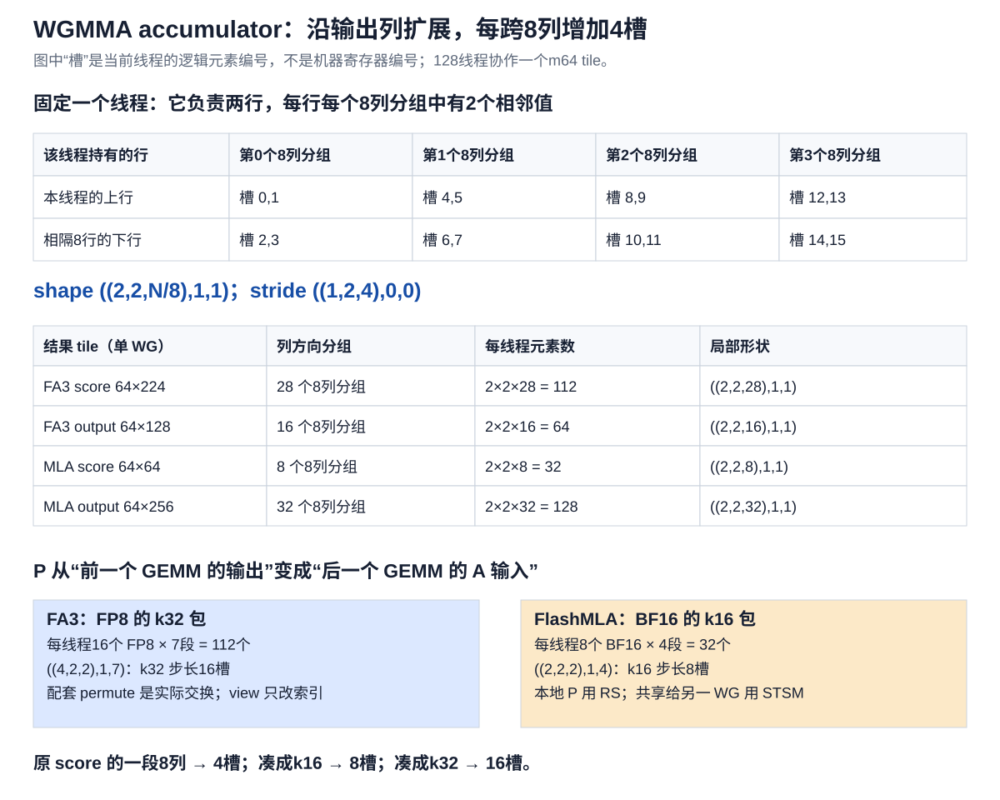
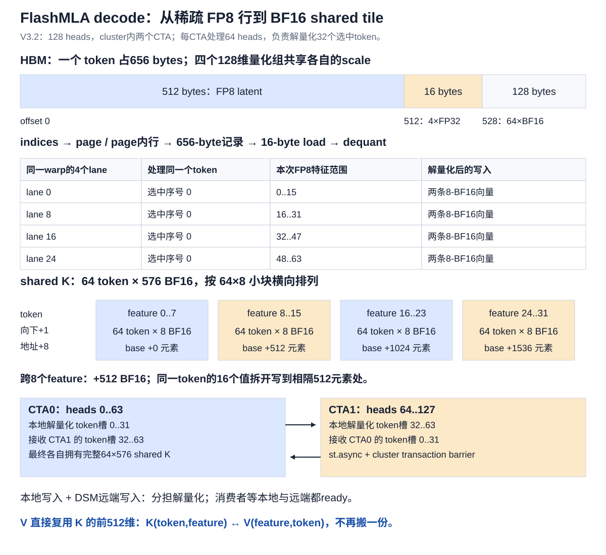
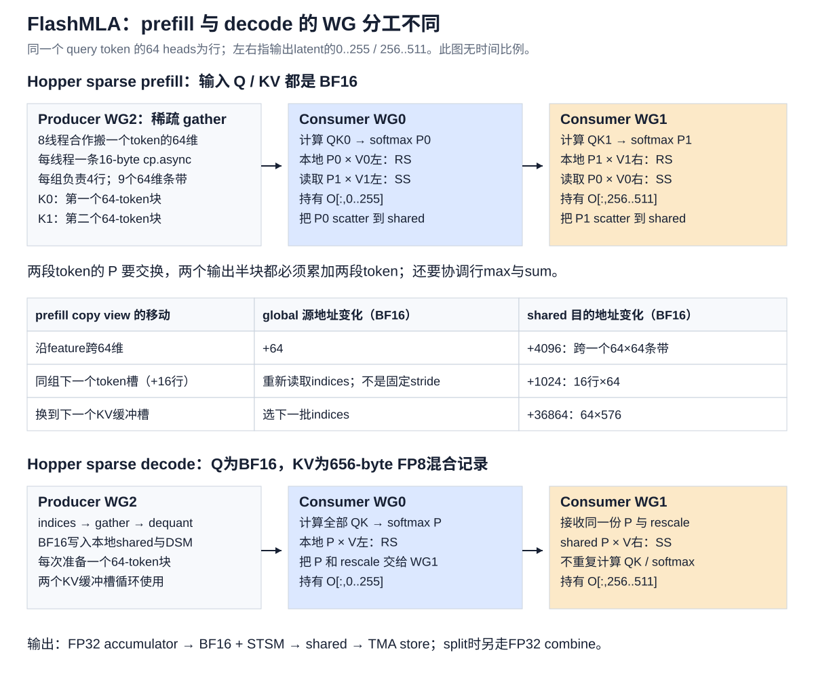

# Hopper 上的 FA3 与 FlashMLA：从 tile 推导 copy、MMA 和 layout

本文延续 [CuTe GEMM 的 tile 分析方法](cute_gemm_81920.md)：先说当前需要的矩阵块，再数重复的块，最后说明**同一个线程跨这些块时，底层地址增加多少**。不从大段 lane 公式开始。

TMA与mbarrier的独立入门代码见 [descriptor、事务计数与phase教程](tma_descriptor_mbarrier.md)，可以先运行CPU布局检查与基础GPU barrier实验。

这里区分三个量：矩阵坐标、线程私有元素槽位、shared/global 的物理地址。下面写 `+16槽` 指线程本地元素编号；写 `+16 B` 才是字节地址。shape 不足以唯一确定 stride，必须同时知道存储排列和指令协议。

## 0. 先明确所讲的实现与 FP8 边界

源码固定为仓库已有版本，避免把新旧内核与 Blackwell 内核混在一起：

- FA3：`third_party/flash-attention`，commit `060c9188beec3a8b62b33a3bfa6d5d2d44975fab`，讲 `hopper/` C++ 实现。
- FlashMLA：`third_party/FlashMLA`，commit `15f13e5030374295491c5ce31b02d7e63a7772c6`，讲 `csrc/sm90/`，FP8 cache 固定为 V3.2 的 576 维格式。
- 本项目已有的 [FA3 BF16 教学复刻](flash_attention3_hopper.md) 只实现 BF16，不能当成本文的 FP8 kernel。

| 路径 | 输入/存储类型 | Tensor Core 输入 | 本文的定位 |
|---|---|---|---|
| FA3 Hopper FP8 forward | Q/K/V 都为 E4M3 | FP8 × FP8，FP32 累加 | 真正的 FP8 attention 计算路径 |
| FlashMLA Hopper sparse prefill | Q、KV 都为 BF16 | BF16 × BF16，FP32 累加 | 官方 API 不接收此处所说的 FP8 KV 记录 |
| FlashMLA Hopper sparse decode | Q 为 BF16；KV 为混合 FP8 cache | 解量化到 BF16，再做 BF16 MMA | 本文重点分析的 gather/dequant/DSM 路径 |
| FlashMLA Hopper dense decode | Q、KV 为 FP16/BF16 | 对应的 FP16/BF16 MMA | 用于比较连续 page 搬运与稀疏 gather |
| FlashMLA dense prefill | 当前库的 dense prefill/FMHA 代码面向 SM100 | 不套用到 SM90 | Hopper dense prefill 可由 FA3 等实现承接，需另选合法配置 |

依据：[FA3 API](../third_party/flash-attention/hopper/flash_api.cpp)、[FlashMLA sparse prefill 的 dtype 检查](../third_party/FlashMLA/csrc/api/sparse_fwd.h)、[sparse decode](../third_party/FlashMLA/csrc/api/sparse_decode.h)、[dense decode](../third_party/FlashMLA/csrc/api/dense_decode.h)。官方对 FP8 cache 与 BF16 MMA 的说明见 [FlashMLA Hopper FP8 技术文](https://github.com/deepseek-ai/FlashMLA/blob/15f13e5030374295491c5ce31b02d7e63a7772c6/docs/20250929-hopper-fp8-sparse-deep-dive.md)。

因此，“FP8 输入”必须继续问：是 Q/K/V 全 FP8，还是只有 cache 压缩成 FP8？二者的数据流不同。若上游只提供量化后的 KV，又要调用此版本的 Hopper sparse prefill，需要在上游解量化成 API 要求的 BF16；不能只改一个模板 dtype。正常流程也可以保留当前 prefill 的 BF16 KV，同时为后续 decode 写入量化 cache。

## 1. 从 GEMM 迁移到 Hopper：哪些习惯需要改

之前的 SM80 GEMM 经常是：`cp.async → shared → ldmatrix → registers → mma.sync`。

Hopper 的 WGMMA 以 **128 个线程组成的 warpgroup** 为协作单位；本例使用 m64。它有两种重要的操作数路径：

| 形式 | A 在哪里 | B 在哪里 | C/D 在哪里 |
|---|---|---|---|
| SS | shared，由 descriptor 描述 | shared，由 descriptor 描述 | 每线程 accumulator |
| RS | 每线程寄存器 fragment | shared，由 descriptor 描述 | 每线程 accumulator |

所以 SS 的 QK 不需要先把完整 Q/K 用 `ldmatrix` 搬进所有消费者的寄存器。CuTe 对 shared 构造的 MMA fragment 可以承载 descriptor；不能看到 `partition_fragment_A/B` 就认定它分配了等量数值寄存器。

TMA 也不等于“每个线程搬16 bytes”。一个发起线程提供 tensor map、坐标和完成 barrier，硬件搬整个规则 tile。TMA 的 `get_slice(0)` 是 TMA 操作的切片，不是把一个 tile 的所有数据归属给 lane 0。真正的消费者归属由后面的 WGMMA 决定。

同步要看谁在消费数据：TMA 的 transaction barrier 表示输入已到达；WGMMA 的 commit/wait 表示异步矩阵操作的进度；generic shared 写入交给异步代理读取时还需要 `fence_view_async_shared` 等协议。普通 CTA barrier 无法替代所有这些职责。具体指令约束见 [NVIDIA PTX WGMMA 文档](https://docs.nvidia.com/cuda/parallel-thread-execution/index.html#asynchronous-warpgroup-level-matrix-instructions)。

## 2. FA3：用源码实际选择的 FP8 tile 开始

固定条件：Hopper，`D=Dv=128`，Q/K/V 为 E4M3，V 最后一维连续，普通 dense forward，无 softcap、无 paged-KV 特例。

[`tile_size.h`](../third_party/flash-attention/hopper/tile_size.h) 选择 `BlockM=128, BlockN=224`；[`flash_fwd_launch_template.h`](../third_party/flash-attention/hopper/flash_fwd_launch_template.h) 选择两个 stage。



一块 CTA 需要：

| Tensor | 逻辑 tile | 为什么需要这块 |
|---|---|---|
| Q | 128 query × 128 feature | 本 CTA 固定处理这些 query |
| K | 224 key token × 128 feature | 当前扫描到的一段 key |
| score | 128 query × 224 key token | QK 的中间结果 |
| V | 224 key token × 128 value feature | 对这些 score 做加权求和 |
| O | 128 query × 128 value feature | 在扫描各段 K/V 时持续累加 |

两个 consumer WG 沿 query 行拆分：每组负责 64 行，不沿 K 维拆分求和。需要转置 V，因此 producer 用一个完整 WG；这里共 384 个线程。其他不用 V 转置的配置，producer 活跃线程数可能不同。

这里的两个 WGMMA atom 为：

```text
QK：m64n224k32，SS，E4M3 × E4M3 → FP32
PV：m64n128k32，RS，E4M3 × E4M3 → FP32
```

一个 QK tile 沿 feature 方向有 `128/32=4` 段，所以每 WG 发 4 次 QK atom；一个 PV tile 沿 token 方向有 `224/32=7` 段，所以每 WG 发 7 次 PV atom。每 CTA、每个完整 KV tile 共 `2×(4+7)=22` 次 warpgroup 级 MMA。这里统计的是这两个 GEMM 的 atom 数，不包含转置指令，也不代表 22 个线程。

**必须打开官方使用的 `CUTE_SM90_EXTENDED_MMA_SHAPES_ENABLED`。** 不开时，本机 CUTLASS 的 selector 会退到 n32，再沿 N 重复7次；总元素数仍然相同，但 QK 指令数与 fragment 的层级会变。检查程序把这个前提显式写入并 static_assert atom N=224。

## 3. FA3 G2S：先沿 feature 连续，再进入 shared swizzle

为了让 global stride 清楚，先取 `B=1、H=1` 的连续 tensor；多 head 的 `[B,S,H,D]` 存储须把相应行步长改成 `H×D`，不能直接复制下面的128。

Q/K 原始每行有128个 FP8，故沿 feature 走一步是 `+1 B`，沿 token 走一行是 `+128 B`。切成 CTA tile 后：

| 移动 | global 地址差 | shared 分配量/地址关系 |
|---|---:|---|
| Q 跨128个 query | +16384 B | 本 CTA 的 Q tile 是16384 B |
| K 跨224个 token | +28672 B | 每个 K stage 为28672 B |
| K 切换 stage | global 由扫描进度决定 | stage 基址 +28672 B |
| 原始 V 跨224个 token | +28672 B | Vt 每 stage 同为28672 B |

Q/K 的128个 FP8刚好是128 bytes，shared selector 选择 SW128。把 shared 想成多个 `8行×128列` 的 atom：先沿行扩展到所需 token 数，再添加 stage。swizzle 会改变行内向量的物理位置；这里的 +28672 是**完整 stage 的步长**，不是说所有局部列步长都保持普通行优先。

TMA 路径大致是：

```cpp
auto tma = make_tma_copy(SM90_TMA_LOAD{}, gTensor, smem_layout, tile_shape);
auto block_copy = tma.get_slice(0);
auto src = block_copy.partition_S(gTile);
auto dst = block_copy.partition_D(sTile);
copy(tma.with(ready_barrier), src, dst);
// consumer 必须等该 stage 的 transaction barrier。
```

这是语义示意；官方还处理 multicast、varlen、paged layout 和阶段状态。TMA shape 描述搬运区域，WGMMA shape 描述计算区域，它们不是同一种线程值布局。

## 4. FA3 V transpose：shape 一样，存储的“条带”换方向

对 PV，CuTe 把 B 操作数 V 看成 `(N,K)=(Dv,token)`，因此转置前后的逻辑 shape 都可以写成 `(128,224,2)`。

但是最初 V 的物理数据沿 Dv 连续，而 FP8 WGMMA 的该路径需要 K-major，也就是沿 token 的归约维排列。必须搬动字节，不能只交换 shape/stride。

### 4.1 先找满足搬运协议的小 tile

代码将 V 转置划分成 `64 Dv × 32 token` 小块：

- Dv 有128维，分成2块。
- 当前有224个 token，分成7块。
- 一个小块2048个 FP8，128个 producer 线程，每线程处理16个 FP8。
- 每 stage 总共14个小块；`Transpose_ILP=2` 把两个小块一批处理，共7批。

源 partition 经大小简记为：

```text
原视图：  (16,1,1,2,7,2)
                 Dv token stage
group 后：(16,(1,1,2,7),2)
两块一批：(16,(2,7),2)
```

最后的2是输入 stage；中间的2是同一批处理两个转置小块。这和前文 GEMM 的“scratch batch 与 input stage”一样，必须分开。

### 4.2 源/目的跨同一个小 tile，地址为什么不同

固定 source lane0 的 CuTe view，检查程序打印：

```text
src: ((16,1),1,1,2,7,(1,2)):((1,0),0,0,64,4096,(0,28672))
dst: ((16,1),1,1,2,7,(1,2)):((1,0),0,0,2048,4096,(0,28672))
```

`(1,2)` 是 stage 的内部层级，总大小仍是2。这里第一 mode 的16是 copy atom 协议中的值数，不是说每个源线程最终就拥有它自己提供地址上的16个值；LDSM 有 warp 内数据分发。

| 跨 tile 的方向 | source lane0 行首 view | destination lane0 行首 view | 存储解释 |
|---|---:|---:|---|
| Dv +64 | +64 B | +2048 B | 源仍在同一128-byte行；目的跨64行、每行32 bytes |
| token +32 | +4096 B | +4096 B | 源跨32条128-byte行；目的跨完整128×32条带 |
| stage +1 | +28672 B | +28672 B | 一整个128×224 tile |

注意，上表是固定切片的计算结果，不把它泛化成任意 swizzle 内坐标的线性步长。

目的为什么是 SW32？其 K 维为224个 FP8：224不能被128或64整除，但能被32整除。selector 选择 `Layout_K_SW32_Atom`，随后沿 token 铺7个32列条带。**同为 FP8，同一个 kernel 的 Q/K 与 V 不必使用同一 swizzle。**

### 4.3 真正移动数据的三步

[`mainloop_fwd_sm90_tma_gmma_ws.hpp`](../third_party/flash-attention/hopper/mainloop_fwd_sm90_tma_gmma_ws.hpp) 的 `transpose_V` 使用：

```text
LDSM.T：按16-bit单元完成warp协作读取/转置
byte_perm：在寄存器内重新排列8-bit元素
STSM：按目标shared layout写回
```

16-bit 单元装着两个 FP8，所以仅做16-bit转置还不够。代码对两个32-bit word组成的8 bytes做：

```text
原始 bytes：0 1 2 3 | 4 5 6 7
0x6420：    0 2 4 6
0x7531：    1 3 5 7
```

这是字节选择，不是数值转换。`LDSM_T` 中的 T、把 V 的逻辑轴重解释为 `(Dv,token)`、以及 `byte_perm` 是不同层面的操作。

为减少 shared bank conflict，官方还选择了带置换的 V 排列，并在 P/O 侧配套调整。不能删掉这些 permute，只保留看起来更简单的 transpose。

## 5. WGMMA accumulator：从8列分组推 shape 和 stride



先固定一个 m64 的 WG 和其中一个线程。这个线程持有两行，每个8列分组在每行持有2个相邻值：

```text
                  第0个8列组   第1个8列组   第2个8列组
本线程上行          slot0,1      slot4,5      slot8,9
相隔8行的下行       slot2,3      slot6,7      slot10,11
```

因此第一个嵌套 mode 是 `(2,2,N/8)`：相邻2值、2行、若干个8列组。紧凑本地槽位的对应 stride 是 `(1,2,4)`。

这解释了为什么“跨8列”导致本地 `+4槽`：当前线程在这8列里只保存4个值，而不是保存全8列或整个64×8块。

| 结果 | 每 WG tile | 每线程 shape | 每线程逻辑元素数 |
|---|---|---|---:|
| FA3 score | 64×224 | `((2,2,28),1,1)` | 112 FP32 |
| FA3 O | 64×128 | `((2,2,16),1,1)` | 64 FP32 |
| MLA score | 64×64 | `((2,2,8),1,1)` | 32 FP32 |
| MLA 一半 O | 64×256 | `((2,2,32),1,1)` | 128 FP32 |

这些 shape 的两个外层1表示本线程在所选 tiled MMA 下不再沿 M/N重复，并不是全 CTA 只有一个 warpgroup。FA3 的另一个 WG 已由 thread layout 分到另一段64行。

完整布局以 FA3 score 为例为 `((2,2,28),1,1):((1,2,4),0,0)`。每个结果坐标的恰好一次覆盖已经由 identity tensor 枚举全部线程验证。

## 6. FA3 softmax → P → 第二个 MMA

### 6.1 把同一行的槽位集中到一个 view

softmax 要按行求最大值和求和，原 accumulator 按“相邻值、两行、列组”排列。`convert_layout_acc_rowcol` 把行的 mode 收在一起、列的 mode 收在一起：

```text
((2个相邻值,2行,28列组),1,1)
→ ((2行,1),(2个相邻值,28列组,1))
→ 每线程看到2行、每行56个分散列值
```

这一步创建 view，不复制数据。完整一行跨4个 lane；代码通过 quad shuffle 做行归约，不能只对单线程56个值求和就当作整行224列的 softmax。

online softmax 每轮维护行最大值、行和、O。新块导致最大值增大时，旧行和与旧 O 按同一个比例缩小，再加入新块贡献。整个 score 矩阵从不需要写到 global。

### 6.2 FP8 descale 在哪里

Q/K 的 descale 乘到 logits 的 softmax scale 上；并不是把整块 Q/K 先还原成 BF16。当前参数按 batch、KV head 索引，不能直接当成 FlashMLA 那种每 token、每128维一份的 scale。

FP8 路径使用 `Max_offset=8`：内部 exp2 结果扩大256倍，缓解 P 转 FP8 时的下溢。内部 row_sum 同样累加这个放大后的 P；最后用这个 row_sum 归一化 O，256会相消。计算对外 LSE 时，代码把 row_sum 的256倍去掉。V 的 descale 乘入最终 O 的归一化系数。

因此这里有三个不同概念：Q/K 的输入 descale、P 的内部256倍范围调整、V 的输出恢复系数。详见 [`softmax.h`](../third_party/flash-attention/hopper/softmax.h) 与 [`flash_fwd_kernel_sm90.h`](../third_party/flash-attention/hopper/flash_fwd_kernel_sm90.h)。

论文还讨论量化前对 Q/K 做随机符号 Hadamard 正交变换，以分散异常值；这是精度处理，不能与 copy layout 的 byte permutation 混为一谈，也不能假定调用本例 forward 就自动执行了这项预处理。[作者对 incoherent processing 的说明](https://tridao.me/blog/2024/flash3/)。

### 6.3 从112个结果值凑成7个 k32 输入包

PV 的归约维是224个 token，FP8 atom 每次吃32个 token。固定一个线程：

- score 的每8列有4个值。
- 凑齐32列，需要4个这样的组，共16个值。
- 224列有7段，所以 P 的目标形状为 `((4,2,2),1,7)`，总计112个 FP8。
- 每跨下一段 k32，进入下一包16个值，因此本地 stride 为16槽。

`convert_layout_acc_Aregs` 将数据组织成这个 A-view；但 FP8 的 C→A 寄存器归属还需要配套交换。

对于本文的 V 行优先分支：

```text
FP32 softmax结果
→ permute_Cregs_fp8：交换本线程部分64-bit值对
→ convert_layout_acc_Aregs：按k32重新分组
→ convert_type_out：数值转换为E4M3
→ PV RS WGMMA
→ permute_output_fp8：恢复输出列次序
```

对于预先按列存储 V 的另一个分支，代码改用 `permute_Aregs_fp8`，它包含4-lane范围的 shuffle 和 byte_perm。**retile/view 不搬数据，不代表整条 FP8 C→A 路径没有搬数据。** 真正交换的 API 必须单独识别。

## 7. FA3 异步循环与输出 scatter

先有输入可用，才能 issue WGMMA；先等 QK 的结果可用，才能在 CUDA Core/SFU 上做 softmax；P 输入不能在仍被 PV 使用时覆盖。这些是 schedule 的硬约束。

FA3 利用两层重叠：不同 WG 交替做矩阵乘和 softmax；同一 WG 中把下一块 QK 与当前块 PV 提交为不同异步 group，在只等较老 group 时处理已完成的 score，让较新的 PV 继续执行。源码依据 head dimension 等条件调整 O rescale 的时机，不能把一个简化时序套给所有配置。[FA3 的异步设计说明](https://tridao.me/blog/2024/flash3/)。

输出端对于本文无 split 的固定配置：

```text
FP32 O accumulator
→ 行归一化与v_descale、恢复列置换
→ 转成BF16
→ make_tiled_copy_C + retile_S + partition_D + STSM
→ shared O
→ async proxy fence / producer-consumer同步
→ TMA store 到 global
```

这和前文 R2S scatter 的思想相同：每线程把自己持有的结果写到正确的逻辑坐标。区别是后半段由 TMA 搬整个规则 tile，不必固定重现 SM80 例子的“每线程8个值 S2G”布局。FA3 FP8 API 输出 BF16，不是 FP8。

## 8. FlashMLA：先弄清 score 的行为什么变成 head

对 V3.2 的 absorbed MLA 表示，固定一个 query token 后：

```text
Q：128 heads × 576 feature
选中 KV：topk token × 576 feature
score：128 heads × topk token
输出 latent：128 heads × 512 feature
```

576分为512维 compressed latent与64维 RoPE。QK需要全部576维；PV只使用前512维。最终512维是 attention 的 latent 输出，后续模型投影不在本 attention kernel 内。

一次处理64个选中 token、64个 query head时，得到 `64×64` score。这里的64行属于同一个 query token的不同 head。多 query token 的 prefill 会发起更多 CTA，而不是把这里的行直接解释成序列位置。

FP8 decode 的128-head实例组成两CTA cluster，各处理64 heads。每个 CTA 内有3个 WG：WG0 算 QK/softmax及左256维 O，WG1 算右256维 O，WG2 负责 gather/dequant。cluster 两CTA之间共享输入劳动；CTA内两个consumer之间拆分输出列，这是两种不同的并行维度。

## 9. FlashMLA FP8 cache：gather 前先认清一条记录



一个 token 的记录：

| 字节范围 | 内容 | 作用 |
|---|---|---|
| 0..511 | 512个 E4M3 | latent，每128维一组 |
| 512..527 | 4个 FP32 | 上面四组各自的scale |
| 528..655 | 64个 BF16 | RoPE，保持16-bit |

因此记录步长是656 bytes。把整块 buffer 标记成 FP8/uint8，是为了表示原始字节；不能把后144 bytes也逐元素解释成 FP8。

以连续存储、page大小64为例：每页41984 B；给定一个**物理cache slot索引**，先确定第几页、页内哪行，再定位656-byte记录。实际代码使用 `stride_kv_block/row`，页步长允许由参数提供。

示例：物理 slot=130，是page2的第2行；连续页布局下记录起点为 `2×41984+2×656=85280 B`。这是地址举例，不表示输入的 selected indices 必须排序。

**gather 的本质是先读索引，再产生源地址。** 从第0个选中 token 切到第1个，源行可以从slot130跳到slot7，没有统一的“下移一行 stride”。但它们在 shared 中会排成紧凑的第0、1行。page table解决逻辑页到物理页映射；selected indices解决选哪些token，两者也不是一个概念。

这个 kernel 接收已经选好的 indices，不负责训练/计算 indexer，也不负责 top-k 选择。

## 10. Decode producer：一次16-byte load怎样变成两个shared小块

源码：[producer 分支](../third_party/FlashMLA/csrc/sm90/decode/sparse_fp8/splitkv_mla.cuh)、[dequant helper](../third_party/FlashMLA/csrc/sm90/decode/sparse_fp8/components/dequant.h)。

### 10.1 四个lane合作搬一个token的64维

一个 producer WG 有128个线程，即4个warp。每个warp负责8个token，每个token分给4个lane；以warp0的第一个token为例：

| lane | 这一次负责的FP8 feature |
|---:|---|
| 0 | 0..15 |
| 8 | 16..31 |
| 16 | 32..47 |
| 24 | 48..63 |

每条 `load_128b_from_gmem` 读16个FP8。沿 feature 每跨64维，各lane的源地址增加64 B；循环8次覆盖512维。量化组宽128，所以连续两轮64维使用同一个scale。

一个WG因此负责32个token。对于128 heads，两个CTA分别负责当前64-token tile的前32行、后32行。若是64 heads、cluster=1，同一个producer要做两轮token工作。

### 10.2 dequant是数值操作，retile不是

V3.2 路径读取每token的4个FP32 scale，当前实现先转换成BF16 scale。helper 把E4M3转换到float，再转BF16并做BF16向量乘scale；CUDA的实际底层转换指令可有中间格式，不能把它描述成一个原生 FP8→BF16×scale 指令。

16个FP8占16 B；解量化后16个BF16占32 B。shape可以仍是16个元素，但每元素字节数和数值都变了。当前实现也不等价于“所有运算完成后才做一次BF16舍入”，因为scale转换和BF16乘法已有舍入。

### 10.3 shared选择64×8小块，目的stride就变了

本 decode 的 K 使用 `GMMA::Layout_INTER_Atom<bf16,Major::K>`。把整个 `64 token × 576 feature` 画成72个 `64×8` 条带最容易理解：

```text
feature：  0..7          8..15         16..23        ...
          ┌───────────┬────────────┬────────────┐
token 0   │ 8 BF16    │ 8 BF16     │ 8 BF16     │
token 1   │ 8 BF16    │ 8 BF16     │ 8 BF16     │
  ...     │          │            │            │
token 63  │          │            │            │
          └───────────┴────────────┴────────────┘
条带基址    +0           +512         +1024        BF16元素
```

第一个条带先放完64行，再放下一个条带。于是：

| shared中的移动 | 地址变化（BF16元素） |
|---|---:|
| 当前8维小组内，下一个feature | +1 |
| 同一条带，下一个token | +8 |
| 同一token，下一个8维条带 | +512 |
| 同一token，跨64个feature | +4096 |
| 下一个完整KV缓冲槽 | +36864 |

因此，lane0一次读来的 feature0..15，解量化后要写两条8-BF16向量：第一条进入feature0..7条带，第二条进入feature8..15条带。两次写的起点相隔512 BF16，并不连续。

具体取 shared token行5：feature0..7的起点是第40个BF16；feature8..15的起点是第552个BF16。虽然 global 这16个FP8连续，shared这两个8值包不连续。

将这种排列写成一个紧凑的教学 layout：

```text
坐标： (token, (feature_in_8, feature_group))
shape： (64, (8,72))
stride：(8,  (1,512))           // 单位：BF16元素
```

实际 CuTe 打印中 token 还分成 `(8,8)`，但含义相同。按producer的源值分工，可把一个线程的工作理解为 `(16值,8个feature轮次,token轮次)`；destination中16值再拆为 `(8值,2个条带)`。这是对手写索引的教学表示，官方producer没有调用同名的 `make_tiled_copy`。

### 10.4 两CTA crossover：共享解量化劳动

CTA0 解量化token槽0..31，CTA1解量化32..63。每个CTA对自己算好的结果同时做：

1. 普通128-bit store写本地shared。
2. `st.async` 写另一个CTA的对应shared地址，并关联远端transaction barrier。

每CTA最后都有完整 `64×576 BF16` 的 K，供各自64个heads使用。每CTA接收另一半的事务字节数为 `32×576×2=36864 B`。消费者同时等local-ready与remote-ready；输入buffer只有在相关consumer都完成最后使用后才可复用。

这不是TMA multicast直接对FP8执行dequant，也不是两个CTA共用一份寄存器。DSM交换的是已经解量化的BF16。

FP8在这里节省的是HBM里的cache容量和读取字节数；消费侧shared仍存BF16。一个完整KV槽是 `64×576×2=73728 B`，两个槽合计147456 B。不要用656-byte记录步长去计算这个shared槽的容量：scale字段已经被消费，RoPE与解量化后的latent组成576个BF16。

记录步长656是16的倍数，因而在对齐基址上各token的16-byte向量满足对齐；但656不是32的倍数，行起点会在32-byte边界上交替偏移。不要把16-byte load宽度与32-byte事务对齐混为一谈。

## 11. Decode QK、PV和P scatter：为何不需要另一份V

### 11.1 QK需要9段64维，PV需要4段64-token中的k16

每CTA的 Q 为 `64 heads × 576`，由TMA搬到SW128 shared。K为相同feature维的 `64 selected token × 576`，由producer填入INTER shared。

QK atom是 `m64n64k16`：576 feature等于9个64维条带，每条带4段k16，共36次atom，生成 `64×64` score，每线程32个FP32。

WG0 softmax将这32个结果值变成BF16 P，再按照PV的A协议分为：

```text
32个元素 → 4包，每包8个BF16 → ((2,2,2),1,4)
本地stride：((1,2,4),0,8)
```

跨下一段k16，当前线程进入下一包8个值，所以是 `+8槽`。

### 11.2 V只是K前512维的另一种坐标解释

QK看 `K(token,feature)`；PV的B看 `V(feature,token)`。代码以 `composition` 构造第二种view，并复用同一shared基址。

这里能不搬数据，是因为BF16 WGMMA支持此处使用的 `Major::MN`，且K的物理布局与转置view兼容。它与FA3 FP8 V必须实际转置的前提不同。

V覆盖前512维，分成左右两个 `256 feature × 64 token`：

- WG0：输出latent0..255，用寄存器P做RS PV。
- WG1：输出latent256..511，从shared读取P做SS PV。
- 右半V在相同K缓冲槽内的基址增加 `64×256=16384 BF16`。
- 每半PV使用 `m64n256k16`，64 token需要4次atom。

因此每CTA、每64-token tile，主计算为36次QK与8次PV，共44次WGMMA。128-head实例有两个CTA，cluster合计88次；不要再额外乘128线程。

### 11.3 P的R2S和之前的retile例子怎样对应

WG0需要将P交给WG1，于是：

```cpp
auto r2s = make_tiled_copy_C(
    Copy_Atom<SM90_U32x4_STSM_N, bf16>{}, TiledMMA_QK{});
auto thread_copy = r2s.get_slice(idx_in_warpgroup);
auto src = thread_copy.retile_S(rS);
auto dst = thread_copy.partition_D(sP);
copy(r2s, src, dst);
```

当前线程原有32个BF16。STSM x4一次搬8个BF16，因此source retile为：

```text
((8,4),1,1):((1,8),0,0)
```

第0 mode的外层含4个8值包，总大小32；一份完整64×64 P需4次warp级x4 store/warp。retile没有生成第二份P值，也不负责让另一个WG自动看到数据；实际STSM、async proxy fence和named barrier完成传递。

WG1还要接收每行旧O的rescale，不能只接收P。两个WG的O左右半块必须始终使用同一个行最大值/归一化基准。

## 12. Hopper sparse prefill：gather还在，但dequant不在



源码：[prefill配置](../third_party/FlashMLA/csrc/sm90/prefill/sparse/config.h)、[phase1主循环](../third_party/FlashMLA/csrc/sm90/prefill/sparse/phase1.cuh)。仍取V3.2的576维。

每CTA固定一个query token、64个heads，3个WG共384线程。与decode相比：KV已经是BF16，producer使用16-byte `cp.async` 将稀疏行收集到SW128 shared，不经过FP8转换，也没有本文decode的两CTA crossover。

### 12.1 从64×64拷贝条带推线程分工

把 `64 selected token × 576 feature` 切成9个 `64×64` 条带。每条带8192 B，需要128线程各搬64 B才能覆盖。

producer分成16个小组，每组8线程：

- 8线程，每线程8个BF16，正好搬一行64维。
- 16组同时搬16行；每组再重复4行，覆盖64个token。
- 沿feature重复9次，覆盖576维。

所以手写copy的线程工作可理解为：`8值 × 4个token行 × 9个feature条带`，另有两个KV buffer。这里8值包内部连续；token行的源地址来自indices，没有统一的源行stride。

| 同一线程的移动 | global源（BF16元素） | shared目的（BF16元素） |
|---|---|---|
| 下一个64维条带 | +64 | +4096 |
| 本组下一个token，shared行号+16 | 根据下一个indices重新取地址 | +1024 |
| 下一KV buffer | 读下一段selected indices | +36864 |

shared为什么跨feature64要+4096？它先存完整64×64条带，再存下一条带。为什么行号+16是+1024？同条带每行64元素；16行正好跨完整swizzle周期，剩下规则地址差。

与decode的INTER比较：prefill按64维宽条带组织，decode按8维窄条带组织。**两个kernel逻辑K shape都是64×576，物理layout不同。**

### 12.2 两个consumer为什么各算一次QK

prefill一次配对处理两个64-token块K0、K1：WG0算QK0、WG1算QK1。各自得到P0/P1后，还要交换P：

```text
WG0持有左256维O：累加 P0×V0左 和 P1×V1左
WG1持有右256维O：累加 P0×V0右 和 P1×V1右
```

本地P使用RS，对方P经STSM写shared后使用SS。两个块的行max和sum需要统一，旧O和传递给对方的P要按更新后的max rescale；不能各自做完独立softmax再直接把结果相加。

producer也不是简单“先完整K0，再完整K1”。源码按依赖顺序交错准备K0左4条带、K1右5条带、K0右5条带、K1左4条带，利用分段ready/free barrier提前启动有条件执行的工作。

每两个token块的算术量：两次完整QK各36个atom，加四个半输出PV各4个atom，共88次WGMMA/CTA。这是算术计数，不描述prologue、epilogue或异步group数量。

V3.2还将一个P buffer复用在K0的RoPE条带上。只有完成对应QK的RoPE读取后才能覆盖；PV不用RoPE，因而后续PV不会再需要那段K内容。这个“最后一个读者是谁”的分析与前面GEMM复用A空间作C scratch完全一致。

### 12.3 prefill输出也按条带写回

每consumer有 `64×256` 的FP32输出，每线程128个值。输出按4个 `64×64` 条带转换成BF16，使用STSM写shared、TMA写global；一个条带每线程32值，因此每warp需要4次x4 STSM。

向下一条输出feature条带移动：shared基址 `+4096 BF16`，同一global行内 `+64 BF16`。输出shape看起来同为64×512，但global行优先与shared条带排列的stride不同。TMA tensor map将这两个地址系统连接起来。

## 13. Dense decode、split combine与cache scatter分别在哪

### 13.1 Dense decode：规则page内可以用TMA

本版本Hopper dense decode有2个consumer WG，共256线程，支持FP16/BF16，配置同样是 `Dqk=576,Dv=512,page=64`。

逻辑page先经block table定位物理page；page内部规则的64-token块可以使用TMA，按9个 `64×64` feature条带搬运，并通过每条带barrier与QK重叠。消费者协作计算两段KV、交换P、分别持有左右256维O。

源码将第8条Q条带保存在寄存器，用RS QK处理，以便复用shared空间；所以也不能把所有QK一概写成SS。其余主条带走SS。详见 [`dense/splitkv_mla.cuh`](../third_party/FlashMLA/csrc/sm90/decode/dense/splitkv_mla.cuh)。

稀疏decode则在page内部也可能跳着选token，同时还要dequant，所以这里采用线程级global load，而不是假设TMA能根据任意indices直接生成完整选中矩阵。

### 13.2 Split-KV解决decode的并行度问题

query token少时，如果只按query/head发CTA，会没有足够任务占满GPU。因此调度器可以把一条请求的selected tokens或dense KV范围分给多个split，分别计算部分输出与LSE，再做combine。split划分的是attention归约域，不是把576维QK任意切开后分别softmax。

每个split产出的O已按自己的row_sum归一化。combine根据各split的LSE生成权重，再加权合并O；权重不是简单平均。比如两个split的归一化分母分别为1和3，则合并权重应为1/4与3/4，而不是各1/2。实现用稳定的max/exp2归约避免溢出。

稀疏decode无split输出：FP32累加器 → BF16 → STSM → SW128 shared O → TMA store。每WG的64×256输出，分为16个64×16片段；每个片段每线程8个值，即一次x4 STSM/warp。

有split时，为保留合并精度，部分O输出为FP32。shared scratch使用 `(64,512):(520,1)`：每行512个有效float后留8个padding。跨一行加520 float，跨右256列加256 float；每行有效数据的bulk S2G仍然只写512 float，不把padding带进global。最终combine再生成BF16输出。

此处的R2S将已有K buffer复用为O scratch，前提仍是所有K/V消费者已完成。要等TMA store读完shared后才能再次复用。

### 13.3 “scatter”至少有三种含义

| 操作 | 源与目的 | 是否数值转换 | 在本文kernel内？ |
|---|---|---|---|
| cache写入scatter | 新token的KV → 分配好的物理cache slot | 可包含quant与scale生成 | 此处attention主kernel不负责cache插入 |
| gather | indices指定的cache记录 → 紧凑shared token tile | sparse decode还带dequant | 是 |
| P/O的R2S scatter | MMA线程拥有的值 → 对应shared矩阵坐标 | P/O在copy前可能先转换dtype | 是 |
| split combine | 多个部分O/LSE → 最终O | FP32加权合并并转换输出 | 独立combine kernel |

一个合理的系统流程为：先得到新token的latent/RoPE，按128维组量化latent、保留RoPE BF16，将656-byte记录写入分配的cache slot；attention随后按已准备好的indices读取。量化、slot分配与cache写入需要从调用它的推理框架继续追踪，不能虚构成 `FlashMLA::retile` 自动完成。

仓库的 [quant.py参考量化](../third_party/FlashMLA/tests/quant.py) 给了一个可对应的例子：每128维取绝对值最大值，除以E4M3的448；将scale钳到至少`1e-4`并向上取到2的整数幂，再把原值除以scale转换成E4M3。四个scale仍按FP32字段存储。decode做的是相反方向的“读取E4M3并乘scale”。这是该测试生成器的scale选择方法，cache格式本身只规定字段含义，不应推断所有外部框架都使用同一scale算法。

若将BF16 prefill接到FP8 decode，**prefill算attention的KV**与**写给后续decode的压缩cache**可以是同批原始KV的两种表示；并不要求prefill先从压缩cache读回来。

## 14. 如何用代码核对这些图

提供独立的CPU检查程序 [`hopper_layout_probe.cu`](../examples/flash_attn/hopper_layout_probe.cu)：

```bash
nvcc -std=c++17 \
  -Ithird_party/flash-attention/csrc/cutlass/include \
  examples/flash_attn/hopper_layout_probe.cu \
  -o /tmp/hopper_layout_probe
/tmp/hopper_layout_probe
```

它使用真实CuTe类型重建本文固定配置：打印MMA fragment、V transpose的source/destination partition、P的STSM retile；通过identity tensor检查全部线程覆盖；检查decode producer手写地址、K/V alias、feature条带stride。它不launch GPU kernel，可以在没有Hopper的机器上核对layout。

保存的原始输出见 [hopper_layout_probe.txt](hopper_layout_probe.txt)。也可以把include路径换成 `third_party/FlashMLA/csrc/cutlass/include`，核对另一份内嵌CuTe上的相同布局定义。

本次两份CUTLASS均已编译并通过CPU检查，打印结果逐字一致；4张图通过SVG结构检查、重复生成一致性检查和完整PNG目视检查，文档内本地链接已核对。

图的源文件是 [`hopper_fp8_layouts.py`](assets/hopper_fp8_layouts.py)，运行可重新生成4张SVG及PNG；图是结构示意，不是实测时延或吞吐图。

本机GPU为RTX4060 Laptop（SM89）。本文验证范围是源码、CPU执行的CuTe布局检查与图形渲染；没有声称在H100/H800上运行完整FP8 kernel、测量性能或验证它的数值误差。旧版FA3内嵌CUTLASS在CUDA13下编译有deprecated vector type警告，检查程序仍可构建。

继续阅读源码时，优先沿以下顺序定位：

1. FA3 `tile_size.h → mainloop_fwd_sm90_tma_gmma_ws.hpp → utils.h/softmax.h → epilogue_fwd.hpp`。
2. FlashMLA sparse decode `config.h → splitkv_mla.cuh producer → components/dequant.h → WG0/WG1 → store_o`。
3. FlashMLA sparse prefill `config.h → phase1.cuh copy_tiles → 两WG的QK/PV交换 → epilogue`。

每遇到一个新layout，先找它描述的轴和tile边界：是feature条带、token块、head块、input stage，还是copy包。再比较同一个线程从一块走到下一块时的实际存储位置，shape和stride的区别就能落到具体数据上。
